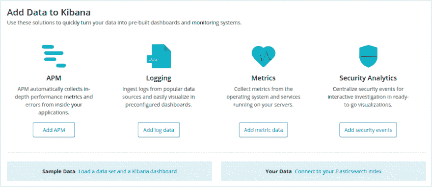

# 如何在 Rails Web 应用程序中实现 Elasticsearch:第 1 部分

> 原文：<https://dev.to/codicacom/how-to-implement-elasticsearch-in-a-rails-web-app-igd>

*这篇文章最初发表在 [Codica 博客](https://www.codica.com/blog/developing-rails-web-app-with-elasticsearch/)上。*

构建一个应用程序，你应该考虑两个最关键的方面，即信息分析和搜索。它们决定了你产品的整体成功。当你打算开发一个完美的 Rails web 应用程序时，情况也是如此。

在 Codica，我们相信，当涉及到强大和方便的搜索算法时，Elasticsearch 可以拯救世界。我们想向您展示使用技术实现创建测试 Rails 应用程序的过程。

今天，我们将设置所需的工具和服务，并启动一个新的 Rails 应用程序。

你可以在这里阅读全文版本:[开发一个 Rails Web App 时如何实现 Elasticsearch】。](https://www.codica.com/blog/developing-rails-web-app-with-elasticsearch/)

## 第一步:设置工具

在开始实际的代码编写之前，让我们安装我们将要使用的服务和工具。

**安装 Ruby 2.6.1**
[RVM](https://rvm.io/) 将帮助我们管理我们系统上设置的多个 Ruby 版本。
要检查 Ruby 版本，使用`rvm list`并安装下面的`rvm install 2.6.1`。

**安装轨道 5.2.3**
下一步是设置[轨道宝石](https://github.com/rails/rails)。

`gem install rails -v 5.2.3`

为了确保您已经安装了所需的 Rails gem 版本，键入请求`Rails -v`。

**安装 Elasticsearch 6.4.0**
我们已经[将 Elasticsearch](https://www.elastic.co/downloads/past-releases/elasticsearch-6-4-0) 保存到下载文件夹。通过键入请求来启动服务:
`~/Downloads/elasticsearch-6.4.0/bin/elasticsearch`

用 [http://localhost:9200/](http://localhost:9200/) 打开工具，确保启动。

在这里，我们得到以下:
[](https://res.cloudinary.com/practicaldev/image/fetch/s--Y9OW4Ewa--/c_limit%2Cf_auto%2Cfl_progressive%2Cq_auto%2Cw_880/https://thepracticaldev.s3.amazonaws.com/i/bqb09vi2afxpokc3ig7d.png)

**安装基巴纳 6 . 4 . 2**T3】我们已经将基巴纳保存到了下载文件夹。要启动该服务，请键入以下内容:
`~/Downloads/kibana-6.4.2-linux-x86_64/bin/kibana`

要确保 Kibana 正在运行，请访问 [http://localhost:5601/](http://localhost:5601/) 。

你看到下面的窗口:
[](https://res.cloudinary.com/practicaldev/image/fetch/s--uQkq2l-z--/c_limit%2Cf_auto%2Cfl_progressive%2Cq_auto%2Cw_880/https://thepracticaldev.s3.amazonaws.com/i/k4f3ymi26idsvppowqns.png)

我们已经安装了所有需要的工具和服务。让我们进行下一步。

## 步骤 2:启动一个新的 Rails 应用程序

在这个阶段，我们在 API 模式下使用 PostgreSQL 数据库和 Rails:

```
rvm use 2.6.1
rails new elasticsearch_rails --api -T -d postgresql
cd elasticsearch_rails
bundle install 
```

Enter fullscreen mode Exit fullscreen mode

首先配置 **config/database.yml** 结构类似这样:

```
default: &default
 adapter: postgresql
 encoding: unicode
 pool: <%= ENV.fetch("RAILS_MAX_THREADS") { 5 } %>
 username: postgres

development:
 <<: *default
 database: elasticsearch_rails_development

test:
 <<: *default
 database: elasticsearch_rails_test

production:
 <<: *default
 database: elasticsearch_rails_production
 username: elasticsearch_rails
 password: <%= ENV['DB_PASSWORD'] %> 
```

Enter fullscreen mode Exit fullscreen mode

因此，我们创建了`rails db:create`数据库。

现在，我们要建立一个将被索引和搜索的模型。创建一个有两个字段的**位置**表，如**名称**和**级别** :

```
rails generate model location name level 
```

Enter fullscreen mode Exit fullscreen mode

构建完表后，用`rails db:migrate`命令启动迁移。

我们已经安排好了所有需要的测试数据。复制下面文件的内容[，插入 **db/seeds.rb** ，运行`rails db:seed`。](https://github.com/codica2/sample-article-code-elasticsearch-rails/blob/master/db/seeds.rb)

## 结论

在这篇文章中，我们讨论了所需的工具和服务，还创建了一个 Rails 应用程序。
在下一部分，我们将带您了解 Elasticsearch 与所创建的应用程序的集成过程，为其添加功能，并使研究请求可用。

敬请关注，点击此处阅读全文:[开发 Rails Web App 时如何实现 Elasticsearch】。](https://www.codica.com/blog/developing-rails-web-app-with-elasticsearch/)