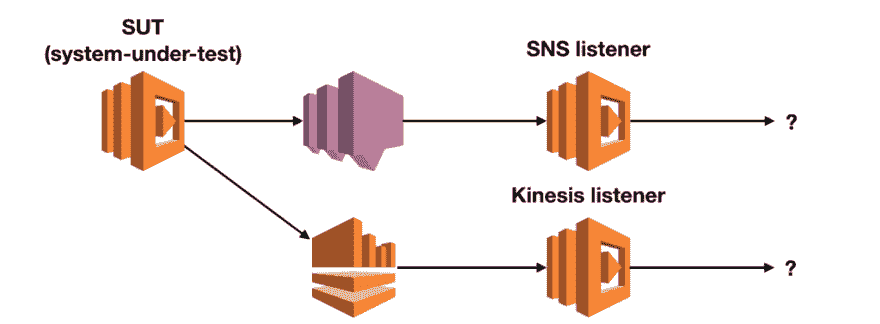
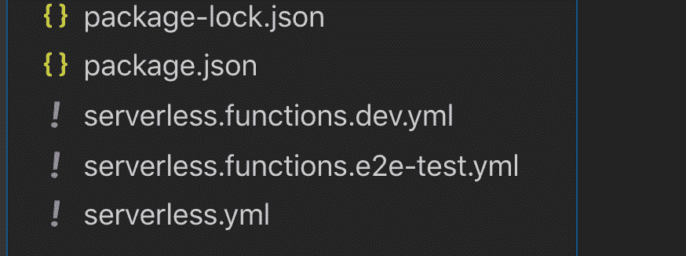
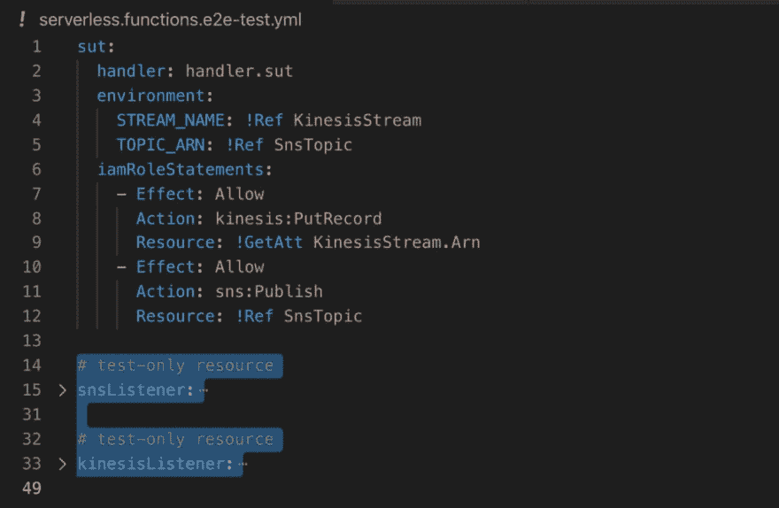
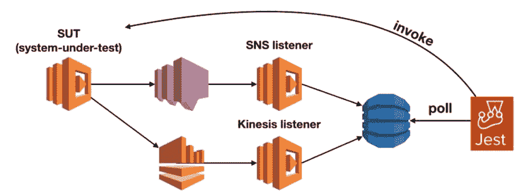
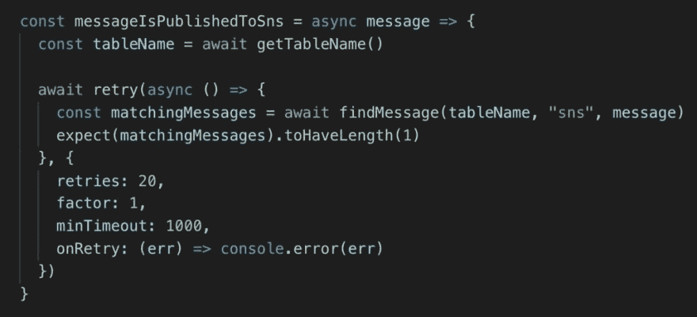
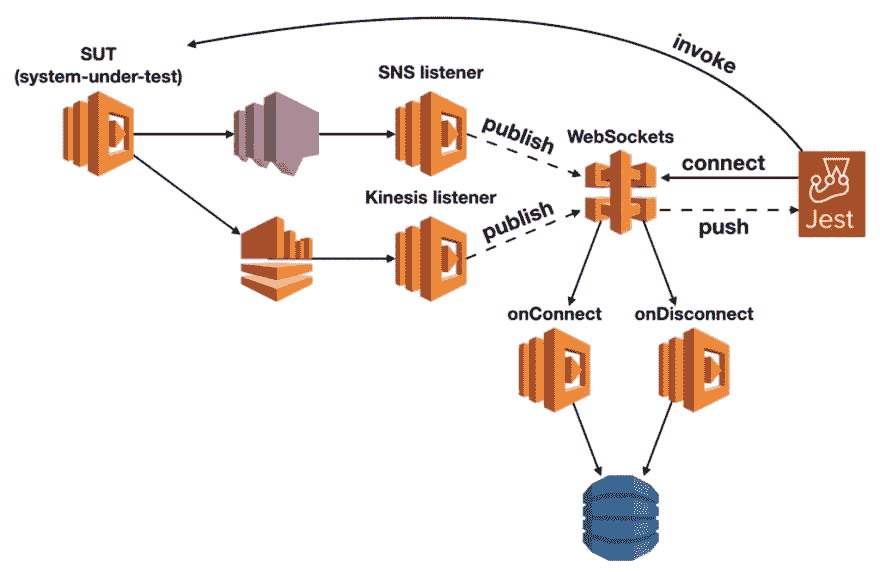
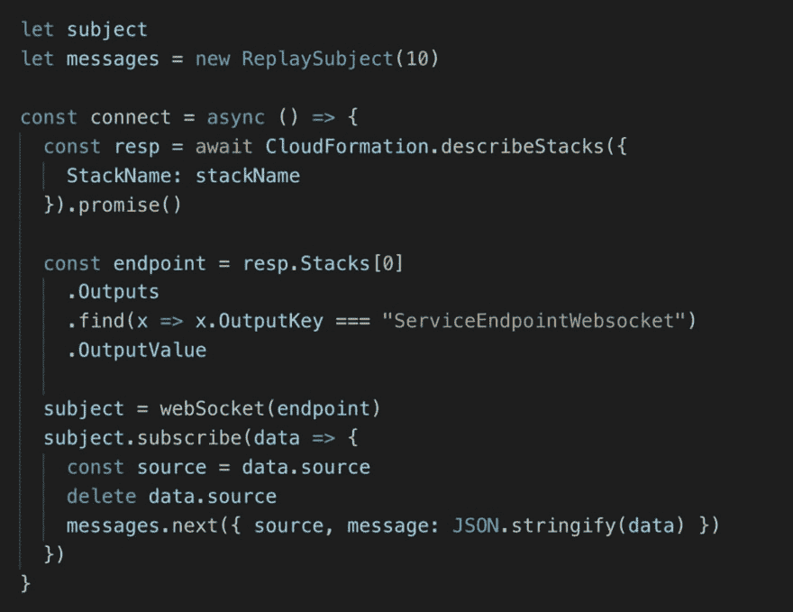
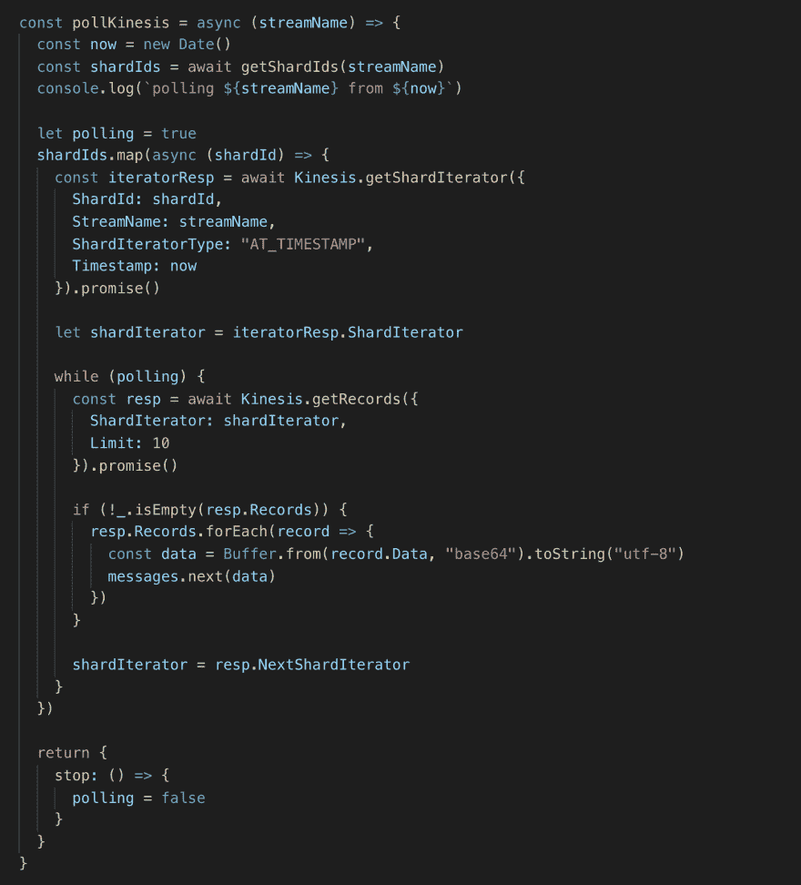

# 如何在你的 e2e 测试中加入社交网络和 Kinesis

> 原文：<https://dev.to/theburningmonk/how-to-include-sns-and-kinesis-in-your-e2e-tests-22c4>

**2019 年 17 月 9 日更新:根据反馈，我增加了几个替代方案，不需要你在 e2e 测试阶段部署额外的 Lambda 函数。滚动到末尾，了解更多信息。**

* * *

事件驱动是无服务器架构的一个关键特征。通常我们的 Lambda 函数会将事件发布到 SNS 主题或 Kinesis 流，而不是直接调用下游 API。

这是以松耦合方式构建系统的一个很好的方式。上游 API 不需要知道谁对他们的事件感兴趣。他们的工作是报道发生在他们限定范围内的事件，仅此而已。订阅者可以寻找他们感兴趣的事件，并完全独立于发布者对其做出反应。

像这样的事件驱动系统也更有弹性，因为您避免了常见的微服务陷阱，如级联故障。因为系统不必直接相互集成，而是通过健壮的消息代理来集成。

这绝对是我构建系统的首选方式。然而，它也不是没有缺点。其中一个缺点是它们更难进行端到端的测试。在本帖中，我们将讨论在端到端测试中包含 SNS 和 Kinesis 输出的两种方法:

*   通过将消息存储在 DynamoDB 表中，然后轮询该表
*   通过将消息广播到 API 网关 websocket 并侦听正确的消息到达

这两种方法都适合在 CI/CD 管道中使用临时云生成堆栈，正如我在[上一篇文章](https://dev.to/theburningmonk/why-you-should-use-temporary-stacks-when-you-do-serverless-2ai0)中所讨论的。

这两种方法的代码都可以在 Github repo 中找到。你可以自己尝试一下，并在下面的评论中告诉我你的问题。

# 一般做法

对于 SNS 和 Kinesis 来说，我们没有简单的方法来查询发送给他们的数据。所以这两种方法都遵循相同的模式，只在`e2e-test`阶段部署一组资源。

这些功能包括订阅 SNS 主题和/或 Kinesis 流并转发消息的 Lambda 功能。

当然，我们不希望将这些功能部署到生产中！使用 CloudFormation，您可以使用[条件](https://docs.aws.amazon.com/AWSCloudFormation/latest/UserGuide/conditions-section-structure.html)来有条件地包含某些资源和输出。

使用最新的无服务器框架 [1.5.2 版本](https://github.com/serverless/serverless/releases/tag/v1.52.0)，您也可以将`condition`和`dependsOn`添加到函数定义中。但是，这些并不延伸到其他相关资源，如`LambdaVersion`、`SNS::Subscription`和 IAM 角色。我发现的最好的解决方案是根本不包含那些函数定义，除了`e2e-test`阶段。

在 repo 中，你会发现函数定义被分解到一个单独的 YML 文件中。

每个环境都会有一个。

SNS 和 Kinesis 监听器功能仅在`serverless.functions.e2e-test.yml`中定义

这是一个不幸的设置，用来解决无服务器框架的限制。如果你需要经常这样做，那么你应该考虑把这个行为打包成一个插件，并与他人分享。或者，您可以创建一个 PR 并将变更提交到无服务器核心；-)

无论如何，从现在开始，这两种方法出现了分歧。

# 通过 DynamoDB

使用这种方法，SNS 和 Kinesis 监听器会将收到的消息写入 DynamoDB 表。与函数一样，该表也是有条件提供的，并且仅在`e2e-test`阶段可用。

端到端测试将直接调用 deploy Lambda 函数*。然后每秒轮询一次 DynamoDB 表，查看发布的消息是否存在。

**如果 SUT 功能配置了 API 网关或其他事件源。那么您应该通过调用 API 网关端点来触发该函数。为了简洁，我没有为 SUT 函数配置任何事件源，因此直接调用。*

您可以用 [async-retry](https://www.npmjs.com/package/async-retry) 实现轮询逻辑，测试可能如下所示:

在这种情况下，测试将轮询表 20 次，每次尝试之间有 1s 的延迟。这意味着测试可能会持续 20 秒。您应该相应地设置测试超时。

当您第一次部署`e2e-test`阶段时，第一次测试通常需要更长时间。平均而言，这些端到端测试大约在 2-4 秒内完成。

这种方法非常简单，不需要太多的移动部件。然而，因为我们每秒轮询一次 DynamoDB，所以我们可以等待整整一秒钟来查看新消息。当然，您可以通过更改重试之间的`minTimeout`来减少延迟。但是，如果您正在寻找一种更即时的、基于推送的方法来确定何时收到消息，那么请考虑下一种方法。

# 通过 API 网关 WebSocket

使用这种方法，SNS 和 Kinesis 侦听器会将消息转发到 API 网关 WebSocket 端点。

然而，由于 API Gateway 的 WebSocket 的工作方式，它稍微复杂一些。您需要额外的 Lambda 函数和 DynamoDB 表来跟踪谁连接到了 WebSocket 端点。

这增加了更多的移动部件(因此也增加了复杂性)，但遗憾的是，这是实现广播所必需的。

端到端测试仍然会直接调用 SUT 函数。但是我们还需要连接到 WebSocket 端点，这样我们就可以在消息进来时监听消息。另外，不要忘记在测试完成后断开连接，这样我们就不会在 DynamoDB 表中留下幻象连接。使用临时堆栈的一个好处是我们不需要担心清理这些测试数据。

一旦我们连接到 WebSocket 端点并触发了 SUT 函数，我们就必须等待预期的消息。

为了使这变得简单明了，我使用了 [RxJS](https://www.npmjs.com/package/rxjs) 的 WebSocket 包装器，并在 [ReplaySubject](https://rxjs-dev.firebaseapp.com/api/index/class/ReplaySubject) 中捕获我们收到的消息，以避免竞争情况。

当我们等待消息到来时，消息是否在我们调用`waitForMessage`的之前*被接收并不重要。这就是 *ReplaySubject* 的美妙之处——它首先给我们缓冲的消息。*

就是这样！一旦您部署到一个`e2e-test`阶段，您就可以运行这些测试来确保 AWS 中的一切都是端到端工作的。

这种方法的优点是，当收到来自 SNS/Kinesis 的消息时，它会给我们一个实时更新。然而，与 DynamoDB 方法相比，它需要额外的移动部件。

您也许能够通过使它们成为环境的一个“特性”并在其他项目中重用来分摊这些额外的覆盖。也就是说，如果您需要在许多其他项目中运行类似的测试，那么为什么不留下 WebSockets 端点并重用它呢。您甚至可以对所有的非生产环境都这样做，这样您就可以在所有的环境中运行端到端测试。

原来如此！在你的端到端测试中包含 SNS 和 Kinesis 的两种方法。正如我一直说的，这些不应该作为处方，你绝对应该调整这些让它们为你工作。如果你对这些方法有任何问题或意见，请在下面的评论中告诉我。

* * *

# 其他替代品(2019 年 17 月 9 日新增)

根据 Erez Rokah 的反馈，我决定加入一些其他的方法供你考虑。我过去曾经尝试过这些方法，但是随着时间的推移，我开始倾向于上面提到的两种方法。因为他们同时为 SNS 和 Kinesis 工作。而下面的方法对 SNS 或 Kinesis 都有效，但不是两者都有效。

附注:所有三个备选方案都包含在[演示报告](https://github.com/theburningmonk/e2e-test-sns-kinesis-demo)中。

# SQS 民调(仅限 SNS)

对于 SNS，我们可以为 SNS 主题订阅一个 SQS 队列。和以前一样，这个队列是有条件部署的，并且只在`e2e-test stage`中可用。

有了 SQS，我们可以轮询队列并等待(最多 20 秒)新消息到达。这给了我们一个简单的方法来验证发布到 SNS 的消息。

# Kinesis poller(仅限 Kinesis)

使用 Kinesis，我们可以直接从测试中轮询流。`e2e-test`阶段不需要额外的资源。

然而，这需要一系列的 API 调用:

*   首先，描述流以获得碎片 id。
*   然后，对于每个分片，获取一个分片迭代器，它在我们调用 SUT 函数之前从一个时间戳开始。
*   对于每个碎片，保持轮询并报告我们收到的任何消息。许多请求将返回没有任何数据。

您的轮询代码可能如下所示:

# 本地网络服务器(仅限 SNS)

这是我们列表中最复杂的方法:

*   启动本地 web 服务器作为测试设置的一部分(例如，使用 express 或 restify)。
*   用 [ngrok](https://ngrok.com/) 公开暴露本地端点。
*   为 ngrok 端点订阅 SNS 主题。
*   等待带有正确消息的产品升级和技术支持服务通知。
*   测试后，取消订阅 SNS 主题的 ngrok 端点。
*   清理并删除 ngrok 端点。

好消息是，您不需要部署任何特殊的资源来促进您的端到端测试。

* * *

嗨，我的名字是**崔琰**。我是一个 **[AWS 无服务器英雄](https://aws.amazon.com/developer/community/heroes/yan-cui/)** 和 [**量产无服务器**](https://bit.ly/production-ready-serverless) 的作者。我已经在 AWS 中运行了近 10 年的大规模生产工作负载，我是一名架构师或首席工程师，涉足从银行、电子商务、体育流媒体到移动游戏等多个行业。我目前是一名专注于 AWS 和无服务器的独立顾问。

你可以通过[邮箱](//mailto:theburningmonk.com)、[推特](https://twitter.com/theburningmonk)和 [LinkedIn](https://www.linkedin.com/in/theburningmonk/) 联系我。

雇用我。

帖子[如何将 SNS 和 Kinesis 纳入你的 e2e 测试](https://theburningmonk.com/2019/09/how-to-include-sns-and-kinesis-in-your-e2e-tests/)最先出现在 theburningmonk.com[的](https://theburningmonk.com)上。

