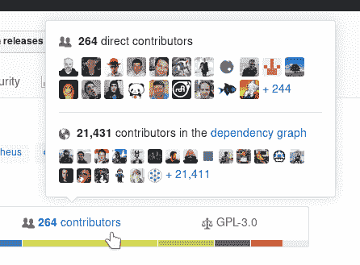
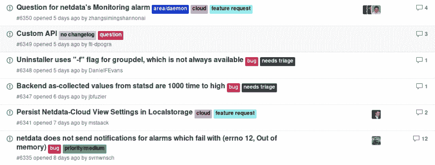

# 如何激发对您的开源项目的杰出贡献

> 原文：<https://dev.to/joelhans/how-to-inspire-exceptional-contributions-to-your-open-source-project-1ebf>

*这篇文章最初发表在 [Netdata 博客](https://blog.netdata.cloud/posts/open-source-contributions/)上。*

* * *

谈到鼓舞人心的贡献，Netdata *必须*在做正确的事情。我们的[开源分布式监控代理](https://github.com/netdata/netdata)在 GitHub 上非常受欢迎，已经有数百人做出了贡献:

 

我们甚至雇佣了一些贡献者全职致力于使 Netdata 生态系统更加强大。

社区对我们正在构建的东西充满热情，他们非常希望让它更好地满足他们的特殊需求。

因为贡献者就是这样的人:**愿意介入并改进你的项目，以便它更好地为*他们的特定用例*** 服务。一些贡献者也很乐意为其他原因贡献他们的时间，但是在我们的例子中，他们大多是系统管理员，一旦我们实现了他们的想法，他们会做得更快或更聪明。

但是 Netdata 社区并不是凭空出现的。我们采取了许多协同努力来激发这些贡献，我们认为我们应该分享一些最成功的举措。

现在，为开源项目激发贡献的过程有两个核心部分:1)获得新的贡献者，2)长期留住他们。这些我们陆续说吧。

## 为你的开源项目找到新的贡献者

就像创业一样，任何开源项目的主要目标都是获得热切和热情的人的关注。是的，这是一种营销，但我们几乎只专注于尽可能简单地做出贡献。

### 记住每一期都是一份贡献

没有所谓的无益问题。但是为了让您的项目从这些问题中获得价值，您需要发现根本原因。这意味着要有耐心，花时间与这位新贡献者讨论他们的顾虑。问题并不总是出在你的代码中——它可能缺少文档，或者他们可能以你以前没有想到的方式使用你的项目。

通过总是把每一个问题，不管多小，作为有价值的贡献来对待，你将能够更有效地帮助用户解决他们的问题，并使你的项目从长远来看更好。

这就是我们在 Netdata 处理新问题的方式。每个人都帮助我们更好地了解人们是如何在“野外”使用该制剂的通过理解这些用例，我们可以让 Netdata 对更多的开发人员、系统管理员和 DevOps 工程师更有价值。

### 上传并提交贡献者契约行为准则

作为一个开源维护者，你能做的最糟糕的事情就是创造一个让人们不愿为你的项目做贡献的环境。你不能对你的信念含糊其辞，这使得行为准则对于任何开源项目来说都是显而易见的。另外，实现起来也不费吹灰之力。

[贡献者契约](https://www.contributor-covenant.org/)是由 [Coraline Ada Ehmke](https://where.coraline.codes/) 创建的一份文件，以明确你接受来自所有背景和情况的人的贡献的承诺。

你可以在这里下载并改编最新版本[。根据需要修改它，并以文件名`CODE_OF_CONDUCT.md`将其添加到项目的根目录中。当然，我们身体力行。这是 Netdata 自身的](https://www.contributor-covenant.org/version/1/4/code-of-conduct)[行为准则](https://github.com/netdata/netdata/blob/master/CODE_OF_CONDUCT.md)。

### 创建一个 CONTRIBUTING.md 文件，解释如何以及在哪里提供帮助

在 Netdata，我们有一个非常全面的[贡献文档](https://github.com/netdata/netdata/blob/master/CONTRIBUTING.md)，我们在`CONTRIBUTING.md`维护它。在本文件中，我们概述了人们为 Netdata 做出贡献的各种方式。

在你的`CONTRIBUTING.md`文档中，你应该清楚而具体地说明所有技能水平的人可能如何为你的项目做出贡献。对于那些以前从未为项目贡献过代码的人，请他们在项目上打一颗 GitHub 星，或者创建一个问题来提供建设性的批评。对于更高级的贡献者，明确你的项目最需要工作的领域。或许这是在改进文档，或许这是用户强烈要求的新特性。

这份文件也是一个很好的机会来提及行为准则，以及你的项目运作的其他理念。对于 Netdata 来说，那就是**性能**、**有意义的指标**、**自动化测试**、一个**分布式框架**、**对许多操作系统的支持**，包括**文档**，以及**未来维护**。

确保这个文档也解释了你如何处理工作流和过程，比如拉请求和代码审查。你希望贡献者在主回购上工作，还是把它转到他们自己的 GitHub 账户上工作？你如何标记问题？如何区分准备合并的代码和仍在进行中的代码？

在你的`CONTRIBUTING.md`文档中，清晰是最重要的。阅读本文档后，潜在贡献者应该`1)`能够根据您的定义自行选择他们的技能水平，`2)`知道下一步在哪里做出他们的第一份贡献，`3)`感觉他们能够有意义地帮助项目向前发展。

你可能会觉得你在微观管理，但是你在建立入职过程的效率和清晰度。每个人的时间都是有限的，一份好的`CONTRIBUTING.md`文档可以确保人们尽可能无缝地开始工作。

<figcaption>GitHub even gives you an easy way to track your progress in developing these contributor-friendly resources!</figcaption>

### 不要指望别人能解决你需要的

 *仅仅因为你在你的`CONTRIBUTING.md`文档中概述了项目中需要改进的部分，并不意味着人们会蜂拥而至来解决你的请求。相反，他们更有可能找到解决他们的问题和特定用例的方法。

一个想从自家后院的树莓皮上追踪实时天气数据的 Netdata 用户不会对[收集更多的清漆指标](https://github.com/netdata/netdata/issues/6169)有太大兴趣，尽管我们恰恰希望如此。但是他们可能有兴趣编写一个新的[收集器](https://docs.netdata.cloud/collectors/)来从他们的传感器收集更多的数据。

> 记住:用户的需求推动贡献，而不仅仅是他们的热情。

### 用“良好的首个问题”标记具体问题

在 Netdata，我们经常在关于插件、警报和集成的问题或功能请求上去掉`good first issue`标签，因为从事这些工作不需要贡献者理解进入 Netdata 的每一行`C`。例如，我们一直在寻求帮助构建[更好的警报](https://github.com/netdata/netdata/issues/4727)，它使用具有 Netdata 特定语法的配置文件。如果有人想在这里帮助我们，他们只需要学习配置语法就可以开始了。这样做将教会他们很多关于 Netdata 的底层结构，为他们将来更复杂的贡献做好准备。

标记是一个简单的动作，有助于将新的潜在贡献者推向他们最有帮助的领域。

无论何时使用`good first issue`标签，都要确保有可靠的文档来支持它。这就是我们对[关于如何编写报警配置文件的大量文档](https://docs.netdata.cloud/health/)所做的。如果你没有这部分代码的文档，那么这个问题就不是一个好的首要问题。

不说别的，在 GitHub 上搜索 [`good first issue`](https://github.com/search?q=label%3A+good+first+issue) 会返回超过 20 万个结果。也许一个热切的开发人员会执行这样的搜索，并第一次偶然发现你的项目。

### 鼓励在文档中投稿

想象一下，你每天得到 100 个你的代码的克隆/安装。但是其中 10%的人在安装过程中遇到了麻烦。这 10%中的一半——每天有 5 个人——提出问题寻求帮助，因为他们看不懂文档。你可以把你宝贵的时间花在帮助他们上，或者让这些问题得不到解答，创造出前面提到的墓地。不管怎样，这对你的项目来说都是个坏消息。

现在，让我们假设一个贡献者出现并重写了安装程序文档，将安装失败率从 10%降低到 2%。不仅仅是你每天只看到一期，这位撰稿人为你节省了大量的时间和精力。

作为维护人员，您的主要工作是保持项目的活力，更好的文档几乎总是比新特性更重要，即使前者远没有那么吸引人。

改进文档、纠正错别字、理顺句子都是创建完美、专业代码库的一部分。通过鼓励对文档的贡献，你将会撒下更大的网，不可避免地捕捉到一些你可能会错过的人。

## 留住身边的贡献者

贡献者逗留的时间越长，他们就越能更好地与你、你的代码以及任何可能参与进来的人一起工作。相反，失去一个高价值的贡献者会给项目带来巨大的成本。

当然，随着时间的推移，你会经历一些不可避免的损耗。人们找到新工作，搬家，组建家庭，经历艰难时期。你不能阻止每一个离开，但是你可以依靠一些最佳实践来尽可能长时间地留住贡献者。

但是你可以通过遵循一个非常简单的规则来留住人们:**贡献者是志愿者，感激总是流向志愿者。**他们没有机会参与你的项目。你很幸运受益于他们的时间和专业知识。

这就是我们从营销转向管理的地方。

### 在贡献者的兴趣消退之前解决问题

每期都有截止日期。你必须迅速行动，因为你永远不知道到期日何时到来。

如果你在时间用完之前不接受用户的问题是一个有效的现实场景，你将永远失去他们。这是一种耻辱，因为贡献者是有价值的测试者和质量保证检查员——毕竟，他们在他们生命中的某个重要部分运行你的项目。

Netdata 的贡献者已经在几十个用例中实现了生产质量，这些用例是我们自己永远无法解决的。当我们不断努力快速解决新问题时，我们会努力记住这一点。

<figcaption>As always, trying our hardest to engage issues straightaway.</figcaption>

### 找到你的贡献者喜欢的工作

志愿者对那些不能让他们兴奋或给他们一种帮助公益事业的模糊感觉的工作没有耐心。

随着新的贡献者开始与团队交流并提交 PRs，您会对他们最感兴趣的工作有所了解。你也会发现他们擅长什么。鼓励你的贡献者也告诉你这些事情。他们擅长 CSS 并想让你的应用程序的仪表板看起来更好吗？他们喜欢创建测试套件吗？他们热爱文档并知道如何写一个清晰的句子吗？

了解他们的兴趣和才能，并适当地将工作委派给他们，这是作为维护者和团队领导你能做的最重要的事情之一。他们可能不会因此而感谢你，但一路上他们肯定会更快乐。

### 让人们按照自己的时间表工作

同样，你的贡献者不是你的员工。在给定的时间框架内，你不应该期望他们在什么时候或者对你的项目有多大贡献。你不应该期望他们在一个小时内对 GitHub 的每一次提及做出回应。作为维护者，你有责任以一种尊重他们在项目之外也有生活的方式来委派工作。

> 任何贡献者都不应该对他们为你的项目所做的贡献感到压力。

如果一个问题是严重的和时间敏感的，例如安全漏洞或阻止人们安装或使用你的软件的拦截器，这是你的责任。不要依赖他人，也不要指望贡献者会跳过他们孩子的小提琴演奏会，自愿花更多的时间来解决一个关键问题。

通过在你的管理风格中建立灵活性，你将尽可能长时间地避免精疲力竭的威胁。任何贡献者都不应该对他们为你的项目所做的贡献感到压力。这不仅仅是一个让你精疲力尽的方法——这是一条从 A 点到 b 点的直线。

### 知道何时说不

积极而有价值的贡献者通常会对你的项目的未来提出不可行或你不同意的建议或要求。也许他们想重新设计仪表板，而你认为这是在浪费时间，直到特性 X、Y 和 Z 被实现。也许他们想把你的整个代码库改造成 Rust，因为每个人似乎都突然喜欢上了 Rust。

你需要在管理团队的方式中建立(善意的)拒绝。当你完全致力于不合并代码的时候，允许贡献者停止工作，从事他们喜欢的项目，不仅仅是浪费时间。也很残忍，不尊重人。

这一点也适用于那些贪多嚼不烂的贡献者。即使一个特定的项目是有效的和有价值的，但是对于贡献者来说太复杂而不能处理，你也不应该允许他们在不可避免会失败的工作中挣扎。

相反，当贡献者宣布他们的意图时，参与进来。你可能会发现很难打破他们的愿景，但从长远来看，这将是最好的结果。

记住:**任何贡献者都不应该对他们为你的项目所做的贡献感到压力。**

### 随时间扩展角色

你希望你的贡献者增加。培养他们的才能和对项目的承诺。反过来，你必须给他们成长的空间。

这意味着要认识到什么时候一个积极的贡献者可以在没有你指导的情况下处理更复杂的任务。或者允许他们参与其他贡献者工作的代码评审。一旦他们证明了自己，也许是时候给他们合并权了。

对于每个项目和您特定的管理风格来说，成长的里程碑可能是不同的，但是如果一个贡献者在项目中的角色从来没有超出发送有用的错误报告和期望最好的结果，那么没有人会从他那里得到最多。

正如[德鲁·德沃明智地](https://drewdevault.com/2018/06/01/How-I-maintain-FOSS-projects.html#fnref:1)所说:

> 对于贡献者通过承担艰难或重要的任务而获得的经验来说，由于缺乏经验而导致的一些错误是很小的代价。

### 要有礼貌！

开源社区有时会引起争议。不要助长这种心态！

## 我们的社区哲学

在这一切之后，我们可以专注于使 Netdata 成为各种形式和规模贡献的圣地的核心理念。

1.  任何提交问题的人都是贡献者。
2.  社区的需求推动着 Netdata 的未来。
3.  我们的贡献者使 Netdata 成为生产级产品。
4.  每个贡献者都应该知道我们在倾听，而且要快。
5.  每个人都应该在没有压力的情况下，用自己的时间做自己喜欢的项目。
6.  我们会对彼此非常好！

## 激励新的和持续的贡献者完全是关于透明度和指导

对于许多开源项目维护者来说，这两种品质都是可怕的。他们花了很多时间，并为批评或竞争创造了曝光率。它们需要大量的写作技巧，用于创建文档、清楚地解释自己，以及管理贡献者之间的交流方式。你需要耐心和奉献。

但是来自你的社区的鼓舞人心的贡献是你能做的让你的项目继续下去的最好的事情。很可能会有这样的时候，即使你需要从你已经建立的项目中休息一下，但是如果你已经策划了一个愿意承担这个任务的社区，你就可以让你的努力工作继续下去。

这里有一些有趣的资源，可以用来管理贡献者:

*   [仅限第一次使用](https://www.firsttimersonly.com/)
*   [一个开源维护者的挣扎](http://antirez.com/news/129)
*   [我如何维护自由/开源软件项目](https://drewdevault.com/2018/06/01/How-I-maintain-FOSS-projects.html)

相反，对于那些想为开源项目做贡献的人来说:

*   [如何为开源做出贡献](https://opensource.guide/how-to-contribute/)
*   对你来说，为开源项目做贡献有哪些障碍？
*   [首次捐款](https://github.com/firstcontributions/first-contributions)
*   [开源:我在巴别塔的第一个功能贡献的 9 个步骤](https://maurobringolf.ch/2017/07/open-source-9-steps-to-my-first-feature-contribution-in-babel/)

我错过了一个帮助激励伟大贡献者的重要提示吗？请在评论中告诉我。*