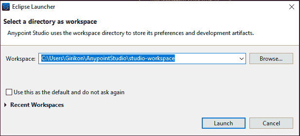
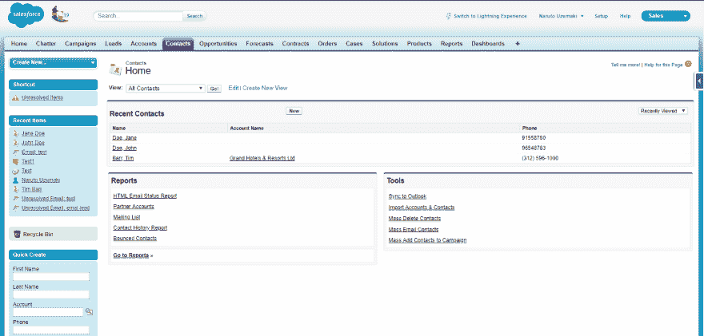

# 如何整合 Salesforce 和 MuleSoft

> 原文：<https://dev.to/girikon/how-to-integrate-salesforce-with-mulesoft-dgk>

**我们的 Salesforce 咨询团队逐步完成简单的 MuleSoft 集成**

在 Girikon，一家银色的 [**Salesforce 咨询公司**](https://www.girikon.com.au/salesforce-consultant/) 我们相信 Salesforce 是基于 CRM(客户关系管理)功能的世界第一云平台。去年年初，Salesforce 同意以数百万美元的现金和股票交易收购 MuleSoft。MuleSoft 是一家软件公司，提供连接应用程序、数据和设备的集成软件。

Girikon 的 Salesforce 顾问专注于许多 Salesforce 产品，在发布之后，我们的顾问团队获得了 MuleSoft 的认证。Girikon 致力于通过领先技术的知识和认证保持领先地位。

在这篇博客中，我们关注 Salesforce 与 MuleSoft 的集成。

首先，我们需要一个 Salesforce 开发人员帐户，方法是单击以下链接:

[https://developer.salesforce.com/signup](https://developer.salesforce.com/signup)。

然后点击以下链接创建 MuleSoft 帐户:

[https://anypoint.mulesoft.com/login/signup](https://anypoint.mulesoft.com/login/signup)。

在第一个示例中，我们可以在 MuleSoft 的帮助下向 Salesforce 发送一些联系人记录。为此，我们必须通过点击链接[https://www.mulesoft.com/lp/dl/studio](https://www.mulesoft.com/lp/dl/studio)下载任何一个点工作室，这是一个 MuleSoft IDE。

我们将使用任何点工作室进行数据传输。首先下载任意点工作室。然后解压你的目录中的 zip 文件，并点击应用程序来安装它。安装完成后，点击任意点工作室图标，它将启动一个向导，如下图所示。

Fig: – Launch Wizard of Any point Studio

*   选择工作区目录后，单击启动按钮。然后它将打开如下图所示的任意点工作室。

Fig: – Any point Studio

*   通过登录 MuleSoft 帐户，在任何 point Studio 中从任何 point Exchange 打开示例项目。
*   下载导入联系人到 Salesforce 应用程序。注意:不要运行应用程序。
*   登录您的 Salesforce 帐户。
*   在左侧导航栏中，打开个人设置标题下的我的设置，单击展开我的个人信息。
*   单击重置我的安全令牌。Salesforce 重置令牌和电子邮件。
*   打开发送安全令牌的邮件帐户，并将令牌复制到本地剪贴板上。
*   下载并打开应用程序后，现在打开你的任意点工作室，它将看起来像图
     所示

    
Fig: – Any point Studio with application

*   在 Studio 的应用程序中，单击 Global Elements 选项卡。双击 Salesforce SFDC 配置全局元素以打开其全局元素属性面板。

*   在安全令牌字段中，粘贴您从邮件中复制的 Salesforce 令牌。

*   或者，在 XML 编辑器中配置全局元素。

*   将用户名和密码字段的内容更改为特定于您的帐户的值，然后单击确定保存更改。

*   该应用程序项目包括一个示例 CSV 文件 contacts.csv，您可以使用它来查看该应用程序的端到端功能。CSV 文件将如下所示。
    [T3】](https://www.girikon.com/wp-content/uploads/2019/07/image5-1.png)

    
Fig: – contacts.csv

在 Package Explorer 中，单击 src/main/resources 文件夹将其展开，然后在该文件夹中找到 contacts.csv 文件。双击全局元素选项卡中的文件配置选项卡，并将工作目录字段设置为指向 src/main/resources 文件夹。在包浏览器中，右键单击 import-contacts-into-sales force 项目，然后选择 Run As > Mule Application。

Studio 在嵌入式服务器上运行应用程序。应用程序成功运行后，它将在 salesforce 中创建两个包含 csv 文件的联系人记录。打开您的 salesforce 帐户，然后导航至联系人选项卡。它将显示两个新条目:John Doe 和 Jane Doe。

Fig: – Two new contacts created

帖子[如何整合 Salesforce 和 MuleSoft](https://www.girikon.com/blog/salesforce-mulesoft-integration/) 最早出现在 [Salesforce 咨询公司，全球办事处在美国，澳大利亚](https://www.girikon.com/)。