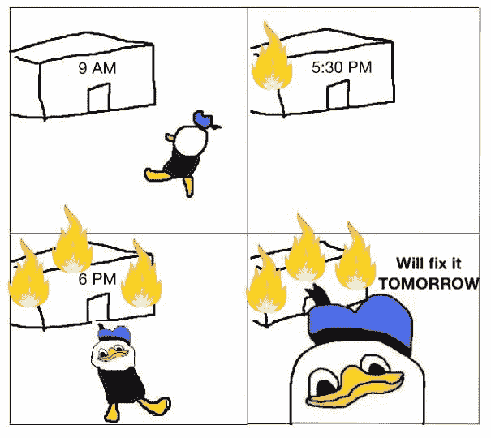
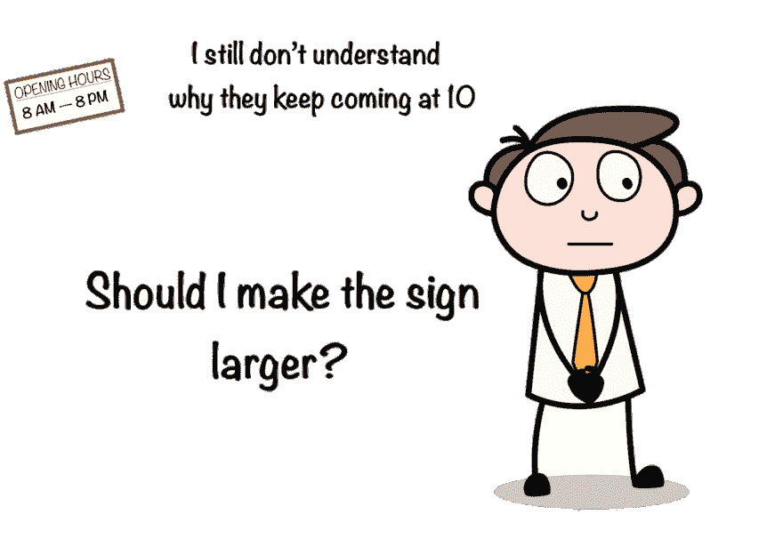

# 如何制定个人 SLA 以在工作中找到平衡(第二部分)

> 原文：<https://dev.to/_elergy_/how-to-make-personal-sla-to-find-balance-at-work-part-2-2h2c>

第一部分的链接是[这里是](https://evgenii.info/sla-1)。这是第二个。

## 个人 SLA

正如我之前提到的，人们没有文档。相反，我们必须依靠个人感知。

如果你是一个人，你可能会注意到其他人总是对你有所期待，但可能不清楚具体是什么。有时候他们的思考方式会让你吃惊:

> Tracy 是我们团队中唯一的女性，所以她应该为我们的下一个活动做一个蛋糕。
> 
> Dan 没有家庭，他应该在圣诞假期来办公室。
> 
> 麦克总是忘记带眼镜，我们不应该给他升职，因为他无法应付。

这些事情很难预防，但我有两个小贴士可以让它变得不那么频繁:

1.  意识到我们在做什么，因为它给了人们一个暗示，告诉人们未来会发生什么。
2.  要始终如一。

听起来像是前一部分的两个原则，对吗？

**听起来像个人 SLA。**

如何建立良好的个人 SLA？

从 SLA 的*危险部分我们已经知道，一个指标是不够的，我们应该有一套指标。每月带来一只猛犸象是不够的，我们需要添加更多的细节。*

所有指标及其目标值应符合以下规则:

1.  它们应该是可持续的。这意味着我们维持一个好的 SLA 越久，对我们来说就越容易。
2.  它们应该有助于实现长期目标。
3.  应该是可以实现的。

我们的衡量标准应涵盖 3 类行为:

1.  **领域**这一类别描述了我们的职责范围:**我们能做什么**。
2.  **可用性**这个类别有描述**何时**我们正在做的指标。
3.  **质量**最后一类描述了**我们如何**做这件事。这不仅意味着最终结果的质量，也意味着我们的态度和方法。

现在，我想谈谈这些类别中的每一个，展示好的度量标准的例子，并描述它们如何遵守我们之前设定的规则。

* * *

## 类别 1:域

所有描述**其他人可能期望我们做的事情**都属于这一类。

如果你的键盘坏了，你就打电话给 IT 部门的人。他的领域是帮助人们解决与 IT 相关的问题。如果你申请签证需要工作证明，你可以去找人力资源部的人。很可能，这是他们的领域。

有时候并不是那么清楚:

> Tracy 是我们团队中唯一的女性，所以她应该为我们的下一个活动做一个蛋糕。

对某些人来说，特雷西的一个领域是烘焙蛋糕。也许这是真的，但我们现在不知道。如果她不同意，她内心的感知和其他人对她的期望就有出入。

如果有人不断要求你做一些你不喜欢做的事情，转移无聊的责任，并期望你为此感到高兴，你可能也有同样的问题。

### 举例

我刚开始工作时遇到了一个问题——很难承认我什么都不知道。

我觉得每次有人问问题，我都必须找到答案。我远程工作的事实让情况变得更糟。没有人看到我在做什么，所以我有足够的时间去谷歌或者问别人。

现在我知道这只是冒名顶替综合征，但当时我觉得有人会发现我不适合这份工作的偏执。

老实说，我不能抱怨太多，因为这对每个人都有好处:

1.  人们可以问我任何问题，当我处理它的时候，他们只是等待。
2.  我已经建立了良好的声誉，因为我已经证明了我能够独立工作。我的同事们看到我可以自己找到任何东西——这在当时是一个大三学生的关键技能。

如果它运行良好，它是关于什么的？

我最大的错误是，当我成为高级工程师和团队领导时，我坚持同样的行为。当人们问我问题时，我要么直接回答，要么利用我的关系网为他们寻找必要的信息。

我期望自己总能找到答案。

它不好的三个原因:

1.  我有更少的时间做自己的工作。
2.  我对此很不高兴。很多时候，当人们不想自己寻找答案时，他们会问一些问题。这不是复杂的问题和挑战，这只是时间的问题。
3.  我在很多情况下成了瓶颈。当人们需要我的帮助，而我不在的时候，他们会等我。通常，这是不必要的，他们可以自己解决。

那时候我会对自己建议什么？显然，试着建立更现实的期望，让其他人找到答案。更具体地说:

1.  如果你不知道某事，就说“我不知道”。没有人什么都知道，这没关系。
2.  如果你知道在哪里可以找到这些信息，请与同事分享。它可以是文档的链接(或一些查找它的关键字)，某人的电子邮件地址，任何东西。
3.  如果你决定自己寻找答案，分享一下你是如何做到的。确保在没有你的情况下也能回答类似的问题:–发送所有你认为有用的链接——讲述在类似情况下能提供帮助的人——让这位同事参与你发起的所有沟通，这样她就能自己提出后续问题

### 如何契合好的个人 SLA 的规则？

让我们比较一下我建立的两种不同的期望:

1.  我会找到任何问题的答案
2.  如果我知道什么，我会告诉你的。不然我就说不知道。

规则 1:它是可持续的吗？

我越遵循第一种方法，就越难。如果人们问我问题，我为他们找到答案，他们会带来更多的问题。他们会建议其他人在不确定的时候和我谈谈。在某些时候，我将无法处理它，所以它是不可持续的。

相反，另一种方法给了人们更多关于我的知识极限的信息。最终，他们会多问一些我知道的事，少问一些我不知道的事，因为这对每个人来说都更容易。如果我不在，他们可能不会被屏蔽，因为没有必要再等我了——可能我只是不知道答案。只要他们确定有必要，等待是值得的。这种方法是可持续的。

规则二:对实现长期目标有帮助吗？

答案取决于目标。

我最初的目标是证明(对自己)我不是骗子，并建立良好的声誉。这种方法效果很好，所以即使是第一种不可持续的方法，在这里也帮助了我。

显然，一个高级工程师的目标与初级工程师的不同，所以这种策略不起作用了。此外，这使事情变得更糟，因为我的团队不太能够并行地做事情，有时我会阻碍其他工程师的职业发展。

第二种方法帮助我有更多的时间做与我的直接职责相关的事情。同时，球队没有被我阻挡，我们可以取得更多的成绩。说“我不知道”是实现我长期目标的更好策略。

规则 3:有可能一直坚持这种方法吗？

如果我说*“你的问题我总能找到答案”*会怎么样？我能确信这是真的吗？

显然，不是所有的问题都有答案。有些问题太复杂了，花时间在上面不合理。最终，这意味着我将无法信守承诺，对所有事情都做出回答。

另一方面，说*“我知道答案就来回答你的问题”*并没有同样的问题。遵循这种方法很容易，如果我什么都不知道，没有人会失望。这是绝对有可能的。

现在，您看到了找到正确的领域并恰当地传达它是如何改变您日常工作的范围的。在我们找到正确的领域后，我们需要做的就是始终如一地坚持下去，因为这是建立正确期望的唯一方法。

* * *

### 第二类:可用性

领域让周围的人了解我们能做什么。可用性有描述**何时**我们可以做的指标。

我应该什么时候到办公室？

——我回复 WhatsApp 消息的速度有多快？

–如果有急事，可以在周日打电话给我吗？

这就是可用性。

通常情况下，这与正式合同中的内容无关，因为人们仍然依赖自己的感觉。上文中的这段引文说明了这一点:

> Dan 没有家庭，他应该在圣诞假期来办公室。

有人认为圣诞节期间丹必须值班。

也许他去年就已经做过了，或者他说因为某种原因他不喜欢圣诞节。无论如何，他建立了这些期望，这将很难改变。

### 举例

就像我之前说的，我花了很多时间帮助别人解决问题。但我还是得做我的工作。我是如何做到这一切的？

答案很简单——我加班了。

问题不仅仅是问题，至少有三种标准情况浮现在脑海中:

1.  如果我花了很多时间处理一个简单的问题，我会觉得无论如何都有义务完成我的工作。想象一下，有一个任务我可以做 4 个小时。我启动了它，然后遇到了意想不到的事情。我花了一整天调试，问题最终是一个错误的变量名或一个丢失的逗号。在这种情况下，我通常会加班完成任务，因为我觉得是我的错。
2.  **固定的期限和不断变化的要求。**另一个例子——我从事某项工作，然后需求意外地发生了变化。我得扔掉一些碎片，重新开始。当截止日期与营销活动的开始或某个特定日期(如圣诞节或季度末)联系在一起时，情况会更糟。
3.  **突发事件。**当然，没有人在突发事件中是安全的，它们总是在你意想不到的时候发生。凌晨 3 点或你计划回家前 30 分钟可能会发生一些重要的事情——额外的工作是不可避免的。

SLA 如何帮助我做得更好？

答案很简单:**确定工作的小时数，并坚持下去。**

这听起来很奇怪:如果我已经工作了 7.5 小时，而我们又有紧急情况，我怎么可能只工作 8 小时呢？我应该回家吗？

<figure> 

<figcaption>这就是一个非常严格的 SLA 的样子</figcaption>

</figure>

当您查看 SLA 中的传统指标(如正常运行时间)时，答案就变得简单了。一个系统不可能在某个特定时刻保持 99.99%的运行状态，它可以运行也可以关闭。99.99%只有在距离上才有可能。工作时间也是一样——一天工作 8 个小时真的很难。但是一周工作 40 小时要容易得多。如果我必须在星期一呆到很晚，为什么我不能在星期二早点离开？

为什么这很重要？

1.  长时间工作会对健康产生负面影响:过度劳累与睡眠问题、T2、心脏病和抑郁症症状之间存在关联。
2.  疲倦的人效率更低，容易犯更多的错误。
3.  当你持续过度工作时，你会让它更有可能再次发生，因为它成为你与周围人交流的 SLA 的一部分。

前两项听起来很简单。最后一个我会说几句。

> 我的朋友在一家数码公司做网页开发。前一段时间，他分享了一个他在工作中遇到问题的故事。
> 
> 他们的作息时间很灵活，每个人大概工作 7 - 9 个小时，但是没人检查。通常，他们完成所有计划好的工作后就回家了。
> 
> 最近，我的朋友发现自己处于一个非常不愉快的境地——他的经理在他计划回家之前开始要求开始重要和紧急的任务。她以前经常这样做，但这很少见——大约一个月一次。现在她每周至少做两次，而且越来越严重。

他告诉我的不仅仅是一个故事，而是对他的经理的抱怨，以显示她有多狡猾，迫使他一次又一次地加班。

我很容易理解我的朋友，但我也能想象他的经理的处境。

他们都被雇佣来为他们的公司做最好的事。我朋友的职责之一是建立好的网站。

他的经理的职责(也是其中之一)是组织她的团队的流程，使每件事按时高质量地完成。

这位经理的团队中有几十名开发人员，她需要在一天中与他们中的许多人交谈。在某种程度上，她明白了如果她在一天结束时重新安排与我朋友的交流，他会做得更多。

我们不知道她是如何想到这一点的——也许她是无意识地这么做的，但也有可能她在这之前尝试了不同的方法。我们只知道她找到了一种让她的开发人员更努力工作的方法。衡量时间总是比效率和质量更容易，所以在她看来，她为公司做到了最好。最有可能的是，她没有试图让其他人感觉不好，她只是试图做她的工作，利用她所拥有的所有信息。

我的朋友也尽力了吗？

我问他一个简单的问题:

> –如果你的朋友在工作日走到你面前，提出在附近的酒吧喝两杯伏特加，你会怎么说？我可能会说我很好。
> 
> 为什么？你们公司禁止喝酒吗？
> 
> –嗯...我不记得我的合同里有任何关于它的内容。但我不认为之后我还能继续工作。

这才是重点。几项研究表明，工作时疲劳相当于喝醉。例如:

> 根据新的研究，就像喝酒一样，疲惫的神经元反应更慢，需要更长的时间，发出更弱的信号。
> 
> 这项研究可以解释为什么非常累感觉有点像喝醉了。这也可能解释了为什么有些症状是相似的，比如在一夜未眠或大量饮酒后记忆力减退和注意力不集中。
> 
> 摘自[Independent.co.uk](https://www.independent.co.uk/news/science/tired-sleep-drunk-symptoms-effects-drink-alcohol-fatigue-study-research-latest-a8040721.html)

只是重新表述他的情况:他发现有些事情对他的表现和态度有负面影响。但是他没有告诉他的经理。他没有试图改善这种情况。相反，他保持相同的 SLA: *如果他在一天结束时有新任务，他会工作更长时间。对每个人来说都是双输的局面。*

> 老实说，在我的朋友解决了他的问题之后，我们有过这样的对话。
> 
> 我只是把它放在这里看起来更明智，对不起:-)

当时，我只是建议与经理讨论此事，以建立一个更可持续的流程，但他找到了另一个解决方案。

他开始保持平衡——如果以前不得不加班，就减少工作。他做的最棒的事——他让所有人都明白了。如果他来晚了，他会在每天的团队会议上解释原因。如果他打算提前离开，他会让团队知道。类似于*“我计划今天 3:30 离开，因为我昨天把 X 修理到晚上 10 点。如果你需要我，请告诉我”*让每个人都明白这一点。更好的是，当周围的人开始做同样的事情时，一天结束时有新任务的情况就变得不那么常见了。他们的经理仍然试图为公司做得最好，但现在她有更多的信息来寻找另一种方法。

该团队中的所有工程师都更改了他们的 SLA，以保持每周相同的工作时间。同时，他们在紧急情况下保持灵活性。如你所见，他们**找到了可持续的平衡**和**在保持合理的工作时间方面是一致的**。

8 小时只是一个例子，因为这是合同中最常见的价值。实际值看你的情况:一个可以是 4，一个可以是 10。

### 如何符合一个好的个人 SLA 的规则？

我的朋友有两种不同的策略:

1.  他一直工作到所有的工作都完成为止
2.  他每周工作 40 个小时，但如果需要的话，每天都可以灵活安排。如果有重要的事情发生，他会加班，但是为了保持平衡，他会减少工作量。

让我们像以前一样比较一下。

规则 1:它是可持续的吗？

第一种方法是不可持续的，因为工作量取决于以前的表现。你完成的任务越多，你就可以为未来计划更多的任务，因为你过去做得很好。在前面的例子中，经理没有时间考虑加班会影响工程师的长期表现。反过来，我的朋友没有把这个信息给她。他们一起建立了不可持续的过程，这只是一个时间问题，何时以及如何爆发。

第二种方法被证明更具可持续性，因为经理有更多关于可用性的信息来明智地安排工作的优先级。工程师们严格遵守时间表，这有助于他们保持最佳性能，同时他们仍能灵活处理紧急情况。他们越遵循这种方法，就越容易提前计划。

规则二:对实现长期目标有帮助吗？

我不能很自信地回答这个问题，因为我不知道我的朋友当时有什么目标。

我想他的目标是在公司里建立一个成功的职业生涯，同时享受工作氛围，不牺牲个人生活。在这种情况下，第一种方法不起作用，因为他打算找一份新工作。第二种方法效果很好，而且不仅仅是对他而言。

规则 3:有可能一直坚持这种方法吗？

我认为只有当所有的工作都做完了才回家是不可行的。谁来定义需要做多少工作？谁保持可实现的水平？

显然，明智地计划然后成功地执行这个计划是一个好的意图。但在大多数情况下，不确定性水平太高，因此无论如何，能够实现长期目标比今天完成所有任务重要得多。当我们大多数人甚至无法预测明天将会做什么的时候，我们怎么能说只有当所有的工作都完成了，我们才能休息呢？

第二种方法在这些情况下非常有效。当我有空的时候，我总是可以说的。对于紧急情况，我有一个简单的规则。不取决于外界因素。

当然，有时候我们会遇到更多意想不到的情况，有时候一切都按计划进行。但是如果我们的 SLA 对每个人都是清楚的，就有可能一直坚持这种行为。

* * *

### 第三类:质量

我们定义了**什么**和**什么时候**我们能做什么。最后一类是关于**如何**。

这个**到底是什么意思**到底是什么意思？几件事，例如:

1.  最后的结果有多好。
2.  我们如何组织工作。
3.  我们用什么方法来达到目标。

这些指标通常很难衡量。

因此，如果有人对**品质**有期望，就很难改变。

我们一开始就有这样一个期望的例子:

> 麦克总是忘记带眼镜，我们不应该给他升职，因为他无法应付。

正如您在这里看到的，有人认为 Mike 粗心大意，因此对他处理新职位的能力的期望值很低。这不是关于他做了什么或者他什么时候做了什么，而是关于他的态度。

他现在能做些什么来改变这种情况呢？如果他不再忘记戴眼镜，情况看起来不会有所改善。

因此，从一开始就建立正确的印象非常重要——为指标定义合理的目标，并坚持不懈地实现它。

有很多不同的标准可以定义质量。通常，你可以为自己定义的大多数目标都是可持续的和可实现的。因此，我不想谈论一个有好目标和坏目标的特定情况，而是想展示更多的例子，但花更少的时间来谈论它们。

**例题**

1.  你总是以最好的结果为目标。是的，需要更多的时间。但这是可能的，有时也是必要的。如果别人的生活依赖于你的工作呢？如果你正在建造一枚太空火箭，而你只有一次机会把它做好，那该怎么办？如果周围的人认为你总能取得高质量的成果，那么你将是最关键任务的最佳人选。
2.  你总是试图让 _ **的东西尽快运转** _ **。**在很多情况下，结果不应该是完美的，速度更重要。需要建立一个原型来测试一个新想法？还是为客户的问题想出最快的解决方案？有需求的人可以做到这一点，所以如果这听起来像你，你总是会找到一个很好的利基。
3.  你可以擅长自主工作。如果你能带着一个问题，带着一个解决方案回来，那是非常好的。如果你总是这样做，周围的人肯定你要么完成它，要么带着为什么不可能的清晰解释回来——不需要长时间的会议和持续的状态更新。
4.  你可以擅长在团队中工作。组织不需要瓶颈，他们需要高效的流程、共享知识和高效的团队。不用说，拥有一个能够帮助人们一起实现比单独实现更大成就的人是至关重要的。

正如你所看到的，完全相反的方法在某些情况下可能是好的，这只是你的目标与实际需要保持一致的问题。

> 但是如果我想在中间找点什么呢？
> 
> 真的有必要坚持到极致吗？如果我想展示我可以灵活变通:自主地和在团队中工作，快速制作原型，开发高质量的产品，该怎么办？

这比你想象的要难，因为你永远不知道人们会注意到什么:

1.  你创造了一个完美的产品，但是你的老板只注意到了它的制作时间。
2.  你已经为一个重要的客户实施了一个快速解决方案，但是你的同事们在事后才注意到使用你的临时解决方案有多困难。

通常，这并不是因为他们是坏人或者不喜欢你——更可能的是他们并不了解所有的信息。在那种情况下什么能有帮助？

答案很简单——**沟通**。

如果你想确保人们记得正确的事情，你必须告诉他们。

你记得忘记带眼镜的迈克吗？现在你可能会给他一些建议。如果他想被人以不同的方式看待，他应该**谈论**这件事。

> 迈克:
> 
> 当我在做一个重要的项目时，我非常专注，所以我不会注意到周围的任何东西。昨天我忘了吃午饭，今天我找不到我的眼镜。
> 
> 能够集中注意力增加了一些好处，但我在每周二和周五都会试着退后一步，想想大局。这样，我就能确保我有效地运用了我所有的技能。

如果人们听到这些，他们会认为他是一个关心自己工作效率并致力于自己优点和缺点的人。至少直到他在星期二或星期五忘记一些事情。我是认真的——沟通在这里只是一种工具。**始终如一的行为**仍然是必需的。正如我们在前一部分所讨论的，人们更依赖他们的经验，而不是他们写的或说的。

<figure> 

<figcaption>男人，你该回家了</figcaption>

</figure>

* * *

## 总结

一个好的**个人 SLA** 包括三个类别:

1.  域(**能做什么)**
***   可用性(**何时**我们可以做到)*   质量(**如何**我们是如何做到的)**

 **所有指标及其目标值应该是:

1.  可持续的
2.  有助于实现目标
3.  可完成的

确保人们根据您的 SLA 建立期望的最佳方式是始终坚持您的标准。

有时保持一致的 SLA 没有帮助，人们仍然做出不切实际的期望。为什么？

很多时候，他们只是没有掌握所有的信息。

在这种情况下，沟通很有帮助:告诉人们你在做什么，为什么要做，给他们更多的细节。

好的 SLA 有不同的例子，有时它们完全相反。在一种情况下起作用的可能在另一种情况下不起作用。因此，这里最好的建议是根据你的目标、你对可持续性的理解和你自己的能力来建立你的 SLA。

* * *

> 如果没有在我发表了关于这个话题的第一篇笔记后和我交谈的所有人，这篇文章是不可能的。
> 
> 如果你使用相同的原则，不同意某些事情或有有趣的例子，请随时通过 [twitter](http://twitter.com/_elergy_) 、 [facebook](https://www.facebook.com/ponomarev.eugene) 或通过[电子邮件](//mailto:ponomarev.e.s@gmail.com)联系我。**