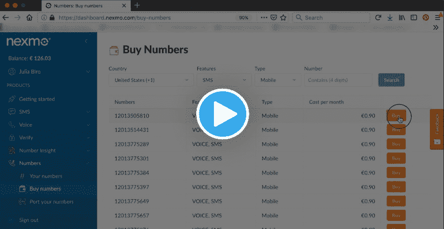
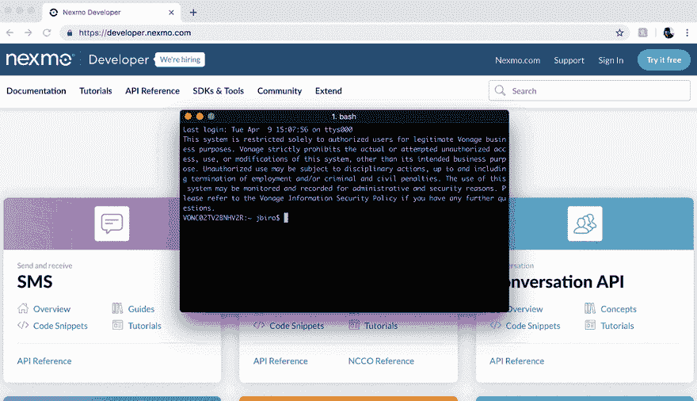
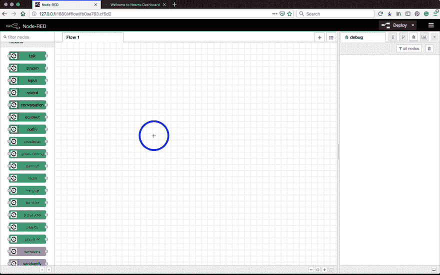
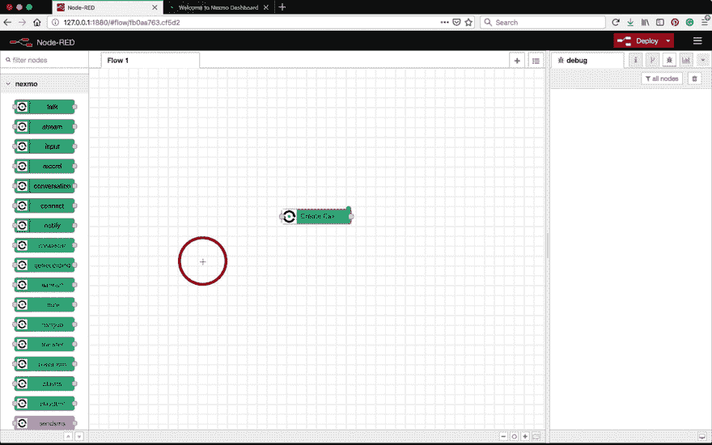
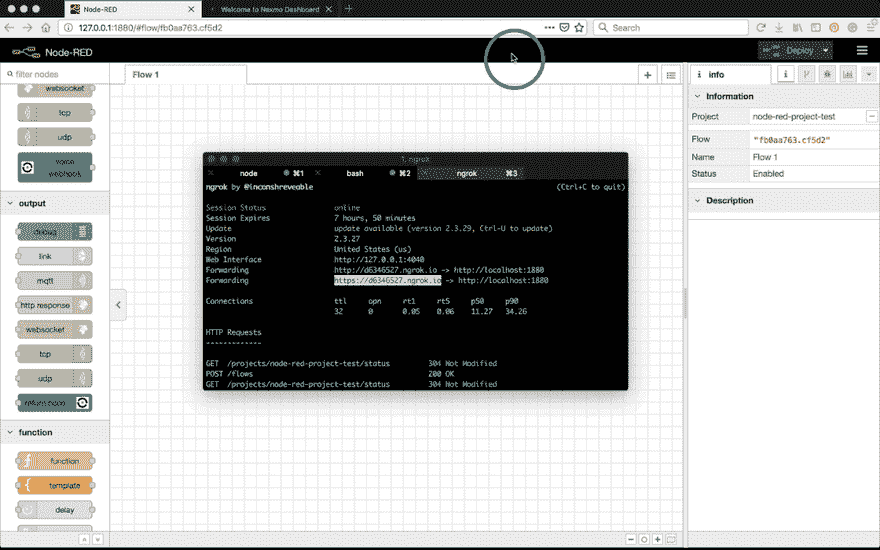
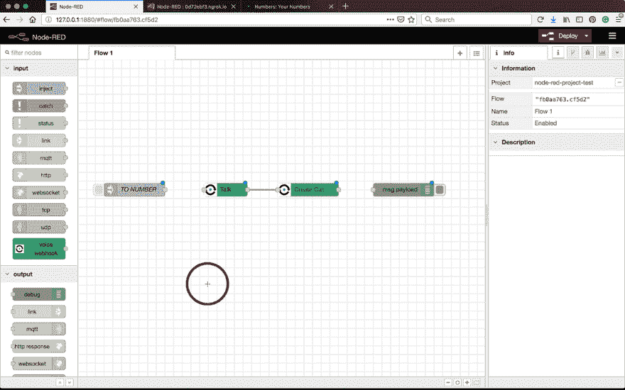

# 如何使用 Node-RED 进行文本到语音通话

> 原文：<https://dev.to/vonagedev/how-to-make-text-to-speech-phone-calls-with-node-red-2nfj>

*这是“Nexmo 和 Node-RED 入门”系列教程的第四篇文章。*

在之前的教程中，您已经学习了如何使用 Nexmo API 以编程方式发送和接收短信，以及如何处理来电。

接下来，您将学习出站呼叫，到本文结束时，您将已经使用 Node-RED 拨打了第一个文本到语音(TTS)电话。

## 先决条件

开始之前，您需要一些东西:

*   安装在您机器上的 [Node.js](https://nodejs.org/en/) 和 [Node-RED](https://nodered.org/docs/getting-started/installation)
*   Nexmo 帐户–[如果您还没有，请免费创建一个帐户](https://dashboard.nexmo.com/sign-up)
*   可选:[ngrok](https://ngrok.com/download)–了解[亚伦的博客文章](https://www.nexmo.com/blog/2017/07/04/local-development-nexmo-ngrok-tunnel-dr/)

### 领取证件

为了与语音 API 进行交互，您需要注意一些事情。一旦你创建了一个 Nexmo 账户，进入[仪表盘](https://dashboard.nexmo.com)找到你的 API 密匙和密码。

接下来，你需要一个启用语音的虚拟号码。前往号码> [购买号码](https://dashboard.nexmo.com/buy-numbers)获得一个号码。

[](https://res.cloudinary.com/practicaldev/image/fetch/s--T8BvIeGm--/c_limit%2Cf_auto%2Cfl_progressive%2Cq_auto%2Cw_880/https://www.nexmo.com/wp-content/uploads/2019/04/buy-number-nexmo-dashboard.png)

### 设置你的节点-红色编辑器

首先，你需要[安装](https://nodered.org/docs/getting-started/installation)运行时和编辑器。这可以在您的本地机器、单板计算机(例如 Raspberry Pi)上完成，也可以在许多云托管选项上完成。这个示例将使用您的本地机器，所以一旦您已经全局安装了 Node-RED，只需在您的终端中键入以下命令即可开始。

```
$ node-red 
```

然后，您可以通过将浏览器指向 [http://localhost:1880](http://localhost:1880) 来访问 Node-RED 编辑器。

打开编辑器后，您需要安装 Nexmo 节点。你可以在*管理调色板*菜单下搜索`node-red-contrib-nexmo`包并点击安装。

[](https://res.cloudinary.com/practicaldev/image/fetch/s--2o1iT9LB--/c_limit%2Cf_auto%2Cfl_progressive%2Cq_66%2Cw_880/https://www.nexmo.com/wp-content/uploads/2019/06/install-nexmo-nodered.gif)

现在，您应该看到所有的 Nexmo 节点出现在屏幕的左侧，在其他默认节点中。

## 使用 Node-RED 进行文字语音通话

### 创建 Nexmo 应用程序

包括语音 API 在内的一些 Nexmo API 使用 Nexmo 应用程序来保存连接到 NEX mo 端点所需的安全和配置信息。

在 Nexmo Node-RED 调色板中，有几个节点能够创建这些应用程序:`getrecording`、`earmuff`、`mute`、`hangup`、`transfer`、`createcall`、`playaudio`、`playtts`和`playdtmf`。

因为最终目标是发出一个呼出呼叫，所以使用 **`createcall`** 节点，它将使用上面创建的 NCCO 发出一个呼出呼叫。

一旦你把它放到你的工作区，双击 **`createcall`** 节点打开节点编辑器。`Nexmo Credentials`旁边的

，从下拉菜单中选择“添加新 nexmovoiceapp…”并点击编辑按钮。填写下面的详细信息，然后点击`Create New Application`。

| 键 | 描述 |
| --- | --- |
| `Name` | 为您的语音应用程序选择一个名称，例如`TTS call Node-RED`。 |
| `API Key` | 您的 Nexmo API 密钥，显示在您的[账户概述](https://dashboard.nexmo.com/getting-started-guide)中。 |
| `API Secret` | 您的 Nexmo API 秘密，显示在您的[账户概述](https://dashboard.nexmo.com/getting-started-guide)中。 |
| `Answer URL` | 当处理[入站呼叫](https://dev.to/nexmo/how-to-receive-phone-calls-with-node-red-3in5-temp-slug-648629)时，Nexmo 向其发出请求的 URL。本教程不需要，所以现在使用 http://example.com 的。 |
| `Event URL` | Nexmo 将向该 URL 发送呼叫事件(如响铃、应答)。如果您想要接收有关通话进度的事件，请确保您的服务器已接入互联网，然后在此字段中使用`YOUR_URL/event`。 |

否则，请随意使用[http://example.com](http://example.com)——这将响应 200 OK。

您还可以在其节点属性中为特定的`createCall`节点覆盖该 eventURL。|

Node-RED 将在您的帐户上创建一个新的 Nexmo 应用程序，并填写应用程序 ID 和私钥字段供您保存。现在你可以在你的 Nexmo 仪表盘的*语音* > *[你的应用](https://dashboard.nexmo.com/voice/your-applications)* 下找到这个应用。

[](https://res.cloudinary.com/practicaldev/image/fetch/s--C7eW-MXq--/c_limit%2Cf_auto%2Cfl_progressive%2Cq_66%2Cw_880/https://www.nexmo.com/wp-content/uploads/2019/06/create-voice-app-example.gif)

### 构建 Nexmo 呼叫控制对象(NCCO)

Nexmo 调用使用 *Nexmo 调用控制对象*进行控制，也称为 NCCOs。NCCO 定义了处理呼叫时要遵循的操作列表。有许多不同的动作可用，在你的 Node-RED 编辑器中的 Nexmo 调色板下找到相应的节点，或者查看 [NCCO 参考](https://developer.nexmo.com/api/voice/ncco)以找到更多关于它们的信息。

在本教程中，我们将使用`talk`动作。

一旦 NCCO 准备好，它将被传递到`createcall`节点，该节点将被用来进行出站调用。该`createcall`节点接受`Answer`字段中 NCCO 的 3 种输入:`JSON`、`URL`或`msg.ncco`。根据您选择的方式，有 3 种相应的方式来构建 NCCO，如下所示。

#### msg.ncco

将 **`talk`** 节点拖放到您的工作区中，双击它以打开节点属性，并将`Text{}`字段设置为您希望在接听电话时读出的消息。注意`Text`标签旁边的`{}`符号，表示这个值可以使用 [Mustache 模板](https://mustache.github.io/)动态设置。您也可以选择一个`Voice Name`，有关选项的完整列表，请参见[文本到语音转换指南](https://developer.nexmo.com/voice/voice-api/guides/text-to-speech#voice-names)。

接下来，将 **`talk`** 节点的导线输出到 **`createcall`** 节点，然后在 **`createcall`** 节点属性下从`Answer`下拉菜单中选择`msg.ncco`。

[](https://res.cloudinary.com/practicaldev/image/fetch/s--Nz_AbY_J--/c_limit%2Cf_auto%2Cfl_progressive%2Cq_66%2Cw_880/https://www.nexmo.com/wp-content/uploads/2019/06/talk-msg-ncco-createcall.gif)

#### JSON

如果你想把你的 NCCO 写成 JSON，而不是使用 action 节点，你可以在 **`createcall`** 节点中这样做。打开节点属性并在`Answer`字段中选择`JSON`。

展开 JSON 编辑器并粘贴到下面的代码片段中:

```
[{ "action": "talk", "text": "This is a text to speech message from Nexmo" }] 
```

确保你已经将`talk`设置为`action`，但是可以随意定制`text`。

[](https://res.cloudinary.com/practicaldev/image/fetch/s--BW73XXvU--/c_limit%2Cf_auto%2Cfl_progressive%2Cq_66%2Cw_880/https://www.nexmo.com/wp-content/uploads/2019/06/talk-json-ncco-createcall.gif)

#### 回答网址

或者，您可以在 AnswerURL 提供 NCCO。在这种情况下，您还需要将本地服务器暴露给互联网。

将 **`talk`** 节点拖放到您的工作区，然后将其连接到一个 **`voice webhook`** 输入节点和一个 **`return NCCO`** 输出节点。

接下来，在 **`voice webhook`** 节点中，选择`GET`作为方法，并在答案 URL 字段中键入类似`/answer`的内容。

最后，转到 **`talk`** 节点属性，并将`Text{}`字段设置为您希望在呼叫被应答时读出的消息。注意`Text`标签旁边的`{}`符号，表示这个值可以使用 [Mustache 模板](https://mustache.github.io/)动态设置。

您也可以选择一个`Voice Name`，请参见[文本到语音转换指南](https://developer.nexmo.com/voice/voice-api/guides/text-to-speech#voice-names)了解选项的完整列表。

[](https://res.cloudinary.com/practicaldev/image/fetch/s--44uqyMuQ--/c_limit%2Cf_auto%2Cfl_progressive%2Cq_66%2Cw_880/https://www.nexmo.com/wp-content/uploads/2019/06/talk-answer-url-ncco.gif)

##### 将您的本地服务器暴露在互联网上

接下来，您必须将您的本地服务器暴露在互联网上，以便 Nexmo 可以访问它。如果你在一个公共的网络服务器上运行 Node-RED，而不是在你的本地机器上，你可以跳过这个阶段。

否则，一种方便的方法是使用隧道服务，如 [ngrok](https://ngrok.com) 。

[下载](https://ngrok.com/download)并安装 **ngrok** ，然后在终端运行它，在端口`1880`上启动隧道。

```
$ ./ngrok http 1880 
```

导航到显示的 URL，找到您的红色节点编辑器。

[T4】](https://res.cloudinary.com/practicaldev/image/fetch/s--3n3mIhr3--/c_limit%2Cf_auto%2Cfl_progressive%2Cq_auto%2Cw_880/https://www.nexmo.com/wp-content/uploads/2019/06/ngrok-nodered-tts-outbound-call.png)

最后，进入 **`createcall`** 节点属性，从`Answer`下拉列表中选择`URL`，在字段中填入`YOUR_URL/answer`。

[](https://res.cloudinary.com/practicaldev/image/fetch/s--Wak98tpr--/c_limit%2Cf_auto%2Cfl_progressive%2Cq_66%2Cw_880/https://www.nexmo.com/wp-content/uploads/2019/06/ngrok-update-answer-url-createcall.gif)

### 拨打呼出电话

接下来，让我们仔细看看 **`createcall`** 节点的属性。要实际拨打电话，您需要填写更多的细节。

首先，从`Endpoint`下拉菜单中选择`Phone`。这将把呼叫转移到一个电话号码，您可以在`Number{}`标签旁边的文本字段中指定该号码。

注意`{}`符号，这意味着这些字段支持 [Mustache 模板](https://mustache.github.io/)。您可以在这里硬编码一个电话号码，或者使用一个 **`inject`** 节点动态传递它，在这种情况下，用`{{msg.payload}}`引用它。

进入下一步，将你的虚拟号码[中的一个](https://dashboard.nexmo.com/your-numbers)设为`From{}`号码。

向流添加一个 **`inject`** 节点，并将其连接为 **`createcall`** 的输入。在其节点属性中，从`Payload`下拉菜单中选择`Number`，并在旁边的文本字段中填写您希望以 E.164 格式拨打的电话号码。例如 447401234567。

为了更深入地了解调用时发生了什么，将 **`createcall`** 的输出连接到一个 **`debug`** 节点。

现在点击**部署**并点击 **`inject`** 节点的按钮——你的手机应该随时会响！

[](https://res.cloudinary.com/practicaldev/image/fetch/s--15VCpu32--/c_limit%2Cf_auto%2Cfl_progressive%2Cq_66%2Cw_880/https://www.nexmo.com/wp-content/uploads/2019/06/make-tts-call-talk-msgncco.gif)

### 可选:事件 Webhook

如果你想接收关于你的呼叫进程的事件，你也可以设置一个事件 webhook。首先，您需要设置一个事件处理程序，然后将您的本地服务器暴露给互联网。

#### 为事件 URL 设置处理程序

将一个`http`输入节点连接到一个`http response`节点，以及一个`debug`节点，这样您就可以在调试区域查看您的交货收据。

在 **`http`** 输入节点中，选择`POST`作为`Method`，在`URL`字段中填入类似`/event`的内容。

**`http response`**节点应该将`200`设置为`Status code`，但不用担心，这也是默认值。

[](https://res.cloudinary.com/practicaldev/image/fetch/s--wXACVV-f--/c_limit%2Cf_auto%2Cfl_progressive%2Cq_auto%2Cw_880/https://www.nexmo.com/wp-content/uploads/2019/06/event-handler-tts.png)

#### 将您的本地服务器暴露在互联网上

接下来，您必须将您的本地服务器暴露在互联网上，以便 Nexmo 可以访问它。如果你在公共网络服务器上运行 Node-RED，或者你选择在 AnswerURL 上提供 NCCO，你可以跳过这一步。

否则，一种方便的方法是使用隧道服务，如 [ngrok](https://ngrok.com) 。

[下载](https://ngrok.com/download)并安装 **ngrok** ，然后在终端运行它，在端口`1880`上启动隧道。

```
$ ./ngrok http 1880 
```

导航到显示的 URL，找到您的红色节点编辑器。

[](https://res.cloudinary.com/practicaldev/image/fetch/s--3n3mIhr3--/c_limit%2Cf_auto%2Cfl_progressive%2Cq_auto%2Cw_880/https://www.nexmo.com/wp-content/uploads/2019/06/ngrok-nodered-tts-outbound-call.png)

#### 更新事件 URL

最后，打开 **`createcall`** 节点属性，在`Event URL`字段中填入`YOUR_URL/event`。

[](https://res.cloudinary.com/practicaldev/image/fetch/s--DA9iOht6--/c_limit%2Cf_auto%2Cfl_progressive%2Cq_auto%2Cw_880/https://www.nexmo.com/wp-content/uploads/2019/06/update-event-url-tts.png)

点击**部署**并点击 **`inject`** 节点的按钮——你的手机现在随时会响！现在，您还可以在 debug 侧栏中跟踪您的调用流程。

#### 下一步去哪里？

*   关于[语音 API](https://developer.nexmo.com/voice/voice-api/overview) 的更多信息
*   查看 [NCCO 参考资料](https://developer.nexmo.com/voice/voice-api/ncco-reference)，了解控制通话的多种方式。
*   [文本到语音指南](https://developer.nexmo.com/voice/voice-api/guides/text-to-speech#voice-names)
*   [如何用 Node-RED 接听电话](https://dev.to/nexmo/how-to-receive-phone-calls-with-node-red-3in5-temp-slug-648629)
*   [宣布 Nexmo Node-RED 包](https://www.nexmo.com/blog/2019/02/21/nexmo-node-red-package-dr/)
*   [如何用 Node-RED 发送短信](https://dev.to/nexmo/how-to-send-sms-messages-with-node-red-2l2o)
*   [如何用 Node-RED 接收短信](https://dev.to/nexmo/how-to-receive-sms-messages-with-node-red-55ll)
*   仔细看看[节点——红色](https://nodered.org/docs/)

window . addevent listener(' domcontentloaded '，(事件)= > {
document . query selectorall(")。gif 播放器)。forEach(图像= > {
图像. src = image.src.replace(/)。gif$/g，"。png ")
image . addevent listener(" click "，(event)=>if(event . target . src . index of(")。gif ")>0){
image . src = image . src . replace(/。gif$/g，"。png ")
} else {
image . src = image . src . replace(/)。png$/g，"。gif ")
}
})
})
}；

。gif-player {
光标:指针；
}
img . align none {
border-width:0px！重要；
}

帖子[如何使用 Node-RED](https://www.nexmo.com/blog/2019/06/14/make-text-to-speech-phone-calls-node-red-dr/) 进行文本到语音的电话通话首先出现在 [Nexmo 开发者博客](https://www.nexmo.com)上。