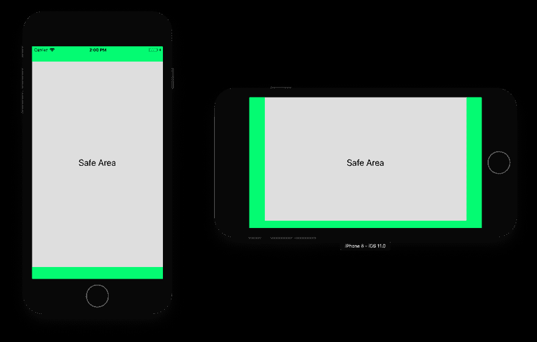

# 如何让您的 React 原生应用响应迅速

> 原文：<https://dev.to/newbiebr/how-to-make-your-react-native-apps-responsive-45d8>

几周前，我在 Dev.to 上发布了我的第一篇文章，谈论我的 React 原生堆栈，另一位开发者问我如何确保我的应用在不同屏幕尺寸上的一致性。

我写了一个简短的回复，但是今天我决定谈论更多，因为响应是每个 React 本地开发者必须处理的第一件事。

## **使用 flexbox**

React Native 的 flexbox 是我爱 React Native 的原因之一。

你可以用两个简单的属性`flex`和`flexDirection`轻松制作任何你想要的布局。

最后，布局完全适应屏幕尺寸。引用自 [React 本地文档](https://facebook.github.io/react-native/docs/flexbox)

> Flexbox 旨在为不同尺寸的屏幕提供一致的布局。

所以只要处处使用 **flexbox** ，避开*绝对*位置

## **避免硬性值**

通过*硬值*我的意思是:

```
const container = {
    width: 100,
    height: 300,
}; 
```

大多数时候，*硬值*(尤其是大值)会导致这种情况

[](https://res.cloudinary.com/practicaldev/image/fetch/s--BzXhTF9R--/c_limit%2Cf_auto%2Cfl_progressive%2Cq_auto%2Cw_880/https://i.imgur.com/bLbnjsC.jpg)

相反，我尽可能多地使用**%**:

```
const container = {
    width: "10%",
    height: "30%",
}; 
```

## **适应硬值**

有时我无法避免硬值，所以当我不得不使用它们时，我会使用我在[上一篇文章](https://dev.to/newbiebr/my-react-native-stack-after-1-year-37j)中分享的这个功能，使它们适应屏幕尺寸。

我承诺过，我已经在 npm 上创建了一个包，所以你可以很容易地在你的项目中安装和使用它。

### 没有`normalize`

[](https://res.cloudinary.com/practicaldev/image/fetch/s--BzXhTF9R--/c_limit%2Cf_auto%2Cfl_progressive%2Cq_auto%2Cw_880/https://i.imgur.com/bLbnjsC.jpg)

### 同`normalize`

[](https://res.cloudinary.com/practicaldev/image/fetch/s--J8vl_fQV--/c_limit%2Cf_auto%2Cfl_progressive%2Cq_auto%2Cw_880/https://i.imgur.com/4IqqAR2.jpg)

[react-native-normalize](https://github.com/NewBieBR/react-native-normalize) 是一个小而简单的包，帮助您的 react 原生应用程序轻松响应。

它带有一个函数`normalize`，可以根据屏幕的宽度或高度调整数值，这样你就可以用它来做`width, height, top, bottom, fontSize, borderRadius,...`

```
// on iPhone 8
normalize(100)          // = 100
normalize(50, 'height') // = 50

// on iPhone 5s
normalize(100)          // = 86
normalize(50, 'height') // = 43

// on iPhoneXs Max
normalize(100)          // = 110
normalize(50, 'height') // = 67 
```

## **处理刻痕(iOS)**

React Native 有一个`SafeAreaView`组件，可以自动避开 iPhone X、Xs 上的凹口和底部区域...但是有时由于各种原因(布局，动画，...)，我用不了`SafeAreaView`。

当我使用[react-native-iphone-x-helper](https://github.com/ptelad/react-native-iphone-x-helper)时，这个库提供了一些有用的功能，可以帮助我处理 iPhoneX、Xs、...凹口和底部区域。我用得最多的有两个函数:`getStatusBarHeight`和`getBottomSpace`。

[](https://res.cloudinary.com/practicaldev/image/fetch/s--Qt-WmWZc--/c_limit%2Cf_auto%2Cfl_progressive%2Cq_auto%2Cw_880/https://miro.medium.com/max/2000/1%2AToLKb6NYZWtBmdOD-jA0jQ.png)

## **安卓尺寸**

在 android 上`Dimensions.get('window').height` [有时会返回错误的值](https://github.com/facebook/react-native/issues/4934)。
当你使用返回的高度来计算你的布局时，会产生一些问题。

所以我用了[react-native-extra-dimensions-Android](https://github.com/Sunhat/react-native-extra-dimensions-android)，一个给你屏幕实际宽度和高度(包括软菜单栏等元素)、软菜单高度和状态栏高度的包。

[](https://res.cloudinary.com/practicaldev/image/fetch/s--fQLGiahz--/c_limit%2Cf_auto%2Cfl_progressive%2Cq_auto%2Cw_880/https://github.com/Sunhat/react-native-extra-dimensions-android/raw/master/demo.png)

## **在不同屏幕上测试**

我通常在 iPhone 8 模拟器上测试我的应用程序，但当我完成实现后，我会在 3 种不同的屏幕尺寸上测试它:

*   iPhone5s(小号)
*   iPhone8(中号)
*   iPhoneXs Max(大)

因此，如果你的应用程序在这三种屏幕尺寸下看起来都很棒，你可以非常确定它在今天的大多数手机上看起来都很好。