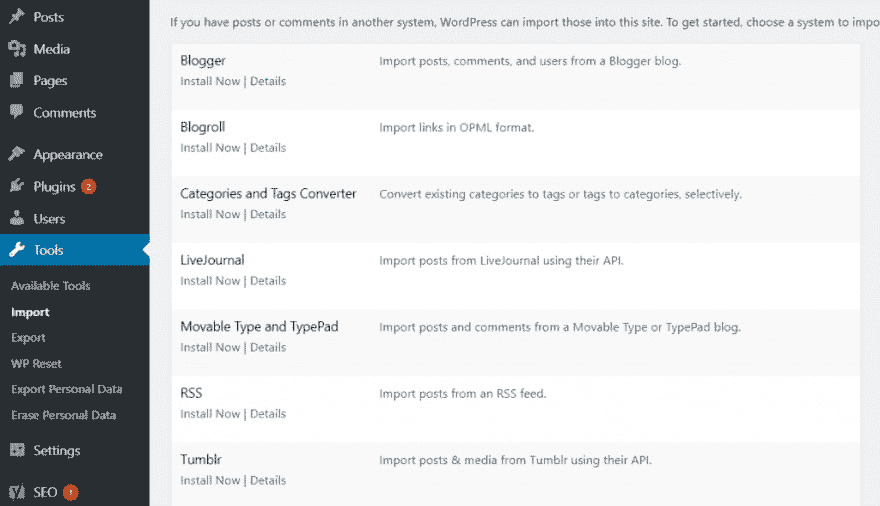
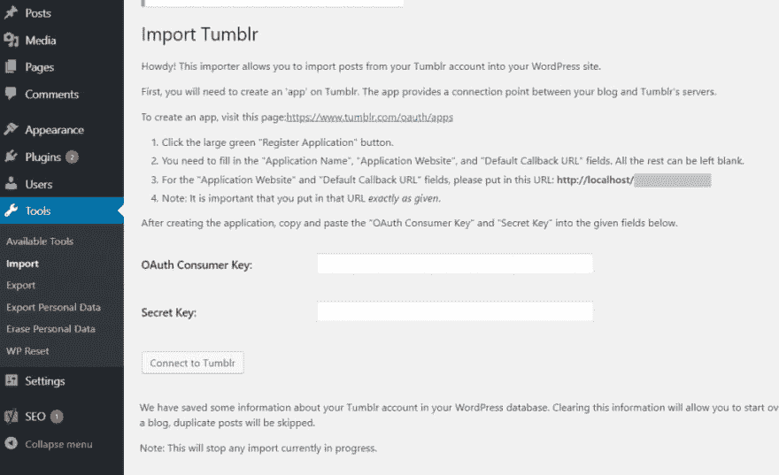
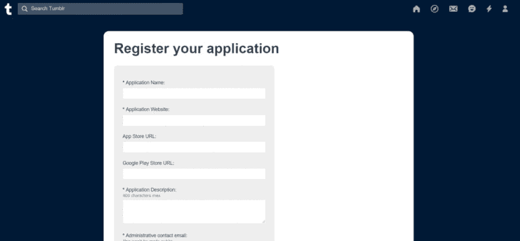
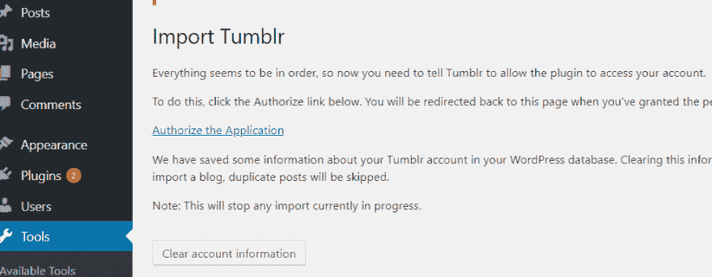
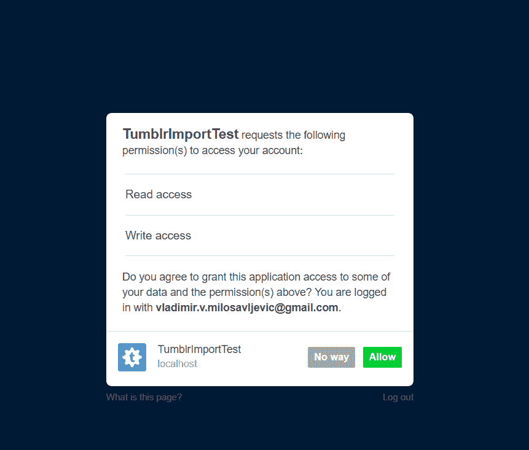
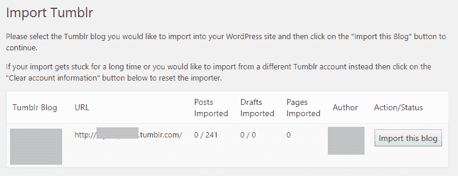
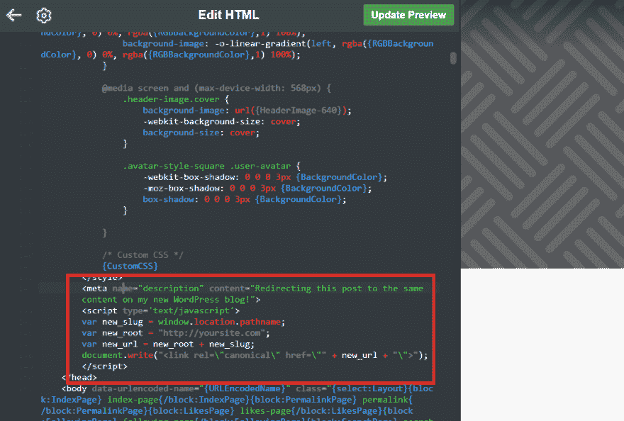

# 如何在几分钟内将你的 Tumblr 博客迁移到 WordPress

> 原文：<https://dev.to/bitofwp/how-to-migrate-your-tumblr-blog-to-wordpress-in-just-a-few-minutes-4c6j>

Tumblr 第一次发布时引起了轰动。许多人开始使用它。如果你是他们中的一员，你可能已经积累了很多内容。也有可能你意识到使用 Tumblr 有很多限制，而技术已经远远领先了。如果你正在考虑转换到 WordPress，但是不想离开你的 Tumblr 博客，那么这篇文章就是为你准备的。

发布 WordPress 的公司 Automattic 上个月从威瑞森收购了 Tumblr，然而，这两个平台仍然是独立的。从 Tumblr 转到 WordPress 是个好主意吗？根据我们掌握的一些数据，只有 0.1%的网站使用 Tumblr，而 WordPress 却占据了 34%的网络份额。所以你不是唯一有这种想法的人。

此外，下一件要考虑的事情是–选项。WordPress 让你完全控制你的内容。有成千上万的主题可供选择，既有免费的，也有高级的，甚至有更多的插件来扩展你网站的功能。你也可以自己编写任何你想要的代码(只要你知道该怎么做)。

你可以随意做出决定并做出改变。过渡到 WordPress 既轻松又没有痛苦。我们可以建议两种方法:

*   使用带有 Tumblr API 的 WordPress Tumblr 工具
*   自动迁移(不免费)

## 1。使用 WordPress 工具+ Tumblr API 导入 Tumblr 内容

该方法将包含 9 个步骤。本质上，你将安装一个来自 WordPress 的可用工具。为了将其连接到 Tumblr 并继续导入，您需要在 Tumblr 上注册一个应用程序。如果听起来令人困惑，请不要担心。只需按照下面的步骤。

#### 1.1 安装 WordPress Tumblr 工具

如果这不是你的第一次“竞技”，那么你知道我们总是在做任何事情之前做备份。这是我们民族的一个古老传统，而且如果出了问题，它还是救命稻草。不过不用担心，不会的。即使有，你也有备份。

转到“工具->导入”。您将看到可用工具的列表。找到 Tumblr 工具，然后点击“立即安装”。安装完成后,“立即安装”将变为“运行导入程序”。点击“运行导入程序”。

#### 1.2。将工具连接到 Tumblr

首先，您需要将该工具连接到 Tumblr。这需要在 Tumblr 上创建一个“应用”，因为你需要 OAuth 消费者密钥和秘密密钥。

你会看到一个链接[http://www.tumblr.com/oauth/apps](http://www.tumblr.com/oauth/apps)。此时，您必须登录您的 Tumblr 帐户。点击链接后，您应该会看到这样一个页面:

点击注册申请。该页面将打开:

虽然应用程序名称可以是您想要的任何名称，但您需要复制工具页面中提供的确切 URL，并将其粘贴到“应用程序网站”和“默认回拨 URL”字段中。如果您按照说明操作，您应该会在页面顶部看到您的应用程序及其密钥:

将密钥复制并粘贴到工具页面中。接下来要做的是授权应用程序。您将看到这样一个屏幕:

点击“授权申请”后，您将返回 Tumblr 确认页面。

点击“允许”,一切准备就绪。您将被重定向回您的网站，您将看到按钮“导入此博客”。

#### 1.3 运行导入器

根据网站的大小，此过程可能需要一段时间。看到一些图像没有被传送过来也是很常见的。你很可能也不得不向喜欢和评论挥手告别。

另一个原因是主机。如果导入停滞或中断，当您再次启动时，将会导入重复的内容。

#### 1.4 将访问者重定向到你的新 WordPress 站点(可选)

我们在上面写了“可选”,但对一些人来说，这根本不是可选的。这是可以理解的，如果你担心这种迁移会让你失去访客和流量，因为它可能会让你觉得一切都要重新开始。

为了自动将所有访问者从 Tumblr 重定向到你的新 WordPress 网站，你需要使用一些 JavaScript。不用担心，因为代码已经写好了。你只需要做一个小小的改变，把两段代码放在正确的位置。

首先，进入 Tumblr，点击 _ account _ 图标，然后点击下拉菜单底部的‘编辑外观’。接下来，点击“编辑主题”。这将带您到定制页面。在左上角，你会看到“编辑 HTML”。点击它。

这将打开主题的原始 HTML。找到结束的`</code>`标签，并将其粘贴在它的正上方:

``

 

只需用你的新 WordPress 站点的 URL 替换[【http://your site . com】](http://yoursite.com%E2%80%9D)。

只需添加一小段代码，仅此而已。找到结尾