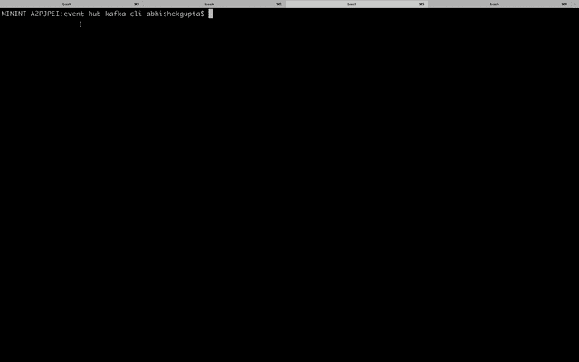

# 如何快速测试 Kafka 集群与 Azure 事件中心的连接，而无需编写任何代码

> 原文：<https://dev.to/azure/how-to-quickly-test-connectivity-to-your-azure-event-hubs-for-kafka-cluster-without-writing-any-code-4la1>

你在 Azure Event Hubs 上有一个崭新的 [Kafka 支持的代理，并且想要快速测试它，而不需要编写繁琐的客户端(生产者和消费者)代码。尝试这篇文章中的指导，你应该(希望)在 10 分钟内完成所有的设置和测试。](https://docs.microsoft.com/azure/event-hubs/event-hubs-for-kafka-ecosystem-overview?WT.mc_id=devto-blog-abhishgu)

[](https://res.cloudinary.com/practicaldev/image/fetch/s--3UvBqOVE--/c_limit%2Cf_auto%2Cfl_progressive%2Cq_66%2Cw_880/https://thepracticaldev.s3.amazonaws.com/i/rilzkcc6a30c1l4us45b.gif)

克隆这个 GitHub repo 并切换到正确的目录

```
git clone https://github.com/abhirockzz/azure-eventhubs-kafka-cli-quickstart
cd azure-eventhubs-kafka-cli-quickstart 
```

Enter fullscreen mode Exit fullscreen mode

> 如果你还没有 Azure CLI 的话，你可以选择安装它(应该很快！)或者直接从你的浏览器使用 [Azure 云壳](https://azure.microsoft.com/features/cloud-shell/?WT.mc_id=devto-blog-abhishgu)。

### 创建您的 Kafka 启用事件中心集群

如果您已经有一个集群，请跳过这一步，转到*“获取连接到集群所需的资源”*部分

设置一些变量以避免重复

```
AZURE_SUBSCRIPTION=[to be filled]
AZURE_RESOURCE_GROUP=[to be filled]
AZURE_LOCATION=[to be filled]
EVENT_HUBS_NAMESPACE=[to be filled]
EVENT_HUB_NAME=[to be filled] 
```

Enter fullscreen mode Exit fullscreen mode

如果还没有资源组，请创建一个

```
az account set --subscription $AZURE_SUBSCRIPTION
az group create --name $AZURE_RESOURCE_GROUP --location $AZURE_LOCATION 
```

Enter fullscreen mode Exit fullscreen mode

创建一个[事件中心名称空间](https://docs.microsoft.com/azure/event-hubs/event-hubs-features?WT.mc_id=devto-blog-abhishgu#namespace)(类似于 Kafka 集群)

```
az eventhubs namespace create --name $EVENT_HUBS_NAMESPACE --resource-group $AZURE_RESOURCE_GROUP --location $AZURE_LOCATION --enable-kafka true --enable-auto-inflate false 
```

Enter fullscreen mode Exit fullscreen mode

然后创建一个事件中心(与 Kafka 主题相同)

```
az eventhubs eventhub create --name $EVENT_HUB_NAME --resource-group $AZURE_RESOURCE_GROUP --namespace-name $EVENT_HUBS_NAMESPACE --partition-count 3 
```

Enter fullscreen mode Exit fullscreen mode

### 获取你需要连接到的集群

获取集群的连接字符串和凭据

> 有关详细信息，请阅读[事件中心如何使用共享访问签名进行授权](https://docs.microsoft.com/azure/event-hubs/authorize-access-shared-access-signature?WT.mc_id=devto-blog-abhishgu)

首先获取事件中心规则/策略名称

```
EVENT_HUB_AUTH_RULE_NAME=$(az eventhubs namespace authorization-rule list --resource-group $AZURE_RESOURCE_GROUP --namespace-name $EVENT_HUBS_NAMESPACE | jq '.[0].name' | sed "s/\"//g") 
```

Enter fullscreen mode Exit fullscreen mode

然后，利用规则名提取连接字符串

```
az eventhubs namespace authorization-rule keys list --resource-group $AZURE_RESOURCE_GROUP --namespace-name $EVENT_HUBS_NAMESPACE --name $EVENT_HUB_AUTH_RULE_NAME | jq '.primaryConnectionString' 
```

Enter fullscreen mode Exit fullscreen mode

> [此信息很敏感——请格外小心](https://docs.microsoft.com/azure/event-hubs/authorize-access-shared-access-signature?WT.mc_id=devto-blog-abhishgu#best-practices-when-using-sas)

将上述命令的结果复制到`jaas.conf`文件的`password`字段中。

```
KafkaClient {
    org.apache.kafka.common.security.plain.PlainLoginModule required
    username="$ConnectionString"
    password=enter-connection-string-here;
}; 
```

Enter fullscreen mode Exit fullscreen mode

> 不要移除`jaas.conf`中的尾部`;`

### 使用 Kafka CLI 连接到集群

> 我假设您已经有一个 Kafka 设置(本地或其他地方)Kafka CLI 与它捆绑在一起。如果没有，设置它应该不会花太长时间——只需[下载，解压](https://kafka.apache.org/downloads)就可以了！

在您的本地机器上，使用一个新的终端来启动一个 **Kafka 消费程序**——首先设置所需的变量

```
EVENT_HUBS_NAMESPACE=[to be filled]
EVENT_HUB_NAME=[to be filled]
export KAFKA_OPTS="-Djava.security.auth.login.config=jaas.conf"
KAFKA_INSTALL_HOME=[to be filled] e.g. /Users/jdoe/kafka_2.12-2.3.0/ 
```

Enter fullscreen mode Exit fullscreen mode

开始消费

```
$KAFKA_INSTALL_HOME/bin/kafka-console-consumer.sh --topic $EVENT_HUB_NAME --bootstrap-server $EVENT_HUBS_NAMESPACE.servicebus.windows.net:9093 --consumer.config client_common.properties 
```

Enter fullscreen mode Exit fullscreen mode

使用另一个终端启动一个**Kafka Producer**——首先设置所需的变量

```
EVENT_HUBS_NAMESPACE=[to be filled]
EVENT_HUB_NAME=[to be filled]
export KAFKA_OPTS="-Djava.security.auth.login.config=jaas.conf"
KAFKA_INSTALL_HOME=[to be filled] e.g. /Users/jdoe/kafka_2.12-2.3.0/ 
```

Enter fullscreen mode Exit fullscreen mode

启动生成器

```
$KAFKA_INSTALL_HOME/bin/kafka-console-producer.sh --topic $EVENT_HUB_NAME --broker-list $EVENT_HUBS_NAMESPACE.servicebus.windows.net:9093 --producer.config client_common.properties 
```

Enter fullscreen mode Exit fullscreen mode

您将看到一个提示，然后您可以开始输入值，例如

```
> foo
> bar
> baz
> john
> doe 
```

Enter fullscreen mode Exit fullscreen mode

切换到用户终端，确认你已经收到信息！

[](https://i.giphy.com/media/QN6NnhbgfOpoI/giphy.gif)

### 供大家参考...

这里有一个方便的列表，列出了所有使用过的与事件中心相关的 CLI 命令

*   az eventhubs 命名空间创建 -创建 eventhubs 命名空间。
*   az 事件中心事件中心创建 -创建事件中心事件中心。
*   [az eventhubs 命名空间授权-规则列表](https://docs.microsoft.com/cli/azure/eventhubs/namespace/authorization-rule?view=azure-cli-latest&WT.mc_id=devto-blog-abhishgu#az-eventhubs-namespace-authorization-rule-list) -按命名空间显示授权规则列表。
*   [az eventhubs 命名空间授权-规则密钥列表](https://docs.microsoft.com/cli/azure/eventhubs/namespace/authorization-rule/keys?view=azure-cli-latest&WT.mc_id=devto-blog-abhishgu#az-eventhubs-namespace-authorization-rule-keys-list) -显示命名空间的连接字符串。

我真的希望你喜欢这篇文章，并从中学到了一些东西！如果你做了，请喜欢并跟随。很高兴通过 [@abhi_tweeter](https://twitter.com/abhi_tweeter) 获得反馈或发表评论。