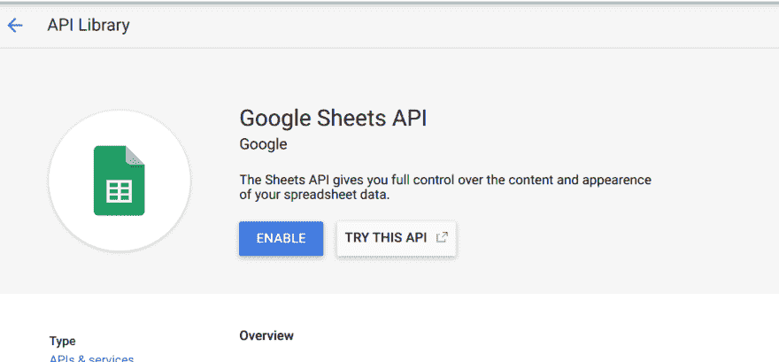
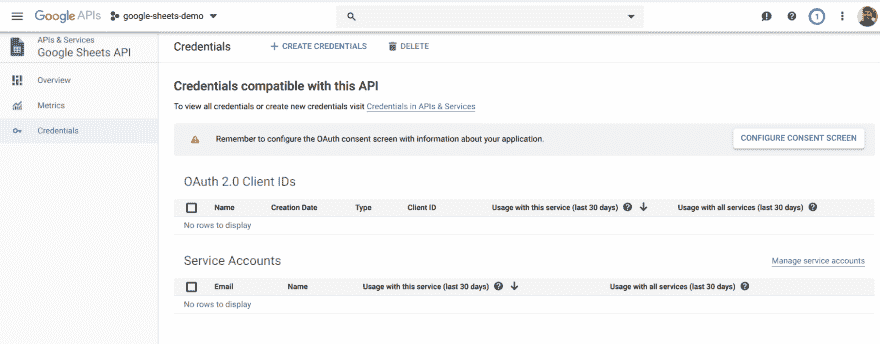
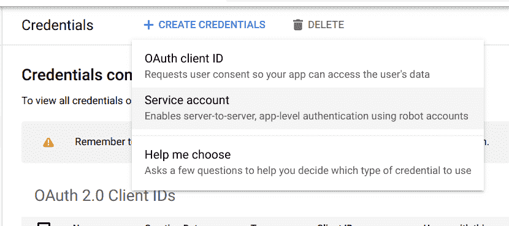
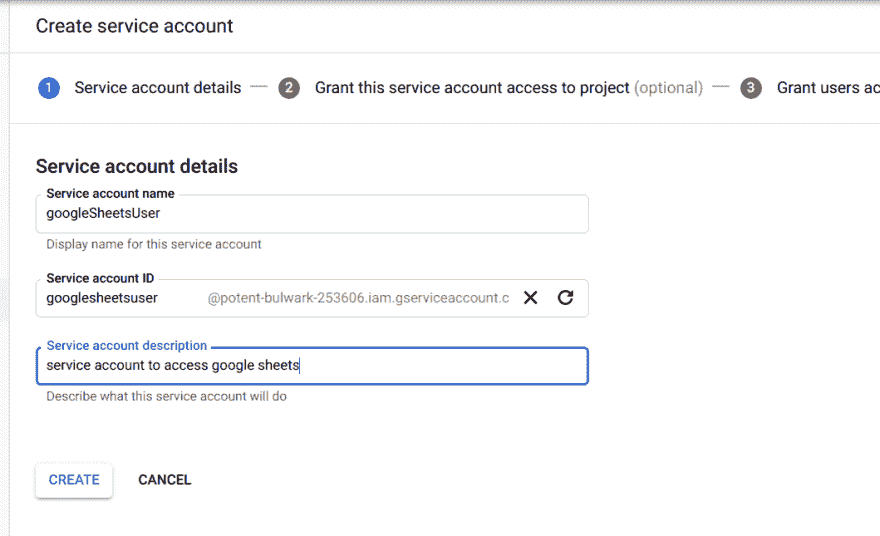
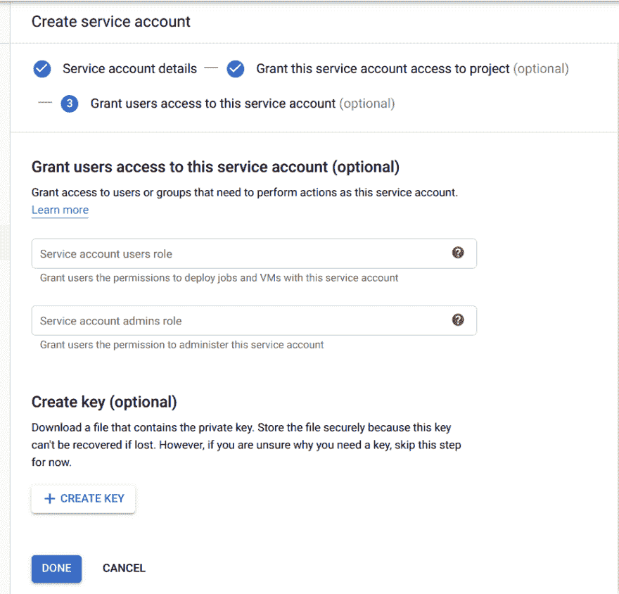
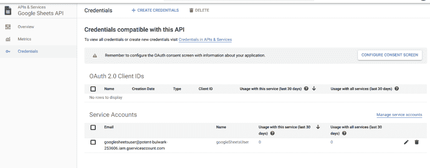

# 如何使用 Node.js 从 Google Sheets 中读取或修改电子表格？

> 原文：<https://dev.to/mandeepm91/how-to-read-or-modify-spreadsheets-from-google-sheets-using-node-js-4c30>

首先，简要概述一下我们的用例。假设我在 Google Sheets 上有一个不公开的电子表格，我希望能够通过在我的本地机器或一些服务器上运行的一些批处理程序来读取/修改。这是我最近在 Node.js 应用程序中不得不做的事情，我发现认证部分有点难以理解。所以我想分享我的解决方案，我希望它能帮助有需要的人。也许有更好的方法，但我分享的是最适合我的方法。

因为在我们的用例中不涉及用户交互，所以我们不希望使用 OAuth 过程，在这个过程中，用户需要打开浏览器并登录到他们的 Google 帐户来授权应用程序。对于像这样的场景，Google 有一个*服务账户*的概念。服务帐户是一种特殊类型的 Google 帐户，旨在代表一个非人类用户，该用户需要进行身份验证并被授权访问 Google APIs 中的数据。就像普通帐户一样，服务帐户也有电子邮件地址(尽管它没有实际的邮箱，并且您不能向服务帐户电子邮件发送电子邮件)。就像您可以使用用户的电子邮件地址与他们共享 google 表单一样，您也可以使用他们的电子邮件地址与服务帐户共享 google 表单。这正是我们在本教程中要做的。我们将使用一个普通用户在 Google Sheets 上创建一个电子表格，与一个服务帐户(我们将创建)共享它，并在 Node.js 脚本中使用服务帐户的凭证来读取和修改该工作表。

### 先决条件

本教程假设您已经:

*   使用 Node.js 的经验
*   一个谷歌账户
*   谷歌开发人员控制台上的项目设置，你有管理员权限

### 步骤概述

以下是我们将在本教程中遵循的步骤列表:

1.  在 Google sheets 上创建电子表格
2.  在 Google 开发者控制台上启用我们项目中的 Google Sheets API
3.  创建服务帐户
4.  与步骤 3 中创建的服务帐户共享步骤 1 中创建的电子表格
5.  使用服务帐户凭证编写 Node.js 服务来访问在步骤 1 中创建的 google sheets
6.  测试我们在步骤 5 中编写的服务

既然我们已经有了要做的事情的大纲，那就让我们开始吧

### 第一步:在 Google Sheets 上创建一个电子表格

这个不需要任何说明。你只需要登录你的谷歌账户，打开谷歌驱动，创建一个新的谷歌表单。可以放一些随机数据进去。我们需要注意的一件事是工作表的 id。当您在浏览器中打开该表单时，url 将类似于:`https://docs.google.com/spreadsheets/d/1-XXXXXXXXXXXXXXXXXXXSgGTwY/edit#gid=0`。在这个 url 中，`1-XXXXXXXXXXXXXXXXXXXSgGTwY`是电子表格的 id，每个电子表格的 id 都不同。记下来，因为我们将在 Node.js 脚本中需要它来访问这个电子表格。对于本教程，以下是我们存储在电子表格中的数据:

[](https://res.cloudinary.com/practicaldev/image/fetch/s--rgtnVjTB--/c_limit%2Cf_auto%2Cfl_progressive%2Cq_auto%2Cw_880/http://codingfundas.com/conteimg/2019/09/Screenshot-from-2019-09-21-13-19-40.png)

### 步骤 2:在 Google 开发者控制台上启用我们项目中的 Google Sheets API

为了能够使用它，我们需要为我们的项目启用 Google Sheets API。本教程假设你已经有一个项目在谷歌开发控制台，所以如果你没有一个，你可以很容易地创建一个新的。一旦你有了谷歌开发控制台上的项目，打开项目仪表板。您应该会看到一个按钮*启用 API 和服务*。

点击它并使用搜索栏搜索 Google sheets API。一旦你看到它，点击它，然后点击*启用*

[](https://res.cloudinary.com/practicaldev/image/fetch/s--pFTPco7O--/c_limit%2Cf_auto%2Cfl_progressive%2Cq_auto%2Cw_880/http://codingfundas.com/conteimg/2019/09/Screenshot-from-2019-09-21-12-02-33.png)

### 第三步:创建服务账户

一旦您在项目中启用了 Google Sheets API，您将看到一个页面，您可以在其中配置该 API 的设置。点击左侧边栏上的*凭证*选项卡。在这里，您将看到 OAuth 客户端 id 和服务帐户的列表。默认情况下应该没有。

[](https://res.cloudinary.com/practicaldev/image/fetch/s--PXYmz6rZ--/c_limit%2Cf_auto%2Cfl_progressive%2Cq_auto%2Cw_880/http://codingfundas.com/conteimg/2019/09/Screenshot-from-2019-09-21-12-03-16.png)

点击顶部的*创建凭证*按钮，选择*服务账户*选项

[](https://res.cloudinary.com/practicaldev/image/fetch/s--qGmsdkxa--/c_limit%2Cf_auto%2Cfl_progressive%2Cq_auto%2Cw_880/http://codingfundas.com/conteimg/2019/09/Screenshot-from-2019-09-21-12-03-26.png)

输入服务帐户的名称和描述，并点击*创建*按钮。

[](https://res.cloudinary.com/practicaldev/image/fetch/s--YhpLH-2x--/c_limit%2Cf_auto%2Cfl_progressive%2Cq_auto%2Cw_880/http://codingfundas.com/conteimg/2019/09/Screenshot-from-2019-09-21-12-04-01.png)

在下一个对话框中点击*继续*

[](https://res.cloudinary.com/practicaldev/image/fetch/s--w9l4oqu5--/c_limit%2Cf_auto%2Cfl_progressive%2Cq_auto%2Cw_880/http://codingfundas.com/conteimg/2019/09/Screenshot-from-2019-09-21-12-04-15.png)

在下一个对话框中，您可以选择创建密钥。这是重要的一步。点击*创建密钥*按钮，选择 *JSON* 作为格式。这将要求您将 JSON 文件下载到您的本地机器。

对于本教程，我已经重命名了文件，并在我的本地机器上保存为`service_account_credentials.json`。

把它放在安全的地方。这个密钥文件包含我们在 Node.js 脚本中需要的服务帐户的凭证，以便从 Google Sheets 访问我们的电子表格。

[](https://res.cloudinary.com/practicaldev/image/fetch/s--rm91hBUw--/c_limit%2Cf_auto%2Cfl_progressive%2Cq_auto%2Cw_880/http://codingfundas.com/conteimg/2019/09/Screenshot-from-2019-09-21-12-04-56.png)

完成所有这些步骤后，您应该会在凭证页面上看到新创建的服务帐户

[](https://res.cloudinary.com/practicaldev/image/fetch/s--uV24Pr0E--/c_limit%2Cf_auto%2Cfl_progressive%2Cq_auto%2Cw_880/http://codingfundas.com/conteimg/2019/09/Screenshot-from-2019-09-21-12-05-42.png)

记下服务帐户的电子邮件地址。我们需要与此帐户共享我们的电子表格。

### 步骤 4:与步骤 3 中创建的服务帐户共享步骤 1 中创建的电子表格

现在我们有了一个服务帐户，我们需要与它共享我们的电子表格。这就像与任何普通用户帐户共享电子表格一样。在浏览器中打开电子表格，点击右上角的*共享*按钮。这将打开一个模式，您需要输入服务帐户的电子邮件地址。取消选中*通知人员*复选框，因为这将发送一封电子邮件，并且因为服务帐户没有任何邮箱，它将向您发送邮件传递失败通知。

[](https://res.cloudinary.com/practicaldev/image/fetch/s--hXm7Knkg--/c_limit%2Cf_auto%2Cfl_progressive%2Cq_auto%2Cw_880/http://codingfundas.com/conteimg/2019/09/Screenshot-from-2019-09-21-13-49-42.png)

点击*确定*按钮，与服务账户共享电子表格。

这就完成了所有的配置步骤。现在我们可以开始有趣的部分了:-)

### 步骤 5:编写 Node.js 服务，使用服务帐户凭证访问 google 表单

我们将创建我们的脚本作为服务，可以作为一个更大的项目的一部分使用。我们称之为`googleSheetsService.js`。它将公开以下 API:

*   getAuthToken
*   获取电子表格
*   getSpreadSheetValues

函数`getAuthToken`是我们处理认证的地方，它将返回一个令牌。然后，我们将使用该令牌，并将其传递给其他方法。

我们不会讨论向电子表格中写入数据，但是一旦您对如何使用 API 有了基本的了解，扩展服务以添加越来越多的 Google Sheets API 支持的功能就变得很容易了。

我们将使用`googleapis` npm 模块。因此，让我们从为这个演示项目创建一个目录开始。姑且称之为`google-sheets-demo`。

```
cd $HOME
mkdir google-sheets-demo
cd google-sheets-demo 
```

Enter fullscreen mode Exit fullscreen mode

将我们在步骤 3 中创建的`service_account_credentials.json`文件复制到这个目录(`google-sheets-demo`)。并创建我们的新文件`googleSheetsService.js`。将以下几行粘贴到文件中:

```
// googleSheetsService.js

const { google } = require('googleapis')

const SCOPES = ['https://www.googleapis.com/auth/spreadsheets']

async function getAuthToken() {
  const auth = new google.auth.GoogleAuth({
    scopes: SCOPES
  });
  const authToken = await auth.getClient();
  return authToken;
}

module.exports = {
  getAuthToken,
} 
```

Enter fullscreen mode Exit fullscreen mode

目前，我们的服务只有一个返回 auth 令牌的函数。我们将很快增加另一个功能`getSpreadSheet`。首先让我们看看我们的函数做什么。

首先，我们需要`googleapis` npm 模块。然后我们定义`SCOPES`。当我们使用 google APIs 创建一个 auth token 时，有一个作用域的概念，它决定了我们的客户端拥有的访问级别。为了阅读和编辑电子表格，我们需要访问范围`https://www.googleapis.com/auth/spreadsheets`。类似地，如果我们只需要对电子表格进行只读访问，我们就会使用 scope `https://www.googleapis.com/auth/spreadsheets.readonly`。

在`getAuthToken`函数中，我们调用构造函数`new google.auth.GoogleAuth`，在 arguments 对象中传递作用域。

这个函数期望有两个环境变量可用，`GCLOUD_PROJECT`是 Google 开发人员控制台项目的项目 ID，`GOOGLE_APPLICATION_CREDENTIALS`表示包含服务帐户凭证的文件的路径。

我们需要从命令行设置这些环境变量。要获取项目 ID，您可以在 web 浏览器中打开项目时从项目的 url 获取它。它应该是这样的

> [https://console.cloud.google.com/home/dashboard?project={project](https://console.cloud.google.com/home/dashboard?project=%7Bproject) ID}

并且`GOOGLE_APPLICATION_CREDENTIALS`必须包含`service_account_credentials.json`文件的路径。因此，转到终端，从`google-sheets-demo`目录运行以下命令来设置这些环境变量:

```
export GCLOUD_PROJECT={project ID of your google project}
export GOOGLE_APPLICATION_CREDENTIALS=./service_account_credentials.json 
```

Enter fullscreen mode Exit fullscreen mode

您需要确保在当前目录中复制了凭证文件。

现在，我们将为我们的服务添加两个功能:

*   获取电子表格
*   getSpreadSheetValues

第一个将返回关于电子表格的元数据，而第二个将返回电子表格内部的数据。我们修改后的`googleSheetsService.js`文件应该是这样的:

```
// googleSheetsService.js

const { google } = require('googleapis');
const sheets = google.sheets('v4');

const SCOPES = ['https://www.googleapis.com/auth/spreadsheets'];

async function getAuthToken() {
  const auth = new google.auth.GoogleAuth({
    scopes: SCOPES
  });
  const authToken = await auth.getClient();
  return authToken;
}

async function getSpreadSheet({spreadsheetId, auth}) {
  const res = await sheets.spreadsheets.get({
    spreadsheetId,
    auth,
  });
  return res;
}

async function getSpreadSheetValues({spreadsheetId, auth, sheetName}) {
  const res = await sheets.spreadsheets.values.get({
    spreadsheetId,
    auth,
    range: sheetName
  });
  return res;
}

module.exports = {
  getAuthToken,
  getSpreadSheet,
  getSpreadSheetValues
} 
```

Enter fullscreen mode Exit fullscreen mode

在顶部我们添加了一行

```
const sheets = google.sheets('v4'); 
```

Enter fullscreen mode Exit fullscreen mode

这是为了使用 sheets API。然后我们添加了两个新函数`getSpreadSheet`和`getSpreadSheetValues`。要查看 Google Sheets API 支持的所有 API 端点，请查看此链接【https://developers.google.com/sheets/api/reference/rest T2】。

在我们的演示中，我们只使用了其中的两个。`getSpreadSheet`函数期望将`auth`令牌和`spreadsheetId`作为其参数。并且`getSpreadSheetValues`期望一个额外的参数，即`sheetName`，从该参数中获取数据。默认情况下，电子表格只包含一张工作表，命名为`Sheet1`。最后，我们通过`module.exports`导出新添加的功能。

这就完成了我们的`googleSheetsService`。如果需要支持更多的 API 函数，可以使用上面的链接查看引用，在这个服务中添加相应的包装器函数，并使用`module.exports`导出。对于这个服务的任何消费者，他们首先需要调用`getAuthToken`函数来获得授权令牌，然后将该令牌传递给后续的函数，如`getSpreadSheet`、`getSpreadSheetValues`等。现在我们已经准备好了我们的服务，我们只需要测试它以确保它工作正常

### 第六步:测试我们的服务

所以我们已经准备好服务了。但是这有用吗？我们去看看。

虽然通常我们会使用测试框架来运行单元测试，但为了使本教程简单，我们将编写一个简单的 Node.js 脚本。从我们的项目目录中，创建一个名为`test.js`的新文件，并复制粘贴以下内容:

```
const {
  getAuthToken,
  getSpreadSheet,
  getSpreadSheetValues
} = require('./googleSheetsService.js');

const spreadsheetId = process.argv[2];
const sheetName = process.argv[3];

async function testGetSpreadSheet() {
  try {
    const auth = await getAuthToken();
    const response = await getSpreadSheet({
      spreadsheetId,
      auth
    })
    console.log('output for getSpreadSheet', JSON.stringify(response.data, null, 2));
  } catch(error) {
    console.log(error.message, error.stack);
  }
}

async function testGetSpreadSheetValues() {
  try {
    const auth = await getAuthToken();
    const response = await getSpreadSheetValues({
      spreadsheetId,
      sheetName,
      auth
    })
    console.log('output for getSpreadSheetValues', JSON.stringify(response.data, null, 2));
  } catch(error) {
    console.log(error.message, error.stack);
  }
}

function main() {
  testGetSpreadSheet();
  testGetSpreadSheetValues();
}

main() 
```

Enter fullscreen mode Exit fullscreen mode

这个文件包含两个测试函数和一个调用这些测试函数的`main`函数。在文件的底部，我们正在执行`main`函数。该脚本需要两个命令行参数:

*   spreadsheetId(这是我们在步骤 1 中获得的 Id)
*   sheetName(这是要查看其值的工作表的名称。当您创建新的电子表格时，它是`Sheet1`

[](https://res.cloudinary.com/practicaldev/image/fetch/s--fSmIiZmO--/c_limit%2Cf_auto%2Cfl_progressive%2Cq_auto%2Cw_880/http://codingfundas.com/conteimg/2019/09/Screenshot-from-2019-09-21-20-16-13.png)

另外，确保环境变量`GCLOUD_PROJECT`和`GOOGLE_APPLICATION_CREDENTIALS`设置正确。

现在，从终端运行这个脚本

```
node test.js <your google sheet's spreadsheet id> <sheet name of the worksheet> 
```

Enter fullscreen mode Exit fullscreen mode

如果您正确遵循了所有步骤，您应该会看到如下输出:

```
output for getSpreadSheet {
  "spreadsheetId": "1-jG5jSgGTwXXXXXXXXXXXXXXXXXXY",
  "properties": {
    "title": "test-sheet",
    "locale": "en_US",
    "autoRecalc": "ON_CHANGE",
    "timeZone": "Asia/Calcutta",
    "defaultFormat": {
      "backgroundColor": {
        "red": 1,
        "green": 1,
        "blue": 1
      },
      "padding": {
        "top": 2,
        "right": 3,
        "bottom": 2,
        "left": 3
      },
      "verticalAlignment": "BOTTOM",
      "wrapStrategy": "OVERFLOW_CELL",
      "textFormat": {
        "foregroundColor": {},
        "fontFamily": "arial,sans,sans-serif",
        "fontSize": 10,
        "bold": false,
        "italic": false,
        "strikethrough": false,
        "underline": false
      }
    }
  },
  "sheets": [
    {
      "properties": {
        "sheetId": 0,
        "title": "Sheet1",
        "index": 0,
        "sheetType": "GRID",
        "gridProperties": {
          "rowCount": 1000,
          "columnCount": 26
        }
      }
    }
  ],
  "spreadsheetUrl": "https://docs.google.com/spreadsheets/d/1-jG5jSgGTwXXXXXXXXXXXXXXXXXXY/edit"
}
output for getSpreadSheetValues {
  "range": "Sheet1!A1:Z1000",
  "majorDimension": "ROWS",
  "values": [
    [
      "Name",
      "Country",
      "Age"
    ],
    [
      "John",
      "England",
      "30"
    ],
    [
      "Jane",
      "Scotland",
      "23"
    ],
    [
      "Bob",
      "USA",
      "45"
    ],
    [
      "Alice",
      "India",
      "33"
    ]
  ]
} 
```

Enter fullscreen mode Exit fullscreen mode

如果你得到一个错误，这意味着你没有正确地遵循所有的步骤。对于本教程，`googleapis` npm 模块的版本是`43.0.0`。如果您使用该模块的旧版本，可能会遇到问题。请确保 spreadsheetId 和 sheetname 是正确的，并且环境变量设置正确。如果仍然出现错误，您应该检查错误消息和代码，看看是什么导致了这个问题。

### 参考文献

*   [Google API node . js 客户端的文档](https://github.com/googleapis/google-api-nodejs-client)
*   [官方 Google Sheets API 参考](https://developers.google.com/sheets/api/reference/rest)

我强烈建议查看这些参考资料(尤其是官方的 Google Sheets API 参考资料),以便更深入地了解 Sheets API 以及如何使用 Node.js 客户端。

希望这篇教程对你有所帮助。感谢并祝编码愉快:-)