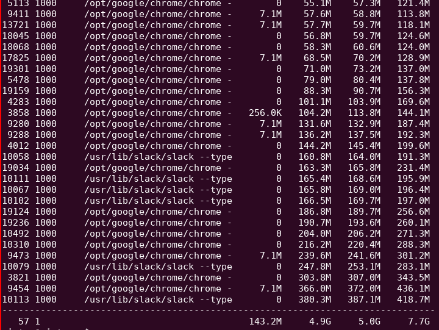
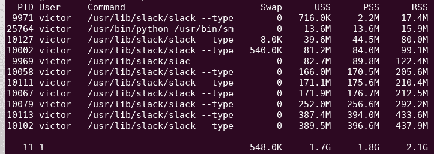

# 如何查看和限制一个应用的内存消耗？

> 原文：<https://dev.to/vga/how-to-see-and-limit-memory-consumption-of-an-application-5bfl>

几个月来，我的电脑经历了几分钟的死机，唯一恢复工作的方法就是重启。这真的很烦人，所以我决定看看到底是怎么回事。三年来，我一直在使用一台戴尔 E7450 笔记本电脑。它有 8GB RAM 大小和一个带有 2 个内核和 4 个逻辑处理器的英特尔 i5 内核。这已经足够了，不是吗？
我用 Ubuntu 18.04 加上 [i3](https://i3wm.org/) 作为我的窗口管理器。顺便说一句，如果你还不了解 i3，你得看一看。
我注意到只有两个打开的应用程序:谷歌 Chrome 和 Slack，这两个都用了我大部分的内存。众所周知，谷歌 Chrome 使用大量内存，Slack 应用程序是基于电子和坏消息构建的:[电子是众所周知的资源猪](https://josephg.com/blog/electron-is-flash-for-the-desktop/)。

## 内存使用情况

我做了一些简单的测试来检查内存消耗。正如你从这张图片中看到的，只有 2 个打开的应用程序使用了我将近 100%的内存。

[](https://res.cloudinary.com/practicaldev/image/fetch/s--G0cC5ERa--/c_limit%2Cf_auto%2Cfl_progressive%2Cq_auto%2Cw_880/https://thepracticaldev.s3.amazonaws.com/i/qw19uyfnnqcuizz0u3dy.png)

此图摘自 htop 程序截图。Htop 是 top 的绝佳替代品。它为每个内核提供了过滤、排序、搜索和查看功能。这里让我感兴趣的是内存，尤其是每个进程的内存。为此，我使用了 [smem](https://manpages.ubuntu.com/manpages/precise/en/man8/smem.8.html) ，这是一个计算每个进程的 USS、PSS 和 RSS 的工具。

USS 代表唯一集合大小。这是该进程独有的非共享内存量。它不包括共享内存。另一方面，PSS 代表比例集大小。它将唯一内存(USS)与共享内存的比例(除以共享该内存的进程数)相加。它给出了每个进程实际使用了多少物理内存的表示——共享内存实际上表示为 shared。

RSS 代表常驻集大小。这是每个进程使用的共享内存加上非共享内存的数量。如果任何进程共享内存，这将会多报实际使用的内存量，因为相同的共享内存将会被计数不止一次——在共享相同内存的每个其他进程中再次出现。这个指标可能不可靠，尤其是当流程有很多分叉时。

这里我使用的命令:

```
smem -n -s pss -t -k -P chrome 
```

Enter fullscreen mode Exit fullscreen mode

如果你不熟悉命令行，你可以使用[explainshell.com](https://explainshell.com/explain?cmd=smem+-n+-s+pss+-t+-k+-P+chrome)，一个很棒的解析命令的网站。

[](https://res.cloudinary.com/practicaldev/image/fetch/s--89KWAVOc--/c_limit%2Cf_auto%2Cfl_progressive%2Cq_auto%2Cw_880/https://thepracticaldev.s3.amazonaws.com/i/vvhhnxld1oqrlprfzexz.png)

综上，57 个进程匹配' chrome '，用了 4,9G 的 USS，5.0G 的 PSS，7,7G 的 RSS。

让我们关注一下空闲内存消耗:

[](https://res.cloudinary.com/practicaldev/image/fetch/s--Cr8Qo19W--/c_limit%2Cf_auto%2Cfl_progressive%2Cq_auto%2Cw_880/https://thepracticaldev.s3.amazonaws.com/i/hfmbfsvghammh1ua6taj.png)

## 记忆限制

假设我想限制分配给 Slack 应用程序的内存。我首先想到的是用 Docker。通过将应用程序包装在 Docker 容器中，我可以使用 Docker 能力来限制容器的资源。

例如:

```
docker run --memory=1G …. 
```

Enter fullscreen mode Exit fullscreen mode

该参数将设置容器可以使用的最大内存量。它的工作，但这意味着我需要创建一个 Docker 镜像专用于所有我想限制内存量的应用程序。
事实上，Docker 使用了一种叫做`namespaces`的技术将容器与其他进程隔离开来。要了解更多关于 Docker 架构的信息，可以看看 [Docker 概述页面](https://docs.docker.com/engine/docker-overview/)。在我的例子中，有一个名称空间很有趣:控制组，也称为 cgroups。这使得物理资源受到限制。

我们来用一下:

```
# Create a group for memory named “slack_group”
cgcreate -g "memory:slack_group" -t victor:victor

# Specify memory limit to 1G for this group
cgset -r memory.limit_in_bytes=1G "slack_group" 
```

Enter fullscreen mode Exit fullscreen mode

为了确保正确应用内存限制，可以查看目录`/sys/fs/cgroup/memory/mygroup/`并精确查看文件`memory.limit_in_bytes`。

```
# Launch slack application in this group
cgexec -g "memory:slack_group" slack

# If needed, we can remove the group
cgdelete "memory:slack_group" 
```

Enter fullscreen mode Exit fullscreen mode

在我的例子中，我只使用 cgroups 来限制分配的内存，但是也可以限制 CPU。

然后，我们来看看它是否有效。

[](https://res.cloudinary.com/practicaldev/image/fetch/s--BdsallBr--/c_limit%2Cf_auto%2Cfl_progressive%2Cq_auto%2Cw_880/https://thepracticaldev.s3.amazonaws.com/i/gaeargdokd9tq71wvdgy.png)

如您所见，PSS 严格等于 1G，但交换容量现在增加到了 500M。这个应用程序有点慢，从一个工作空间转换到另一个工作空间有点长，但是使用起来还是很舒服的。让我们禁用 swap，看看它是否有效。

```
echo 0 > /sys/fs/cgroup/memory/slack_group/memory.swappiness 
```

Enter fullscreen mode Exit fullscreen mode

你猜怎么着？它不工作，应用程序没有响应，一些进程被杀死。事实上，是 OOM 黑仔(内存不足的黑仔)负责终止进程，以便为系统释放内存。OOM 黑仔从内核维护的分数中选择最佳候选项进行淘汰。你可以在
中看到这个分数

```
/proc/${PID}/oom_score 
```

Enter fullscreen mode Exit fullscreen mode

## 自动化

我知道如何限制一个应用程序的内存消耗，但这在未来肯定是不可持续的。我必须为每个我想要限制内存使用的应用程序创建一个组。多亏了这个 [StackExchange 问题](https://unix.stackexchange.com/a/279175/363256)，我找到了一个完成这项工作的脚本。可从以下网址获得: