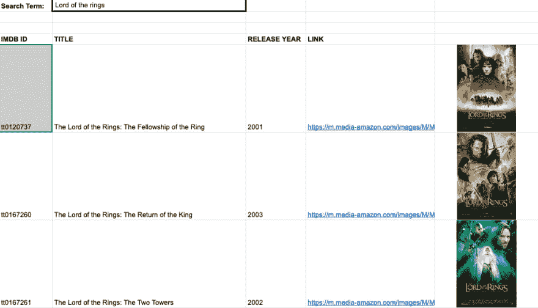
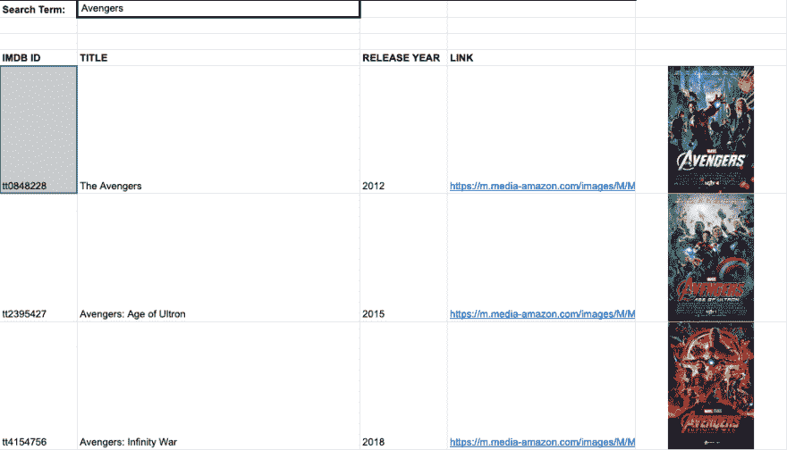

# 如何在 Google Sheets 中使用 API 用于 Google Sheets 的 RapidAPI

> 原文：<https://dev.to/alexwalling/how-to-use-an-api-in-google-sheets-rapidapi-for-google-sheets-5h27>

在本文中，您将了解如何在 Google Sheets 中使用 RapidAPI 的 API。

Google Sheets 可以成为存储、管理和转换各种数据的强大工具。我一直用它来跟踪我的每月支出、RapidAPI 可能赞助的潜在会议、合作伙伴的电子邮件、我的年度目标等等！随着 Google Sheets 已经成为如此有用的工具，我们希望帮助任何人通过 API 的力量来增强他们的表单。

用于 Google Sheets 的 RapidAPI 插件允许您从 Google Sheet 中向 RapidAPI 上的任何 API 发出 API 请求，并将获得的数据嵌入到 Sheet 中——所有这一切都通过一个可以跨多行拖动的函数来完成

本教程将带您了解使用该插件的基本知识。

## 1)安装插件

要安装该插件，只需前往 Google Sheets add-on 商店，安装免费的 RapidAPI for Google Sheets add-on。在安装过程中，会有一个接受运行权限的提示——这是必需的，因为这个附加组件向外部 API 发出请求。
默认情况下，您创建的任何新电子表格都会禁用该插件。在新的电子表格中使用它之前，您必须为该文档启用它。为此:

1.  打开要在其中使用加载项的工作表。
2.  打开窗口顶部的“附加组件”菜单。
3.  单击“管理加载项”
4.  你应该看到 RapidAPI 插件在那里-点击它旁边的绿色“管理”按钮，并选择“在这个文件中使用”。选中后，旁边应该会有一个复选标记。

[](https://res.cloudinary.com/practicaldev/image/fetch/s--vp6Od0r5--/c_limit%2Cf_auto%2Cfl_progressive%2Cq_auto%2Cw_880/https://blog.rapidapi.com/wp-content/uploads/2019/05/Screen-Shot-2019-04-23-at-10.55.38-AM.png)

## 2)形成请求

RapidAPI Google Sheets 插件支持两种不同类型的功能

```
=GET(url, selectPaths, rapidApiKey)
=GETARR(url, arrPath, selectPaths, rapidApiKey) 
```

这两个函数的主要区别在于数据响应的显示方式。如果 API 只有一个对象作为响应，那么您将使用 GET 函数。如果 API 返回一个包含值数组的对象，那么您将使用 GETARR 函数。

对于本教程，我们将使用 GETARR 功能来搜索[电影数据库(IMDB Alternative) API](https://rapidapi.com/imdb/api/movie-database-imdb-alternative) 以获得关于电影搜索词的信息。

## 3)订阅 API

在能够向 API 发出请求之前，您首先需要订阅一个 API 计划。为此，请使用“[定价](https://rapidapi.com/imdb/api/movie-database-imdb-alternative/pricing)选项卡。对于我们在这个例子中使用的 API，目前有四种不同的定价方案。最实惠的计划是免费的基本计划，该计划允许每月拨打 1，000 次电话，超过 1，000 次的每个额外请求收取 0.01 美元。允许最高请求量的计划是每月 10 美元的 MEGA 计划，它使您能够进行无限的 API 调用。

如果你正在使用的 API 确实有相关的超额费用，请一定要注意你的账户发出的请求数量。任何额外的使用都将向您收费。您可以在您的 [RapidAPI 开发者仪表盘](https://dashboard.rapidapi.com/)中跟踪您的配额。

> 请注意。每次打开 Google 工作表时，都会运行 Google 脚本请求。这意味着将发出另一个 API 请求。确保在 Google Sheet 中实现 RapidAPI 时意识到这一点。

## 4)收集所需信息

对于 GETARR 函数，至少需要 url、arrPath、selectPaths 和 rapidApiKey。您还可以提供可选和必需的查询字符串参数。所有这些信息都可以在 RapidAPI 的 [API 列表页面](https://rapidapi.com/imdb/api/movie-database-imdb-alternative)中轻松找到。这里是你可以找到信息的地方:

```
URL: "https://rapidapi.com/imdb/api/movie-database-imdb-alternative"
arrPath: "Search"
selectPath: "imdbID,Title,Year,Poster"
rapidApiKey: "*****************************"
requiredParameters: "s",{Cell Containing Search Term}
optionalParameters: "page","1","r","json" 
```

有了这些信息，你就可以开始形成你的要求了！下面是完整请求的样子:

```
=GETARR("https://movie-database-imdb-alternative.p.rapidapi.com/","Search","imdbID,Title,Year,Poster","*********************","page","1","r","json","s",B3) 
```

这里需要注意的一点是，在输入所有必需的值*【URL，arrPath，selectPaths，rapida piKey】*之后，您可以按照以下格式提供可选的和必需的查询字符串参数:，" key "，" value "，" key2 "，" value2 "等。

当我使用这个工具时，我喜欢用一个单元格作为搜索词来格式化电子表格，因为它是动态参数。这使得更新特定的单元格并获得新的搜索结果变得容易。

[](https://res.cloudinary.com/practicaldev/image/fetch/s--qrQbOzLJ--/c_limit%2Cf_auto%2Cfl_progressive%2Cq_auto%2Cw_880/https://blog.rapidapi.com/wp-content/uploads/2019/05/Screen-Shot-2019-05-14-at-2.55.45-PM.png)

[](https://res.cloudinary.com/practicaldev/image/fetch/s--sg__eRp---/c_limit%2Cf_auto%2Cfl_progressive%2Cq_auto%2Cw_880/https://blog.rapidapi.com/wp-content/uploads/2019/05/Screen-Shot-2019-05-14-at-2.54.45-PM.png)

API 请求是填充这个电子表格的 IMDB ID、标题、发布年份和链接列的内容。然后作为一个额外的奖励，我使用了=IMG()函数，这是 Google Sheets 默认提供的，根据 API 返回的链接添加电影海报的图像！

我为这个特定的例子创建了一个模板来帮助您开始。模板谷歌表可以在这里找到。

有了这个电子表格，你可以选择“添加到驱动器”,并按照这篇博文中的说明来帮助你开始。一旦你订阅并得到你的 API 密匙，只要把它添加到电子表格中就可以看到你的结果。对于更多的示例用例，您可以看看这个示例电子表格，它向您展示了如何验证电子邮件地址列表、查找股票信息、对地址进行地理编码。

我们真的很高兴看到您将使用 RapidAPI Google Sheets 插件的方式！请在 [@rapid_api](https://dev.to/rapid_api) 给我们发一条推文，让我们知道你最终构建了什么。