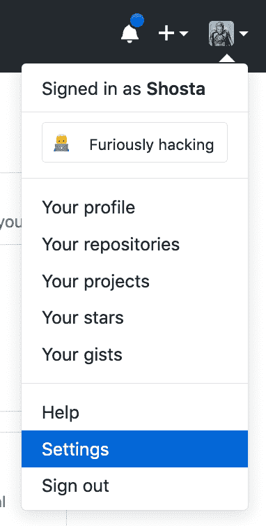
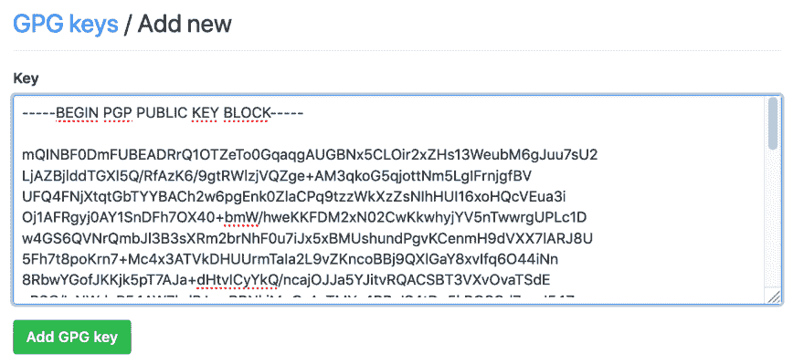
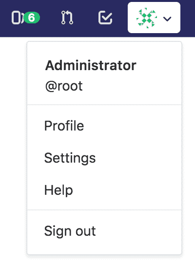

# 如何使用 GPG 在 Github、Gitlab、Bitbucket 上签名

> 原文：<https://dev.to/shostarsson/how-to-use-pgp-to-sign-your-commits-on-github-gitlab-bitbucket-3dae>

*照片来自 [Jantine Doornbos](https://unsplash.com/@helloquence) 上[Unsplash](https://unsplash.com)T5】*

大家好，

每次我得到一台新电脑(虽然不经常，但足够经常来写这篇文章)，我都在为我拥有的不同代码库帐户的 Git 配置而“挣扎”。

每次我有了新电脑，我都不记得几年前/几个月前我做了什么来正确设置它。因此，这篇文章更多是写给未来的我，而不是现在的你，因为你正在阅读它。🤔

在设置了 SSH 密钥之后，我必须在 Git 服务上设置我的签名身份。

事实上，如果你不签署你的提交，[每个人都可以在提交时冒充](https://medium.com/@pjbgf/spoofing-git-commits-7bef357d72f0)。
这就是签署承诺书非常重要的原因。🖋️

* * *

### TL；博士；医生

总结一下我们要做的事情，我们将**创建一个 GPG 密钥**，**将其添加到您的 Git 服务**中作为我们的身份，**设置 Git 使用正确的 GPG 密钥**和**将一封电子邮件与 GPG 密钥**相关联。

我将在 [GitHub](https://github.com/) 、 [Bitbucket](https://bitbucket.org/) 和 [GitLab](https://about.gitlab.com/) 上向大家展示**如何做到这一点**。
然后我将解释如何**根据您的项目定义您想要使用的签名身份**。

要签署提交，您需要创建一个私有/公共密钥对，并与想要验证您的提交的每个人共享公共密钥。你的公钥实际上是通过 Github、Gitlab 或 Bitbucket 共享给想要验证你身份的人的。

执行这些操作的每个命令如下所述。👨‍💻⬇️
尽情享受。😎

* * *

## 🔑GPG·凯斯一代

1.  下面是创建 GPG 键的默认命令。

```
gpg --full-generate-key 
```

Enter fullscreen mode Exit fullscreen mode

> 如果你不知道 GPG 代表什么，你应该在维基百科上看一看。

1.  在提示符下，指定您想要的键的种类，或者按下`Enter`接受默认的`RSA and RSA`。

    > GitHub 支持几种你可以使用的 GPG 密钥算法。
    > 
    > *   南非共和国(Republic of South Africa)
    > *   埃尔加马尔
    > *   目录系统代理(Directory System Agent)
    > *   这是什么
    > *   ECDSA
    > *   埃德萨

2.  输入所需的密钥大小。我推荐`4096`的最大密钥大小。

3.  输入密钥应该有效的时间长度。按 Enter 键指定默认选择，表示密钥不会过期。我建议最多有一年的有效期。

4.  输入您的用户 ID 信息。

5.  验证您的选择是否正确。

6.  键入安全密码。

7.  将该密钥的安全密码保存到您选择的密码管理器中(我个人使用 [KeepassXC](https://keepassxc.org/) )。

要检查一切是否正常，您可以列出设备上的 GPG 键。

```
gpg --list-secret-keys --keyid-format LONG
/Users/hubot/.gnupg/secring.gpg
-----------------------------------------
sec   4096R/3AA5C34371567BD2 2016-03-10 [expires: 2017-03-10]
uid                          Hubot 
ssb   4096R/42B317FD4BA89E7A 2016-03-10 
```

Enter fullscreen mode Exit fullscreen mode

这里有一段视频展示了整个过程。
[https://www.youtube.com/embed/JedF44zpWok](https://www.youtube.com/embed/JedF44zpWok)

举个例子，我会考虑我们有一个想要在 Github 和 Gitlab 上使用的个人身份(电子邮件)和一个想要在 Github 和 Bitbucket 上使用的职业身份。

让我们用表格总结一下:

| 服务 | 身份 | 电子邮件 | 评论 |
| --- | --- | --- | --- |
| 开源代码库 | 个人的 | [remi . lavdrine @ pero . com](mailto:remi.lavedrine@perso.com) | Github 上的个人身份 |
| 开源代码库 | 专业的 | [remi . lavdrine @ pro . com](mailto:remi.lavedrine@pro.com) | Github 上的职业身份 |
| Gitlab | 个人的 | [remi . lavdrine @ pero . com](mailto:remi.lavedrine@perso.com) | Gitlab 上的个人身份 |
| Bitbucket | 专业的 | [remi . lavdrine @ pro . com](mailto:remi.lavedrine@pro.com) | Bitbucket 上的职业身份 |

我为这篇文章创建了所有这些密钥。
随意创建你需要的，然后使用下面的命令`gpg --list-secret-keys --keyid-format LONG`检查每个人都是正确的

* * *

## ✍️配置 Git 身份和签名策略

既然我们已经准备好了 GPG 密匙，我们可以配置 Git 根据我们的身份选择合适的 GPG 密匙。

### 🗺️全球配置

您必须为您的 Git 声明一个全局配置。

```
git config --global --edit 
```

Enter fullscreen mode Exit fullscreen mode

添加默认用户:

```
[user]
    signingkey = 4B6598BF5707D5A4
    name = Remi Lavedrine
    email = remi.lavedrine@perso.com 
```

Enter fullscreen mode Exit fullscreen mode

定义您的签署提交策略(我不建议自动签署所有提交😉):

```
[commit]
    gpgsign = true 
```

Enter fullscreen mode Exit fullscreen mode

现在我们有了默认的 Git 身份。

### 🏙️本地配置

为了对我们的签名身份有更多的控制，我们将在克隆一个新的存储库时，为每个项目定义我们的身份项目。
只需移动到目标文件夹，并克隆您的存储库(例如`git clone git@github.com:thepracticaldev/dev.to.git`)😉).

一旦进入存储库文件夹，您就可以启动命令:

```
git config --local --edit 
```

Enter fullscreen mode Exit fullscreen mode

或者如果您对 vi 不太熟悉，您可以编辑`./.git/config`文件。

```
nano ./.git/config 
```

Enter fullscreen mode Exit fullscreen mode

和全局配置一样，您只需添加用户和您选择的签名提交策略。

```
[user]
    signingkey = 4B6598BF5707D5A4
    name = Remi Lavedrine
    email = remi.lavedrine@perso.com

[commit]
    gpgsign = true 
```

Enter fullscreen mode Exit fullscreen mode

对您正在使用的每个存储库都这样做，并希望签署您的提交。

* * *

## 💭将密钥添加到您的存储库帐户

现在，一切都已在本地设置妥当。因此，我们必须将 SSH **公共**密钥添加到您正在使用的服务中。

1.  让我们列出可用的 GPG 键。

```
gpg --list-keys
sec   rsa4096/4B6598BF5707D5A4 2019-07-16 [SC] [expire : 2020-07-15]
      913C42CFA493DCF45FA65B464B6598BF5707D5A4
uid                [  ultime ] Rémi Lavedrine (Personal Identity on Github) <remi.lavedrine@perso.com>
ssb   rsa4096/425EA1013A372D16 2019-07-16 [E] [expire : 2020-07-15]

sec   rsa4096/943F54877369FBC9 2019-07-16 [SC] [expire : 2020-07-15]
      BD1318B04CEAB84DC5FB8BFA943F54877369FBC9
uid                [  ultime ] Rémi Lavedrine (Professional Identity on Github) <remi.lavedrine@pro.com>
ssb   rsa4096/61531E9B065DD712 2019-07-16 [E] [expire : 2020-07-15]

sec   rsa4096/D1495F54BE4ECF37 2019-07-16 [SC] [expire : 2020-07-15]
      9EB8C0816D7C607FC493F354D1495F54BE4ECF37
uid                [  ultime ] Rémi Lavedrine (Personal Identity on Gitlab) <remi.lavedrine@perso.com>
ssb   rsa4096/90055F33F5B23681 2019-07-16 [E] [expire : 2020-07-15]

sec   rsa4096/B788EC8FF8B4487C 2019-07-16 [SC] [expire : 2020-07-15]
      090D6265BB26DF44E3D84173B788EC8FF8B4487C
uid                [  ultime ] Rémi Lavedrine (Professional Identity on Bitbucket) <remi.lavedrine@pro.com>
ssb   rsa4096/659371B2F5F99CAB 2019-07-16 [E] [expire : 2020-07-15] 
```

Enter fullscreen mode Exit fullscreen mode

1.  并且复制一个我们要用的(*Github 上的个人身份*)。

🍏-在 MacOS 上，将 GPG 公钥复制到剪贴板是相当容易的。

```
gpg --armor --export 913C42CFA493DCF45FA65B464B6598BF5707D5A4 | pbcopy 
```

Enter fullscreen mode Exit fullscreen mode

🐧-在 Linux 上，你只需要使用 xclip 就可以了(如果它不在你的系统上，在你的终端上启动`sudo apt install xclip`)

```
gpg --armor --export 913C42CFA493DCF45FA65B464B6598BF5707D5A4 | xclip -selection c 
```

Enter fullscreen mode Exit fullscreen mode

### 🐙开源代码库

1.  让我们登录你的 Github 账户，进入账户设置。
    [T3】](https://res.cloudinary.com/practicaldev/image/fetch/s--zMeSMF3a--/c_limit%2Cf_auto%2Cfl_progressive%2Cq_auto%2Cw_880/https://thepracticaldev.s3.amazonaws.com/i/x1vjz5xpylfmcp4t34yv.png)

2.  选择“SSH 和 GPG 键”。
    [T3】](https://res.cloudinary.com/practicaldev/image/fetch/s--61Zvtbue--/c_limit%2Cf_auto%2Cfl_progressive%2Cq_auto%2Cw_880/https://thepracticaldev.s3.amazonaws.com/i/k6iacznldh4zpjlb0d2m.jpg)

3.  点击“新 GPG 键”按钮，将剪贴板上的内容粘贴到网站上，然后点击“添加 GPG 键”。
    [T3】](https://res.cloudinary.com/practicaldev/image/fetch/s--w2-dqGxN--/c_limit%2Cf_auto%2Cfl_progressive%2Cq_auto%2Cw_880/https://thepracticaldev.s3.amazonaws.com/i/1uifmqasa0fh4mcz71yb.png)

🤜 💥 🤛你可以走了！！！

这里有一个视频总结了这一点。
[https://www.youtube.com/embed/BXq21ORNfmk](https://www.youtube.com/embed/BXq21ORNfmk)

### 🦊Gitlab

1.  让我们登录您的 Gitlab 帐户，并进入帐户设置。
    [T3】](https://res.cloudinary.com/practicaldev/image/fetch/s--OpVBPz3C--/c_limit%2Cf_auto%2Cfl_progressive%2Cq_auto%2Cw_880/https://docs.gitlab.com/ee/user/profile/img/profile_settings_dropdown.png)

2.  导航到 GPG 密钥选项卡，将您的公钥粘贴到“密钥”框中，保存。
    [T3】](https://res.cloudinary.com/practicaldev/image/fetch/s--d_Yu-tuq--/c_limit%2Cf_auto%2Cfl_progressive%2Cq_auto%2Cw_880/https://docs.gitlab.com/ee/user/project/repository/gpg_signed_commits/img/profile_settings_gpg_keys_paste_pub.png)

🤜 💥 🤛你可以走了！！！

### 🗑️ Bitbucket

在 Bitbucket 上，签名提交仅适用于服务的本地版本(Bitbucket 服务器)。

1.  让我们登录到您的 Bitbucket 帐户，并转到帐户的设置。
    [T3】](https://res.cloudinary.com/practicaldev/image/fetch/s--7spnYUBB--/c_limit%2Cf_auto%2Cfl_progressive%2Cq_auto%2Cw_880/https://thepracticaldev.s3.amazonaws.com/i/k4yuwtrp4xmnenxlrq13.png)

2.  单击 GPG 键。>添加密钥。

3.  将 GPG 公钥的内容粘贴到剪贴板中。

4.  单击“添加密钥”按钮进行验证。

🤜 💥 🤛你可以走了！！！

* * *

## 🖋️使用您的 GPG 密钥签署提交

现在一切都配置好了，无论是在机器上还是在服务上。你可以签署你的承诺。

要签署您的提交，您只需在您的`git commit`命令中添加一个“`-S`”参数。

已签名的提交将如下所示:

```
git commit -S -m "My commit message" 
```

Enter fullscreen mode Exit fullscreen mode

然后，您可以将您的提交推送到 [GitHub](https://github.com/) 、 [GitLab](https://about.gitlab.com/) 或 [Bitbucket](https://bitbucket.org/) ，并检查您的提交是否得到验证。

正如在配置一节中所解释的，如果您不想在每次提交时都添加“`-S`”参数，您可以编辑 Git 本地配置(`git config --local --edit`或`git config --local commit.gpgsign true`)。

* * *

## 🖋️使用您的 GPG 密钥签署标签

在 Git 上，您可以签署承诺。
但是您也可以在标签上签名。

至于签署提交，您只需在您的`git tag`命令中添加一个“`-s`”参数。

一个已签名的标签看起来应该是这样的:

```
git tag -s -m "My tag message" 
```

Enter fullscreen mode Exit fullscreen mode

您也可以运行以下命令来验证您的签名标签:

```
git tag -v mytag
    Verifies the signed tag 
```

Enter fullscreen mode Exit fullscreen mode

* * *

你现在可以**创建任意多的 GPG 密钥**并将它们添加到 Github、Gitlab 或 Bitbucket 中，然后**在本地配置你的签名策略**并**签署你的提交或标签**。

我希望这对你有帮助。

干杯🍻

*我在 [GitHub](https://help.github.com/en/articles/generating-a-new-gpg-key) 、 [GitLab](https://docs.gitlab.com/ee/user/project/repository/gpg_signed_commits/index.html) 和 [Bitbucket](https://confluence.atlassian.com/bitbucketserver/using-gpg-keys-913477014.html#UsingGPGkeys-AddaGPGkeytoBitbucketServer) 上找到了这个帖子的帮助

* * *

视频由 [Wild & Secure](https://wildnsecure.com) 制作，这是您的安全和房地产咨询公司。
如果您想每周收到高质量的安全内容，请在我们的网站订阅我们的简讯[。](https://wildnsecure.com/contact)