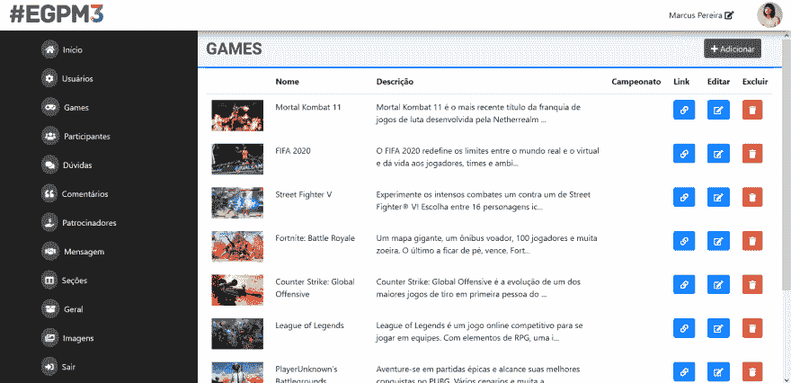

# 我们如何使用 Vue 和 Webpack 为大学活动创建网站和 CMS

> 原文：<https://dev.to/pmarcus93/how-we-created-a-website-and-a-cms-for-a-college-event-with-vue-and-webpack-4clf>

我是一名从米纳斯大学 IT 专业毕业的大学生。每个学期，我们都要做一个期末项目来应用过去几个月里教给我们的所有知识。这一次，我的团队选择为学院每年举办的活动创建一个页面:Encontro Gamer De paráDe Minas(paráDe Minas 的游戏者会议，粗略翻译)。

从一个静态页面开始，变成了一个 Vue 应用程序，它从一个 API 使用数据，从一个定制的 CMS 插入数据。在这篇文章中，我将告诉你我们的经历和我们同时学到的东西。

在开始阅读之前，你可以自己去看这个项目。

[http://egpm.fapam.edu.br/](http://egpm.fapam.edu.br/)

# 启动项目

我们队有三个人:我、卢卡斯和爱德华多。我们都是开发者。卢卡斯和我一起工作，开发网络应用程序。Eduardo 致力于创建 Delphi 系统(并且在网络、主机和基础设施方面有丰富的经验)。

我们的主要目标是开发一个静态登录页面，显示活动的主要细节。我们几乎没有时间做这个项目，我们的想法是尽可能缩小范围。

在开始编码之前，我们决定重塑活动的视觉形象。我们根据欧洲超级任天堂控制器的颜色创造了一个概念。随着新标志和颜色的确定，是时候寻找灵感了。

# 获得灵感和原型

首先，我们分析了许多类似事件的登录页面，记录下我们认为哪些可以，哪些不可以。关注页面上的项目和信息配置的灵感来源。在此基础上，我们创建了小型原型(想想功能性线框)来测试每种布局的可行性，而没有有效地选择技术并开始开发。

# 选择技术

除了创建具有良好用户体验的页面之外，首要任务是将该项目作为实验和学习的平台。选择不同的库和框架是实现这一目标的最佳方式之一。

我们选择了...

### Vue。作为 JS 框架的 JS+作为模块捆绑器的 Webpack

我真的很喜欢 Vue 的语法是用户友好的。所有的文档都写得很好，社区也越来越大。我们使用预配置的模板，支持创建单个文件组件(。vue)。这个模板提供了很多便利:生成 dist 文件夹的命令和所有准备好的文件，CSS 预处理支持，现代的 JS transpiller，带有热重载的本地服务器等等。

### 自举 4

简单的选择。我们为大网格系统和组件选择 Bootstrap 4。

### sass(SCS)

CSS 预处理器。SASS 使我们能够以更加智能和易读的方式编写 CSS。此外，自动化重复的 CSS 任务也很棒。我们选择了 SCSS 语法，因为它与经典的 CSS 语法有很多相似之处。

### Git + Github

版本控制系统是以协作方式开发的一个需求。使用 git 作为 VCS，我们选择 Github 作为源代码库的主机。我们在日常工作中使用 Bitbucket，使用 Github 是了解服务之间的差异和等价性的好方法。

# 在做什么

## 以协作的方式异步工作

我们创建了一个 Github 存储库，并使用问题和拉请求来管理项目。我们习惯于 Bitbucket，学习曲线很容易。在我写这篇文章的时候，我们的知识库有 491 个提交和 24 个关闭的问题。

<figure>

<figcaption>A lot of commits!</figcaption>

</figure>

我们的工作流程基本上是:

1.  定义新功能/热修复程序；
2.  为主题打开一个问题，并分配给我们中的一个人；
3.  基于 master 创建新分支；
4.  开发功能/修补程序；
5.  创建一个指向主节点的拉式请求，将另一个节点指定为审核者；
6.  等待审查；
7.  审核通过后，合并请购单，删除旧分支。

它工作得非常好，我们几乎没有任何问题或代码冲突。我们把自己组织得很好，甚至在周末用完全不同的时间编码。

## 视图，视图，视图

配置好 webpack 模板和在线存储库后，我们开始开发。我们学习了框架的基础知识，在一周多的时间里，我们就有了应用程序的基本结构。

我们面临的第一个挑战是学习现代 Javascript 的基础知识，因为所有的导入和导出都基于 ECMAScript (6+)最新版本的模块化概念。

Vue 语法非常容易学习，特别是如果你以前已经使用过 Angular 这样的框架。文件非常好，非常详细。如果英语不是你的第一语言，也许它有翻译。我是巴西人，我的母语是葡萄牙语，我们有很好的文档翻译。

我最喜欢的 Vue 特性之一是单组件文件。vue)。它们包含组件的所有 HTML、CSS 和 JS。例如，要使用名为 Banner 的组件，只需使用`<Banner></Banner>`。这使得代码对开发人员来说更简单、更易读。

## CMS

<figure>

<figcaption>Yup, my profile image it's a Charli XCX pic. Thanks Lucas, I loved it!</figcaption>

</figure>

随着网站的形成，我们很清楚，我们需要创建一个内容创作 CMS。我们需要一个谁允许我们注册所有的游戏，将在活动中出现，比赛细节，本地化，一个快捷方式购买门票，常见问题和证明书。

Lucas 使用他在个人项目中使用的定制 PHP 框架创建了所有的 CMS。CMS 的前端具有与网站相同的基本结构，使用所有的组件化概念。CMS 由一个面板组成，面板上有不同的部分，用于添加、删除或编辑所有不同的内容。所有的数据都通过 JSON 和网站使用的 API 返回。

今天，所有的 CMS 代码都包含在两个不同的存储库中:一个用于前端，一个用于后端。

## 组件、SASS 和布局的实验是多么容易

Vue 单个文件组件的使用使我们可以毫不费力地进行一系列实验。为了试验一个项目的配置、颜色或字体，我们只需要改变组件文件。该组件的所有实例都会自动更新。

使用 SASS 是另一个伟大的决定。正如我在另一个主题中所说的，它允许我们创建变量和代码片段来自动化使用 CSS 的过程，并支持一种我发现比普通 CSS 更易读的语法。

请记住，毕竟，SASS 转换 CSS 中的所有内容。我选择 SCSS 语法，他用分号和大括号来分隔行尾和选择器。

## 响应性和图像

即使你是一个初学者，你也可能听说过你的站点或系统需要有响应性。在一个大部分网络流量都是由移动设备产生的世界里，重要的是你的网站在任何屏幕上都感觉很棒——从智能手机到桌面以及介于两者之间的任何东西。

为我们的用户提供出色的体验，尤其是那些将通过智能手机访问它的用户，是我们的主要目标之一。这不仅仅是关于清晰易读和位置恰当的物品。数据消耗也需要尽可能小——请记住，大多数智能手机用户使用的是带有数据上限的慢速网络。在巴西，这是一个现实。

我们的网站非常依赖图像，图像是大部分数据消耗的来源。考虑到这一点，我们在 CMS 上实现了一个在图像上传时调整图像大小和压缩图像的解决方案。我们生成一系列不同分辨率和大小的变体。图像最小版本的平均大小接近 25kb ~ 30kb。

使用`<picture>`和`<options>`标签，我们验证显示尺寸以获取最合适的图像。举例来说，在智能手机上，你几乎总能看到图像的最小版本。这大大减少了数据消耗，并反映在速度上。

## 迭代、测试和抛光

我们反复多次，直到我们得到最终的布局。因为我们的老师没有强加任何形式的限制，我们有自由去尝试。例如，所有默认字体、字体大小和项目间距都是在接近项目截止日期时选择的。

在迭代过程中，我们选择“少即是多”的方法。在第一部中，我们有很多 CSS 动画。我们选择将它们减少到最低水平，因为保持它们的使用会使用户失去焦点。

除了我们的内部测试，我们还创建了一个预发布环境，并与我们最亲密的朋友和同学分享。在这个阶段，我们得到了很多有价值的反馈，我们可以根据这些反馈做出很多改进。

# 接待

我们在上个月的项目博览会上发布了第一个版本。反响非常积极。除了页面上的少量内容之外，去我们展台的人喜欢他们在我们用来展示 CMS 和桌面页面的笔记本电脑上以及他们自己的智能手机上看到的内容。

最重要的是我们的同事对幕后的技术和流程非常感兴趣。我相信我们鼓励了很多人参与这样的项目(我们对此非常高兴)。

# 我们可以改进什么？

甚至在我们将项目投入生产后，我们还在继续迭代它。我们已经做了很多改变和改进，修复了错误并在 CMS 上增加了新功能。下学期，我们的老师和促成这一事件的人将会用到很多这样的功能。我们知道还有很多需要改进的地方。我们接下来的一些更新包括:

*   更好地执行无障碍标准；
*   实现一个动画框架页面(就像脸书的一样)，在一些内容加载后保持页面“跳转”。
*   完善整体基础设施:缓存、https 等；
*   提高页面的初始非缓存负载；
*   对屏幕上不可见的图像实现延迟加载；
*   实现自动化测试的工具。

# 总结…

我们在开发这个项目中学到了很多。稍微改变一下我们的日常工作流程，玩玩不同的工具，这是学习新概念和构建系统和页面的好方法。我已经在日常工作中运用了一些新技能，感觉非常好！

要查看项目的运行情况，请跳转到[http://egpm.fapam.edu.br/](http://egpm.fapam.edu.br/)！

如果您有任何问题或建议，请在下面留下您的评论。😊