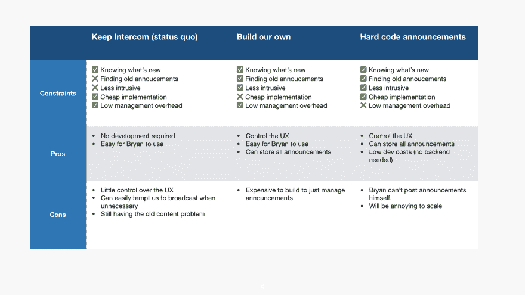

# 我们如何用 100 行代码替换(部分)对讲机

> 原文：<https://dev.to/tability/how-we-replaced-intercom-with-100-lines-of-code-ok-it-was-105-lines-58e6>

编辑:点击较少的标题

(*好吧，是 105 行)

我们开始以经典的方式使用对讲机:我们想要一种简单的方式让人们联系到我们。无论他们是好奇的访客还是现有用户，Intercom 都给了我们一个很好的方式来与人们互动并获得快速的反馈。

所以，要明确的是，我们喜欢对讲机❤️，他们在许多方面都是一个灵感。

但是我们开始看到功能发布的问题:

*   用户将很难清除消息。
*   奇怪的情况下会出现新的帖子。
*   如果你错过了，就不可能找到旧的公告。

我敢肯定，这很大程度上是由于我们的配置不佳。但是，即使我们在张贴方面做得更好了，它仍然不能解决最后一个问题。

用另一种解决方案取代对讲机是一个真正的“缩小规模”的尝试。我们希望能够保持快速发展并让用户了解改进，但我们也必须控制成本——我们无法证明在替代方案上花费超过几天的时间是合理的。

## 寻找更好的解决方案

我已经被直接跳到代码中烧了好几次了，我从惨痛的教训中学到，如果你想穿过一条宽马路，你应该先踩刹车。

当我们要建造重要的东西时，我们有一个简单的方法来评估选择。首先，我们来看看核心能力:

*   客户可以了解新功能。
*   客户可以找到旧的公告。

然后我们列出一些约束条件:

*   侵入性较小
*   低廉的实施成本
*   低管理开销

这两个列表足以开始概述选项。将现状作为第一选择是至关重要的，因为你需要确保你正在改善事情。如果你只是比较一套新的解决方案，你可能会选择一种可能会降低当前体验的方法。

这是第一组选项的样子:

1.  继续使用对讲机(现状)
2.  硬编码公告
3.  构建我们自己的公告功能

我把它们放在一个表格里，并做了一个快速的比较，看看选项 2 或 3 是否令人满意。

提出的解决方案都不令人满意。硬编码的帖子管理起来非常烦人，而且建立一个完整的服务太昂贵了。

我们不断寻找灵感，不无讽刺的是，答案来自对讲机本身。

## 灯泡时刻💡:利用我们现有的资源

目标是让客户了解新功能，仅此而已。但是我们太专注于当前的体验(应用程序中的一切)，所以我们没有寻找不同的方法。

嗯，Intercom 的导航条上有一个小铃铛图标，用于发布功能公告。当有新的内容可以阅读时，它会有一个红点，点击这个铃铛会把你带到他们的博客。没有干扰性的弹出窗口，没有要消除的消息。

太完美了。

我们所有的专题文章都已经在我们的博客上了，这也是客户可以找到旧文章的地方。所以我们必须把他们送到那里，阅读我们为提高稳定性所做的工作。

不需要后端管理职位。不需要在 UI 中创建一个花哨的列表。我们只是需要一种方式来显示新的博客帖子已经发布。

这只是通过使用 localStorage 来捕获他们最后一次点击博客链接的时间。当然，如果你为同一个帐户切换浏览器，通知会再次弹出，但现在这仍然是一个边缘情况(但我们稍后会修复)。

## 第 105 行代码稍后

我们对结果非常满意，我们将对实现进行迭代以改进它:

*   我们仍然必须在前端的某个地方存储最后一次博客更新的时间戳(我们一天部署多次，所以仍然是可管理的)。
*   当我们启动我们的移动应用程序时，在不同的设备上再次弹出通知将会很烦人。

这不是我们最初的想法，但它做了正确的工作:减少噪音，同时让用户了解改进。

吸取的教训？专注于客户需要做什么，而不是你想要提供的体验，会让你更有创造力。

(另外，105 行本来可以更短，但是冗余了...)