# 如何构建您的第一个无服务器逻辑应用程序，第一部分

> 原文：<https://dev.to/azure/how-you-can-build-your-first-logic-app-18he>

在 [Twitter](https://twitter.com/chris_noring) 上关注我，很乐意接受您对主题或改进的建议/Chris

> 本文是 [#ServerlessSeptember](https://dev.to/azure/serverless-september-content-collection-2fhb) 的一部分。在这个无服务器的内容集合中，您可以找到其他有用的文章、详细的教程和视频。9 月份，每天都有来自社区成员和云倡导者的新文章发布，没错，每天都有。

在[https://docs.microsoft.com/azure/azure-functions](https://docs.microsoft.com/azure/azure-functions/?WT.mc_id=servsept_devto-blog-cxa)了解更多关于微软 Azure 如何实现你的无服务器功能。

> 假设你需要开发一个应用程序。为了构建你的应用，你需要它与 Dropbox、Excel、Twitter、Slack、云服务等许多东西相集成。你卷起袖子，知道你需要花很多时间学习如何与这些 API 中的每一个对话，你需要生成 API 令牌并编写连接代码。几周之后，您可能已经完成了所有集成的编写，并且您可能开始考虑您想要实现的实际业务逻辑。停，就像句号。如果这是你的应用程序，一堆集成，然后只是一点业务逻辑在那里，然后有一个框架在那里等着你。它是无服务器产品的一部分，名为**逻辑应用**。

这是系列的一部分

*   第一部分，*我们在这里*，搭建数据库并构建逻辑应用程序
*   [第二部分](https://dev.to/azure/how-you-can-build-your-first-logic-app-2o85)，这部分讲述了如何构建我们的无服务器应用

TLDR；本文将花时间描述逻辑应用程序，什么时候它是一个好的候选对象，以及它由哪些部分组成。我们将以在其中建造一些东西来结束。

在本文中，我们将涵盖:

*   **Why** ，在这里，我们试图描述像 logic apps 这样的框架真正发光的情况，以及它不发光的情况，以及当你不太清楚是自己编码还是使用 Logic Apps 时的情况。
*   **What** ，我们将描述逻辑应用程序由哪些部分组成，这样你就能很好地了解你能用它构建什么
*   演示，我们将在 Logic 应用程序中构建一些东西，包括一个 Twitter 集成和一个数据库。这是一件有趣的事情，只需要很少的时间，并且可以很容易地用更多的逻辑来扩展

## 资源

*   注册一个免费的 Azure 账户如果你想开发逻辑应用和 Azure 功能，你需要一个 Azure 账户，这是免费的。
*   [逻辑应用概述](https://docs.microsoft.com/en-us/azure/logic-apps/?wt.mc_id=servsept_devto-blog-chnoring)提供逻辑应用概述和一些教程链接的优秀文档页面
*   [逻辑应用程序学习](https://docs.microsoft.com/en-us/learn/modules/intro-to-logic-apps/?wt.mc_id=servsept_devto-blog-chnoring)包含许多概念的优秀介绍模块。
*   [Logic apps LEARN II](https://docs.microsoft.com/en-us/learn/modules/route-and-process-data-logic-apps/?wt.mc_id=servsept_devto-blog-chnoring) 本模块将带您了解 Twitter、认知服务和 SQl Server 的真实示例。
*   [逻辑应用程序上的 aka.ms/learn 共有 5 个模块](https://docs.microsoft.com/en-us/learn/browse/?products=azure&resource_type=module&term=logic%20app&wt.mc_id=servsept_devto-blog-chnoring)逻辑应用程序上的 5 个模块，涵盖“Hello World”到更高级的自定义场景。
*   [逻辑应用中的连接器](https://docs.microsoft.com/en-us/azure/connectors/apis-list?wt.mc_id=servsept_devto-blog-chnoring)这将深入讨论连接器，它们是什么，存在哪些连接器
*   [创建自定义连接器](https://docs.microsoft.com/en-us/connectors/custom-connectors/create-logic-apps-connector?wt.mc_id=servsept_devto-blog-chnoring)关于如何创建自定义连接器的优秀文档
*   [VS 代码中的 Azure 函数](https://docs.microsoft.com/en-us/azure/azure-functions/functions-create-first-function-vs-code?wt.mc_id=servsept_devto-blog-chnoring)

## 为什么

正如我们在文章开头所说的:在你的应用程序中有很多需要做的集成意味着，你要么花大量的时间来构建这些集成的连接点，要么你依赖一个集成框架，如 Logic Apps 和其他类似的框架。

### 这有一个连接器

您的工作是找到一个最佳点，在这个点上使用集成框架比自己编写框架更有意义。一个迹象可能是集成的绝对数量，也许更好的迹象是您需要的集成在下面的列表中:

*   销售力量
*   办公室 365
*   神谕
*   推特
*   油管（国外视频网站）
*   Dropbox
*   谷歌服务
*   Azure 认知服务

是吗？很好，那么逻辑应用程序可能适合你。

没有吗？这里有 100 多个连接点，或者逻辑应用程序称之为*连接器*。这里有一个链接，您可以阅读更多关于支持哪些连接器的信息

[连接器上的文档](https://docs.microsoft.com/en-us/azure/connectors/apis-list?wt.mc_id=servsept_devto-blog-chnoring)

### 我们如何编写业务逻辑？

好的，那么你正在考虑逻辑应用？您脑海中的下一个问题可能是如何将您的业务逻辑放入其中。对此有两个答案:

1.  **控制动作**，在逻辑应用中有一些特定的动作叫做控制动作，它允许我们像 IF THEN 一样表达分支逻辑..或者循环，直到你明白了
2.  **自定义连接器**，如果我们正在寻找的集成缺失和/或我们需要执行非常具体的逻辑，那么我们可以编写自己的连接器并实现它。你可以在这里阅读更多案例[创建一个定制连接器](https://docs.microsoft.com/en-us/connectors/custom-connectors/create-logic-apps-connector?wt.mc_id=servsept_devto-blog-chnoring)

所有这些都变得非常理论化，所以让我们试着解释一下逻辑应用的核心概念是什么，以及它是如何工作的，这样你就能更好地掌握它。

## 什么

那好吧。逻辑应用。理解所有概念的最简单的方法是看一个业务流程，我们打算把它变成一个逻辑应用程序。像这样:

[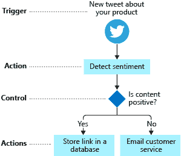](https://res.cloudinary.com/practicaldev/image/fetch/s--A6eLh4Wd--/c_limit%2Cf_auto%2Cfl_progressive%2Cq_auto%2Cw_880/https://thepracticaldev.s3.amazonaws.com/i/f06wz99q7z38osr9mpha.png)

上面我们有一个流程 a *社交媒体经理*。它寻找关于某个话题的新的*推文*。如果发生这种情况，我们会尝试确定内容是积极的还是消极的。如果是肯定的，那么我们将 tweet 的`link`存储在数据库中。如果结果是*否定的*，那么我们会发邮件给我们的客户部门进行跟进。

这个相对简单的过程很容易用逻辑应用程序编写，我们要做的第一件事是确定什么是什么，过程中的哪个阶段对应什么概念。

让我们从头开始。

**触发**

一个*触发器*是启动整个过程的东西，它*根据一个条件激活*。在这种情况下，它被激活是因为一条推文发布在某个主题上。

[](https://res.cloudinary.com/practicaldev/image/fetch/s--VtAleGxz--/c_limit%2Cf_auto%2Cfl_progressive%2Cq_auto%2Cw_880/https://thepracticaldev.s3.amazonaws.com/i/iav7tewivmflkgxwbbmk.png)

**动作**

在*动作*步骤中，我们执行某事。在这种情况下，我们将推文文本作为输入参数发送给认知服务，以确定情绪，例如，这是一条正面还是负面的推文。

[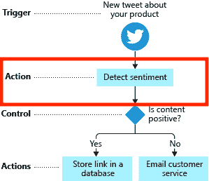](https://res.cloudinary.com/practicaldev/image/fetch/s--bIUKDM7q--/c_limit%2Cf_auto%2Cfl_progressive%2Cq_auto%2Cw_880/https://thepracticaldev.s3.amazonaws.com/i/is1ufmyisaw90bix2zfq.png)

**控制**

*控制*是一种动作，也称为*控制动作*。在这种情况下，它试图根据从认知服务获得的*得分*值来决定是将某些东西存储在数据库中还是发送电子邮件给客户服务。

[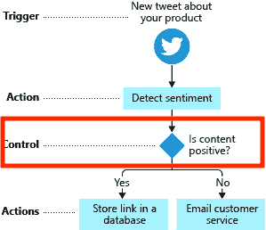](https://res.cloudinary.com/practicaldev/image/fetch/s--83YGFXfE--/c_limit%2Cf_auto%2Cfl_progressive%2Cq_auto%2Cw_880/https://thepracticaldev.s3.amazonaws.com/i/3vtuqp30rzw6ho3jq2vd.png)

**更多动作**

我们的最后一步包括两个不同的动作`Store link in database`和`Email customer service`。和`Detect sentiment`行动一样，这是我们需要执行的任务。

### 我们如何创建一个逻辑 App？

好了，现在你可能对构建模块有了更好的了解。那么我们该怎么做呢？我们如何创建一个逻辑应用程序？

> 我们用一种叫做`Logic Apps Designer`的东西

这是一个存在于 Azure 门户中的可视化工具，是的，它几乎就是组件的拖放和输入输出的配置。但它很强大，当你可以将 Slack 或 Twitter 等不同的连接器与云服务连接起来时，它真的很强大。

> 它看起来像什么，我需要一个视觉，给我一个视觉！

你应该有一个视觉！

[](https://res.cloudinary.com/practicaldev/image/fetch/s--EiRFV76e--/c_limit%2Cf_auto%2Cfl_progressive%2Cq_auto%2Cw_880/https://thepracticaldev.s3.amazonaws.com/i/1uyhr8awcjyletxsuy0d.png)

从上图可以看出，我们从顶部布局了不同的组件/连接器。只要快速浏览一下，我们几乎可以对它的功能有一个基本的了解。

理论够了，最好的学习方法就是去做。:)

## 演示

在本演示中，我们将执行以下操作:

1.  **供应和创建数据库**，SQL Server 数据库将包含一些列，帮助我们存储关于推文的信息
2.  创建一个逻辑应用程序，该应用程序将听取来自谷歌的特定推文，并将其放在数据库中
3.  **构建一个无服务器 API** ，无服务器函数 app 将作为一个从 Sql Server 数据库读取的 API
4.  **实现一个 UI** ，我们将使用 Angular 构建一个 SPA 应用程序，使用无服务器 API

### 调配和创建数据库

好吧，那么，让我们创建一个数据库。我们需要做两件事:

1.  **提供**一个数据库
2.  **添加一个表格**,其中的列可以帮助我们存储我们需要的东西

**提供数据库**

转到`portal.azure.com`。*登录*，然后点击`Create a resource`。此后，如下所示选择`SQL Database`。

[](https://res.cloudinary.com/practicaldev/image/fetch/s--_LAwqdfa--/c_limit%2Cf_auto%2Cfl_progressive%2Cq_auto%2Cw_880/https://thepracticaldev.s3.amazonaws.com/i/d1djutu5ywfylwtcmbcx.png)

填写所有用红色标出的字段。如果你需要创建一个服务器，你会在右边看到`New Server`对话框。

[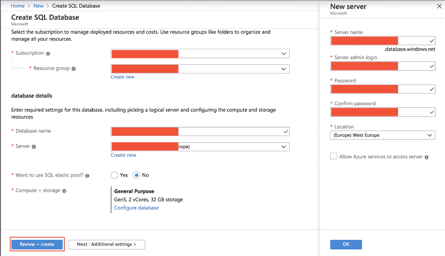](https://res.cloudinary.com/practicaldev/image/fetch/s--VvmlkxaA--/c_limit%2Cf_auto%2Cfl_progressive%2Cq_auto%2Cw_880/https://thepracticaldev.s3.amazonaws.com/i/ulpk32qyuxujyt41409y.png)

最后按`Review and Create`。这将把你带到一个屏幕，在那里你被要求看起来一切正常。在这最后一个屏幕上，按下`Create`，它应该开始供应。

**添加表格**

谈到我们的数据库，我们还有一件事要做。它需要一张桌子。那么我们需要哪些列，我们的表应该做什么呢？嗯，我们打算用它来存储推文上的信息，所以下面的可能是好的:

*   **Tweet id** ，所以如果需要的话，我们可以找到实际的 Tweet
*   **发布日期**，知道它是什么时候发布的很好，这样我们就可以了解随着时间的推移会发生什么
*   位置，知道它是在哪里发布的，将会给我们一个很好的指示，告诉我们世界上哪些地方关心某个特定的话题
*   **Tweet text** 当然，我们需要 Tweet 的内容，以便稍后进行分析

好的，接下来让我们来看看我们的 SQL Server 资源。

[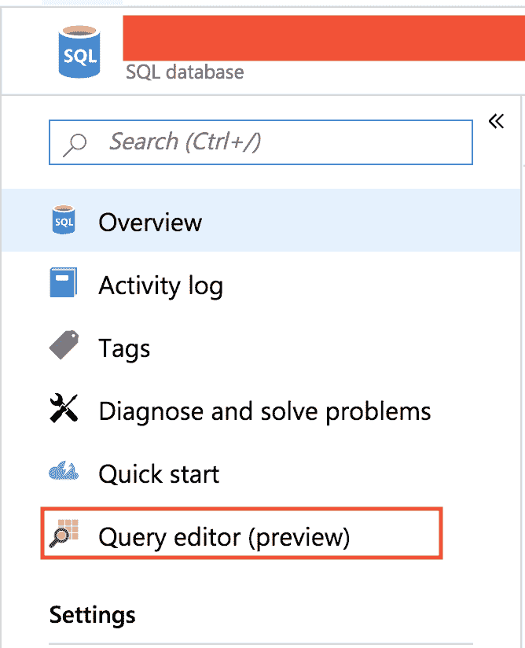](https://res.cloudinary.com/practicaldev/image/fetch/s--tYfz38FF--/c_limit%2Cf_auto%2Cfl_progressive%2Cq_auto%2Cw_880/https://thepracticaldev.s3.amazonaws.com/i/67w61zpfnawq32nwlmjg.png)

根据我们为数据库设置的凭证，我们将被要求*登录*。

[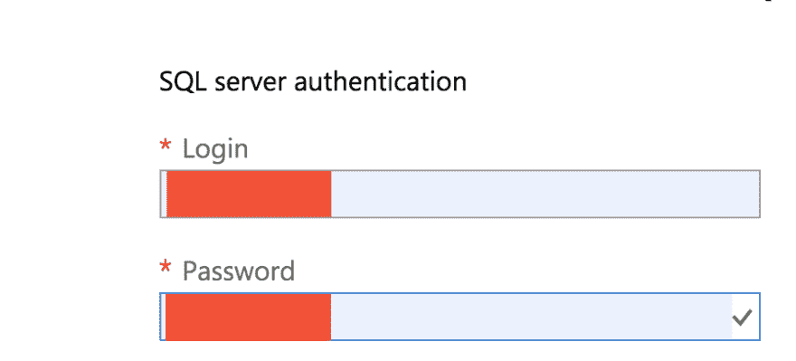](https://res.cloudinary.com/practicaldev/image/fetch/s--7Yk874uR--/c_limit%2Cf_auto%2Cfl_progressive%2Cq_auto%2Cw_880/https://thepracticaldev.s3.amazonaws.com/i/py42yfwvw8awh3x59mm5.png)

第一次它会告诉我们没有权限。要获得访问权限，我们需要设置防火墙规则。幸运的是这很容易。当它告诉你没有访问权限时，只需点击出现的`Password`字段下的蓝色链接。这会将您带到如下所示的页面:

[](https://res.cloudinary.com/practicaldev/image/fetch/s--KxxUWU4U--/c_limit%2Cf_auto%2Cfl_progressive%2Cq_auto%2Cw_880/https://thepracticaldev.s3.amazonaws.com/i/hm5pth9wona2lymf62jn.png)

上面我们有一个标签`Client IP Address`。右边是我们的机器 IP。获取该 IP 并将其输入到字段`START IP`和`END IP`中。然后在字段`RULE NAME`中填写规则的名称。好了，我们完成了，让我们回到登录屏幕。我们填写用户名和密码，这一次我们看到的是查询编辑器。

[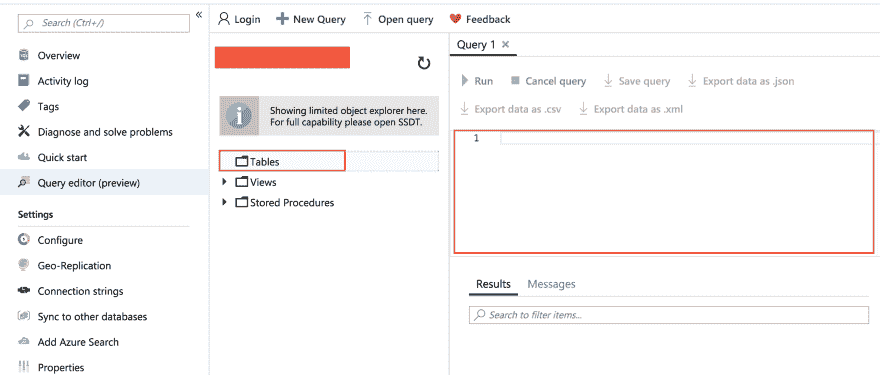](https://res.cloudinary.com/practicaldev/image/fetch/s--CWqD6NY5--/c_limit%2Cf_auto%2Cfl_progressive%2Cq_auto%2Cw_880/https://thepracticaldev.s3.amazonaws.com/i/i2rc6pum2omabk3cyx0a.png)

我们没有任何表格，但是我们在右边有一个大的文本区域。我们需要定义一个包含一些列的表。

在文本区中，添加以下内容:

```
create table Mentions(
 id INT PRIMARY KEY IDENTITY,
 TweetText varchar(500) NULL,
 TweetId varchar(100),
 TweetDate DATE NULL,
 TweetLocation varchar(100)     
); 
```

并按下`Run`来创建我们的表。

现在我们有一张桌子了。很好，下一步是构建我们的逻辑应用程序。

### 创建一个逻辑 app

这一次我们呆在入口。要创建一个逻辑应用程序，我们只需进入`Create Resource`。键入`Logic App`并选择它，就像这样:

[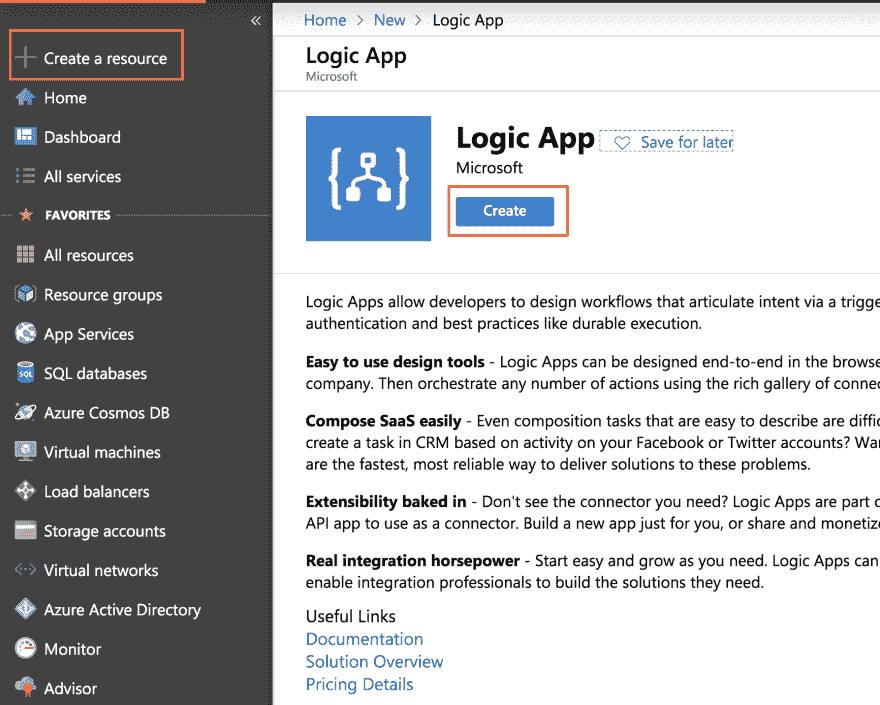](https://res.cloudinary.com/practicaldev/image/fetch/s--Fdwkt0Rd--/c_limit%2Cf_auto%2Cfl_progressive%2Cq_auto%2Cw_880/https://thepracticaldev.s3.amazonaws.com/i/lprgjqjcavcnqlv29g4x.png)

此时，您为您的逻辑应用程序填写所需的数据，即`name`、`resource group`和`location`。然后，它应该开始提供您的逻辑应用程序。

[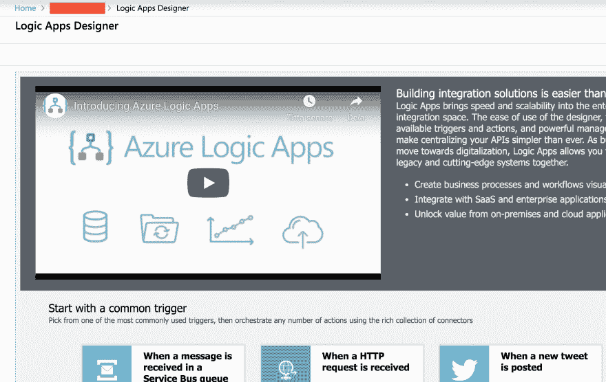](https://res.cloudinary.com/practicaldev/image/fetch/s--Ax9FiRzy--/c_limit%2Cf_auto%2Cfl_progressive%2Cq_auto%2Cw_880/https://thepracticaldev.s3.amazonaws.com/i/g1q3d0c6wm91wnd5wd7x.png)

此时，我们需要滚动并选择`Blank Logic app`

[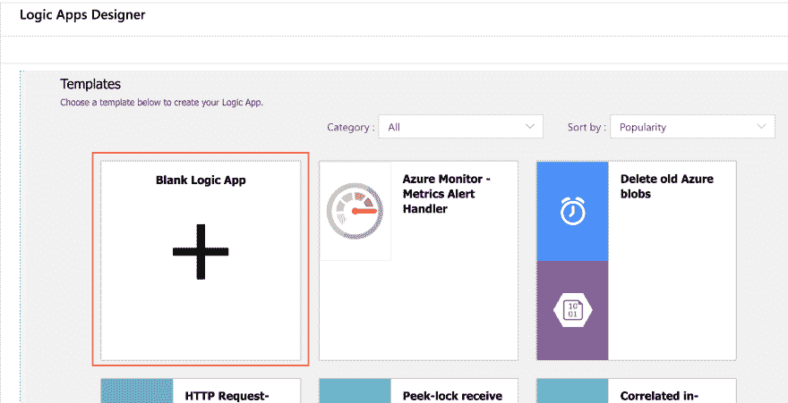](https://res.cloudinary.com/practicaldev/image/fetch/s--xE_fpwdk--/c_limit%2Cf_auto%2Cfl_progressive%2Cq_auto%2Cw_880/https://thepracticaldev.s3.amazonaws.com/i/4d3kulmkho3qphe6enc9.png)

让乐趣开始吧:)

我们需要开展以下工作:

1.  **选择一个触发关键字的 Twitter 触发器**，即标签
2.  **连接一个 SQL 服务器**并将它的列映射到 Twitter 字段。

**选择一个 Twitter 触发器**

搜索`Twitter`并选择出现的 Twitter 图标，它应该显示为`When a new Tweet is posted`。此时，应该会显示:

[](https://res.cloudinary.com/practicaldev/image/fetch/s--Zo0zG219--/c_limit%2Cf_auto%2Cfl_progressive%2Cq_auto%2Cw_880/https://thepracticaldev.s3.amazonaws.com/i/prbrs36dgm0iho3m4idi.png)

你需要按照提示登录 Twitter。完成后，它的外观应该会变成这样:

[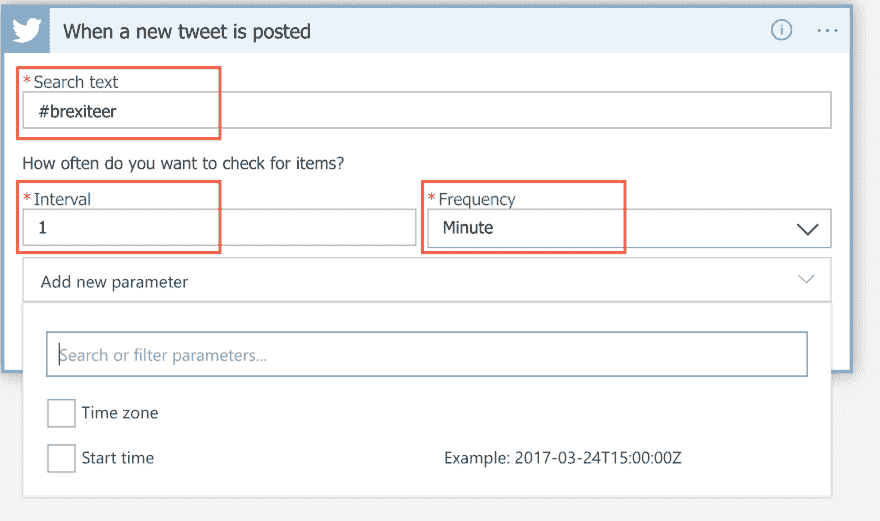](https://res.cloudinary.com/practicaldev/image/fetch/s---owS9jSd--/c_limit%2Cf_auto%2Cfl_progressive%2Cq_auto%2Cw_880/https://thepracticaldev.s3.amazonaws.com/i/lh0cucj4u6v43mdiddpk.png)

指明您要搜索的文本`#brexiteer`，是的，数据库将立即填满:D

填入一个合适的区间，我们用`1`分钟。

接下来，我们需要连接我们的 SQL 服务器，我们通过点击`New Step`来完成。

如果我们现在搜索`SQL server`,我们应该会得到这样的结果:

[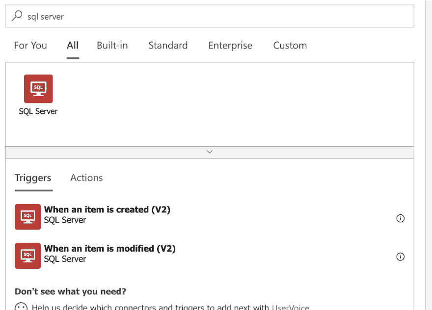](https://res.cloudinary.com/practicaldev/image/fetch/s--E8W5B74p--/c_limit%2Cf_auto%2Cfl_progressive%2Cq_auto%2Cw_880/https://thepracticaldev.s3.amazonaws.com/i/7oq1ekqtng6ubve3aj63.png)

下面你可以看到`SQL server`有两种口味`Trigger`和`Actions`。如果我们想基于数据库、想法、想法中发生变化的东西来构建应用程序，这对于未来是值得注意的:)

回到我们的 app，选择`Actions`，选择`Insert Row v2`。它现在应该是这样的:

[](https://res.cloudinary.com/practicaldev/image/fetch/s--Tp61SITW--/c_limit%2Cf_auto%2Cfl_progressive%2Cq_auto%2Cw_880/https://thepracticaldev.s3.amazonaws.com/i/x61o8m2l5061711dkqq1.png)

现在点击`Manually enter connection info`:

[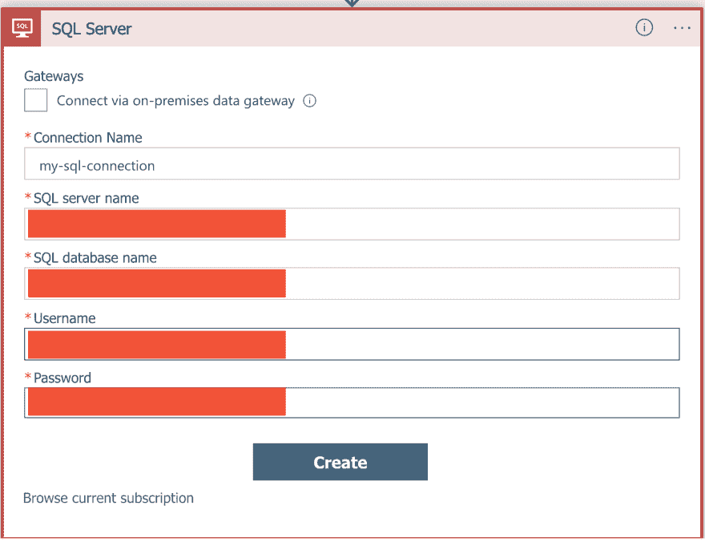](https://res.cloudinary.com/practicaldev/image/fetch/s--EsfwLSnp--/c_limit%2Cf_auto%2Cfl_progressive%2Cq_auto%2Cw_880/https://thepracticaldev.s3.amazonaws.com/i/hplb0ge4fcju66ghap2x.png)

此时选择你的`Server name`、`Database name`和`Table name`。

[](https://res.cloudinary.com/practicaldev/image/fetch/s--JcH6MOIe--/c_limit%2Cf_auto%2Cfl_progressive%2Cq_auto%2Cw_880/https://thepracticaldev.s3.amazonaws.com/i/ir4ptp7jocqysye5wab5.png)

现在有趣的部分来了，twitter 参数与我们的专栏的匹配:)

首先点击`Add new parameter`并检查数据库中的所有列。然后点击一个字段，右边会弹出一个对话框，可以选择 Tweet 字段。持续点击数据库字段和相应的 tweet 字段，直到它看起来像下面这样:

[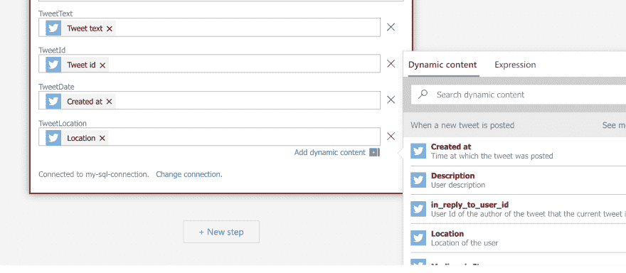](https://res.cloudinary.com/practicaldev/image/fetch/s--dhLgwiWK--/c_limit%2Cf_auto%2Cfl_progressive%2Cq_auto%2Cw_880/https://thepracticaldev.s3.amazonaws.com/i/fr1wf3oh3tpqmkswd9ky.png)

按下`Save`完成此操作。逻辑应用程序部分到此结束。

## 总结

第一部分到此结束，在下一部分我们将构建无服务器 API

[党](https://dev.to/azure/how-you-can-build-your-first-logic-app-2o85)