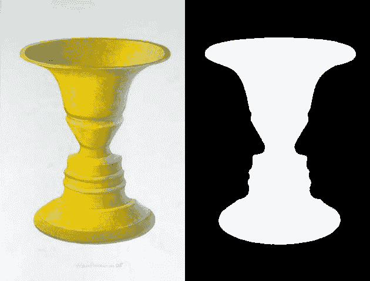

# 人类不是人类

> 原文：<https://dev.to/jeffisadams/human-not-human-3fee>

# 人类不是人类

所以当我脚踏实地的时候，我想我应该为凡人写一篇二进制分类的文章。我的重点是处理数据的细节，以及如何选择一个足够简单的问题来解决。

[](https://res.cloudinary.com/practicaldev/image/fetch/s--HwDOr_kO--/c_limit%2Cf_auto%2Cfl_progressive%2Cq_auto%2Cw_880/https://upload.wikimedia.org/wikipedia/commons/b/b5/Rubin2.jpg)

[鲁宾花瓶](https://en.wikipedia.org/wiki/Rubin_vase)

# 对凡人的二进制分类

碰巧的是，我最近在门廊上的树莓派上安装了一个固定位置的摄像头。我写了一些代码，当一个运动事件触发时给我发短信。然后每 20 分钟就有一条短信，上面有一只猫的照片。说真的，我家附近到处都是猫！

理解数据的使用和结构对于理解如何用 ML 解决问题是至关重要的。机器学习上可用的信息通常不能回答处理输入数据以解决问题所必须付出的努力的问题。

在我自己的学习过程中，我一直觉得我是从零开始的，因为开始编写模型是非常耗时的。数据科学中数据监管复杂性的全球解决方案是在模型输入结构中非常规范。这是一个合适的解决方案，但是，它隐藏了数据科学的不幸事实。数据科学的大部分是成为数字图书管理员和水管工。

## 处理数据——艰苦的工作

这项练习的主要内容是数据输入。有更酷的方法来进行预训练或进行无监督学习，但现有的数据集往往会隐藏在管理它们方面花费的工作量。`mnist.load_data()`的便利性是惊人的！然而，要解决针对特定数据集定制的问题，需要使用该特定数据集。这和你想象的一样无聊。此外，我还计算了人和车的数量，以便将来可以在这个数据集上尝试一些其他模型。我也开始数猫，但是猫太多了，所以我停止了(不是开玩笑)。

## 建立训练验证和测试数据集

我反复强调的关键要点是，任何神经网络的数据都是张量的矩阵或数组。或者任何你想描述我们要反向传播的数值的结构化集合的方式。很容易陷入需要特定目录结构或特定输入编码的例子中，但是只要您最终使用矩阵，就没问题。有很好的理由遵循标准，使用 Sagemaker 这样的烘焙系统进行培训将需要特定的输入结构，但我实际上建议从不是这样的起点做一个转换练习:

```
| data
    | train
    | test 
```

Enter fullscreen mode Exit fullscreen mode

在我的例子中，原始数据只是一个带有图像路径和几列分类数据的 csv。为了对输入模型进行训练验证和测试，我首先创建了输入矩阵和输出向量列表。

```
dataset = np.ndarray(shape=(len(data), target_height, target_width, channels), dtype=np.float32)
y_dataset = []
i=0

# Set of markers so I can create an lst for index, row in data.iterrows():
    y_dataset.append(row.human)
    img = load_img(basePath + '/' + row.filename, target_size=(target_height, target_width))
    x = img_to_array(img)
    x = x / 255.0
    dataset[i] = x
    i += 1 
```

Enter fullscreen mode Exit fullscreen mode

然后，我使用 sklearn train_test_split 随机生成训练和验证数据的群组。最后，我将验证分为验证和测试两部分。

```
x_train, x_val_test, y_train, y_val_test = train_test_split(dataset, y_dataset, test_size=0.4)

validation_length = int(len(x_val))
# Separate validation from test x_val = x_val_test[:validation_length]
y_val = y_val_test[:validation_length]

x_test = x_val_test[validation_length:]
y_test = y_val_test[validation_length:]

x_train.shape 
```

Enter fullscreen mode Exit fullscreen mode

## 模型

这个模型是`hello world`二元分类模型，增加了一些在当时看来不错的调整。我可以理解模型结构并理解其背后的数学基础，但是理解和演奏爵士乐之间有着天壤之别。我强烈推荐 [Cholet 的书](https://www.manning.com/books/deep-learning-with-python)作为梯度下降和支撑模型中发生的事情的链式法则的初级读本。我还调整了图像的大小，这样就降低了内存占用。这将训练时间减少了一个数量级。

```
model = Sequential()

model.add(Conv2D(32, (3, 3), activation='relu', input_shape=x_train[1,:].shape))
model.add(MaxPooling2D((2, 2)))

model.add(Conv2D(64, (3, 3), activation='relu'))
model.add(MaxPooling2D((2, 2)))

model.add(Conv2D(128, (3, 3), activation='relu'))
model.add(MaxPooling2D((2, 2)))

model.add(Conv2D(128, (3, 3), activation='relu'))
model.add(MaxPooling2D((2, 2)))

model.add(Flatten())
model.add(Dense(512, activation='relu'))
model.add(Dropout(0.5))
model.add(Dense(1, activation='sigmoid'))

model.compile(loss='binary_crossentropy',
              optimizer='rmsprop',
              metrics=['accuracy']) 
```

Enter fullscreen mode Exit fullscreen mode

## 为什么这种模式效果相对较好

这并不能作为人类的分类器。我的同事建议我们试试他的前门摄像头，我怀疑它的性能会很差。但重要的是，它解决了这个特定用例的一个实际问题，我真的没有花那么长时间，也没有那么多数据。

纯粹主义者会指责我过度拟合或其他数据完整性/偏差错误，但现在我可以成功地删除猫短信，我仍然充满热情。

## 没有 GPU 如何训练和游泳

我第一次跑这个的时候，是在笔记本电脑上训练的。这花费了大约 4 个小时的 4 个时期。所以我开始调查 Sagemaker 和 Kaggle。两者都提供令人惊叹的服务，但都有缺点。Kaggle 在如何加载自己的数据方面有些限制。Sagemaker 生产的笔记本功能强大，但价格昂贵，将数据存储到这些介质中是复杂性所在。我有本地笔记本和我在 Sagemaker 中使用的版本。

我的建议与我发现的 AWS 相关内容保持一致...如果你要去参加那个聚会，你最好把所有的 koolaide 都喝了。如果你试图进入 AWS 的世界，你会遇到他们锁定的每一个边缘案例。在这种情况下，我没有采纳自己的建议，最终把我的数据上传到了 S3，并把它放进了 Sagemaker 上的一个 Jupyter 笔记本里。

训练速度还算过得去，就花费的时间而言，网络似乎并没有造成太大的伤害。在 Sagemaker 中有更多规定的方法来创建培训工作，但那是以后的事了。如果我在数据构造方面更聪明一些，不需要将整个数据集作为一个列表加载到 ram 中，Kaggle 可能会成功。但是未来要知道的事情。总有新的东西要学。

```
batch_size=16
epochs=10

model.fit(x_train, y_train, batch_size=batch_size, epochs=epochs, verbose=1, validation_data=(x_val,y_val))
model.save('current_full.h5') 
```

Enter fullscreen mode Exit fullscreen mode

我用 797 张图片训练了第二遍。171 个验证图像和 171 个测试图像。这些人群是随机选择的。

## 模型评估

我用我放在一边的测试数据做了评估。以下是顶级结果。

*   损失:0 . 55650 . 38868688681
*   ACC:0 . 38650 . 38383838861

老实说，我仍然对如何解释结果有所感觉，但是通过编写一个批量流程脚本，我对结果感到非常满意。该脚本根据设定的阈值(80%的可能性是人为的)将目录中的文件复制到一组路径分类的图像中。这是一个很好的方式来彻底检查这个问题在将来如何被使用。

```
#!/usr/bin/env python
# coding: utf-8 
from keras.models import load_model
from keras.preprocessing.image import img_to_array, load_img

import os
from shutil import copyfile, rmtree
import sys

import numpy as np

def isHuman(filepath):
    img = load_img(filepath, target_size=(target_height, target_width))
    x = img_to_array(img)
    x = x / 255.0

    size = img.size

    dataset = np.ndarray(shape=(1, size[1], size[0], channels),dtype=np.float32)
    dataset[0] = x
    result = model.predict(dataset)
    return result[0][0]

# load the model model = load_model('../models/human_not_human.h5')

# Base values target_height = 180
target_width = 320
channels = 3

accept_threshold = 0.8

path = sys.argv[1]
print(path)

if not os.path.exists(path):
    raise Exception('`{}` does not exist or is not a directory'.format(path))

# Initialize the directory and ensure it's only our current version dstPath = './data/tested/'
if os.path.exists(dstPath):
    rmtree(dstPath)
os.makedirs(dstPath)
os.makedirs(os.path.join(dstPath, '0'))
os.makedirs(os.path.join(dstPath, '1'))
for f in os.listdir(path):
    if f.endswith('.jpg'):
        filepath = os.path.join(path, f)
        human = '1' if isHuman(filepath) > accept_threshold else '0'
        copyfile(filepath, os.path.join(dstPath, human, f)) 
```

Enter fullscreen mode Exit fullscreen mode

## 准备生产

一旦我训练好了模特。使用 Keras 保存和加载是非常简单的。我创建了两个`production`脚本。我可以传递一个 url 并得到一个预测。第二个函数迭代一个目录，并将它们复制到一个排序的目录结构中。这是完整的操作分类器脚本。

```
#!/usr/bin/env python
# coding: utf-8 from keras.models import load_model
from keras.preprocessing.image import img_to_array, load_img

import sys
from urllib.request import urlopen

import numpy as np

model = load_model('full.h5')

url = sys.argv[1]
print(url)

img = load_img(urlopen(url))
x = img_to_array(img)
x = x / 255.0

size = img.size
channels=3

dataset = np.ndarray(shape=(1, size[1], size[0], channels),dtype=np.float32)
dataset[0] = x
result = model.predict(dataset)

print(result[0][0]) 
```

Enter fullscreen mode Exit fullscreen mode

我还得把它连到相机上，所以现在我还能在手机上收到猫的通知。但是，我一直对这种全新的解决方案充满热情。

[](https://res.cloudinary.com/practicaldev/image/fetch/s--HJ6Lju2Q--/c_limit%2Cf_auto%2Cfl_progressive%2Cq_auto%2Cw_880/v1/./assets/cat.jpg)

## 链接

*   [用 Python 进行深度学习](https://www.manning.com/books/deep-learning-with-python)
    *   我怎么推荐这本书都不为过。
*   [图像内核可视化](http://setosa.io/ev/image-kernels/)
*   [关于数据管理你应该知道的一切](https://towardsdatascience.com/everything-a-data-scientist-should-know-about-data-management-6877788c6a42) = [卷积神经网络](https://towardsdatascience.com/a-comprehensive-guide-to-convolutional-neural-networks-the-eli5-way-3bd2b1164a53)