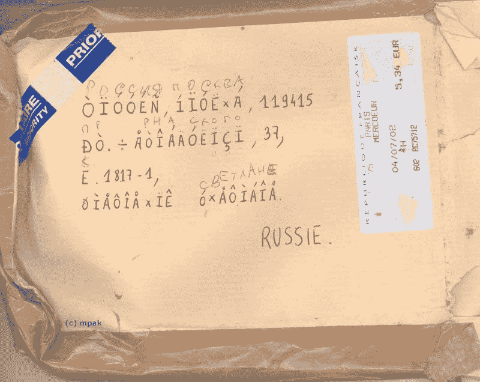

# 我做了一个调试字符编码问题的工具

> 原文：<https://dev.to/matmooredev/i-made-a-tool-for-debugging-character-encoding-problems-4246>

[我做了一个东西](https://github.com/MatMoore/string-inspector)！叫 string inspector，可以通过货，锈包管理器(`cargo install string-inspector`)安装。

# 它有什么作用

该工具获取一个字符串，以一种或多种字符编码对其进行解码，并打印出原始字节以下的字符(作为十六进制)。它看起来是这样的:

上面的例子显示了 UTF-8，但是您也可以将字符串解释为拉丁-1，我计划以后添加更多的字符编码。

注意:这目前只在 Unix 系统上有效；不支持 Windows。

# 我为什么做这个

我做这个部分是因为我想学习 rust，部分是因为我经常发现自己试图通过编写代码或使用调试器来调试文本数据，我只是想要一个可以粘贴文本的简单工具。

当我说“调试文本数据”时，我的意思是我想了解字符串是由什么数据组成的，而不是仅仅将它打印到屏幕上。

有时，字符串由什么字符组成并不明显，尤其是当您考虑来自不熟悉的书写系统的字符时。您可以获得不可见的字符、相互组合产生单个“字素”的字符以及改变文本方向的字符。这些事情[会给应用程序带来问题](https://knowyourmeme.com/memes/zalgo)。

如果我正在处理一个只影响某些输入的奇怪的 bug，我想尽快排除的一件事是，它里面是否有任何不寻常的字符，仅仅看着它可能不明显。如果有，那么那些字符是什么？看起来像撇号的东西实际上是[右单引号](https://www.fileformat.info/info/unicode/char/2019/index.htm)吗？或者也许我的同事正在通过用希腊问号替换我所有的分号[来戏弄我？](https://twitter.com/spontifixus/status/535033916030464000?lang=en)

更糟糕的是，当你处理的代码会产生混乱的文本，也就是 [mojibake](https://en.wikipedia.org/wiki/Mojibake) 。

当您以一种字符编码(如 ISO 8859-1)对文本进行编码，并将其解释为以另一种编码(如 UTF-8)进行编码时，就会发生这种情况。

有一个很好的 mojibake 的例子，有人用胡言乱语的拉丁字符写下了一个俄罗斯地址，一名邮政工作人员尽职尽责地将其翻译回西里尔字符:

 
来源:[用 Unicode 编程](https://unicodebook.readthedocs.io/definitions.html#mojibake)

在英语中，当代码这样做时就不那么明显了，因为英语文本主要使用 ASCII 字符集(128 个字符，包括英语键盘上的大多数符号)的一部分。许多西方字符集是 ASCII 的扩展，UTF-8 的目标之一是与 ASCII 互操作，所以大多数时候草率的文本处理仍然有效。

但是 ASCII 不包含你在英语文本中能找到的所有符号。由于我是英国人，我经常看到英镑符号( )被弄得乱七八糟，因为不同的字符编码对它的处理不同。我觉得如果能看到实际的字节就更容易调试了。如果你知道在有效的 UTF-8 中应该是`0xc2 0xa3`,你可以检查你的字符串是否真的是这样编码的。

有很多智能猜测字符编码的工具，当我开始这个项目时，我查看了其中的一些。通常他们使用统计分析，在猜测编码的同时猜测文本的语言。但这实际上是为长文档设计的，而不是短的文本片段，因为我的工具是面向调试的，所以我想帮助用户理解文本是如何编码的，而不是说出可能是错误的猜测。

# 接下来是什么？

如果你觉得这个工具有用，请告诉我！

最初的版本只是一个概念验证，所以我预计它会有一点问题。我想做的下一件事是[让它更可靠](https://github.com/MatMoore/string-inspector/projects/2)。

这意味着增加更多的测试，并投入大量奇怪的输入来看看会发生什么。如果您了解 rust，请随意贡献 PRs！我还在继续思考。

假设我做到了这一点，然后我想探索该工具可以帮助识别英文文本中的 mojibake 的方法。例如，如果有一个字节序列，你可以通过[双重编码 UTF-8](http://blogs.perl.org/users/chansen/2010/10/coping-with-double-encoded-utf-8.html) 得到，也许它可以暗示原始字符串是什么？