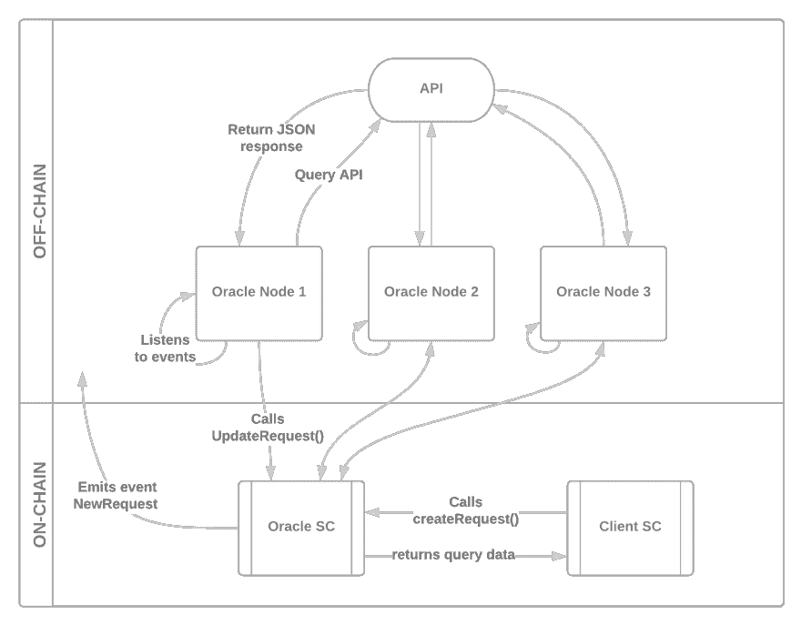

# 在以太坊上实现区块链 Oracle

> 原文：<https://dev.to/pedroduartecosta/implementing-a-blockchain-oracle-on-ethereum-56bp>

TLDR: 在这篇文章中，我将解释如何构建一个以太坊自托管区块链先知。该服务将根据智能合同的请求查询 API，并添加有关区块链的信息。所描述的方法允许部署相同 oracle 的多个竞争方对结果有相同的发言权。但是可以很容易地转换成一个简单的 oracle 来为一个利益相关者服务。

## 背景

以太坊中的智能合约可以支持广泛的应用，然而，由于区块链的性质，智能合约缺乏一个基本功能:*互联网连接*。

### 为什么？你可能会问

以太坊区块链被设计为完全确定性的，这意味着如果有人下载了整个网络历史并重放它，他们应该总是以相同的状态结束。确定性是必要的，以便节点可以达成共识。

然而，互联网是不确定的，在某个时间点查询一个 API 的智能合约，不能保证以后查询同一个 API 会得到相同的结果。web 上的 API 和数据会发生变化。因此，智能合约本质上缺乏连通性。

### 如此神谕对吗？

神谕这个名字来源于这样一个事实，从历史上讲，神谕是真理的来源。这就是我们所需要的。

Oracles 是在区块链上插入数据以供智能合约使用的服务。通过将具有所需信息的交易添加到区块链，智能合约可以运行并总是获得相同的信息，因为它正在从区块链检索该信息。

## 解

我们将创建一个 oracle 服务，它可以查询 JSON APIs 并从 API 响应中检索单个值。oracle 将保存所有的请求和回答，并将拥有一组预定义的利益相关者。

这些是运行 node.js 服务的帐户，该服务查询 API 并向 oracle 返回响应。oracle 还具有它必须接收的最小数量的相等响应，以便确认所提供的答案是有效的。

这样，如果竞争方依靠神谕来强化他们的合同，而其中一方(节点)变得不守规矩或试图操纵结果，这是不可能的，因为他们同意了预先定义的相等答案的法定人数。

## 建筑

这个预言将由两部分组成。链上 oracle(智能契约)和链下 oracle 服务(node.js 服务器)。

on-chain oracle 是一个智能契约，它有一个公共函数 *createRequest* ，该函数接收要查询的 URL 和要检索的属性。然后，启动一个事件来警告离线 oracle 有新的请求。

离线 oracle 由不同方部署的几个 node.js 服务组成，这些服务将查询 API 并向契约返回响应。

然后，链上 oracle 验证是否达到了相等响应的最小数量，如果达到了，则发出一个事件，表明它已经就该值达成了共识，以便查询 oracle 的客户端智能合约知道它已经得到了响应。

[](https://res.cloudinary.com/practicaldev/image/fetch/s--WlDh3FOH--/c_limit%2Cf_auto%2Cfl_progressive%2Cq_auto%2Cw_880/https://thepracticaldev.s3.amazonaws.com/i/xtjqcwdzgcgalvjrm0r8.png)

## 链上 Oracle 实施

我们用商定的条款定义 oracle 契约:最小法定人数和 Oracle 总数。在这个例子中，有三个利益相关者，为了达成共识，三个中的两个必须提供相同的答案。

```
pragma solidity >=0.4.21 <0.6.0;

contract Oracle {
  Request[] requests; //list of requests made to the contract
  uint currentId = 0; //increasing request id
  uint minQuorum = 2; //minimum number of responses to receive before declaring final result
  uint totalOracleCount = 3; // Hardcoded oracle count

} 
```

然后我们添加请求结构，它将保存请求:

```
 // defines a general api request
  struct Request {
    uint id;                            //request id
    string urlToQuery;                  //API url
    string attributeToFetch;            //json attribute (key) to retrieve in the response
    string agreedValue;                 //value from key
    mapping(uint => string) anwers;     //answers provided by the oracles
    mapping(address => uint) quorum;    //oracles which will query the answer (1=oracle hasn't voted, 2=oracle has voted)
  } 
```

现在我们可以创建公共函数 *createRequest* ，客户端智能契约(任何想要使用 oracle 服务的契约)将调用该函数:

```
function createRequest (
    string memory _urlToQuery,
    string memory _attributeToFetch
  )
  public
  {
    uint lenght = requests.push(Request(currentId, _urlToQuery, _attributeToFetch, ""));
    Request storage r = requests[lenght-1];

    // Hardcoded oracles address
    r.quorum[address(0x6c2339b46F41a06f09CA0051ddAD54D1e582bA77)] = 1;
    r.quorum[address(0xb5346CF224c02186606e5f89EACC21eC25398077)] = 1;
    r.quorum[address(0xa2997F1CA363D11a0a35bB1Ac0Ff7849bc13e914)] = 1;

    // launch an event to be detected by oracle outside of blockchain
    emit NewRequest (
      currentId,
      _urlToQuery,
      _attributeToFetch
    );

    // increase request id
    currentId++;
  } 
```

这个功能包含了利益相关者之间协议的一个重要部分。被信任参与最终解决方案的帐户的地址。并将发出事件， *NewRequest* ，该事件将被离线的 oracles 监听。

```
 //event that triggers oracle outside of the blockchain
  event NewRequest (
    uint id,
    string urlToQuery,
    string attributeToFetch
  ); 
```

一旦听到这个事件(我将在下面解释这一部分),离线的 oracles 将调用公共函数 *updateRequest* 。

```
//called by the oracle to record its answer
  function updateRequest (
    uint _id,
    string memory _valueRetrieved
  ) public {

    Request storage currRequest = requests[_id];

    //check if oracle is in the list of trusted oracles
    //and if the oracle hasn't voted yet
    if(currRequest.quorum[address(msg.sender)] == 1){

      //marking that this address has voted
      currRequest.quorum[msg.sender] = 2;

      //iterate through "array" of answers until a position is free and save the retrieved value
      uint tmpI = 0;
      bool found = false;
      while(!found) {
        //find first empty slot
        if(bytes(currRequest.anwers[tmpI]).length == 0){
          found = true;
          currRequest.anwers[tmpI] = _valueRetrieved;
        }
        tmpI++;
      }

      uint currentQuorum = 0;

      //iterate through oracle list and check if enough oracles(minimum quorum)
      //have voted the same answer has the current one
      for(uint i = 0; i < totalOracleCount; i++){
        bytes memory a = bytes(currRequest.anwers[i]);
        bytes memory b = bytes(_valueRetrieved);

        if(keccak256(a) == keccak256(b)){
          currentQuorum++;
          if(currentQuorum >= minQuorum){
            currRequest.agreedValue = _valueRetrieved;
            emit UpdatedRequest (
              currRequest.id,
              currRequest.urlToQuery,
              currRequest.attributeToFetch,
              currRequest.agreedValue
            );
          }
        }
      }
    }
  } 
```

该功能将首先检查呼叫者是否是预定义地址之一。然后，它将检查甲骨文没有投票，如果是这样，它将保存甲骨文的答案。那么它将检查该回答是否已经由至少所需的最小法定人数提供。如果是这样，那么我们已经就一个结果达成一致，并将发出一个事件 *UpdatedRequest* ，将结果通知给客户端契约。

```
 //triggered when there's a consensus on the final result
  event UpdatedRequest (
    uint id,
    string urlToQuery,
    string attributeToFetch,
    string agreedValue
  ); 
```

在这里你可以找到完整的 oracle 代码以及如何使用 truffle 创建样板文件的说明。

## 链外 Oracle 实现

这是比较简单的部分，它是任何可以监听发出的区块链并查询 API 的服务。

它使用 web3 监听链上 oracle 上的事件，查询请求的 API，解析检索到的 JSON 以获得请求的键，并调用公共函数 *updateRequest* 。

因为这不是本文的重点，而且这是一个简单的服务，所以我不会深入讨论离线服务的实现细节。

[在这里](https://github.com/pedroduartecosta/ethereum-oracle/tree/master/off-chain-oracle)您可以找到应该由所有利益相关者部署的服务代码。

## 总结归纳

这种实现允许不依赖于作为唯一查询 API 的一方的单一方作为事实的来源，而是让多方就结果达成一致。它也是一个非常灵活的服务，因为它可以查询任何公共的 JSON API，允许在过多的用例中使用。

所有的代码都可以在这里找到[。](https://github.com/pedroduartecosta/ethereum-oracle)

# 👋感谢阅读！