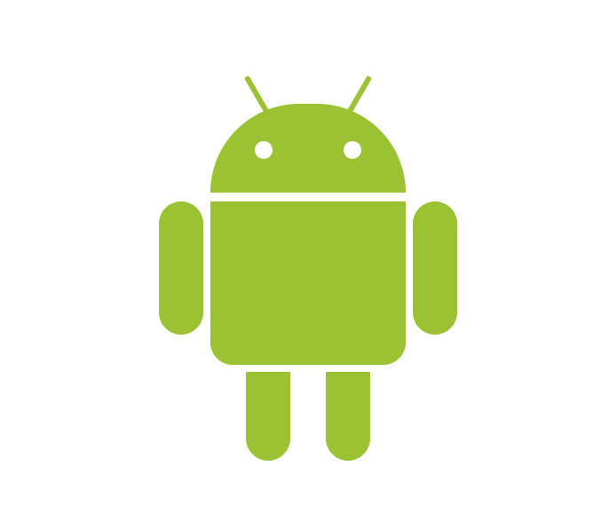
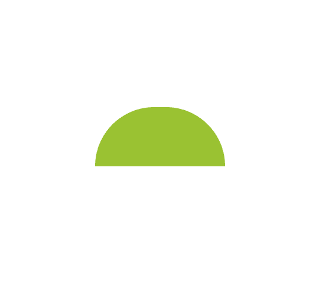
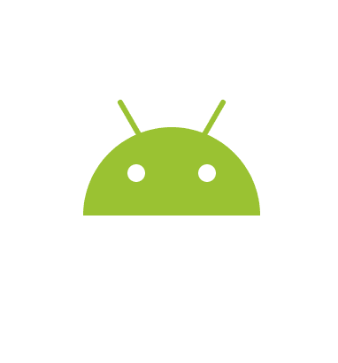

# 用 HTML 和 CSS 实现 Android 徽标

> 原文：<https://dev.to/nedyudombat/implementing-the-android-logo-with-html-and-css-29jh>

在本文中，我们将只使用 HTML 和 CSS 实现 android 徽标。这可能看起来像一吨的工作，但我们将通过它一步一步。我会尽量解释清楚。

我会在本文末尾分享一个 Github 上代码库的链接。

[](https://res.cloudinary.com/practicaldev/image/fetch/s--H40ocFOu--/c_limit%2Cf_auto%2Cfl_progressive%2Cq_auto%2Cw_880/https://res.cloudinary.com/nedy123/image/upload/v1560565889/Screenshot_2019-06-15_at_3.28.03_AM_hij9sw.png)

让我们首先创建一个名为`index.html`的简单 html 文件，其中包含这段代码。

```
<!DOCTYPE html>
  <html lang="en">

  <head>
    <meta charset="UTF-8">
    <meta name="viewport" content="width=device-width, initial-scale=1.0">
    <meta http-equiv="X-UA-Compatible" content="ie=edge">
    Android Logo
  </head>

  <body>
    <div class="android">
        <div class="head">
          <div class="left_antenna"></div>
          <div class="right_antenna"></div>
          <div class="left_eye"></div>
          <div class="right_eye"></div>
        </div>
        <div class="body">
          <div class="left_arm"></div>
          <div class="right_arm"></div>
          <div class="left_leg"></div>
          <div class="right_leg"></div>
        </div>
    </div>
  </body>

</html> 
```

这种标记很容易理解。腿在身体部分似乎很奇怪，但是不要担心，随着我们的进展，你会理解这个概念的。

接下来:创建一个`index.css`文件，并将其链接到您的`index.html`文件。

```
<link rel="stylesheet" href="index.css"> 
```

此时，用户界面上没有显示任何内容，因为标记元素没有内容。

让我们从垂直和水平居中对齐机器人开始。我们将通过使用 flex box 来实现这一点。
做:

*   给文档主体一个`100vh`的`height`。这会将正文的高度设置为当前查看页面的设备的高度。垂直对齐徽标也需要 height 属性。
*   将文档主体的`display`属性设置为`flex`。此属性设置灵活项目的灵活长度。这使我们能够设置其他 flex 属性。
*   将 body 的`justify-content`属性设置为`center`。默认情况下，一些 html 元素占据了其父元素 100%的宽度。此属性设置元素沿水平轴的位置。
*   将 body 的`align-items`属性设置为`center`。设置高度后，所有子元素将垂直定位到视图的中心。
*   将 div 中所有 div 的位置设置为`relative`，将其背景设置为`#A4CA39`

此时，您的`index.css`文件应该看起来像这样

```
body {
    align-items: center;
    display: flex;
    height: 100vh;
    justify-content: center;
}

div div {
    background: #a4ca39;
    position: relative;
} 
```

我们已经设置好了我们的布局，如果你试图在你的浏览器中访问它，你将看不到任何东西，只有一个空白。事不宜迟，让我们深入研究 android 风格

我们将从设计 android 本身开始
Do:

*   将 android 类(`.android`)的宽度和高度分别设置为`340px`和`400px`。

然后，我们将设计我们的 android 徽标的头部样式
Do:

*   将头级(`.head`)的宽度和高度分别设置为`200px`和`100px`。
*   将 top 属性设置为`32px`，为天线腾出空间。
*   为了实现机器人头部的半圆形，我们将把 border-radius 属性设置为`220px 220px 0 0`。这将分别设置头部左上、右上、右下和左下的边界半径。我们在这里使用了一个简写属性，我们也可以使用`border-top-left-radius, border-top-right-radius`等等。

在这一点上，我们应该有一个有点半圆形的头，我们的 android 标志弹出来，像这样
[](https://res.cloudinary.com/practicaldev/image/fetch/s--BT-sBv55--/c_limit%2Cf_auto%2Cfl_progressive%2Cq_auto%2Cw_880/https://res.cloudinary.com/nedy123/image/upload/v1560622692/Screenshot_2019-06-15_at_7.17.59_PM_meufkk.png)

> 等待 css 代码？不，抱歉，我现在还不能给你。试着跟着做，看看你能正确理解多少，这会让你的学习体验更好。

让我们继续吧

## 接下来是我们机器人的眼睛和天线

### 眼睛

对于相似之处，请执行以下操作:

*   将双眼的背景色设置为白色。
*   将宽度和高度设置为`20px`。
*   将 position 属性设置为 absolute，这样我们就可以将它移动到我们想要的位置。
*   将 top 属性设置为`42px`。
*   并将边界半径设置为`100%`。

对于差异，请执行以下操作:

*   将左眼的 left 属性设置为`50px`。
*   将右眼的 right 属性设置为`50px`。

### 天线

对于相似之处，请执行以下操作:

*   将宽度和高度设置为`6px`和`50px`。
*   将 position 属性设置为 absolute，这样我们就可以将它移动到我们想要的位置。
*   将 top 属性设置为`-34px`。
*   并将边界半径设置为`3px`。

对于差异，请执行以下操作:

*   将左侧天线的左侧属性设置为`50px`，并将其旋转-30 度
*   将右天线的 right 属性设置为`50px`，并将其旋转 30 度

在这一点上，我们应该有我们的 android 标志的头看起来像这样
[](https://res.cloudinary.com/practicaldev/image/fetch/s--hjLhVled--/c_limit%2Cf_auto%2Cfl_progressive%2Cq_auto%2Cw_880/https://res.cloudinary.com/nedy123/image/upload/v1560632862/Screenshot_2019-06-15_at_10.07.26_PM_nhhf6e.png)

## 接下来是身体

这实际上是更简单的部分，因为它只是一个矩形，我们可以像处理头部一样处理边界半径属性。
对于 android 徽标的主体，请执行以下操作:

*   将宽度和高度分别设置为`200px`和`184px`。
*   将 top 属性设置为 42px。
*   将边界半径设置为`0 0 25px 25px`。

在这一点上，我们应该有我们的 android 标志的头看起来像这样
[](https://res.cloudinary.com/practicaldev/image/fetch/s--eo4AStDx--/c_limit%2Cf_auto%2Cfl_progressive%2Cq_auto%2Cw_880/https://res.cloudinary.com/nedy123/image/upload/v1560635108/Screenshot_2019-06-15_at_10.44.56_PM_uj3xsc.png)

是啊，是啊，露出那灿烂的笑容。

## 接下来是胳膊和腿

胳膊和腿有一些相似之处，看它们做什么:

*   将双臂和双腿的宽度设置为`50px`。
*   将位置设置为绝对。

对于手臂的相似性，做:

*   将高度设置为`150px`。
*   将边界半径设置为`25px`。

两臂的区别在于，它们应该被拉离身体两侧`58px`。

对于腿的相似性，做:

*   将高度设置为`100px`，因为徽标上的腿比手臂短。
*   将边界半径设置为`0 0 25px 25px`。
*   将 top 属性设置为`192px`。这将把腿拉到身体下方，同时在它们之间增加一点空间。

两条腿的区别在于，它们应该从身体两侧拉进`40px`。

## 乌拉，看看我们的安卓标志

[](https://res.cloudinary.com/practicaldev/image/fetch/s--HjEAgtBK--/c_limit%2Cf_auto%2Cfl_progressive%2Cq_auto%2Cw_880/https://res.cloudinary.com/nedy123/image/upload/v1560635852/Screenshot_2019-06-15_at_10.57.19_PM_z9vveg.png)

此时，您的`index.css`应该是这样的:

```
body {
  height: 100vh;
  display: flex;
  justify-content: center;
  align-items: center;
}

div div {
  background: #A4CA39;
  position: relative;
}

.android {
  height: 400px;
  width: 340px;
}

.head {
  width: 200px;
  height: 100px;
  top: 32px;
  border-radius: 220px 220px 0 0;
}

.left_eye,
.right_eye {
  background: #fff;
  width: 20px;
  height: 20px;
  position: absolute;
  top: 42px;
  border-radius: 100%;
}

.left_eye {
  left: 50px;
}

.right_eye {
  right: 50px;
}

.left_antenna,
.right_antenna {
  width: 6px;
  height: 50px;
  position: absolute;
  top: -34px;
  border-radius: 3px;
}

.left_antenna {
  left: 50px;
  transform: rotate(-30deg);
}

.right_antenna {
  right: 50px;
  transform: rotate(30deg);
}

.body {
  width: 200px;
  height: 184px;
  top: 42px;
  border-radius: 0 0 25px 25px;
}

.left_arm,
.right_arm,
.left_leg,
.right_leg {
  width: 50px;
  position: absolute;
}

.left_arm,
.right_arm {
  height: 150px;
  border-radius: 25px;
}

.left_leg,
.right_leg {
  height: 100px;
  top: 192px;
  border-radius: 0 0 25px 25px;
}

.left_arm {
  left: -58px;
}

.right_arm {
  right: -58px;
}

.left_leg {
  left: 40px;
}

.right_leg {
  right: 40px;
} 
```

下面是 github 上的资源库链接

## [【nedyudambat】](https://github.com/NedyUdombat)/[Android 标志](https://github.com/NedyUdombat/Android-Logo)

### 用纯 css 和 html 制作的 Android Logo

<article class="markdown-body entry-content p-5" itemprop="text">

# 安卓标志

这是一个用 HTML 和 CSS 构建的 Android 标志

链接到[界面](https://nedyudombat.github.io/Android-Logo/)

</article>

[View on GitHub](https://github.com/NedyUdombat/Android-Logo)

以及完整的[预览](https://nedyudombat.github.io/Android-Logo/)

请随意分享。非常欢迎评论和更正。