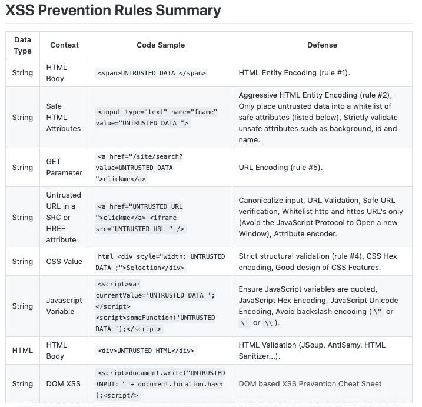

# 。innerHTML 跨站点脚本

> 原文：<https://dev.to/caffiendkitten/innerhtml-cross-site-scripting-agc>

## [T1。innerHTML？？](#innerhtml)

。innerHTML 是一个 JavaScript 标签，其属性用于 DOM 操作。更具体地说，它“设置或返回元素的 HTML 内容(内部 HTML)”(1)

```
const item = document.getElementById("exampleIdName").innerHTML = "Something had changed!"; 
```

Enter fullscreen mode Exit fullscreen mode

通常，此属性用于检查页面的当前 HTML 源代码，包括自页面最初加载以来所做的任何更改。但是，它也可以用于跨站点脚本(XSS)。

## 跨站脚本(XSS)

XSS 是一种将恶意脚本注入受信任网站的攻击。当攻击者使用 web 应用程序向不同的终端用户发送恶意代码(通常以浏览器端脚本的形式)时，就会发生 XSS 攻击(2)
当攻击者使用 XSS 向不知情的用户发送恶意脚本时，最终用户的浏览器无法知道该脚本不应被信任，并将执行该脚本。因为它认为脚本来自一个可信任的来源，恶意脚本可以访问任何 cookies、会话令牌或其他由浏览器保留并用于该站点的敏感信息。而且，这些脚本甚至可以重写 HTML 页面的内容。”(2)

## [T1。innerHTML 和安全性](#innerhtml-and-security)

使用。innerHTML 仍然是用于编辑网页上的项目的一种相当常见的做法，因为设置。innerHTML 让您可以轻松地用新内容替换元素的现有内容。(3)但是，由于这种方式。innerHTML 可以将文本和元素添加到网页中，它可以很容易地被操纵，以在其他 HTML 元素标记中显示潜在的不需要或有害的元素。不幸的是，允许 XSS 攻击成功的“缺陷”。innerHTML 非常普遍，出现在 web 应用程序使用用户输入的任何地方。

```
item.innerHTML = name;     // harmless in this case
// ...
name = "<script>alert('I am John in an annoying alert!')</script>";
item.innerHTML = name;     // harmless in this case
---
const name = "";
el.innerHTML = name; // shows the alert 
```

Enter fullscreen mode Exit fullscreen mode

[](https://res.cloudinary.com/practicaldev/image/fetch/s--yjGNhxEN--/c_limit%2Cf_auto%2Cfl_progressive%2Cq_auto%2Cw_880/https://thepracticaldev.s3.amazonaws.com/i/wflpn7zfb4zj2wodcwjv.png)

## 阻止 XSS 取道。innerHTML

OWASP 组织给出了一些规则，可以帮助 guid 防止 XSS (5)，但是这些规则不允许绝对自由地将不受信任的数据放入 HTML 文档。
这些规则应该涵盖绝大多数常见的用例，但浏览器中有一个内置的保护措施，因为仅仅注入一个脚本元素不会使你受到攻击，因为 DOM 的这一部分已经被解析和运行了。
[](https://res.cloudinary.com/practicaldev/image/fetch/s--Fnqw67vo--/c_limit%2Cf_auto%2Cfl_progressive%2Cq_auto%2Cw_880/https://thepracticaldev.s3.amazonaws.com/i/g1nanozthwfy8gfuu7qn.jpg) 
最好的预防方法。innerHTML XSS 验证用户输入或对其进行编码，并使用 innerText 代替。尽可能使用 innerHTML。此外，“如果您的项目将接受任何形式的安全审查，使用 innerHTML 很可能会导致您的代码被拒绝。例如，如果您在浏览器扩展中使用 innerHTML，并将该扩展提交给 addons.mozilla.org，它将无法通过自动审查过程。”(3)

## 使用安全吗

的“安全性”。innerHTML 属性是有争议的，取决于它的用途。如果它插入用户提供的值，这是一个安全问题，但是如果您使用它来插入静态数据，或者在不包含任何用户输入的情况下生成的数据，这不是一个安全问题。为了最好地确保安全性，对页面上的任何用户数据进行编码或“净化”总是一个好的做法。

#### 资源

1.  [https://www.w3schools.com/jsref/prop_html_innerhtml.asp](https://www.w3schools.com/jsref/prop_html_innerhtml.asp)
2.  [https://www . owasp . org/index . PHP/Cross-site _ Scripting _(XSS)](https://www.owasp.org/index.php/Cross-site_Scripting_(XSS))
3.  [https://developer . Mozilla . org/en-US/docs/Web/API/Element/innerHTML](https://developer.mozilla.org/en-US/docs/Web/API/Element/innerHTML)
4.  [https://www.youtube.com/watch?v=1UsllDMhvN4](https://www.youtube.com/watch?v=1UsllDMhvN4)
5.  [https://github . com/OWASP/Cheat sheetseries/blob/master/Cheat sheets/Cross _ Site _ Scripting _ Prevention _ Cheat _ sheet . MD](https://github.com/OWASP/CheatSheetSeries/blob/master/cheatsheets/Cross_Site_Scripting_Prevention_Cheat_Sheet.md)

###### 请注意，我是学生，还在学习。如果我说的不正确，请告诉我。我很想了解更多我可能不完全了解的东西。