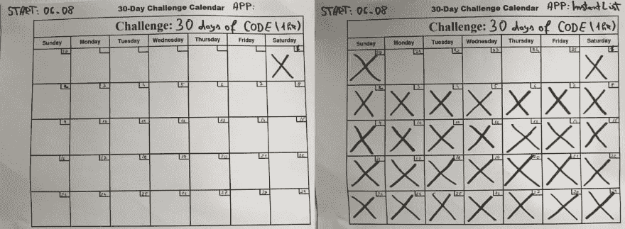

# #30DaysOfCode 的见解、经验和后续步骤

> 原文：<https://dev.to/robertistok/insights-learnings-and-the-next-steps-of-30daysofcode-4hco>

* * *

第 1 天→第 30 天——想象进步是养成习惯的关键因素

* * *

*如果你错过了我的* [*上一篇*](https://medium.com/@robertistok/announcing-30-days-of-code-2ea5a129d9b5) *，六月初我承诺每天下班后至少花一个小时写代码，坚持 30 天。*

* * *

已经一个月了，时间过得真快。我做到了，在过去的一个月里，我每天至少花一个小时在个人项目上。这是一种难以置信的感觉，我非常高兴我完成了这个挑战。

### 获得的数值

*   工作之外的编码和我的副业感觉很正常，不需要额外的努力。
*   很多关于使用 [NextJS](https://nextjs.org) 、 [Prisma](https://prisma.io) 和 [Todoist](https://developer.todoist.com/sync/v8/) API 的知识。
*   一个几乎现成的应用程序，我可以存储我做的食物的所有食谱，并更有效地构建购物清单。我计划向公众发布这个应用程序，稍后会有更多的介绍。

### 学问

*   最好在早上完成我的日常目标，然后我就可以享受一个没有压力的下午。当你只是想和朋友出去玩的时候，早点回家，因为你没有达到每天的目标，这并不好玩。
*   对抗拖延症的最好方法就是开始并坚持 15 分钟。一段时间后，我再也不想放弃我正在做的事情，回到 YouTube 上
*   一旦我开始做事，我倾向于得到越来越多关于可能项目的想法。这里的关键是知道我的优先事项，完成我开始的项目，并对我的想法做很多笔记。
*   假设我有时间，我几乎可以开发任何我想要的东西，这是一个他妈的好位置。搔搔自己的痒处，解决自己的问题可能是获得新项目的第一位置。
*   公开承诺是保持正轨和完成工作的一个极好的方法，即使你不想做。没有人想丢脸，尤其是在数百人面前，对吧？

### 结论和下一步

很有趣，我很难过它已经结束了。

但它并不一定要结束，为什么不延长它，并从中获得更多的好处呢？

所以从今天开始，我会继续用 [*#100DaysOfCode*](https://www.100daysofx.com/) 。与前一个挑战相同的规则，每天工作之外至少 1 小时的编码，并在社交媒体上发布我的更新。这将会更加艰难，因为在接下来的 3 个月里会发生很多事情，但是我已经准备好迎接挑战了💪🏻。

你想加入我吗？这很有趣，好处也很多！

* * *

感谢阅读，并订阅不要错过我未来的任何帖子！🙏

### 关于作者

Robert 是一名全栈 web 开发人员，目前在[related](https://bit.ly/2WQyMOn)工作。他喜欢激励人们，探索新的地方，阅读伟大的书籍，拍摄鼓舞人心的照片，并一直学习新的东西。

在 [LinkedIn](https://bit.ly/2OMrsAp) 、 [Instagram](https://bit.ly/2TQxvVu) 、 [GitHub](https://bit.ly/2Vk7Fup) 、 [Goodreads](https://bit.ly/2HYH9DQ) 或者在 [Medium](https://bit.ly/2HYayho) 上关注他。