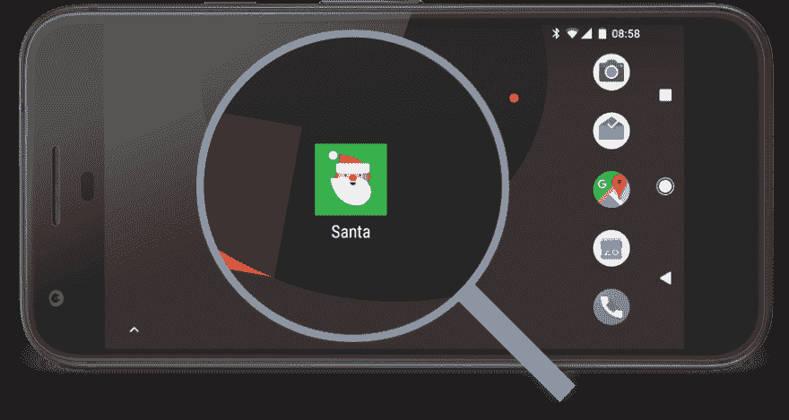
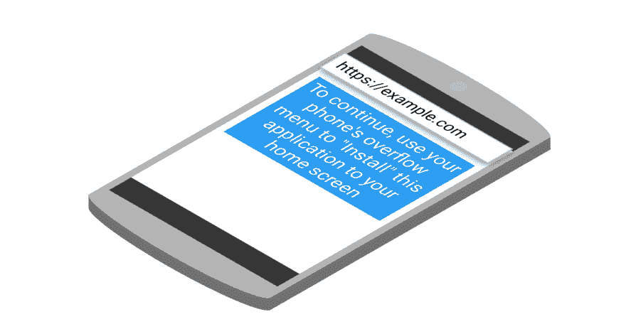

# 安装此 PWA 以继续

> 原文：<https://dev.to/samthor/install-this-pwa-to-continue-mea>

在运行 iOS 11.3+和现代 Chrome 的移动设备上——因此，基本上西方世界的每个人——你都可以在手机的主屏幕上添加一个 PWA。这是一个伟大而令人钦佩的目标，但实现这个目标可能具有挑战性。🤔

[](https://res.cloudinary.com/practicaldev/image/fetch/s--ohOH4ZGn--/c_limit%2Cf_auto%2Cfl_progressive%2Cq_auto%2Cw_880/https://developers.google.com/web/showcase/20img/santa/phone.png)

# 如果...

如果你*坚持*你的用户在收到你的应用之前做这个动作会怎么样？这**永远不会**对内容站点有意义:维基、新闻文章等，老实说，在许多情况下这可能是一种反模式；但它*可能*适用于以下情况:

*   比赛
*   “类似应用”的体验
*   作为用户，您被锁定的工具(比如，您公司的费用报告应用程序)。

最后一个案例特别有意思。通过让你的用户通过网络“安装”应用程序，你可能实际上免除了一些 FUD，比如“哦，它一定是一个应用程序”。

[](https://res.cloudinary.com/practicaldev/image/fetch/s--PylxppJK--/c_limit%2Cf_auto%2Cfl_progressive%2Cq_auto%2Cw_880/https://thepracticaldev.s3.amazonaws.com/i/ewnhagfk4weezt9c1ket.png)

## 实现理论

有几种方法可以检测已安装的 PWA。在 iOS 上，这很简单:我们可以寻找`navigator.standalone`属性:当一个页面从主屏幕启动时，它是*真实的*。

在 Android 上，我们有几个选项。第一种，也是最简单的一种，是配置站点安装时加载的 URL。如果你正在构建一个 PWA，你将有一个 [Web 应用清单](https://developer.mozilla.org/en-US/docs/Web/Manifest)——通常被命名为`manifest.json`或`manifest.webmanifest`。当用户被提示安装你的 PWA 时，进入主屏幕的 URL 实际上是由`start_url`字段设置的:

```
{
  "name": "You Must Install!",
  "short_name": "Installed!",
  "display": "standalone",
  "start_url": "/?homescreen=1",  // set a query we can detect
  ...
} 
```

Enter fullscreen mode Exit fullscreen mode

第二个选择是，如果你的网站是`display: standalone`——它移除了地址栏，给你的 PWA 一个类似应用的体验——你可以通过 CSS 检查这一点。

## 在实践中实现

我们最终的 JS 方法如下所示:

```
function isInstalled() {
  if (navigator.standalone) {
    return true;  // iOS
  }
  if (window.matchMedia('(display-mode: standalone)').matches) {
    return true;  // Android with "display": "standalone" in Manifest
  }
  if (new URL(window.location).searchParams.has('homescreen')) {
    return true;  // fallback to check for "?homescreen=1"
  }
  return false;
} 
```

Enter fullscreen mode Exit fullscreen mode

现在，您可以使用这种方法来控制站点加载，并坚持让用户*在继续之前安装*。

## 现实顾虑

在这两个主要平台上，我们不能真正强制安装提示，或者知道我们可以通过按钮或用户交互可靠地触发它的流程。

在 iOS 上，这(截至 2019 年)在技术上根本不可能。

在 Android 上，参与度指标用于提示用户安装，你的网站也可以使用 [`onbeforeinstallprompt`](https://developer.mozilla.org/en-US/docs/Web/API/Window/onbeforeinstallprompt) 来更好地控制提示。

这个指标非常有用。作为网络用户，我们知道没完没了的“允许通知”提示令人非常沮丧。添加“安装”提示，没有任何接合控制，只会火上浇油。🔥

归结起来就是，在这两个平台上，这整个提议将迫使你显示一条消息，说“在使用前点击你的平台的用户界面来‘安装’”。因此，我们的思维实验虽然有趣，但可能不实用。👎

# 感谢

谢谢你和我一起踏上这段旅程！💭

Fourteen