# 安装 Linux

> 原文：<https://dev.to/th3n00bc0d3r/installing-linux-5d9e>

伟大的家伙，让我们准备好享受什么是真正的 linux。在试验安装了多达 8 个发行版之后，我特意选择了 System76 的 PopOS。目的是选择一个分布，它将支持最小的最简单的原则，在此基础上概念可以被制造，因为一旦你简化事物，可能性开始旋转。

插入 Linux 的 USB 接口，重启你的电脑，或者打开电脑，开始按 F12 键或者 F8 键来打开启动菜单。一旦启动菜单出现，选择你的 USB。

现在你将被带到一个屏幕上，让我们按下回车键并尝试或安装 Pop_OS。

现在，这个奇特的 prodev 文本开始运行，它被称为终端。

[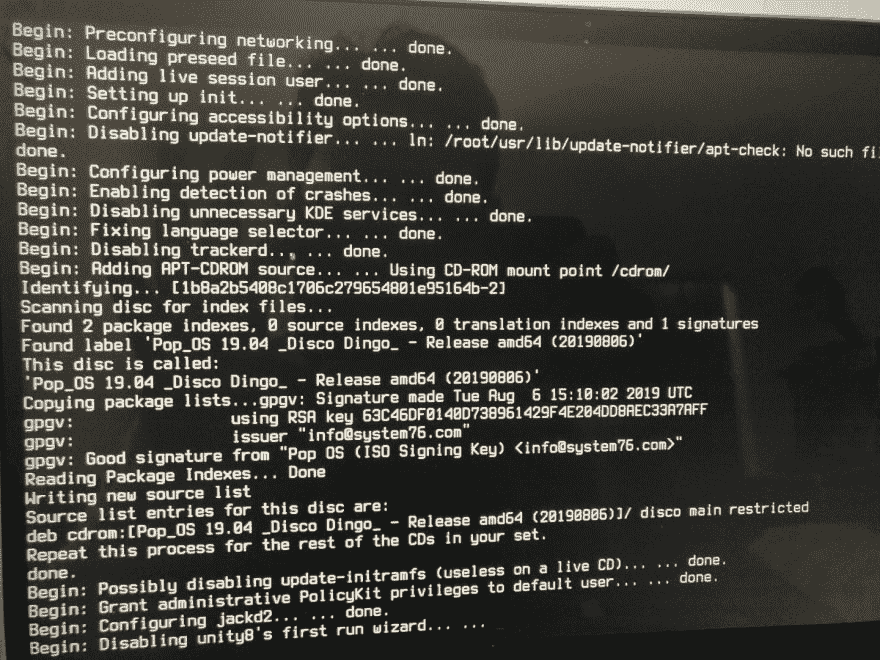](https://res.cloudinary.com/practicaldev/image/fetch/s--QrTNqs_6--/c_limit%2Cf_auto%2Cfl_progressive%2Cq_auto%2Cw_880/https://i.ibb.co/KW9h07B/IMG-20190807-102915.jpg)

您将被直接带到桌面，让选择英语，然后按选择。

你可以在这里选择语言。

[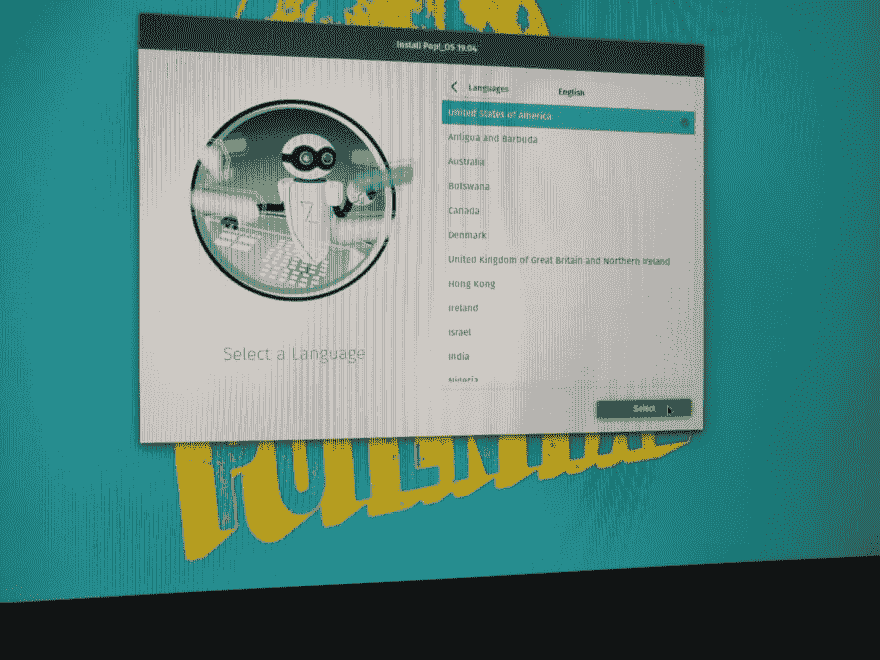](https://res.cloudinary.com/practicaldev/image/fetch/s--LuU54GMB--/c_limit%2Cf_auto%2Cfl_progressive%2Cq_auto%2Cw_880/https://i.ibb.co/VBcLDCc/IMG-20190807-102943.jpg)

然后是键盘布局。

[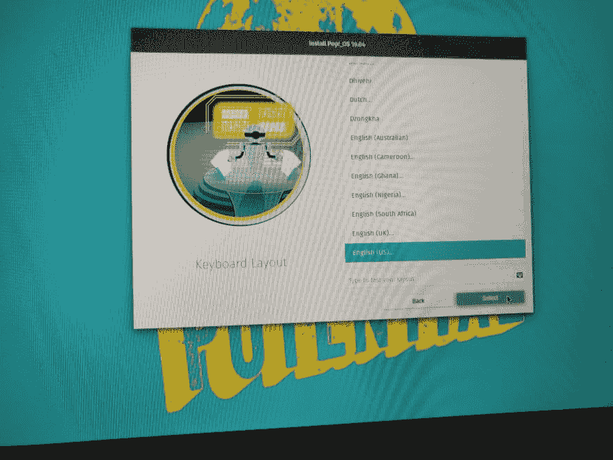](https://res.cloudinary.com/practicaldev/image/fetch/s--qQ2iyTqK--/c_limit%2Cf_auto%2Cfl_progressive%2Cq_auto%2Cw_880/https://i.ibb.co/B2rBYRj/IMG-20190807-102950.jpg)

[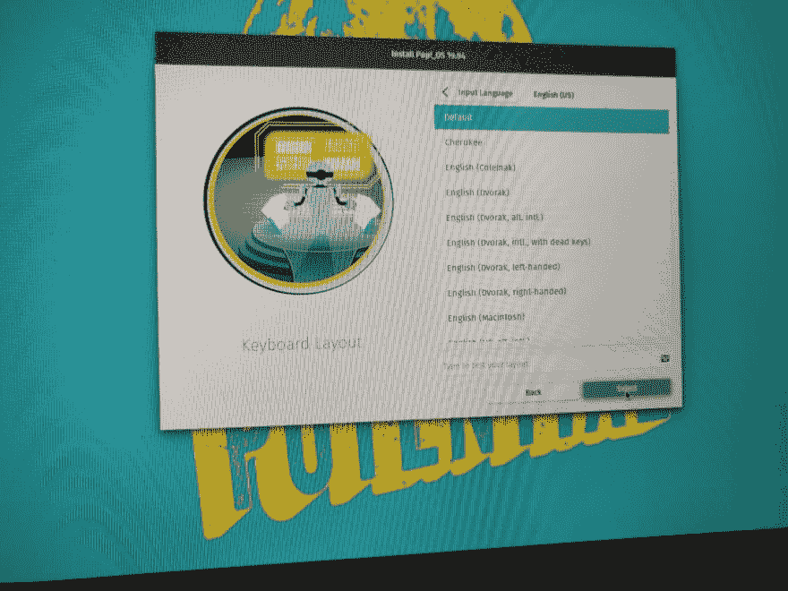](https://res.cloudinary.com/practicaldev/image/fetch/s--98p_aRu1--/c_limit%2Cf_auto%2Cfl_progressive%2Cq_auto%2Cw_880/https://i.ibb.co/FKmfwGg/IMG-20190807-103005.jpg)

现在默认的键盘布局屏幕 2。

好了，现在有趣的部分来了，我们将继续安装部分，并划分我们自己的操作系统方案。选择自定义(高级)。

[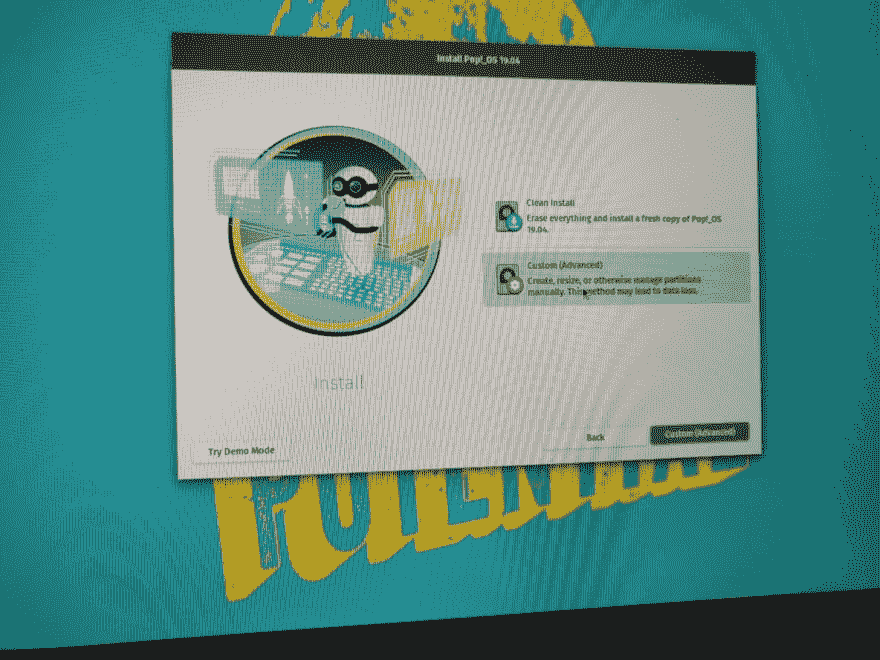](https://res.cloudinary.com/practicaldev/image/fetch/s--_U0yuSNb--/c_limit%2Cf_auto%2Cfl_progressive%2Cq_auto%2Cw_880/https://i.ibb.co/QKRWmF7/IMG-20190807-103012.jpg)

现在看看所有这些花哨的颜色，点击修改分区。

因为我们之前安装了 windows，所以我们将进行双重启动，因此你应该在右上角有一个灰色区域。单击未分配的分区。

[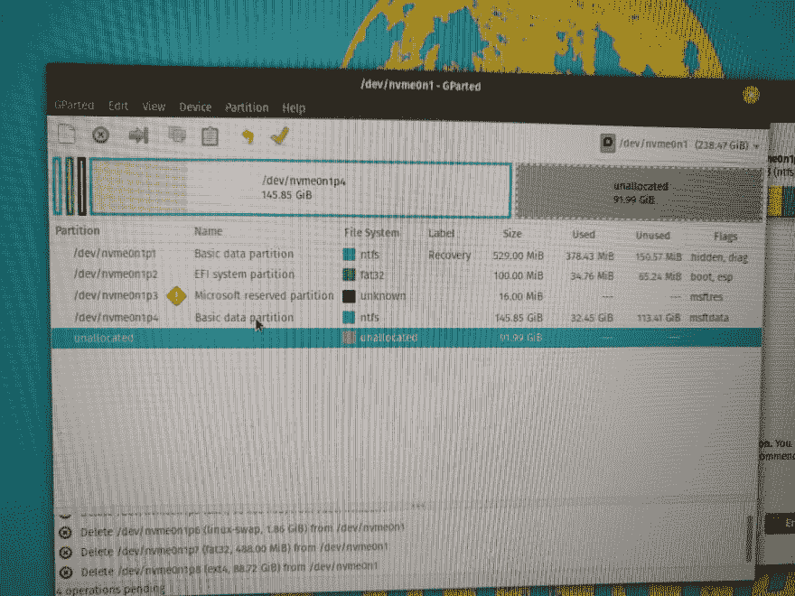](https://res.cloudinary.com/practicaldev/image/fetch/s--OMXdg4oV--/c_limit%2Cf_auto%2Cfl_progressive%2Cq_auto%2Cw_880/https://i.ibb.co/GvNCVsf/IMG-20190807-103109.jpg)

现在点击左上方黑色文档图标。

[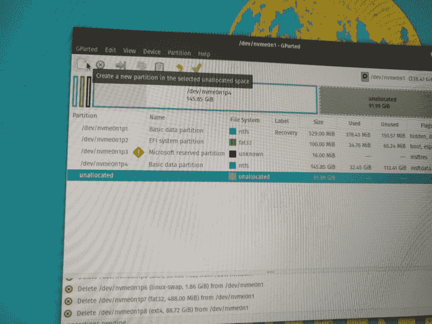](https://res.cloudinary.com/practicaldev/image/fetch/s--6tajl5pw--/c_limit%2Cf_auto%2Cfl_progressive%2Cq_auto%2Cw_880/https://i.ibb.co/SwJDJHH/IMG-20190807-103123.jpg)

在新大小(MiB)中键入 1000，并将其命名为 Boot。然后单击添加

[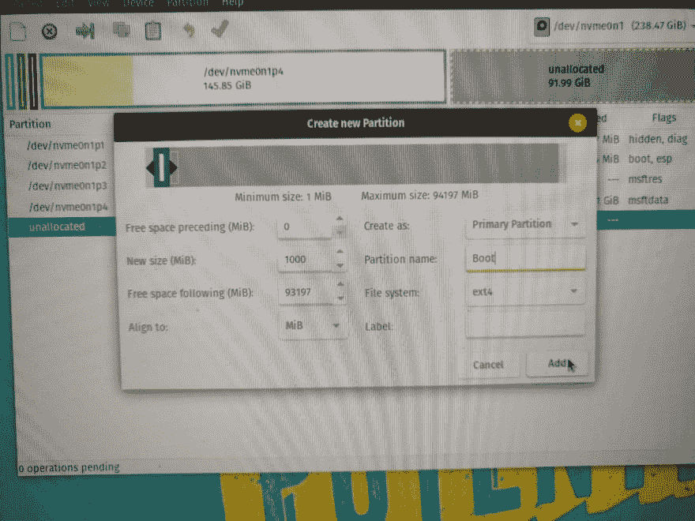](https://res.cloudinary.com/practicaldev/image/fetch/s--mMYiK0dX--/c_limit%2Cf_auto%2Cfl_progressive%2Cq_auto%2Cw_880/https://i.ibb.co/5kBkVZ8/IMG-20190807-103513.jpg)

现在再次单击未分配的分区，并单击新的空白文档图标。现在，在新大小(MiB)中键入 2000，并将其命名为 Swap。从文件系统下拉列表中，选择 linux-swap。单击添加

[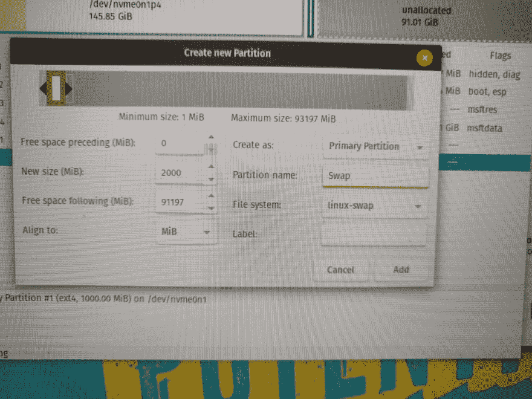](https://res.cloudinary.com/practicaldev/image/fetch/s--KHC4RXsj--/c_limit%2Cf_auto%2Cfl_progressive%2Cq_auto%2Cw_880/https://i.ibb.co/N39fX8h/IMG-20190807-103534.jpg)

现在这是最后一个，重复这个过程，不要改变任何东西，保留新的大小(MiB ),名称是 Root，设置文件系统为 ext4。单击添加

应该和你现在看到的差不多。现在单击绿色勾号以应用所有操作。

你应该回到彩色地带，应该是这样的。

现在单击第一个绿色条，选择 Use Partition，并将其设置为 Use as Boot (/boot/efi)。

[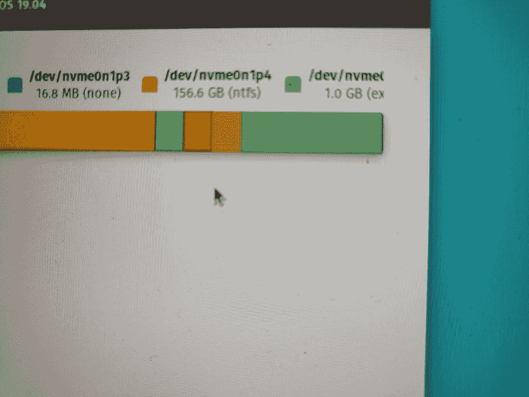](https://res.cloudinary.com/practicaldev/image/fetch/s--giZfg-pi--/c_limit%2Cf_auto%2Cfl_progressive%2Cq_auto%2Cw_880/https://i.ibb.co/fF26KD9/IMG-20190807-103651.jpg)

选择它旁边的橘红色，然后选择“使用分区”并将其设置为“用作:交换”。

[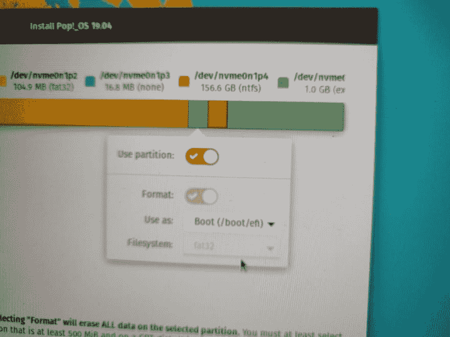](https://res.cloudinary.com/practicaldev/image/fetch/s--ehipiiXt--/c_limit%2Cf_auto%2Cfl_progressive%2Cq_auto%2Cw_880/https://i.ibb.co/vcbbGPg/IMG-20190807-103959.jpg)

现在选择最后一个大的绿色条，选择使用分区，格式化并用作:Root (/)。

[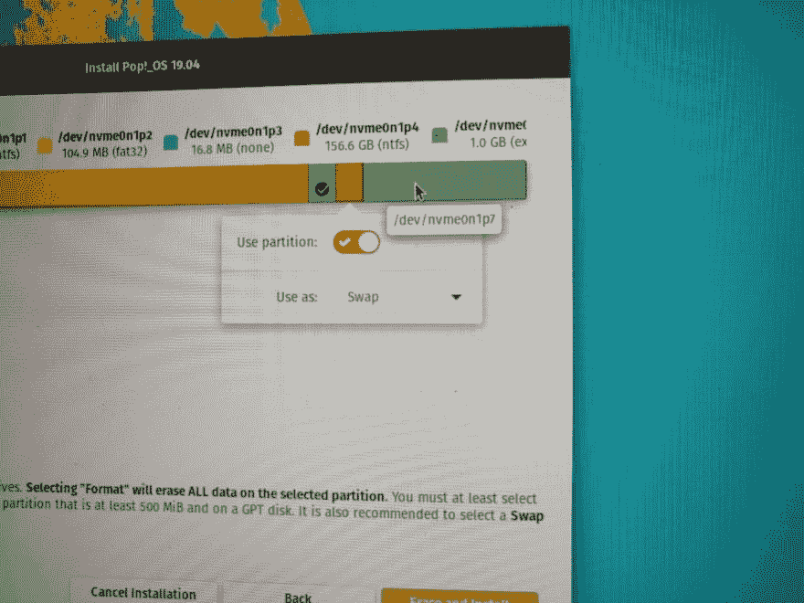](https://res.cloudinary.com/practicaldev/image/fetch/s--rFGDaxOv--/c_limit%2Cf_auto%2Cfl_progressive%2Cq_auto%2Cw_880/https://i.ibb.co/GMmJdG3/IMG-20190807-104005.jpg)

一旦你这样做，你会有复选标记和擦除和安装按钮将亮起。

[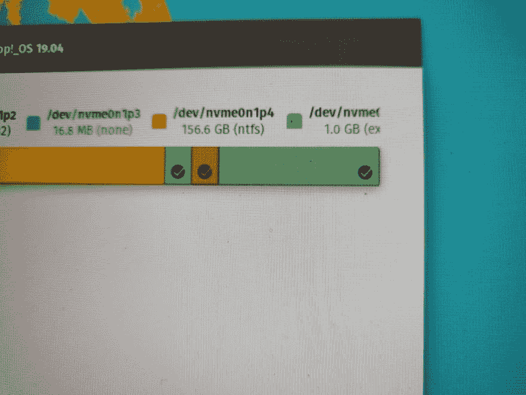](https://res.cloudinary.com/practicaldev/image/fetch/s--soYugrRa--/c_limit%2Cf_auto%2Cfl_progressive%2Cq_auto%2Cw_880/https://i.ibb.co/Js1Tc7T/IMG-20190807-104033.jpg)

Linux 分区方案小结

*   引导分区:挂载为:/boot/EFI——用于放置引导加载程序，帮助加载操作系统。
*   交换分区:挂载为:Linux-swap——用于在 ram 耗尽时增加主机可用的虚拟内存量。
*   根分区:挂载为(/) -就像 windows 上的 C 驱动器一样使用，存储所有操作系统文件。

现在坐下来，给自己弄杯咖啡，虽然这会很快。

[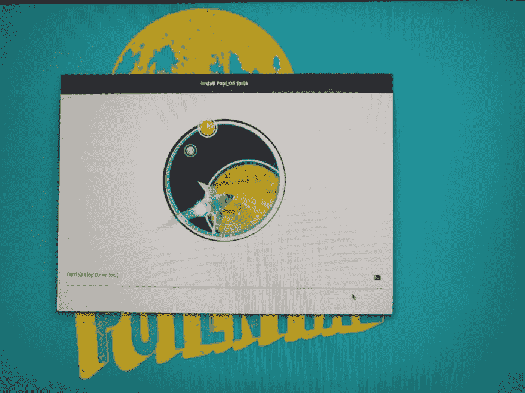](https://res.cloudinary.com/practicaldev/image/fetch/s--C-ek3R6S--/c_limit%2Cf_auto%2Cfl_progressive%2Cq_auto%2Cw_880/https://i.ibb.co/7byYRT9/IMG-20190807-104038.jpg)

好了，现在拔掉 USB 插头，点击重启设备。

[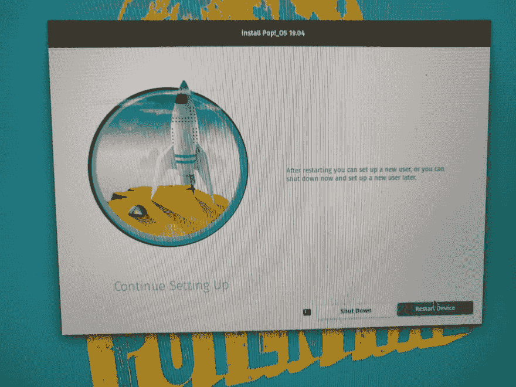](https://res.cloudinary.com/practicaldev/image/fetch/s--LSNxDAO2--/c_limit%2Cf_auto%2Cfl_progressive%2Cq_auto%2Cw_880/https://i.ibb.co/mH4gtYD/IMG-20190807-104419.jpg)

伟大的吉兹，在这个阶段，你不再是笨蛋了。快乐吧，因为快乐将永远伴随着你。

[下一步:为 Linux 设置 IDE](https://dev.to/th3n00bc0d3r/setting-up-the-ide-integrated-development-environment-51lc)

[Noob 指数](https://dev.to/th3n00bc0d3r/noob-guides-index-4mne)