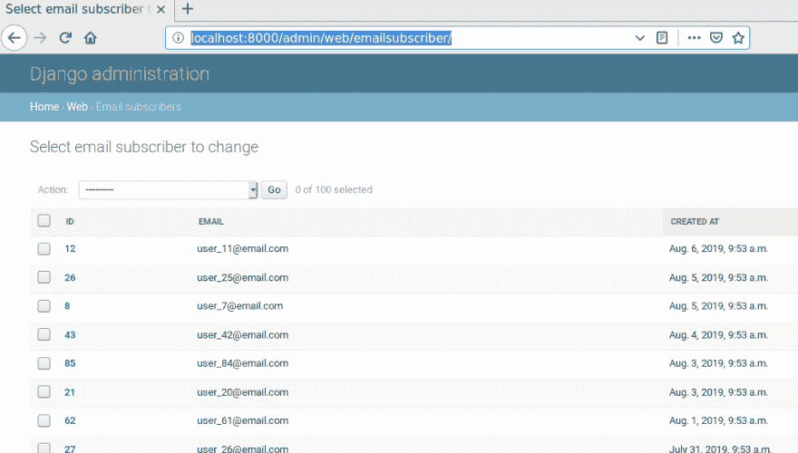
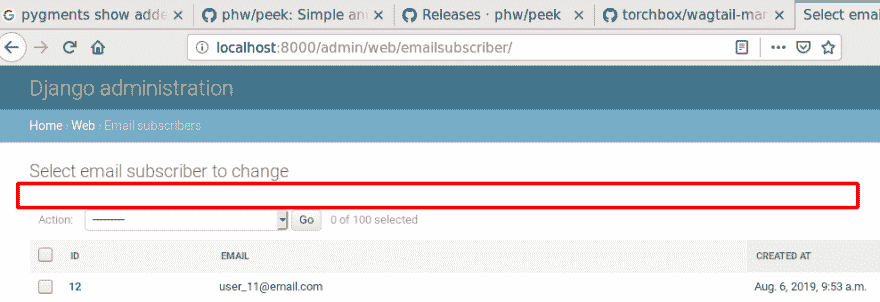
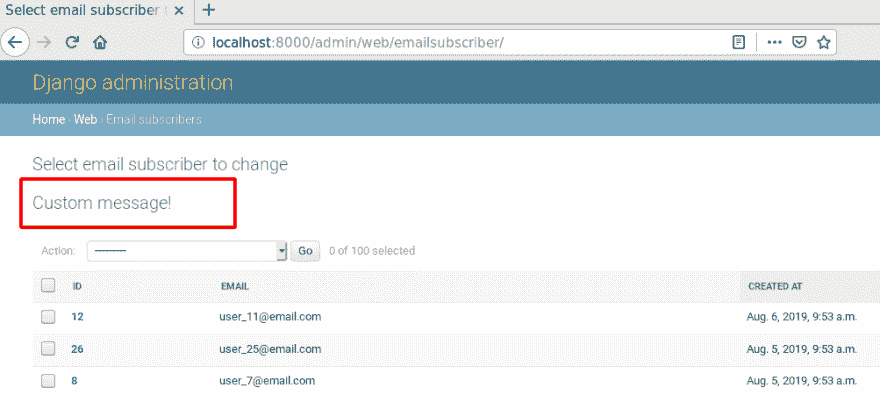
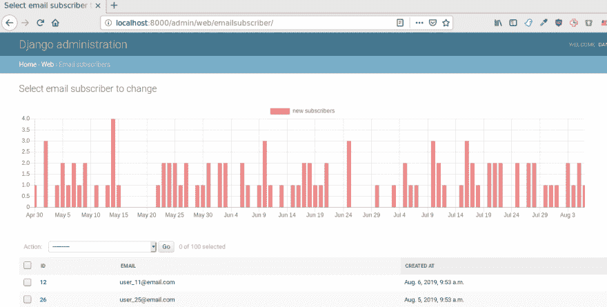
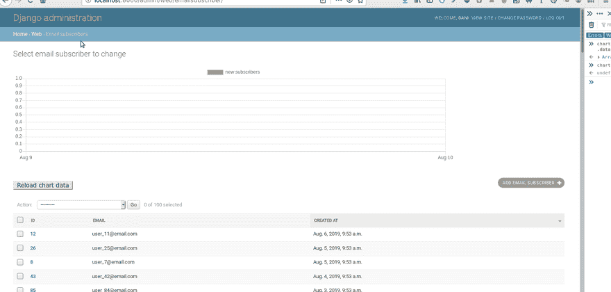

# 向 Django 管理添加图表

> 原文：<https://dev.to/danihodovic/integrating-chart-js-with-django-admin-1kjb>

## 简介

Django 提供了一个现成的功能管理 UI，带有用于数据库管理的 CRUD 接口。这涵盖了基本内容和用户管理系统的大多数用例。然而，它没有显示摘要或历史趋势的探索性视图，这是您从管理仪表板中所期望的。

幸运的是，django 管理应用程序是可扩展的，稍加调整，我们就可以向管理添加交互式 Javascript 图表。

## 问题

我想在 [findwork.dev](https://findwork.dev) 上获得电子邮件订阅者随时间变化的图表概览。就电子邮件订户而言，该网站是在增长还是停滞不前？上个月我们有多少订户？哪一周我们获得了最多的订户？所有订户都在验证他们的电子邮件吗？

使用探索性图表，我们可以从历史上了解我们网站的表现。

我最初探索了现成的 Django 管理应用和仪表板。要求是，它包括制图能力，是有据可查的，看起来不错。虽然我试验过的所有应用程序在风格上看起来都比默认管理员更好，但它们要么缺乏文档，要么缺乏维护。

*   xa admin-没有英文文档
*   [django-jet](https://github.com/geex-arts/django-jet) -无人维护，因为核心团队正在研究 [SaaS 的替代方案](https://github.com/geex-arts/django-jet/issues/389)
*   django-grapinelli -没有制图能力

这时，一个想法浮现在脑海里:**为什么不扩展默认的管理应用程序？**

## 扩展 django-admin

django 管理应用程序由 [ModelAdmin 类](https://docs.djangoproject.com/en/2.2/ref/contrib/admin/#django.contrib.admin.ModelAdmin)组成。这些代表了管理界面中模型的可视化视图。默认情况下，ModelAdmin 类有 5 个默认视图:

*   ChangeList -模型集合的列表视图
*   add——允许您添加新模型实例的视图
*   change——用于更新模型实例的视图
*   删除——用于确认删除模型实例的视图
*   历史记录-对模型实例采取的操作的历史记录

当您想要查看特定的模型时，ChangeList 视图是默认的管理视图。我想在这里添加一个图表，这样每当我打开 EmailSubscribers 页面时，就会看到一段时间以来添加的订户。

假设我们有这样一个电子邮件用户模型:

```
# web/models.py from django.db import models

class EmailSubscriber(models.Model):
    email = models.EmailField()
    created_at = models.DateTimeField() 
```

为了在管理应用程序中显示电子邮件订阅者，我们需要创建一个从`django.contrib.admin.ModelAdmin`扩展而来的类。

一个基本的模型管理员应该是这样的:

```
# web/admin.py from django.contrib import admin
from .models import EmailSubscriber

@admin.register(EmailSubscriber)
class EmailSubscriberAdmin(admin.ModelAdmin):
    list_display = ("id", "email", "created_at") # display these table columns in the list view
    ordering = ("-created_at",)                  # sort by most recent subscriber 
```

让我们添加一些订阅者，这样我们就有了一个初始数据集:

```
$ ./manage.py shell
Python 3.7.3 (default, Apr  9 2019, 04:56:51)
[GCC 8.3.0] on linux
Type "help", "copyright", "credits" or "license" for more information.
(InteractiveConsole)
from web.models import EmailSubscriber
from django.utils import timezone
from datetime import timedelta
import random
for i in range(0, 100):
    EmailSubscriber.objects.create(email=f"user_{i}@email.com", created_at=timezone.now() - timedelta(days=random.randint(0, 100)))
...
<EmailSubscriber: EmailSubscriber object (1)>
<EmailSubscriber: EmailSubscriber object (2)>
<EmailSubscriber: EmailSubscriber object (3)>
... 
```

如果我们进入 ChangeList 视图，我们会看到我们添加了 100 个新订户，创建时间随机[http://localhost:8000/admin/web/email subscriber/](http://localhost:8000/admin/web/emailsubscriber/)。

[](https://res.cloudinary.com/practicaldev/image/fetch/s--GYgBR36m--/c_limit%2Cf_auto%2Cfl_progressive%2Cq_auto%2Cw_880/https://thepracticaldev.s3.amazonaws.com/i/j0473muesv6r4hq20d7h.png)

假设我们想要添加一个图表，该图表在一个条形图中总结了一段时间内的订阅者数量。我们想把它放在订户列表的上方，这样你一进入网站就能看到它。

下面的红色区域勾勒出我想要直观地放置图表的位置。

[](https://res.cloudinary.com/practicaldev/image/fetch/s--ZQIzv4LC--/c_limit%2Cf_auto%2Cfl_progressive%2Cq_auto%2Cw_880/https://thepracticaldev.s3.amazonaws.com/i/h68qui1ms9y28dnzt3nv.png)

如果我们创建一个新文件，我们可以强制 django-admin 加载我们的模板，而不是默认模板。让我们在中创建一个空文件

*   `web/templates/admin/web/emailsubscriber/change_list.html`。

覆盖管理模板时的命名方案是

*   `{{app}}/templates/admin/{{app}}/{{model}}/change_list.html`。

默认的 ChangeList 视图是可扩展的，有多个块可以被覆盖以满足您的需要。当检查默认管理模板时，我们可以看到它包含可以被覆盖的块。我们需要覆盖 [**内容**](https://github.com/django/django/blob/514efa3129792ec2abb2444f3e7aeb3f21a38386/django/contrib/admin/templates/admin/change_list.html#L40) 块来改变模型表之前所渲染的内容。

让我们扩展默认的 ChangeList 视图并添加定制文本:

```
# web/templates/admin/web/emailsubscriber/change_list.html





<h1>Custom message!</h1>

<!-- Render the rest of the ChangeList view by calling block.super -->
{{ block.super }}
 
```

[](https://res.cloudinary.com/practicaldev/image/fetch/s--koznDGrx--/c_limit%2Cf_auto%2Cfl_progressive%2Cq_auto%2Cw_880/https://thepracticaldev.s3.amazonaws.com/i/ic7oyfgqlfpa9kcajx77.png)

酷，我们现在已经成功定制了管理用户界面。让我们更进一步，使用 [Chart.js](https://github.com/chartjs/Chart.js) 添加一个 Javascript 图表。我们需要覆盖 [**extrahead**](https://github.com/django/django/blob/514efa3129792ec2abb2444f3e7aeb3f21a38386/django/contrib/admin/templates/admin/change_list.html#L21) 块来添加脚本和样式元素，以便在标题中加载 Chart.js。

Chart.js 代码基于他们的演示条形图，在这里找到。我稍微修改了一下，读取 X 轴上的时间序列数据。

```
# web/templates/admin/web/emailsubscriber/change_list.html




<!-- Override extrahead to add Chart.js -->

{{ block.super }}
<link rel="stylesheet" href="https://cdnjs.cloudflare.com/ajax/libs/Chart.js/2.8.0/Chart.min.css" />
<script src="https://cdnjs.cloudflare.com/ajax/libs/Chart.js/2.8.0/Chart.bundle.min.js"></script>
<script>
document.addEventListener('DOMContentLoaded', () => {
  const ctx = document.getElementById('myChart').getContext('2d');

  // Sample data
  const chartData = [
    {"date": "2019-08-08T00:00:00Z", "y": 3},
    {"date": "2019-08-07T00:00:00Z", "y": 10},
    {"date": "2019-08-06T00:00:00Z", "y": 15},
    {"date": "2019-08-05T00:00:00Z", "y": 4},
    {"date": "2019-08-03T00:00:00Z", "y": 2},
    {"date": "2019-08-04T00:00:00Z", "y": 11},
    {"date": "2019-08-02T00:00:00Z", "y": 3},
    {"date": "2019-08-01T00:00:00Z", "y": 2},
  ];

  // Parse the dates to JS
  chartData.forEach((d) => {
    d.x = new Date(d.date);
  });

  // Render the chart
  const chart = new Chart(ctx, {
    type: 'bar',
    data: {
      datasets: [
        {
          label: 'new subscribers',
          data: chartData,
          backgroundColor: 'rgba(220,20,20,0.5)',
        },
      ],
    },
    options: {
      responsive: true,
      scales: {
        xAxes: [
          {
            type: 'time',
            time: {
              unit: 'day',
              round: 'day',
              displayFormats: {
                day: 'MMM D',
              },
            },
          },
        ],
        yAxes: [
          {
            ticks: {
              beginAtZero: true,
            },
          },
        ],
      },
    },
  });
});
</script>



<!-- Render our chart -->
<div style="width: 80%;">
  <canvas style="margin-bottom: 30px; width: 60%; height: 50%;" id="myChart"></canvas>
</div>
<!-- Render the rest of the ChangeList view -->
{{ block.super }}
 
```

[](https://res.cloudinary.com/practicaldev/image/fetch/s--Y6OKKDPM--/c_limit%2Cf_auto%2Cfl_progressive%2Cq_auto%2Cw_880/https://thepracticaldev.s3.amazonaws.com/i/a3fjyr4rb1wti19m2i1l.png)

瞧，我们现在已经将 Chart.js 图表呈现到 django admin 中。唯一的问题是数据是硬编码的，不是从我们的后端获得的。

## 将图表数据注入管理模板

ModelAdmin 类有一个名为 [**changelist_view**](https://github.com/django/django/blob/42b9a23267f14be39b9b00958e18d5746783208e/django/contrib/admin/options.py#L1654) 的方法。此方法负责呈现变更列表页面。通过覆盖这个方法，我们可以将图表数据注入模板上下文。

下面的代码大致做到了这一点:

1.  汇总每天新订户的总数
2.  将 Django 查询集编码为 JSON
3.  将数据添加到模板上下文
4.  调用 super()方法来呈现页面

```
# django_admin_chart_js/web/admin.py import json

from django.contrib import admin
from django.core.serializers.json import DjangoJSONEncoder
from django.db.models import Count
from django.db.models.functions import TruncDay

from .models import EmailSubscriber

@admin.register(EmailSubscriber)
class EmailSubscriberAdmin(admin.ModelAdmin):
    list_display = ("id", "email", "created_at")
    ordering = ("-created_at",)

    def changelist_view(self, request, extra_context=None):
        # Aggregate new subscribers per day
        chart_data = (
            EmailSubscriber.objects.annotate(date=TruncDay("created_at"))
            .values("date")
            .annotate(y=Count("id"))
            .order_by("-date")
        )

        # Serialize and attach the chart data to the template context
        as_json = json.dumps(list(chart_data), cls=DjangoJSONEncoder)
        extra_context = extra_context or {"chart_data": as_json}

        # Call the superclass changelist_view to render the page
        return super().changelist_view(request, extra_context=extra_context) 
```

从技术上讲，现在应该将数据添加到模板上下文中，但是我们现在必须在图表中使用它，而不是硬编码的数据。

用来自我们后端的数据替换变量 **chartData** 中的硬编码数据:

```
// django_admin_chart_js/web/templates/admin/web/emailsubscriber/change_list.html
const chartData = {{ chart_data | safe }}; 
```

重新加载页面，看看我们美丽的图表。

[](https://res.cloudinary.com/practicaldev/image/fetch/s--O1h700Ll--/c_limit%2Cf_auto%2Cfl_progressive%2Cq_auto%2Cw_880/https://thepracticaldev.s3.amazonaws.com/i/uq0ivvhg06r74wke9b64.png)

## 使用 JS 动态加载数据

在上面的例子中，我们将初始图表数据直接注入到 html 模板中。我们可以在初始页面加载后进行更多的交互和获取数据。为此，我们需要:

*   向返回 JSON 数据的模型管理员添加一个新的端点
*   添加 JS 逻辑，在单击按钮时进行 AJAX 调用，并重新呈现图表

添加新的端点需要我们覆盖 modeladmin 上的 [**get_urls()**](https://docs.djangoproject.com/en/2.2/ref/contrib/admin/#django.contrib.admin.ModelAdmin.get_urls) 方法，并注入我们自己的端点 url。

**需要注意的是，你的自定义网址应该放在默认网址**之前。默认的是许可的，可以匹配任何东西，所以请求永远不会通过我们的自定义方法。

我们的 python 代码现在应该是这样的:

```
# web/admin.py import json

from django.contrib import admin
from django.core.serializers.json import DjangoJSONEncoder
from django.db.models import Count
from django.db.models.functions import TruncDay
from django.http import JsonResponse
from django.urls import path

from .models import EmailSubscriber

@admin.register(EmailSubscriber)
class EmailSubscriberAdmin(admin.ModelAdmin):
    list_display = ("id", "email", "created_at")
    ordering = ("-created_at",)

    ...

    def get_urls(self):
        urls = super().get_urls()
        extra_urls = [
            path("chart_data/", self.admin_site.admin_view(self.chart_data_endpoint))
        ]
        # NOTE! Our custom urls have to go before the default urls, because they
        # default ones match anything.
        return extra_urls + urls

    # JSON endpoint for generating chart data that is used for dynamic loading
    # via JS.
    def chart_data_endpoint(self, request):
        chart_data = self.chart_data()
        return JsonResponse(list(chart_data), safe=False)

    def chart_data(self):
        return (
            EmailSubscriber.objects.annotate(date=TruncDay("created_at"))
            .values("date")
            .annotate(y=Count("id"))
            .order_by("-date")
        ) 
```

我们还需要添加 Javascript 逻辑，以便在单击按钮时重新加载图表数据，并重新呈现图表。在图表变量的声明下面添加以下几行:

```
 // django_admin_chart_js/web/templates/admin/web/emailsubscriber/change_list.html

  const chart = new Chart...
  ...

  // Reload chart data from the backend on button click
  const btn = document.querySelector('#reload');
  btn.addEventListener('click', async() => {
    const res = await fetch("/admin/web/emailsubscriber/chart_data/");
    const json = await res.json();
    json.forEach((d) => {
      d.x = new Date(d.date);
    });
    chart.data.datasets[0].data = json;
    chart.update();
  }); 
```

将下面的 html 按钮添加到图表:

```

<!-- Render our chart -->
<div style="width: 80%;">
  <canvas style="margin-bottom: 30px; width: 60%; height: 50%;" id="myChart"></canvas>
</div>

<button id="reload" style="margin: 1rem 0">Reload chart data</button>
<!-- Render the rest of the ChangeList view -->
{{ block.super }}
 
```

[](https://res.cloudinary.com/practicaldev/image/fetch/s--HGun-KGY--/c_limit%2Cf_auto%2Cfl_progressive%2Cq_66%2Cw_880/https://thepracticaldev.s3.amazonaws.com/i/eei0iogx4xatg4c75w47.gif)

Chart.js 自带不同的可视化效果。使用基本图表很容易，如果需要，还可以进行定制。

Chart.js 文档在这里是，Django 管理文档在这里是。

完整的示例代码可以在 [Github](https://github.com/danihodovic/django_admin_chart_js) 上找到。