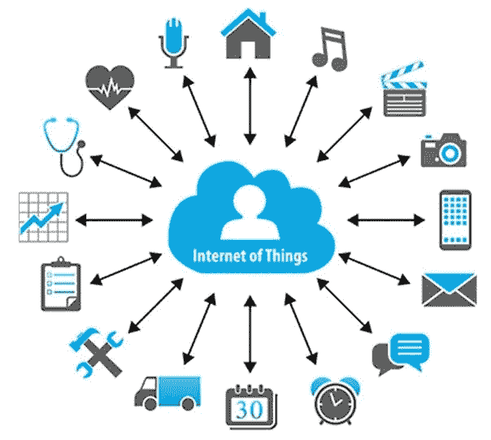

# 物联网(IoT)安全挑战

> 原文：<https://dev.to/techglobex/internet-of-things-iot-security-challenges-27k1>

随着物联网不断接管世界，消费者和企业领域中与物联网部署相关的许多安全挑战逐渐浮出水面。连接到互联网的设备越多，物联网生态系统就变得越复杂，敏感信息面临的风险就越大。

根据 Safelist 的估计， [35%](https://safeatlast.co/blog/iot-statistics/) 的 IT 领导者对物联网设备的安全性缺乏信心。他们担心网络罪犯可能会控制他们的设备，这可能会带来可怕的后果。鉴于 84%的组织已经遭遇过与物联网相关的安全违规，这是一个合理的担忧。

尽管在这一点上没有人能否认许多行业将受益于物联网扩散的事实，但仍有人认为将一切连接到互联网仍有许多漏洞和缺陷，他们完全有权利持怀疑态度。

卡巴斯基实验室的开发人员甚至将物联网称为垃圾物联网，公开批评将一切可能的东西连接到互联网的概念。他们可能有点越线了，但有一点是肯定的——尽管物联网提供了许多显著的好处，但也引发了许多关于安全挑战的担忧。在本文中，我们强调了物联网开发人员需要解决的主要安全问题。

## 数据加密

收集海量数据是物联网设备的本质。数据处理和共享是整个物联网生态系统的组成部分。然而，这些数据大多是敏感的，需要通过加密来保护。

安全套接字层协议或 [SSL](https://www.globalsign.com/en/ssl-information-center/what-is-ssl/) 可用于保护您的在线数据。SSL 软件不仅必须用于保护和加密数据，还必须用于无线协议方面。

也就是说，数据在无线传输时是最容易受到攻击的，这就是为什么在传输过程中也需要加密。位置等敏感数据必须加以保护，以免被窥探，并提供给相关用户。因此，用户使用集成加密的无线协议至关重要。

## 旁道攻击

即使加密已经启动并运行，物联网网络仍然容易受到旁路攻击。这些攻击的重点是信息的呈现方式，而不是数据本身。

基本上，网络罪犯可以使用旁路攻击来访问加密设备的状态及其内容。他或她可以通过分析和观察可以通过不同技术获得的信息来实现这一点。

攻击者分析设备发出的电磁辐射，并从中非侵入性地提取敏感信息。

## 硬件问题

自物联网诞生以来，硬件开发商一直未能跟上物联网的需求。尽管英特尔和 ARM 等物联网设备芯片制造商最近开始加强处理器以提高安全性，但他们似乎无法找到合适的安全漏洞解决方案。

专门为物联网设备设计的芯片的一个问题是制造成本很高。此外，那些设计复杂的芯片将需要更多的电池电量，这对物联网应用设计师来说无疑是一个挑战。

## 设备范围

物联网设备的覆盖网络是最重要的功能之一，也是经常被物联网专家忽略的功能之一。制造商在为您的设备或应用设置一系列指标时需要非常具体。例如，为了支持设备的网络，他们必须精确计算一个设施内需要多少个中继器来为设备提供相应的通信范围。

但是制造商在进行估算时必须谨慎，因为如果过多的中继器连接到网络，系统的容量可能会降低。因此，最重要的是找到最大化范围而不达到临界点的最佳点。