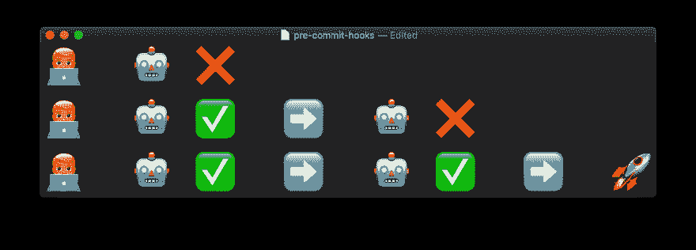

# 客户端 Git 挂钩简介

> 原文：<https://dev.to/robotsquidward/intro-to-client-side-git-hooks-24mn>

当涉及到部署代码的过程时，自动化就是一切。随着时间的推移，即使是最小的改进也会对您在构建和发布软件时不得不忍受的手工过程产生巨大的影响。

在编写、构建和部署代码的过程中，有很多地方可以注入自动化。当在团队中和越来越大的项目中编写代码时，这些挑战和机会只会增加。像林挺、自动化测试和 GitHub 检查这样的东西可以帮助你在推送、审查、合并和交付代码时减少[辛劳](https://landing.google.com/sre/sre-book/chapters/eliminating-toil/)。

[](https://res.cloudinary.com/practicaldev/image/fetch/s--j_vZu26I--/c_limit%2Cf_auto%2Cfl_progressive%2Cq_auto%2Cw_880/https://user-images.githubusercontent.com/10855762/62872161-e1500e00-bcea-11e9-8490-0533a31fc589.png)

这些问题有许多解决方案，大多数都集中在部署代码时最明确的把关者——构建步骤。您的构建应该能够在没有人工干预的情况下自动检测问题。在将代码投入生产之前，从代码风格到性能到服务器健康状况的一切都可以在构建中进行测试和认证。构建会强制执行您的规则，并让开发人员保持诚实，这是人工干预永远无法做到的。

然而，当推进到预构建过程时，有一些检查可以节省更多的时间。

一个很好的例子是开发人员提交和推送糟糕的代码。不是*合并*糟糕的代码，而是简单地编写糟糕的代码，并将其提交到它们自己的特性分支中的源代码控制。这可能看起来不是一个大问题——毕竟所有受保护的分支意味着您可以在批准合并之前通过构建检查来强制执行正确性——但是它可能会引入手动工作并给开发人员带来挫折，这两者都可以通过客户端 git 保护轻松避免。

## 引入 Git 挂钩

[Git 挂钩](https://git-scm.com/book/en/v2/Customizing-Git-Git-Hooks)是在运行某些 Git 命令时运行脚本的一种方式。客户端 Git 流程和服务器端流程上都有挂钩，您可以在其中对 Git 工作流中的变化做出反应。我们将关注客户端钩子，在这里我们甚至可以在完成提交之前保护自己。

### 客户端 Git 挂钩

客户端钩子包括多个 Git 进程的钩子，包括提交、电子邮件工作流和其他进程，如`checkout`和`merge`。现在，让我们把注意力集中在提交工作流*(但是[看看列表的其余部分](https://git-scm.com/book/en/v2/Customizing-Git-Git-Hooks)，你可以做的还有很多！)*。

*   `pre-commit` -甚至在提交消息生成之前在`git commit`运行
*   `prepare-commit-msg` -在提交消息编辑器打开之前但在生成默认消息之后运行
*   `commit-msg` -在消息创建后运行，以验证包含提交消息的临时文件

这些客户端`commit`挂钩实际上分为两类:

1.  您提交的代码
2.  格式化/实施正确的提交消息

我们将从第一类开始，在我们考虑用消息完成提交之前，使用`pre-commit`来分析我们将要提交的代码。

### 写一个饭桶`pre-commit`挂钩

首先，您需要在存储库中为钩子指定一个位置。对于我们的例子，我们将使用以下命令在我们的存储库的根目录下创建一个名为`.githooks`的目录:

```
mkdir .githooks
cd .githooks
touch areYouSure.sh 
```

Enter fullscreen mode Exit fullscreen mode

在你最喜欢的编辑器中打开`areYouSure.sh`。编写一个钩子既极其简单，又具有极大的开放性。您只需要一个返回退出代码的脚本，0 表示成功，非 0 表示失败。任何不为 0 的值都会完全中止提交。

让我们写一个非常简单的脚本，询问我们的开发人员他们是否确定要提交。

```
#!/usr/bin/env bash

# Check that we want to commit.

read -p "Are you sure you want to commit this (y/n)? " answer
case ${answer:0:1} in y|Y )
        exit 0 # If yes, success!
    ;;
    * )
        exit 1 # If no, sorry yo.
    ;;
esac 
```

Enter fullscreen mode Exit fullscreen mode

最后，通过运行
确保这个新文件是可执行的

```
chmod +x .githooks/areYouSure.sh 
```

Enter fullscreen mode Exit fullscreen mode

现在让我们弄清楚如何让 Git 作为`pre-commit`钩子的一部分自动运行这个脚本。

### 添加自定义`pre-commit`步骤

在我们的`.githooks`目录中，我们将创建一个新的脚本，用这些命令来处理我们的自定义`pre-commit`动作:

```
cd .githooks
touch pre-commit 
```

Enter fullscreen mode Exit fullscreen mode

在您喜欢的编辑器中打开新的`pre-commit`文件。让我们更新它来做我们需要的基本事情。

```
#!/bin/sh

# Specify the directory for the hooks.
# We'll use the current one (.githooks)
hookDir=$(dirname $0)

# Specify the hooks you want to run during
# the pre-commit process:
"$hookDir/areYouSure.sh"
# && "hookDir/add-your-own-scripts-here" 
```

Enter fullscreen mode Exit fullscreen mode

这个脚本将指定我们存储钩子的目录(当前的`.githooks`目录)，然后它将指定应该作为`pre-commit`的一部分运行的脚本。在我们的例子中，我们只有一个`areYouSure.sh`脚本。

> 你可以将你的脚本代码直接编码到`pre-commit`中。相反，我们将这段代码抽象成它自己的脚本，以增强可读性、可重用性，并使我们能够在将来轻松地向我们的`pre-commit`步骤添加更多脚本。

最后，通过运行
确保这个新文件是可执行的

```
chmod +x .githooks/pre-commit 
```

Enter fullscreen mode Exit fullscreen mode

### 告诉 Git 使用我们的定制钩子

完成上述步骤后，您应该有一个新的`.githooks`目录，其中包含了`pre-commit`脚本和我们新的定制脚本`areYouSure.sh`。我们可以继续将这些文件提交给源代码管理。如果您现在这样做，您会注意到，您不会在命令行中看到我们的“您确定吗”弹出窗口。

我们的钩子没有运行的原因是，我们仍然需要配置 Git，让它知道我们为这个存储库的`pre-commit`找到了一个新位置。为此，在 repo 的根目录下运行这个命令:

```
git config core.hooksPath .githooks 
```

Enter fullscreen mode Exit fullscreen mode

这告诉 Git 将这个 repo 的钩子路径配置到我们定制的`.githooks`目录。现在，每当 git 运行`pre-commit`步骤时，它都会遵从我们自己的`pre-commit`脚本中的自定义操作。

现在，当您开始一个新的`git commit`时，您应该会看到我们的`areYouSure.sh`提示。一个`Yes`答案应该继续你的提交(继续提交消息步骤),而一个`No`答案应该中止你的提交。

### 下一步

恭喜你。🎉您已经成功地在存储库中编写并配置了一个定制的`pre-commit`钩子！

现在，您可以继续改进您的`pre-commit`工作流，只需向`.githooks`添加新的脚本，并在您的定制`pre-commit`脚本中指定您想要运行的钩子。

一些有助于继续 Git 挂钩之旅的资源:

*   [GitHooks.com](https://githooks.com)
*   [预提交](https://pre-commit.com)——一个从远程回购中提取定制`pre-commit`脚本的框架
*   了解用于执行策略的服务器端 git 挂钩和一些入门的服务器端脚本

感谢您的阅读，如果您对`pre-commit` hooks 有任何问题或想法，或者想分享您用 git automation 完成的令人惊叹的东西——请在评论中告诉我！

> *我最初在 AJ.dev 上发表了这篇文章，[在那里读到的](https://ajkueterman.dev/posts/intro-to-custom-client-git-hooks-pre-commit/)。*