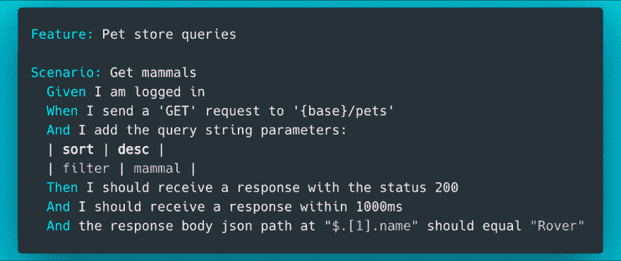

# 介绍 Bat:行为 API 测试器

> 原文：<https://dev.to/philmander/introducing-bat-behavioral-api-tester-2d3a>

我在哈佛工作，我们有几个面向客户的关键任务的 HTTP/Rest API 是用 Node.JS 构建的。当我去年加入时，支持开发和测试这些 API 的标准程序是使用 Postman。但是将 Postman 与版本控制集成、用 Postman 的 GUI 编写 Javascript 测试以及用 Newman 集成到 CI 的过程对我来说并不是一个特别好的开发体验。我想找到一种方法来改善这一点。

我一直是黄瓜的粉丝，这是一个用可读的商业语言编写可运行的软件规范的工具，一般来说，是一种行为驱动开发(BDD)的开发方法。我想到 Cucumber 可能也非常适合开发和测试我们的 HTTP APIs。

从这里，和我在哈佛的同事一起，我们创造了 [Bat(行为 API 测试器)](https://github.com/harver-engineering/bat)；一个帮助用可读的英语编写 HTTP APIs(如 Rest、RPC 和 GraphQL)的可运行规范的工具。这样的规格可以很容易地自动化并集成到您的持续集成管道中。它在节点上运行。JS 和是基于[黄瓜。JS](https://github.com/cucumber/cucumber-js) 。

它很适合用 Cucumber 进行 API 测试，因为在合理的范围内，与测试 HTTP API 相关的动作和断言是有限的。Bat 在 Gherkin 的基础上创建了一个描述 HTTP 交互的公共词汇表(DSL)。当采用 BDD 方法进行 API 开发时，这种规范提供了一种在编写任何实现代码之前编写和审查您的意图的好方法。例如:

这里的记录了步骤定义的完整集合[。我们还在回购](https://github.com/harver-engineering/bat/blob/master/docs/step-reference.md)中提供了(并将继续添加)一堆[的例子。](https://github.com/harver-engineering/bat/tree/master/examples)

因为 Bat 本质上是黄瓜的外挂。JS，使用自定义步骤定义很容易扩展。在 Harver，我们经常这样做与设置上下文相关的非标准内容(`Given`步骤)，比如定制认证过程或设置测试数据。在内部，它使用 [SuperAgent](https://visionmedia.github.io/superagent/) 作为 HTTP 客户端并维护会话。

Bat 有更多有用的特性使其在现实世界中可用，例如变量替换、与 Postman 的环境文件格式兼容以及与开放 API 规范的集成点。更多详情见[自述文件](https://github.com/harver-engineering/bat/blob/master/README.md)。

现在 Bat 在 Github 上[开源，被更广泛的受众使用，更多缺失的功能将变得明显。所以请](https://github.com/harver-engineering/bat)[提出问题](https://github.com/harver-engineering/bat/issues)请求新功能并提出 bug。如果你想回馈 Bat，请查看[投稿指南](https://github.com/harver-engineering/bat/blob/master/CONTRIBUTING.md)。