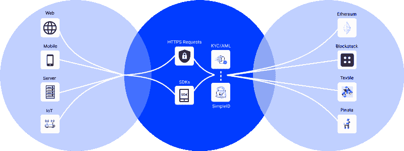
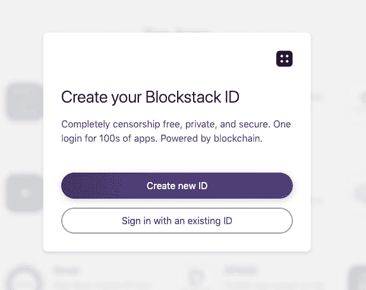
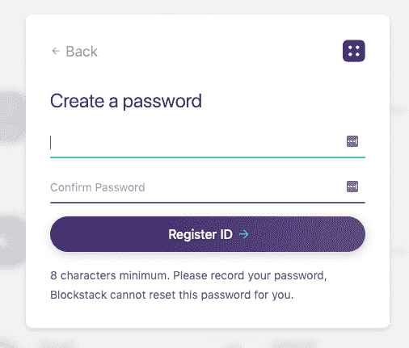
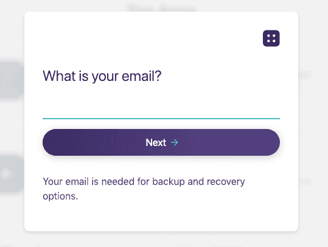
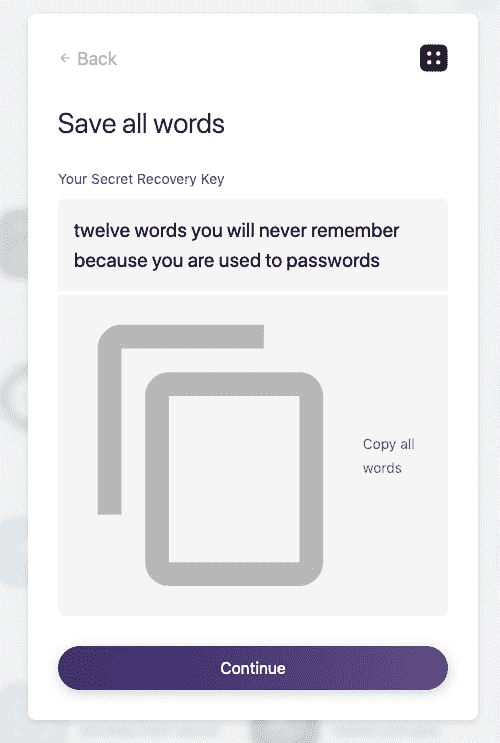
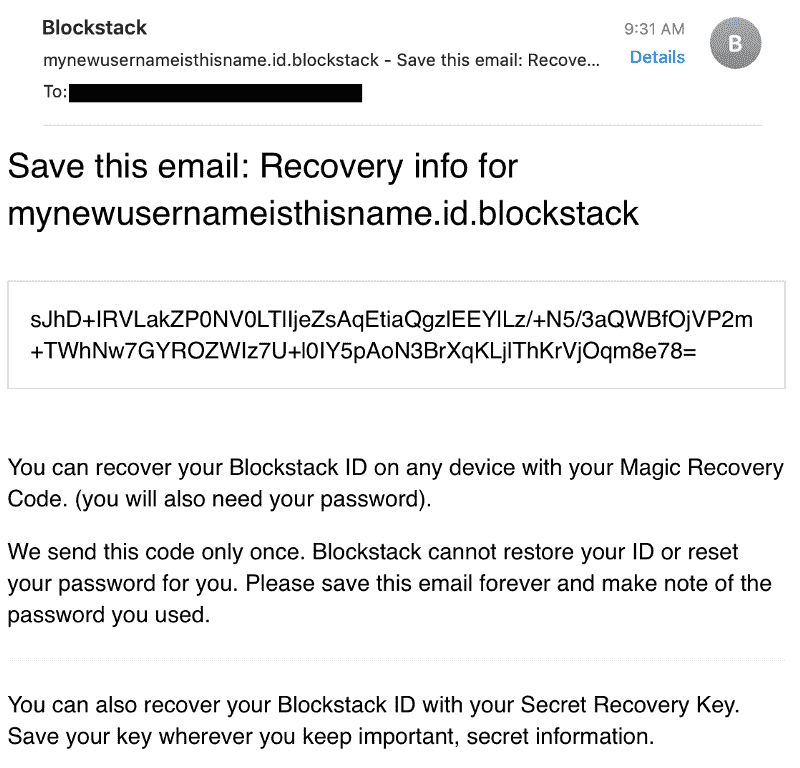
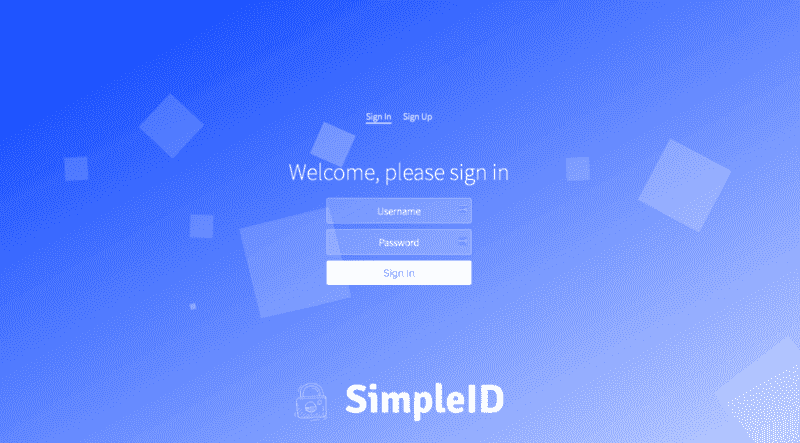
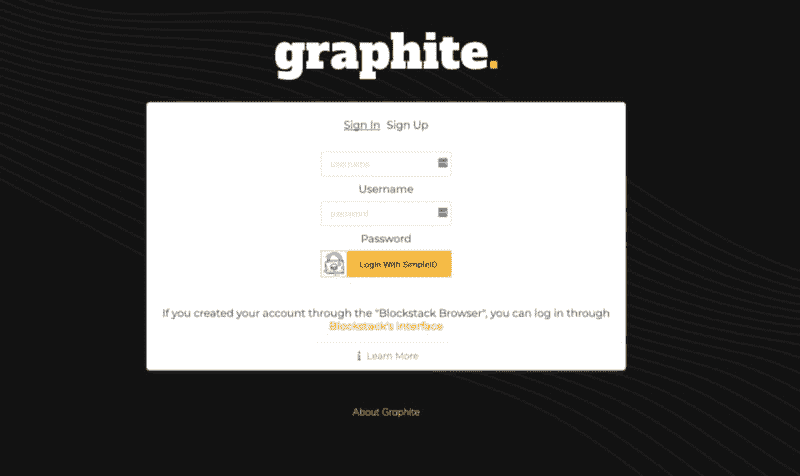

# 介绍 simple id——向你的应用添加去中心化的最简单方法

> 原文：<https://dev.to/polluterofminds/introducing-simpleid-the-easiest-way-to-add-decentralization-to-your-app-2mm7>

* * *

两年前，两个独立的应用程序开始了他们的去中心化 web 之旅。[隐身](https://www.stealthy.im)和[石墨](https://graphitedocs.com)是 [Blockstack 的](https://blockstack.org)去中心化应用系统上的早期应用。尽管 Blockstack 提供了优秀的开发工具，但总有一些东西阻碍了它的采用:

认证。

整个去中心化的网络空间都是如此。不仅仅是 Blockstack，还有 Ethereum apps，EOS，Steem 等。事实是，开发者希望用户能够比他们更快地适应种子短语和密钥管理。缺乏调整抑制了增长。因此，我们着手建立一个更好的解决方案。而那个更好的解决方案就是 [SimpleID](https://www.simpleid.xyz/?t=devto) 。

* * *

### 事情是如何运作的

对于那些从未构建或使用过分散式应用程序的人来说，理解认证过程是什么样子是很重要的。我们将专注于 Blockstack，因为 SimpleID 的免费产品包括 Blockstack 模块(但在发布时，我们也支持[以太坊](https://ethereum.org)、[纺织](https://textile.io)、 [IPFS](https://ipfs.io) 和 [Pinata](https://pinata.cloud) )。

当在任何基于 Blockstack 的应用程序上创建帐户时，用户都要经历类似 OAuth 的过程。用户从应用程序跳转到另一个页面，该页面完全用 Blockstack 颜色和文本标记。然后，用户可以选择“创建新 ID”或“使用现有 ID 登录”

当用户选择“创建新 ID”时，他们可以选择一个以. id.blockstack 为后缀的用户名。

"这将是你唯一的，任何区块链应用程序的公共身份."

这不是一次可怕的经历，但有点令人困惑。如果用户发现一个病毒应用程序碰巧是基于 Blockstack 构建的，他们可能不知道该应用程序是基于 Blockstack 构建的。因此，看到这些文字和 Blockstack 品牌会非常不和谐。这也降低了用户的信任度，正如我们在用户测试中看到的。

现在，你可能会说让用户为这种体验做好准备是应用程序开发人员的工作。在某种程度上，我们同意你的观点。然而，应用程序开发人员拥有应用程序，应该能够拥有体验。强迫一个描述其他公司(在用户看来是不相关的)的入职流程永远不会是一个好的体验。

但是，我跑题了。让我们继续入职流程。

当用户选择了可用的用户名时，系统会提示他们输入密码。酷，用户知道密码。这开始感觉更像是预期的体验。

但是等等。点击“注册 ID”后，用户会看到一个有趣的屏幕。现在是*在*要邮箱地址？

尽管在上一步中，文本告诉用户密码无法重置，但这一步意味着备份和恢复需要电子邮件地址。作为一个用户，如果你认为这意味着如果你忘记了密码，你可以恢复你的身份，这是可以理解的。

当用户输入电子邮件时，系统会提示他们返回他们登录时使用的应用程序。(注意:在下面的截图中，我没有登录应用程序，所以它显示“返回 Blockstack”)。但是还有一条关于“秘密恢复密钥”的消息和一些通过电子邮件发送的恢复指令。如果用户点击“查看秘密恢复密钥”，他们将进入如下屏幕:

哦伙计。这感觉很严重。用户此时可能会想“如果我没有点击按钮来查看这个东西会怎么样？!"但是让我们来看看这个恢复键。

为了达到效果，我编辑了这个例子中的单词，但是用户需要记录 12 个单词并保存在安全的地方。对于任何熟悉密码学的人来说，这并不奇怪。对于今天的网络用户来说，这可能是决定性的时刻。但是让我们假设用户愿意随波逐流，他们复制文字。酷，现在怎么办？

现在，Blockstack 将通过让用户重新输入单词来验证用户是否确实写下了这些单词。但是等等。如果用户选择返回怎么办？他们被带到允许他们点击查看他们的秘密恢复密钥的页面。但是用户已经这么做了，所以另一个选项是点击左上角的“取消”。假设用户这样做了。现在，用户进入了一个陌生的页面，与他们最初试图创建帐户的应用程序完全无关:

如果用户还没有放弃，他们可能会检查他们的电子邮件，并从 Blockstack 看到一些东西，而不是从他们登录的应用程序。

 

原来，这就是电子邮件地址的用途。但是发的这个东西不是那 12 个字。这是为什么呢？web 应用程序的普通用户不理解这一点。邮件里提到了这个代码(是代码吧？)作为“神奇的恢复代码。”

…魔法？

* * *

### 更好的方法

听着，这整个分析并不是要推翻 Blockstack。事实是，Blockstack 可能提供了任何去中心化 web 协议中最好的加入和认证体验。也就是说，这不足以吸引分散网络之外的用户。

这就是 SimpleID 的用武之地。

SimpleID 为开发人员提供了对简单 API 调用和 JavaScript SDK 的访问，后者是一个位于分散协议之上的层。SimpleID 无法访问用户密钥或种子短语。然而，SimpleID 为开发人员提供了机会，让他们能够给用户带来他们所了解和信任的体验。如果你想亲自体验一下，请登录我们的[你好，世界应用](https://www.simpleid.xyz/demo/?t=devtodemo)。

正如您将看到的，体验很简单。用用户名、电子邮件和密码注册。使用用户名和密码登录。

解决方案如此简单，以至于 SimpleID 已经看到了一些早期采用者的转变，包括由我们——simple id 的创造者——构建的应用。例如， [Graphite](https://graphitedocs.com) 已经实现了这一转变，并极大地改善了用户体验:

对于 Blockstack 开发人员来说，将 SimpleID 放入他们的应用程序可以让他们立即访问 Blockstack 的所有其他开发工具。文件存储、加密等。

对于 Ethereum 开发人员来说，使用 SimpleID 为代表用户部署和获取智能合约提供了一个托管解决方案。

对于 IPFS 开发者来说，SimpleID 提供了对 Textile 的 IPFS 包装器的简单访问，并支持存储内容和通过 Pinata 锁定内容。

* * *

### 传统开发者

正如本文前面提到的，SimpleID 不仅仅是分散的应用程序开发人员。SimpleID 适用于不想管理用户名和密码的开发人员。它适用于任何希望为用户提供安全和私有身份验证机制的开发人员。

对于传统的开发人员，当用户登录时，您会收到一个 userSession 对象。这将允许您显示基本信息，还将允许您区分后端访问和存储调用等内容。

当然还有其他工具可以用来管理身份验证。例如，PassportJS 很棒，但它要求开发人员信任第三方社交认证，或者要求开发人员建立一个用户名和密码的安全数据库。

SimpleID 不需要这些。在不到 10 分钟的时间内，开发人员就可以开始使用并拥有一个有效的认证系统。

[而且是免费开始！](https://www.simpleid.xyz/?t=devtofree)

* * *

### 立即开始

如果你准备好开始，看看我们的[网站](https://www.simpleid.xyz/?t=devto)。你也可以在这里查看文档。

如有任何问题，请随时联系我们，我们对您将构建的内容感到兴奋！