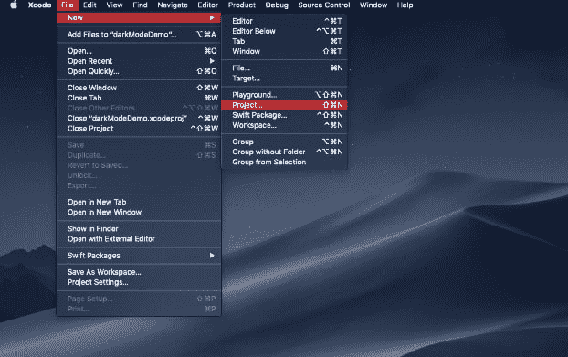
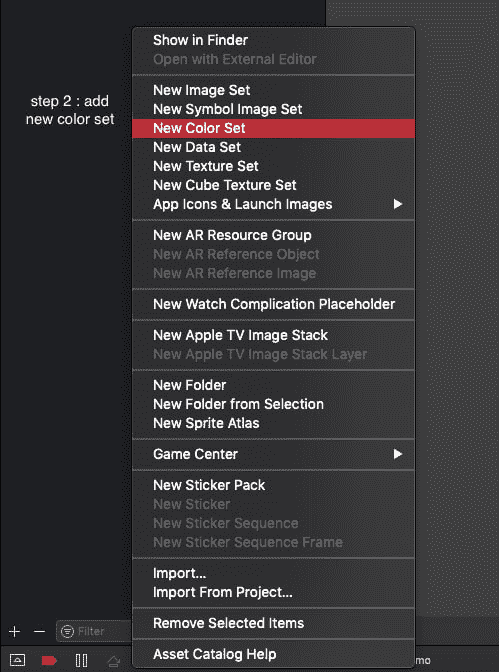
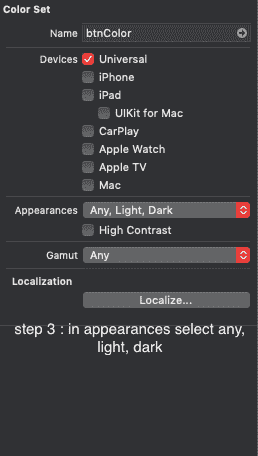
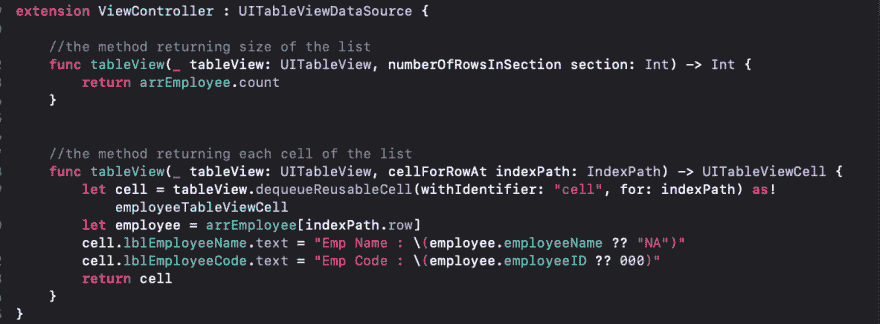
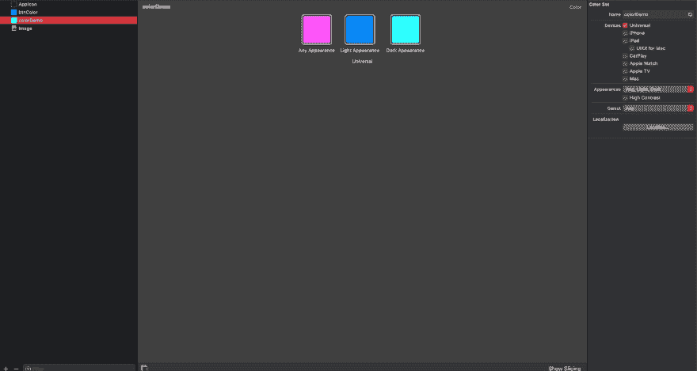
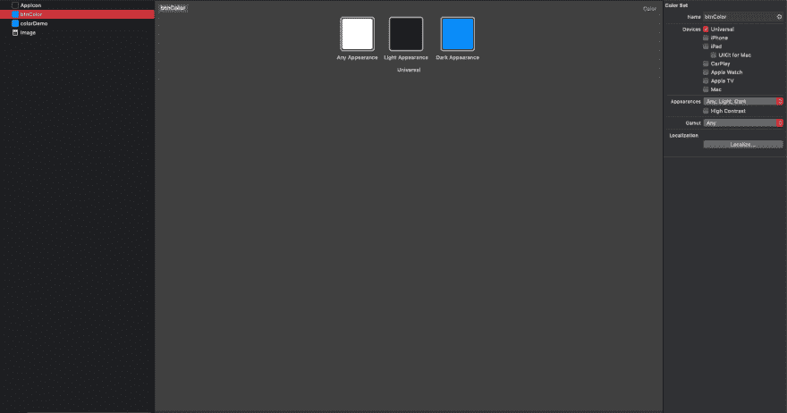

# iOS 教程:如何用 iOS 13 自定义 iOS app 中的黑暗模式

> 原文：<https://dev.to/amitspaceo/ios-tutorial-how-to-customize-dark-mode-in-ios-app-with-ios-13-57a8>

*2019 年苹果全球开发者大会(WWDC)带来了许多新功能、新技术和新版 iOS (iOS 13)。它于 2019 年 6 月 3 日至 7 日举办。在本次开发者大会期间，宣布黑暗模式将在 iOS 13 及以后的版本中推出。*

**你将在这个博客中学到什么:**

*   什么是 iOS 黑暗模式，它做什么
*   使用黑暗模式的好处
*   在应用程序中实施黑暗模式时的重要考虑事项
*   为您的 iOS 应用程序定制不同主题的配色方案——亮暗模式。

**什么是 iOS 黑暗模式？它是做什么的？**

黑暗模式是一种黑暗的系统外观，所有屏幕、视图、菜单和控件都使用较暗的调色板。基本上和安卓黑暗模式一样，把一个明亮的主题换成一个更暗的。它还保持活力和对比度，使前景内容在较暗的背景下更加突出。

# 黑暗模式的好处

*   当周围黑暗时，这是最有帮助的。与光线模式相比，这种模式减轻了眼睛的压力。
*   你可以选择黑暗模式作为你的默认界面风格。
*   您也可以使用设置使您的设备在环境光线较暗时自动切换到黑暗模式。
*   黑暗模式支持所有辅助功能。
*   在 iPhone X、XS、XS Max 等有机发光二极管 iPhone 机型上使用黑暗模式也可能会延长电池寿命。这是因为 OLED 面板中的黑色像素实际上会关闭并节省电池电量。
*   额外收获:黑暗模式看起来真的很酷

正如苹果在会议期间宣布的那样，苹果预装的应用程序，如笔记、新闻、电视、音乐、提醒、邮件和其他应用程序都已经有了它。

然而，开发者将能够使用苹果的新工具为他们的应用程序添加黑暗模式。作为一家 iPhone 应用程序开发公司，我们有很多客户希望将这一功能集成到他们的 iOS 应用程序中。

我们精通的 iPhone 应用程序开发人员决定通过一个简单的例子来解释这个特性，从而帮助其他开发人员。在我们看到如何添加这个特性之前，让我们知道在特性集成过程中应该记住哪些重要的考虑事项。

**在 app 中实现 [iPhone 黑暗模式](https://www.spaceotechnologies.com/dark-mode-ios-13-tutorial/)的注意事项**

将焦点放在内容上:确保内容突出，周围的用户界面退入背景。黑暗模式的目的是将焦点放在界面的内容区域。

**测试亮暗两种外观:**检查界面在两种外观下的外观。您可能需要调整设计以适应每一种外观，因为在一种外观下工作良好的设计可能在另一种外观下不工作。

**测试对比度和透明度的变化:**您必须在打开增加对比度和降低透明度时测试内容。调整对比度和透明度设置时，请确保在黑暗模式下内容清晰。

现在你已经清楚了注意事项，让我们为你的 iOS 应用定制不同主题的配色方案。

# 如何为你的 iOS 应用定制不同主题的配色方案——明暗模式。

**第一步:在 Xcode**
 中创建新项目

**第二步:在 assets.xcassets 文件夹中添加新的颜色集，如图**

第三步:进入故事板，拖动&你想添加到你的项目中的控件。
[T5】](https://res.cloudinary.com/practicaldev/image/fetch/s--6yOZYA96--/c_limit%2Cf_auto%2Cfl_progressive%2Cq_auto%2Cw_880/https://thepracticaldev.s3.amazonaws.com/i/79znq9aiauxs5jal7omc.png)

步骤 4:转到视图控制器，为 UI 控件创建出口。
[T5】](https://res.cloudinary.com/practicaldev/image/fetch/s--_oeBoAVu--/c_limit%2Cf_auto%2Cfl_progressive%2Cq_auto%2Cw_880/https://thepracticaldev.s3.amazonaws.com/i/tsxt8gicla2srhru1mow.png)

**步骤 5:创建 employee struct 并创建 employee struct 的数组**

**第六步:追加 arrEmployee 中的数据，与 UITableView**
 绑定

**第七步:为表视图**
 分配数据源

**步骤 8:为雇员**
 创建一个 UITableViewCell 类

**第九步:实现 UITableView 数据源方法**

**步骤 10:创建开关事件，为虚拟场景**
 设置主题(亮或暗)

**步骤 11:设置 viewdidload**
 中控件的默认行为

**步骤 12:将资产文件夹与下图**
 进行比较

那都是乡亲们！

# 胜负

# 总结笔记

我们希望你觉得这个 iPhone 教程是有用的，并且你对 iPhone 黑暗模式的概念是清楚的。你可以在 [github](https://github.com/spaceotech/SODarkModeDemo) 上找到这个 iOS 13 黑暗模式图解的源代码。

在这里，在这个 iPhone 应用程序教程中，我们了解了如何为 ios 黑暗主题和光明主题定制 iOS 应用程序主题。

如果您对本教程有任何建议或疑问，或者对 [iPhone 应用开发](https://www.spaceotechnologies.com/iphone-app-development/)有任何疑问，我们洗耳恭听。