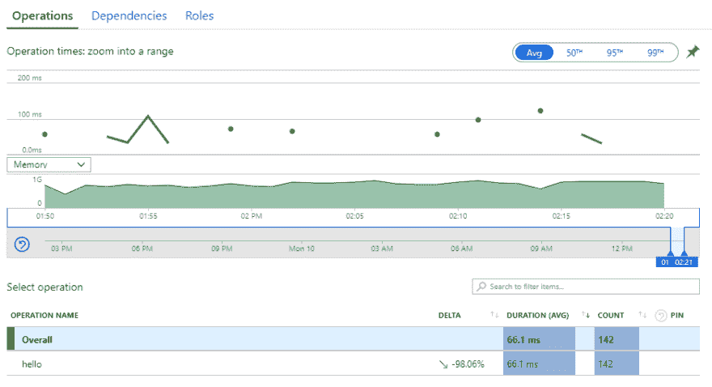

# 在 Azure Functions 上运行 Spring Boot 划算吗？

> 原文：<https://dev.to/azure/is-it-cost-efficient-to-run-spring-boot-on-azure-functions-1kce>

由于我目前正在 Azure 文档网站的[上撰写官方的“Azure Functions 上的 Spring Boot”文档，我在](https://docs.microsoft.com/en-us/azure/azure-functions/?WT.mc_id=devto-blog-judubois)[发布了一个示例应用程序](https://github.com/jdubois/hello-spring-function-azure)，并收到了很多关于性能和相关成本的评论，我们可以从这样的设置中得到预期。

因此，我做了一些相当广泛的测试，我将在这里总结一下。请注意，Azure Functions 的定价模型在这里非常重要，所以如果你想要最具成本效益的解决方案，你应该首先详细研究这个模型，并据此规划你的应用部署。

一旦我的“Azure Functions 上的 Spring Boot”文档在官方文档网站上发布，我就会更新这篇博文。

## Azure 功能介绍

[Azure Functions](https://docs.microsoft.com/en-us/azure/azure-functions/?WT.mc_id=devto-blog-judubois) 是由 [Azure](https://azure.microsoft.com/en-us/?WT.mc_id=devto-blog-judubois) 提供的“无服务器”解决方案，所以基本上它按需运行你的代码，响应一个事件，而不需要你提供或设置任何东西。

它有不同的定价模型，包括一些“高级”模型，但这里的经典用例是用一组功能替换一个简单的应用程序，以获得相关的运营成本。

由于我们正在谈论 Spring Boot，这篇博客文章将关注 Web 应用程序，但请注意，Azure Functions 并不局限于 Web 应用程序:它们只是 Azure 函数的一种，恰好由 HTTP 调用触发。其他几种类型的事件也可以触发 Azure 函数，通常是在你做批处理或者物联网的时候。

## Spring 云函数介绍

Spring Cloud Function 是一个官方的 Pivotal 项目，旨在在无服务器提供商上运行 Spring Boot。它包括一个特定的 Azure 提供者，所以你可以很容易地运行一个 Spring Boot 应用程序作为 Azure 函数。

## 冷启动问题

为了在没有任何前期成本的情况下托管功能，无服务器提供商在不使用这些功能时将其置于“休眠”状态。当一个函数被调用时，无服务器提供者需要唤醒那个函数:它找到一个可以运行它的服务器，安装它的文件系统，然后执行那个函数。

这本身就需要时间，通常有两种方法可以解决这个问题:

*   有些人使用某种 cron 作业来定期唤醒他们的功能:这相当麻烦(因为你永远不知道该功能何时会变得不活动)，并且不真正遵循无服务器功能的理念。
*   如果你使用的是 Azure，那就买一个“高级”版本的 Azure Functions，在那里你可以拥有“永远温暖”的功能。当然，这将花费更多的钱，并解决大部分问题。

“冷启动”有多长时间？这里没有官方数字，Azure Functions 也在不断完善中，不好说，不过要几秒钟。此外，启动一个简单的 Spring Boot 应用程序，如[我的示例应用程序](https://github.com/jdubois/hello-spring-function-azure)，大约需要 4 秒钟，这不依赖于云提供商。

下面是示例应用程序启动时的日志:

切换到另一个 JVM 框架在这里可能不会有太大的帮助:您也许可以通过移除 Spring 来赢得几秒钟的时间，但是“冷启动”在全局上总是需要几秒钟。

*请注意*,没有官方指标告诉你一个应用程序什么时候变得不活动，但是你可以在各种博客上找到，它现在需要大约 20 分钟不活动。

## 用保费计划避免冷启动

如果你购买了 Azure Functions 的一个“高级”实例[，你可以消除大多数冷启动问题:](https://docs.microsoft.com/en-us/azure/azure-functions/functions-premium-plan/?WT.mc_id=devto-blog-judubois)

*   这些实例更强大，导致“冷启动”将很容易低于 5 秒(包括 Spring Boot 启动不到 2 秒)。
*   它们还提供“预热”的实例，无论如何都会消除大部分问题，因为总会有活动的实例准备好为请求提供服务。

## Spring Boot 够快吗？

一旦“冷启动”问题得到解决，正如我们从下图中看到的，我们的大多数请求花费的时间不到 100 毫秒:

这里的 100 ms 标记不是随机取的:这是每次函数执行需要向您收费的最小执行时间。因此，保持在该执行时间内是非常重要的，但从成本角度来看，低于 100 毫秒没有多大意义。这就是为什么在这里进行任何调整可能都没有意义。

## Spring Boot 是否使用了过多的内存？

从下图可以看出，我们的应用程序始终使用不到 1 Gb 的 RAM:

根据我经验，您可以用不到 512 Mb 的内存运行复杂的 Spring Boot 应用程序，如果您对它们进行了很好的调优，您的内存可能会低于 256 Mb。由于 Azure Functions 按 128Mb 的存储片向您收费，这可能是您可以节省费用的地方，而不是花费在执行时间上。尽管如此，在普通的 Azure 函数上设置`JAVA_OPTS`是不可能的(你需要使用一个“高级”计划来受益于这个选项)，所以如果你使用的是 JVM，这是很难调优的。

## 有“低流量”功能

**请注意**所有计算都是在这篇博文发表时完成的，使用的是[官方定价文档](https://azure.microsoft.com/is-is/pricing/details/functions/?WT.mc_id=devto-blog-judubois)。

让我们来计算一个“低流量”函数。所谓“低流量”，我们的意思是我们的应用程序将在半天的时间里每秒处理一个请求。所以这是一个典型的只有几个用户的业务应用程序。此外，由于“冷启动”*非正式地发生在应用程序不活动超过 20 分钟时，这种情况在这样的应用程序中不会经常发生，因此我们可以在计算中忽略它们。*

该成本分为两部分，首先是消耗部分:

*   60*60*24*30*0.5 = 1，290，000 次执行
*   由于执行时间(大部分时间)不到 100 毫秒，所以这就转化为 129，000 秒
*   正如我们在图表中看到的那样，我们使用的内存远远小于 1 Gb，因此我们可以假设它将占用不到 7 张 128 mb(或 896 mb)的幻灯片。因此，这改变了我们之前的计算，即 129，000*896/1024 = 112，875 Gb/s
*   由于这远远低于我们免费提供的 400，000 Gb/s，因此不存在任何成本风险

然后，执行成本部分:

*   同样，60*60*24*30*0.5 = 1，290，000 次执行
*   因为我们有 1，000，000 例免费处决，所以还剩下 290，000 例需要支付
*   因为执行成本是每 1，000，000 次执行 0.2 美元，所以这将花费几美分

因此，这个“低流量”选项对我们来说是免费的。除非我们有一个大的交通高峰，我们有一个非常有限的风险，这成本超过几美分。

## 有“中等流量”功能

我们将进行同样的计算，但是这次我们每秒钟有 10 个请求，仍然是在半天的时间里。

这里是消费部分:

*   10*60*60*24*30*0.5 = 12，900，000 次执行
*   由于执行时间少于 100 毫秒，因此转换为 1290000 秒
*   这使得 1，290，000*896/1024 = 1，128，750 Gb/s
*   由于我们仍有 400，000 Gb/s 的免费流量，我们将总共支付 728，750 Gb/s 的流量
*   所以最终消费价格是 0，000016*728，750 = 11.66 美元

对于执行部分:

*   同样，10*60*60*24*30*0.5 = 12，900，000 次执行
*   因为我们有 1，000，000 例免费处决，所以还有 11，900，000 例需要支付
*   因为执行成本是每 100 万次执行 0.2 美元，所以这是 2.38 美元

因此，这个“中等流量”功能的总价格大约是每月 14 美元。

## 有“高流量”功能

现在我们要做一个“高流量”功能，每秒 50 个请求，仍然是半天。这里要小心，因为这里有一个技巧:除非其他无服务器提供商，否则 Azure Functions 可以并行运行你的函数。因此，对于每秒 50 个请求，我们非常确定 Azure Function 将在同一个实例上并行执行几个函数。这意味着我们在 Azure 上将有更少的“冷启动”问题，这当然是个好消息。

这里是消费部分:

*   50 * 60 * 60 * 24 * 30 * 0.5 = 64800000 次执行
*   由于执行时间少于 100 毫秒，这就转化为 6，480，000 秒
*   这使得 1，290，000*896/1024 = 5，670，000 Gb/秒
*   由于我们仍有 400，000 Gb/s 免费，我们将总共为 5，270，000 Gb/s 付费
*   所以最终消费价格是 0，000016*5，270，000 = 84，32 美元

对于执行部分:

*   同样，50*60*60*24*30*0.5 = 64，800，000 次执行
*   因为我们有 1，000，000 例免费处决，所以还剩下 63，800，000 例需要支付
*   因为执行成本是每 100 万次执行 0.2 美元，所以这是 12.76 美元

因此，这个“高流量”功能的总价格约为每月 97 美元。

## 总结和最后的想法

Spring Boot 在 Azure 函数上工作得非常好！有几件事需要记住:

*   冷启动可能非常烦人，但只有在交通流量非常低的情况下才会发生。如果这对你来说很重要，你也可以通过购买“高级”计划来完全避免它们。
*   执行时间对于降低成本非常重要，Spring Boot(和 JVM！)应该快得足以保证这里有一个好的定价。
*   内存是一个更大的问题，可能会一直是所有基于 JVM 的框架的问题，因为不可能在“高级计划”之外设置`JAVA_OPTS`。
*   价格非常低，即使对于每秒 10 到 50 个请求的应用程序也是如此，因此有相当多的并发用户。