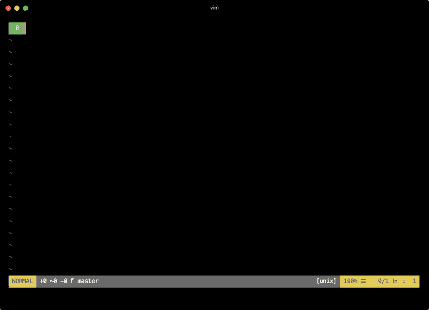
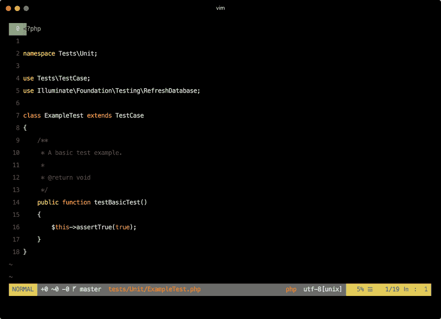
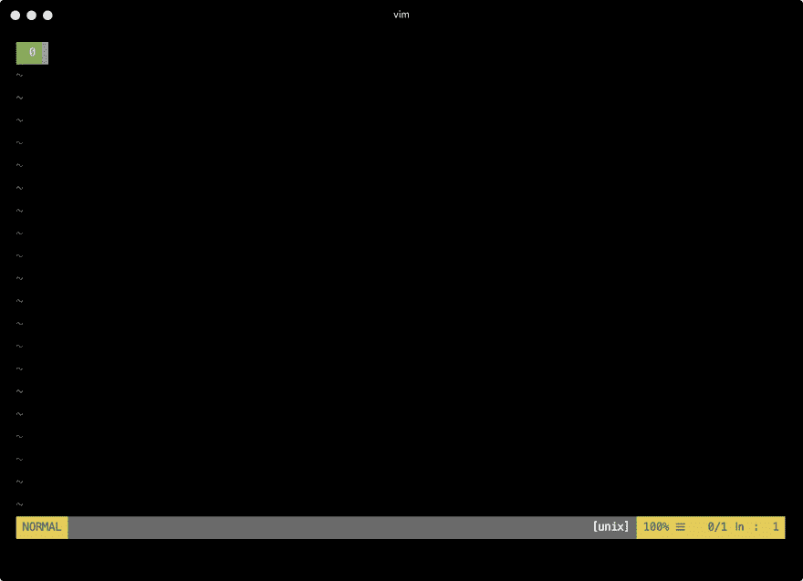
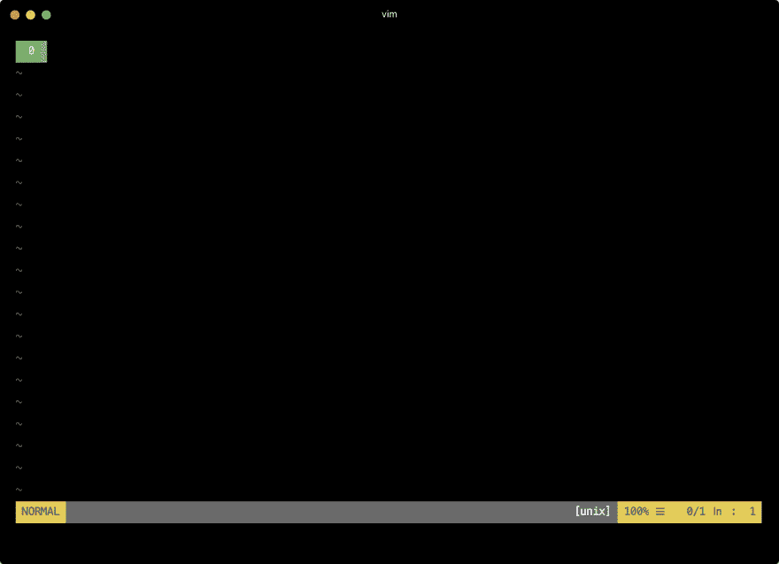

# 一个人 Vim 很危险！拿 Fzf 来说。

> 原文：<https://dev.to/jesseleite/it-s-dangerous-to-vim-alone-take-fzf-2i1i>

我使用 Vim 模拟器已经有几年了，但显然这还不够乏味，所以我最近改用了终端 Vim。进入 Vim 插件的世界是令人生畏的，但是有一个插件使它变得容易多了。通过*传奇* [Junegunn](https://github.com/junegunn) 进入 [fzf.vim](https://github.com/junegunn/fzf.vim) ，这是一个同名命令行模糊查找器 [fzf](https://github.com/junegunn/fzf) 的包装器。从表面上看，它似乎只是另一个模糊的发现者，但远不止如此！让我向您展示一些我的映射以及我是如何使用它的...

## 文件查找器

典型的模糊文件查找器👌这里我映射了`<Leader>f`来搜索 git 跟踪的文件，映射了`<Leader>F`来搜索所有文件*。

```
nmap <Leader>f :GFiles<CR>
nmap <Leader>F :Files<CR> 
```

我从来没有使用过更快的模糊查找器，它似乎比大多数更智能地对结果进行排序。还值得注意的是，每个 fzf 命令都以所谓的[扩展搜索模式](https://github.com/junegunn/fzf#search-syntax)显示结果，这允许您使用直观的类似正则表达式的语法实时缩小结果范围。

*您可以通过在 shell 配置中设置`FZF_DEFAULT_COMMAND`来自定义`:Files`输出。[我设置了](https://github.com/jesseleite/dotfiles/blob/c5fc4a2569f505960eaa542ce6ec0750a801896e/zsh/zshrc#L39)来显示所有东西，包括隐藏的文件。

[](https://res.cloudinary.com/practicaldev/image/fetch/s--x_cxBoVj--/c_limit%2Cf_auto%2Cfl_progressive%2Cq_66%2Cw_880/https://thepracticaldev.s3.amazonaws.com/i/5rr3yxrdmd5tgjalor1q.gif)

## 缓冲查找器

这里我映射了`<Leader>b`来搜索打开的缓冲区，映射了`<Leader>h`来搜索缓冲区历史。

```
nmap <Leader>b :Buffers<CR>
nmap <Leader>h :History<CR> 
```

这两个文件可以很容易地在缓冲区之间切换，并按最近的顺序排列结果，这样您就可以很容易地在两个最近的文件之间切换，而不需要输入搜索查询。

[](https://res.cloudinary.com/practicaldev/image/fetch/s--MKC9W8gA--/c_limit%2Cf_auto%2Cfl_progressive%2Cq_66%2Cw_880/https://thepracticaldev.s3.amazonaws.com/i/46d9nyacax62exoi7i2x.gif)

## [标签查找器](#tag-finder)

这里我映射了`<Leader>t`来搜索当前缓冲区中的标签，映射了`<Leader>T`来搜索整个项目中的标签。

```
nmap <Leader>t :BTags<CR>
nmap <Leader>T :Tags<CR> 
```

前者不需要标签文件，是像[标签栏](https://github.com/majutsushi/tagbar)这样的包的一个很好的替代品，因为模糊搜索方法名通常比通过第二个窗口导航要快。后者与像 [gutentags](https://github.com/ludovicchabant/vim-gutentags) 这样的包结合起来非常强大，在那里搜索`indexpostcon`会跳转到你的`PostController`的`index`方法。

[](https://res.cloudinary.com/practicaldev/image/fetch/s--WzO7GChp--/c_limit%2Cf_auto%2Cfl_progressive%2Cq_66%2Cw_880/https://thepracticaldev.s3.amazonaws.com/i/sce6jwcopq0rioyi9ld7.gif)

## 寻线器

在这里，我映射了`<Leader>l`来搜索当前缓冲区中的行，`<Leader>L`来搜索已加载缓冲区中的行，`<Leader>'`来搜索已标记的行。

```
nmap <Leader>l :BLines<CR>
nmap <Leader>L :Lines<CR>
nmap <Leader>' :Marks<CR> 
```

老实说，你会从`/`和`ag`中获得更多的能力，但是它们需要更多的思考，因为它们不是模糊搜索。能够模糊搜索标记和未标记的行是快速和宽容的。当标签不可用时(例如在。vue 组件或普通组件。txt 文件)。

[](https://res.cloudinary.com/practicaldev/image/fetch/s--MnyeYLPN--/c_limit%2Cf_auto%2Cfl_progressive%2Cq_66%2Cw_880/https://thepracticaldev.s3.amazonaws.com/i/vs45aigu6j2p8idte4tg.gif)

## 项目查找器

```
nmap <Leader>/ :Ag<Space>
nmap <Leader>/ :Rg<Space> 
```

当你需要项目搜索能力时，大多数人要么回到终端运行 [ag](https://github.com/ggreer/the_silver_searcher) 或 [rg](https://github.com/BurntSushi/ripgrep) ，要么寻找像 [ack.vim](https://github.com/mileszs/ack.vim) 这样的搜索包装器。包装器很好，因为它们允许您留在 Vim 中，但是它们通常希望您在看到结果之前指定您的可搜索路径。

Fzf 的`:Ag`和`:Rg`包装器命令允许您首先关注您的搜索查询，然后使用 fzf 的所有模糊查找器都可用的相同的[扩展搜索模式语法](https://github.com/junegunn/fzf#search-syntax)实时缩小结果。在单个结果上点击`Enter`将打开该文件，完全跳过快速修复窗口。如果你正在做一个更大的重构，你可以`Tab`选择多个结果，`ALT-A`选择所有结果，然后`Enter`填充 quickfix 窗口。

这是一个非常强大的工作流程，我唯一的不满是它不允许您将命令行选项传递给开箱即用的`ag`或`rg`...但是没关系，因为[我为那个](https://github.com/jesseleite/vim-agriculture)写了一个插件🚜如果你有兴趣了解更多关于我的项目搜索工作流程，[我写在这里！](https://dev.to/posts/4/project-search-your-feelings)

[](https://res.cloudinary.com/practicaldev/image/fetch/s--Abo_hFPp--/c_limit%2Cf_auto%2Cfl_progressive%2Cq_66%2Cw_880/https://thepracticaldev.s3.amazonaws.com/i/to3904mrhce6737unp9y.gif)

## 帮助查找器

```
nmap <Leader>H :Helptags!<CR> 
```

有时候浏览 Vim 的`:help`文档会很痛苦。找到合适的文章可能很难。Fzf 的`:Helptags`改善了这种体验，特别是当你运行它时，砰的一声`!`以全屏查看结果(顺便说一下，这也适用于 fzf 的其他命令)。

[](https://res.cloudinary.com/practicaldev/image/fetch/s--YOOyuoSB--/c_limit%2Cf_auto%2Cfl_progressive%2Cq_66%2Cw_880/https://thepracticaldev.s3.amazonaws.com/i/dmtpzxwm6c1e8x39pk4l.gif)

## 但是等等，还有！

模糊搜索定义的命令，无论是用户定义的、插件定义的还是本地命令:

```
nmap <Leader>C :Commands<CR> 
```

模糊搜索`:command`历史:

```
nmap <Leader>: :History:<CR> 
```

模糊搜索键映射，这对于在定义新映射之前检查当前映射非常有用:

```
nmap <Leader>M :Maps<CR> 
```

模糊搜索文件类型语法，并在结果上点击`Enter`来设置当前缓冲区的语法:

```
nmap <Leader>s :Filetypes<CR> 
```

如此多的可能性，如果你想创建自己的模糊查找器，它是高度可扩展的！

## 一言以蔽之...

Fzf 最大的优势不仅仅在于它的速度，还在于它一致的界面和可扩展性，可以模糊地找到所有的东西。它让我几乎做任何事情都变得更快，并迅速取代了 ctrlp、tagbar、ack.vim 等软件包。如果有的话，我希望你模糊发现这启发！

## 喜欢这篇文章？

请给我一个跟随❤️的人