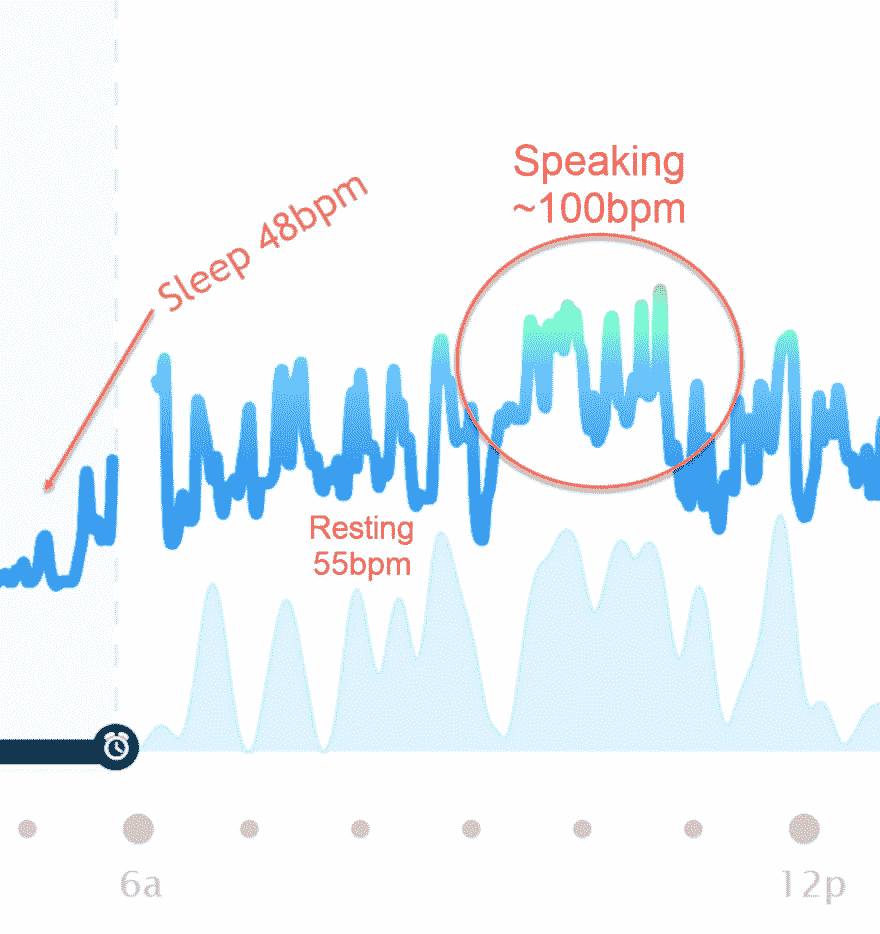
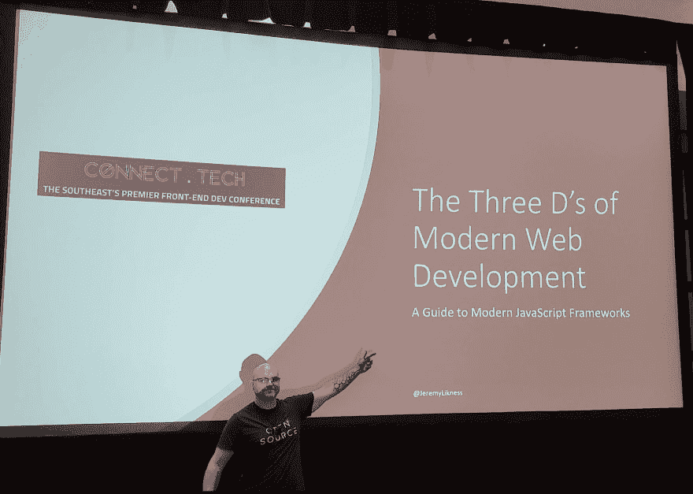
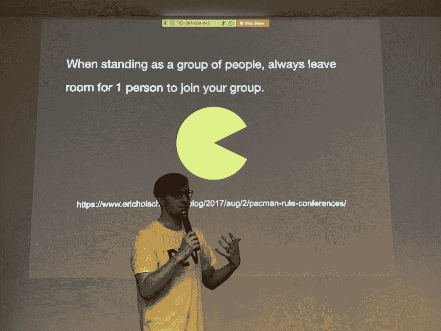
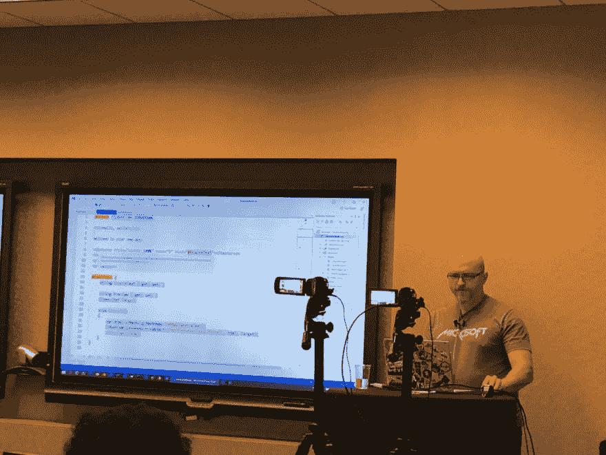

# 该是⌚和🗣对话的时候了！你演讲的那天

> 原文：<https://dev.to/azure/it-s-time-to-talk-the-day-of-your-presentation-2kpl>

我花了十年时间做技术报告，在此期间我学到了一些东西。这个系列的目的是与你分享这些经验。这些不是让你成为顶级演讲者的最佳实践或秘密提示，而是基于个人经验的实用建议。

在这个系列中:

*   [为什么说话？](https://dev.to/azure/a-guide-for-everyone-who-wants-to-give-technical-presentations-53bo)
*   [在哪里说话？](https://dev.to/azure/how-to-choose-where-to-give-your-technical-presentation-5g14)
*   [谈话格式](https://dev.to/azure/the-many-flavors-of-technical-presentations-3fjj)
*   [征集演示文稿](https://dev.to/azure/the-amazing-secret-to-crafting-conference-submissions-that-don-t-suck-hgf)
*   [制作您的演示文稿](https://dev.to/azure/build-a-bomb-diggity-technical-presentation-mic-drop-optional-1fhb)
*   [练习和反馈](https://dev.to/azure/how-to-practice-for-a-lit-presentation-51n9)
*   [准备出行](https://dev.to/azure/what-s-in-the-bag-packing-tips-for-technical-presentations-4k6n)
*   你演讲的那天(你在这里)
*   [演讲和总结后](https://dev.to/azure/after-your-talk-the-power-of-leverage-2enj)

# 👉🏻你演讲的那天

终于发生了！“大日子”到了，是时候发表你的演讲了。这里有一些小贴士可以帮助你为“一天”做好准备。

<figure>

<figcaption>My morning meal before speaking at DevLink in 2014</figcaption>

</figure>

## 套路

尽可能保持你的正常作息是非常重要的。这不是突然不吃早餐或吃些不同东西的时候。我知道紧张会让你难以下咽，但是晕倒会让你难以完成演讲！如果你的胃比较敏感，调整你的饮食，吃一些清淡的食物。我的典型场景是这样的:

*   我在同一时间醒来(如果我的演讲很早，那意味着前几天也起得很早)。
*   如果时间允许，我锻炼是释放一些多余肾上腺素的好方法，可以让我为演讲感到兴奋。
*   我吃典型的早餐。
*   如果谈话是在一天的晚些时候，我会在我习惯的时间间隔内吃正常的饭。
*   如果一顿饭和我的演讲之间有间隙，我会在开始前几分钟吃一块蛋白质棒。
*   我总是在发言前去洗手间，即使我认为我不需要它。
*   我确认房间里有水瓶，如果没有，请自带水(尽管出于科学原因，我更喜欢苏打水😮我在演讲前和演讲中坚持不动的水)。
*   根据日程安排，我会尽可能早地到达。在一些会议上，那可能是在演讲前 30 - 45 分钟。在其他情况下，这可能意味着就在演讲前 10 分钟。
*   在我进入会议室之前，我会根据我的笔记，在我的酒店房间或扬声器房间准备我的电脑。这样，我只需打开我的笔记本电脑盖子和插件，这样任何额外的时间都可以用来解决音频或视频问题，如果他们发生了。你不想等到最后一分钟才设置！

## 神经

如果你采访十几个有经验的演讲者，也许有一两个会告诉你他们不再紧张了。我们大多数人仍然会感到兴奋，肾上腺素激增。甚至当我感觉自己很自信很平静的时候，我的心率却在讲述一个不同的故事。在做了十多年的公开演讲后，这是我演讲时的心率:

<figure>

<figcaption>My heart rate the day of a talk</figcaption>

</figure>

你可以做几件事来最小化紧张的影响。这是一个🐔鸡肉和🥚彩蛋场景。我们变得紧张是因为我们希望谈话顺利进行，但通常会破坏它的是，嗯，紧张。所以，前一天晚上一定要充分休息。我个人更喜欢带一些褪黑激素来帮助我睡觉，避免熬夜在脑子里思考各种可能性。

准备时有几件事对我有帮助。我提醒自己为什么要这样做，并想象期望的结果(参与者很高兴，因为他们学到了新东西)。我提醒自己，勇气并不意味着你不害怕，而是意味着尽管害怕，你仍勇往直前。我会保留电子邮件、推文或其他反馈的副本，这些反馈表明我的一次演讲对某人产生了积极的影响。这些不是让我分享和吹嘘的，而是让我参考和记住为什么我要做我所做的。因为参加了一个讲座，知道有人解决了一个问题，甚至在职业生涯中取得了积极的进展，这是一个很大的激励，让我回到这样一个事实，那就是这并不是真正关于我的，尽管我希望如此。是关于观众的。

<figure>

<figcaption>Having some fun before a presentation</figcaption>

</figure>

一些演讲者发现，在与与会者建立联系后，演讲变得更加容易。你可以走向观众，向观众介绍你自己。了解他们的一天过得如何，他们的期望是什么，并对他们感到满意。这将使你更容易在台上继续对话，并在你发言时给你一些友好的面孔。

最后，我还记得一位商业教练给我的话，尽管听起来有点奇怪，但这句话让我印象深刻:“你知道你所知道的。换句话说，活动前的几天准备会真正影响你的表现。在改变事情之前的几个小时或几分钟内，你不会收到新的信息或神奇的洞察力，所以放松，让它发生。信不信由你，观众们希望你成功。他们站在你这边！所以，不要忘记💧补充水分，尽情挥洒吧！

## 起跑线

有些演讲者永远不知道如何开始一场演讲。我确保自己有一个坚实的开端，并经常练习。我尽量避免使用这样的短语:

“嗯，看样子是时候了。我想我现在要开始了。”

虽然我努力了，但我也是人，并不是每次都做对。我最喜欢用什么方式开始？

“大家好！欢迎来到 Commodore 64”上的实时编码 BBS 系统，并直接进入我的幻灯片。如果我有一些有影响力的东西要分享，我通常会在提到我的名字或背景之前先说出来。我做了自我介绍，并分享了一张包含联系信息的幻灯片，但强调每个人都可以在演讲后*与我见面，这样我就可以进入演讲的内容了。我了解到，大多数与会者要么不在乎我是谁，要么已经知道我是谁，所以当我把额外的时间花在我正在介绍的主题上时，他们会获得更多的价值。*

我建议你永远不要在谈话前道歉。“这是我第一次，如果演示搞砸了，我很抱歉”这是一种消极的语气。掌控谈话，并表现得好像会很顺利，有目的地处理任何打嗝。当演讲者告诉我，“这通常是一个 x 分钟的演讲，但我已经为你把它砍掉了”，这让我有一种轻微的失落感。我错过了什么？谈话不完整吗？精简一个演讲并把它作为一个完整的包来提供是可以的。这里的假设是，你已经找到了重要的部分，并可以参考其他文档或演示来填补空白。

你可以从一个问题、一个激动人心的事实或一个引人入胜的故事开始。如果你只有不到 8 分钟的时间，👀在这里看看一些可行的建议:

> 大卫·迪吉玛博士@ view magazine如果你不知道这一点，那么这就是演讲的开始。这八分钟可能对你接下来的演讲有所帮助[youtube.com/watch?v=w82a1F…](https://t.co/XwgI5y8VfU)2019 年 5 月 23 日上午 07:1502

当谈话以“让我看看，我的幻灯片在哪里”或一声长叹接着“让我们希望一切顺利”开始时，往往会失败。这里的主题是:自信地呈现即使你没有感觉到，也不要为做你自己而道歉，不要冒险站在观众面前，直接进入材料。把闲聊留到开始之前。

> ⭐提示:在演讲开始时让每个人都兴奋和感觉良好没有什么不对。我经常要求观众感谢赞助商和其他演讲者，或者用掌声表达他们对会议的感受。有时，我会带一个 360°相机，问他们是否愿意“选择加入”一张照片，然后要求每个人尖叫和呼喊，以展示一段美好时光。最终结果？每个人都很开心，充满活力，在课程中感觉很棒。[看看我的 360°发布会图片](https://kuula.co/post/7Phn8/collection/7fy4R)。

## 交货

交付是你一直在练习的。以下是我在演讲中做的几件事:

*   识别观众中的面孔并与之交谈。我试着让尽可能多的人参与进来，微笑或点头表示认可总是值得的。
*   衡量观众的能量。如果是在午饭后，一半的与会者都睡着了，我可能会调整我的声音，喊一句话或以某种方式重新参与进来。
*   听听我自己的表达，如果我太频繁地使用“实际上”或“基本上”这样的填充词，请纠正(解决方法是在旋转或收集我的想法时暂停，而不是把随机的词塞进空白)。
*   在有意义的时候走动一下，但不要让它分散注意力。
*   有效地使用我的手和胳膊，但不要过分强调重点。
*   如果正在录制会话，请对着摄像机对离线观众讲话。
*   记录时间，确保我在正确的时间得出正确的结论。

有关交付的精彩系列，请查看:

 [## 有效地使用你的声音进行有影响力的演讲

### 约翰爸爸 3 月 21 日 192 分钟阅读

#devrel #career #discuss](/azure/use-your-voice-effectively-for-impactful-presentations-4128)

> ⭐提示:长时间跑步是对观众和下一位演讲者时间的不尊重。如果需要的话，准备好省略你演讲的部分内容。我通常会练习几次演讲来加快语速，并且知道哪些地方我可以说得更快，或者如果我有额外的时间，我可以深入细节。在你阐述完你的观点和现场问题后，提前结束是可以的。很少有开发人员会抱怨在他们的时间表中得到一些时间来在会议之间喘口气。尽量不要让别人注意到你提前结束或者错过了内容。拥有演示文稿，如果有更多要分享的，在后续的推文或博客帖子中提出来。

## 总结和管理问题

我试着像开始时一样坚强地结束。我从来不喜欢听到“好吧，我想我就这么多了，”或者“我想我完了。”我也不喜欢选择自己的结尾，当演讲者说，“我们有几分钟时间，你想看看吗...?"我已经这样做了，但是当我预先做决定，或者分享额外的内容，或者暂停提问时，通常会更好。

管理问题是一门艺术。问题可能会让你完全迷失方向，尤其是如果有人希望在你的会议期间获得免费咨询，或者是一个喜欢被倾听的巨魔。我总是在演讲时理解我的提问方式。如果我知道我有时间，我会拿走它们，甚至在演示过程中要求它们，但更多时候我会等到最后。一开始我不做任何特别的宣布。我也有一个关于会议的建议:*不要俘虏你的听众*。我见过一些本来可以有一个强有力的结尾的伟大演讲，却在 10 分钟的会后提问中失败了。

我现在更倾向于用一个强有力的总结来结束演讲，接着是一个行动号召:“点击此链接了解更多关于 6502 指令集的信息。这套材料将在今天结束前提供。”然后，我明确表示我可以回答问题，但其他人可以自由离开。“我会留下来参加余下的会议，并期待与您见面！我们还有大约 5 分钟的时间，所以我会留在前面回答你可能有的任何问题。谢谢你陪我度过你的下午！”这意味着每个人都要离开，但也为那些有问题的人提供了一个提问的选择。

> 科里豪斯@ housecor在一场会议或用户组谈话的最后，演讲者应该如何处理提问？2016 年 7 月 12:21PM-0121

我要做的另一件事是拆除我的设备，然后下台。这让我与观众处于同一水平，所以我不会以“居高临下”的态度来回答任何人，但它也做了其他事情:它让下一位演讲者有机会站出来，开始他们的设置。没有什么比在演讲开始前几分钟发现最后一位演讲者还在台上，周围是一排带着问题的与会者更令人沮丧的了！

你的收获可能会有所不同，但我发现如果我把问题推迟到最后，在我释放了观众之后，我的演讲节奏会很好，结尾也会很好。

## 联网

如果你的日程和工作允许的话，请尽量参加整个会议！演示会带来巨大的价值，但通常是之前和之后的交流促进了增长和转变。这里有一些成功社交的小技巧:

*   花一些时间在扬声器室，并了解其他发言者。但是，尽量避免一直呆在那里，因为与会者无法在那里见到你！
*   向供应商和赞助商介绍你自己，一定要感谢他们，尤其是当会议能够支付你的旅行费用时(这个赞助商很可能就是旅行预算的来源)。
*   在两次会议之间到场，以便与会者可以找到你并与你互动。如果你在与人交流和/或互动中感到疲惫，考虑在会议期间花时间去一个安静的角落充电。
*   当有午餐或欢乐时光时，我会努力避免被我认识的人吸引，而是寻找和开放空间建立一个新的团体，或者走向一个我不认识的人的圈子并介绍自己(显然这需要感觉舒服，这是我过去避免的事情，但尽管我害怕/保留，但现在我喜欢由此展开的积极互动)。

> 乔恩教堂🍕@ Jon church见鬼耶！Pacman rule 起源于 [@writethedocs](https://twitter.com/writethedocs) 在柏林 Node.js 合作者峰会上看到它被使用真是太棒了2019 年 5 月 30 日上午 7:19418

## 其他时段

最后，但同样重要的是，花点时间参加其他会议！迷茫何去何从？以下是一些可以考虑的想法:

*   如果你有同事、同事或朋友发言，考虑参加他们的会议，提供鼓励、支持和建设性的反馈。
*   如果你是一名开发人员或顾问，寻找一些主题，这些主题可以强化你正在使用的技术，或者向你介绍一个你可能没有时间自己探索的潜在的新解决方案。
*   我试图找到至少几个演讲，涉及一个我一无所知的话题。有时候我很惊讶，发现自己有兴趣了解更多。
*   有时候，你可能从与会者那里学到比演讲更多的东西。例如，当有人进行调查时，我总是很关注，比如“你使用什么前端框架？”这有助于我跟踪趋势。我也对与会者提出的问题和他们的背景故事感兴趣。你可以从别人的经历中学到很多！
*   观看其他演示风格、演示和幻灯片可能有助于激发新的想法或揭示一种你以前没有考虑过的方法。当我看到人们以创造性的方式手绘幻灯片或演示物联网设备时，我学到了很多东西。

> ⭐ **提示:**大多数演讲者喜欢记录他们的演讲，但不是每个人都喜欢给观众拍照或自拍。如果你正在开会，为什么不从房间后面抓拍一张照片，贴上来，然后贴上发言者的标签？他们可能会因此而感激你，结果你可能会获得一个新的追随者或者创造一个社交机会。然后你可以分享这个技巧，也许有人会捕捉并评论你的演讲*。*
> 
> > Jennifer bland[@ ratracegrad](https://dev.to/ratracegrad)⁦[@ jeremylikness](https://twitter.com/jeremylikness)⁩展示如何使用 c++、。net、rust、blazor 等编程语言用 web 汇编2019 年 6 月 07 日下午 16:3115

## 🎉庆祝一下！

谈话结束了...还有更多的事情要做(我将在下一期也是最后一期文章中介绍)，但是您可以松一口气，在角落里跳一会儿舞。如果你对这次谈话感觉很好，可以考虑自拍或录制一个简短的视频，分享一下你的感受，这样你就可以在未来的谈话之前参考一下，以获得动力。如果你感觉不太好，想想为什么，制定一个计划，放弃你不能改变的事情，解决、练习、学习或改正你能做到的事情。

🗣 **我们来讨论一下**关于演讲，你有什么自己或个人的经验可以分享吗？

**上一篇** [准备出行](https://dev.to/azure/what-s-in-the-bag-packing-tips-for-technical-presentations-4k6n)
T5】下一篇 [结束后的谈话和总结](https://dev.to/azure/after-your-talk-the-power-of-leverage-2enj)

> “现代 Web 开发的三维”是我在 [Connect 上录制的最喜欢的演示。Tech](https://connect.tech) 大会。它混合了 PowerPoint 和实时编码，适合 60 分钟的“分组讨论”时段。该视频可以免费观看，但嵌入功能已关闭，因此您可以在此处观看:👀[现代 Web 开发的三个 D](https://vimeo.com/303443966)。