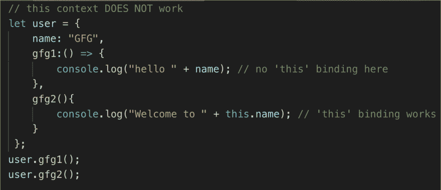
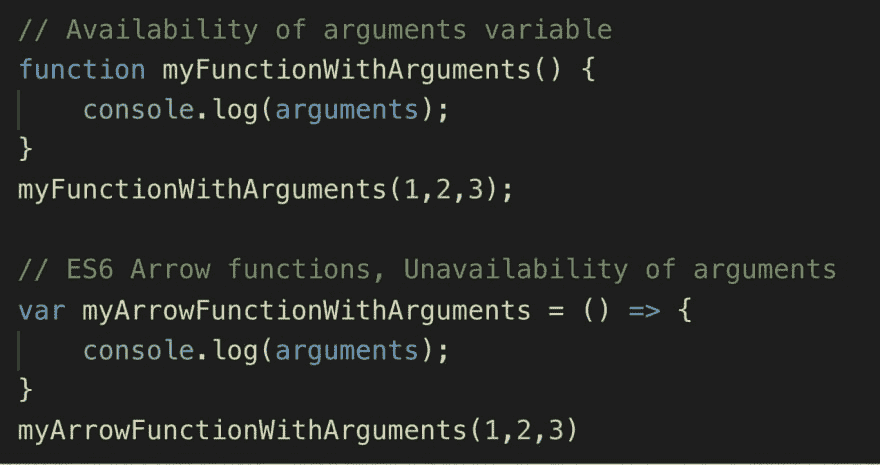
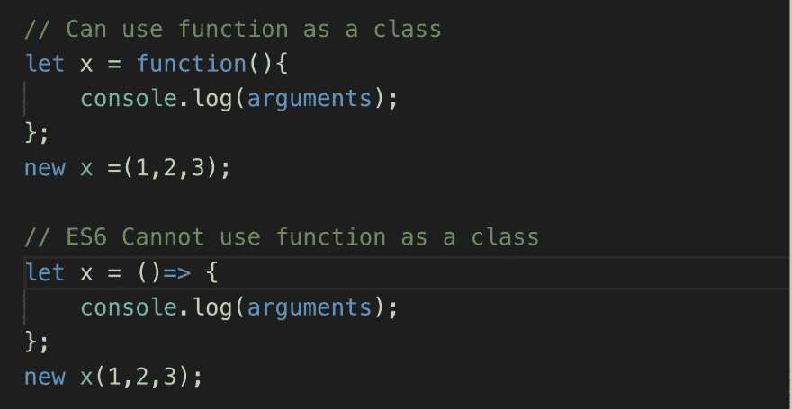

# JavaScript:箭头函数和普通函数的 3 个主要区别

> 原文：<https://dev.to/ankittanna/javascript-3-key-differences-between-arrow-functions-and-normal-functions-in8>

大家好，

这是我的第一篇文章，我想写一些关于“箭头函数”的东西。我想展示箭头函数和普通函数的区别！

通常，当在客户面试或工作面试中被问到时，人们倾向于给出最多一个不同点。但实际上，有三个主要区别:

1.  "这个"--箭头功能没有自己的上下文
    

2.  “参数”——无法访问函数内部的“参数”来了解传递给函数
     的参数

3.  "类"--不能使用箭头函数作为类，因为箭头函数没有构造函数/不像构造函数
    

如果你想亲自动手，请看这个短片:

[https://www.youtube.com/embed/HoJqZKU0ciE](https://www.youtube.com/embed/HoJqZKU0ciE)

请留下您的反馈意见。谢谢你。