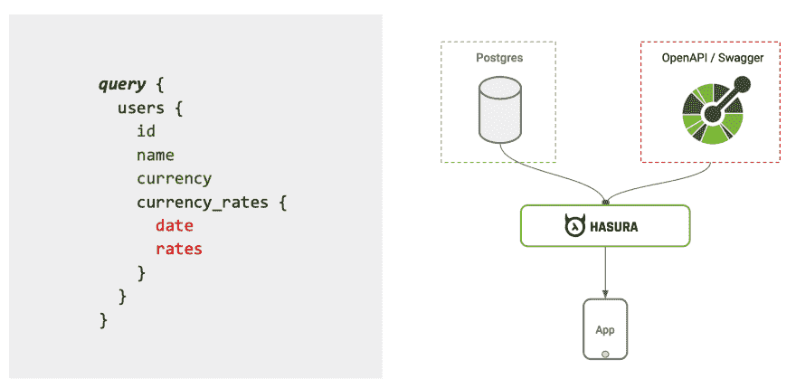
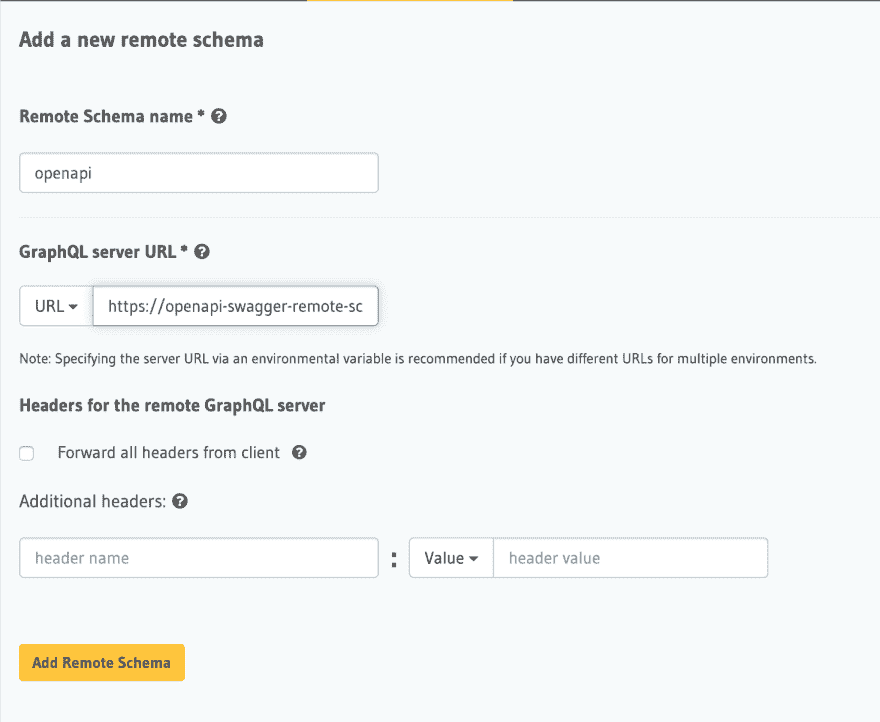

# 使用 Hasura 远程连接将任何 OpenAPI 或 Swagger Rest API 与 Postgres 连接起来

> 原文：<https://dev.to/hasurahq/join-any-openapi-or-swagger-rest-api-with-postgres-using-hasura-remote-joins-3ad8>

## TL；速度三角形定位法(dead reckoning)

使用 Hasura 远程连接将 Postgres 数据库中的数据与任何 OpenAPI/Swagger 兼容的 REST API 连接起来。样板文件-[open API-swagger-remote-schema](https://github.com/praveenweb/openapi-swagger-remote-schema)

这篇文章是我们的[远程连接](https://blog.hasura.io/remote-joins-a-graphql-api-to-join-database-and-other-data-sources/)(在预览版中可用)系列的一部分。Hasura 中的远程连接允许您跨表和远程数据源连接数据。如果你想在我们发布时得到通知，你可以在这里注册[。前往](https://hasura.io/remote-joins)[公关](https://github.com/hasura/graphql-engine/pull/2395)查看更多细节，阅读预览文件，并尝试一个你可以旋转的测试 Hasura 图像。跳到我们的[不和谐](https://discord.gg/hasura)或者评论 [github](https://github.com/hasura/graphql-engine) ，让我们知道你的想法！

[](https://res.cloudinary.com/practicaldev/image/fetch/s--zJ8suw5w--/c_limit%2Cf_auto%2Cfl_progressive%2Cq_auto%2Cw_880/https://blog.hasura.io/conteimg/2019/08/openapi-banner.png)

在这个例子中，我们将看看如何使用 Hasura 远程连接将符合 OpenAPI 规范的公共 API 中的数据与 Postgres 中的现有数据连接起来。我们将利用这个 [OpenAPI 服务](https://api.apis.guru/v2/specs/exchangerate-api.com/4/openapi.json)；它是一个货币汇率 API。给定一种货币，它将返回所有其他全球货币的汇率。

好的，现在让我们假设有一个包含列`id`、`name`、`currency`的`users`表。现在我们想在公共 API 中查询用户数据和汇率数据。让我们看看如何使用 [openapi-to-graphql](https://github.com/IBM/openapi-to-graphql) 工具来实现这一点。

## 添加 OpenAPI 服务作为远程模式

为了能够通过 Hasura 查询 OpenAPI 服务，需要使用 Hasura 控制台将其添加为`Remote Schema`。让我们在 Glitch 上部署 GraphQL 服务器。

[](http://glitch.com/edit/#!/import/github/praveenweb/openapi-swagger-remote-schema)

根据修改的需要，更改`openapi.json`文件中的 OpenAPI 模式。它目前使用这个[汇率 API](https://www.exchangerate-api.com) 。

从 Glitch 获取 GraphQL API 端点，并将其添加为远程模式。

[](https://res.cloudinary.com/practicaldev/image/fetch/s--mwxPlcTR--/c_limit%2Cf_auto%2Cfl_progressive%2Cq_auto%2Cw_880/https://blog.hasura.io/conteimg/2019/08/add-remote-schema-openapi.png)

### 添加远程关系加入

现在让我们添加名为`currency_rates`的远程关系

[](https://res.cloudinary.com/practicaldev/image/fetch/s--OMXUp2Rn--/c_limit%2Cf_auto%2Cfl_progressive%2Cq_auto%2Cw_880/https://blog.hasura.io/conteimg/2019/08/remote-relationship-open-api.png)

现在，在单个 API 调用中获取这些数据的 GraphQL 查询如下所示:

```
query {
  users {
    id
    name
    currency
    currency_rates {
      date
      rates
    }
  }
} 
```

注意，嵌套查询`currency_rates`来自遵循 OpenAPI 规范的汇率 API。它将应用过滤器`users.currency` = `currency_rates.baseCurrency`，从而只给出与当前用户的货币相关的汇率。

查看我们在远程连接系列中的其他帖子:

*   [与盖茨比一起打造音乐播放列表 app，心满意足](https://blog.hasura.io/building-a-music-playlist-app-with-gatsby-contentful-auth0-hasura/)
*   [使用 GraphQL 跨 Google Places API 和 Postgres 连接数据](https://blog.hasura.io/graphql-join-data-google-places-api-postgres-postgis-location/)
*   [使用 Contentful 和 Postgres 构建内容丰富的应用](https://blog.hasura.io/build-apps-with-rich-content-contentful-hasura-remote-joins/)
*   [连接来自 Google Sheets API 和 Postgres 的数据](https://blog.hasura.io/join-data-from-google-sheets-api-and-postgres-using-hasura-remote-joins/)