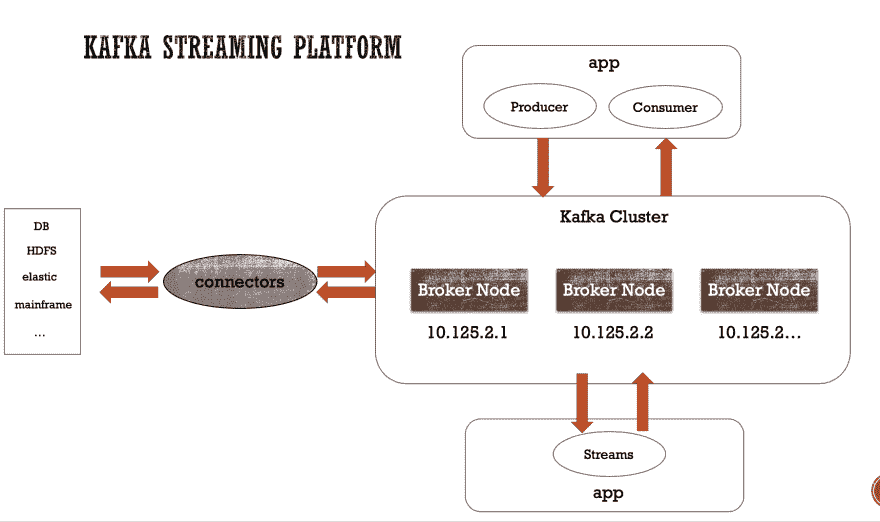

# 卡夫卡-速成班

> 原文：<https://dev.to/thegroo/kafka-crash-course-7j7>

[Apache Kafka](https://kafka.apache.org/intro) 的核心是一个分布式、可扩展和容错的日志系统，以主题抽象的形式公开，并使用高性能和语言不可知的 [TCP 协议](https://kafka.apache.org/protocol.html)实现，这使得它可以以不同的方式使用:

*   流处理系统
*   消息系统
*   存储系统

> Apache Kafka 文档非常简明扼要，我真心推荐您阅读它，作为您使用 Kafka 的初始参考。

它为[产生](https://kafka.apache.org/documentation.html#producerapi)和[消费](https://kafka.apache.org/documentation.html#consumerapi)消息、[流式传输](https://kafka.apache.org/documentation/streams)消息以及通过它的[连接器 API](https://kafka.apache.org/documentation.html#connect) 连接到外部系统提供核心 API。

它的主要客户端是 Java 中的[，但也有为](https://www.javadoc.io/doc/org.apache.kafka/kafka-clients/2.2.1)[许多其他语言](https://cwiki.apache.org/confluence/display/KAFKA/Clients#Clients-HowTheKafkaProjectHandlesClients)构建的客户端，如 Node.js。NET、Scala 等。

# 基本概念

Kafka 对其分布式日志(一个主题)进行了抽象，还提供了与之交互的客户端 API。让我们进一步了解这些主题如何在幕后提供高可用性和可伸缩性，以及使我们能够生产、消费和操作现有数据的客户端 API，但首先，我们将从较高的层面概述 Kafka 及其代理和客户端。

### 经纪人

Kafka 经纪人是管理主题的核心，他们还提供一些基本的支持来协调 Kafka 客户，这将在另一篇文章中详细解释。

向 Kafka 集群添加更多的服务器有点简单，只需要启动一个新的实例，为其分配一个惟一的代理 id，一旦启动，就将一些分区分配给新的代理。Kafka 会将数据复制到适当的代理，并将代理集成到集群中，自动管理现有的分区和副本。

### 主题

Kafka 在其分布式日志系统上提供了一个主题抽象，它可以被分区 1 到 N 次，并且它的分区也可以复制 1 到 N 次，以获得高可用性和持久性。

一个主题可以有零到多个订阅接收其中包含的数据的使用者，并且每个主题可以被多次分区，当一个主题被分区时，消息将被存储并路由到每个分区，这取决于向主题发送消息时是否提供了键。

### 卡夫卡制片人

生产者使我们能够向主题发布消息。如果我们提供了一个密钥，生产者还负责将我们的消息路由到适当的分区，或者如果我们没有在消息中提供密钥，默认情况下，生产者以循环方式将消息路由到适当的分区。

Kafka Producer 的 Java 实现是线程安全的，因此可以重用它来向不同的分区甚至主题发送消息，根据一些基准测试，重用主题实际上是推荐的，在许多情况下可以获得更好的性能。

消息总是按照生产者发送的顺序附加到日志中，并且每条消息将自动获得一个“偏移”号。消费者读取消息的顺序与它们存储在日志中的顺序相同。

当您使用 Kafka 生成器向特定主题发送消息而不提供密钥时，生成器将使用循环调度，并在所有分区之间均匀地分发消息。

如果您为每条消息提供一个键，生成器将对该键进行散列以选择分区，结果散列值必须在 0-NP(零到分区数)的区间内，这将为您提供指定键的排序保证，因为它们都在相同的有序分区中。

### 卡夫卡消费者

消费者从 1 到 N 个主题及其分区中读取消息。

消费者对如何处理这些消息有很大的控制权，并且可以根据其配置并行化和分配负载，这可以通过配置一个*消费者组*来完成。如果您将同一个消费者组分配给多个使用同一主题的实例，它们将共享负载，在现有的组成员之间划分该特定主题的可用分区，这将作为一种点对点机制，其中每个实例将从特定分区读取数据。

另一方面，如果您给每个客户机实例一个自己的*组 id* ，那么每个实例都将处理来自该特定主题的所有现有分区的消息。

多个消费者可以从特定主题读取数据，每个消费者将控制自己的偏移量。

### 卡夫卡溪流

它是一个抽象消费者/生产者客户端的库，在那里数据被读取并发布回 Kafka 主题。在这个过程中，您可以进行数据转换、连接和许多其他有趣的操作。Kafka streams 与其他流媒体平台(如 [Apache Flink](https://flink.apache.org/) 、 [Apache Spark](https://spark.apache.org/) 和其他流媒体平台)之间最显著和有趣的区别是，Kafka streams 是一个库，它直接运行，与您的应用程序位于同一个 JVM 中，这为开发人员提供了很大的灵活性和控制力，并实现了一些美好的可能性。

汇流博客上发表了一篇非常好的文章[比较了 Kafka Streams 和 Flink，如果你想了解更多关于差异的细节，我推荐你阅读。](https://www.confluent.io/blog/apache-flink-apache-kafka-streams-comparison-guideline-users/)

Kafka streams API 分为两个部分，一个是高级的 [Streams DSL](https://kafka.apache.org/22/documentation/streams/developer-guide/dsl-api.html) ，它为您提供对从主题创建的流的无状态和有状态操作，在大多数情况下，streams API 还提供了一个低级的[处理器 API](https://kafka.apache.org/22/documentation/streams/developer-guide/processor-api.html)，它以额外的复杂性为代价，为您提供了更多的控制。建议只在非常特殊的情况下使用它，在这种情况下，您需要对您的流进行更多的控制，并且不能用流 DSL 来完成。

我们将在以后的文章中更详细地看到卡夫卡作品。

### 卡夫卡式的连接器

Kafka 连接器使您能够以可靠和高性能的方式在 Kafka 和外部资源之间“同步”数据，使您能够在系统之间移动大量数据，同时利用 Kafka 的弹性和可伸缩性，并利用其自动偏移控制和通用框架来集成组织中的不同数据源。

对于一个大组织来说，拥有标准、自动化和可靠的集成是非常重要的，它使团队能够对来自许多不同系统的不断变化的数据进行实时处理和反应。

我们将在以后的帖子中看到更多关于 Kafka 连接器的细节。

# 包装完毕

我们刚刚完成了一个关于卡夫卡的速成班。我希望这篇文章能给你一个关于 Kafka 的快速的高层次的概述，理解它是如何工作的和它的 API 的基础。

对于这里涉及的一些概念的更详细的解释，我强烈建议你看看我的朋友 Tim 的这篇文章: [Head First Kafka](https://medium.com/@TimvanBaarsen/head-first-kafka-the-basics-of-producing-data-to-kafka-explained-using-a-conversation-2df6544462f) 这些概念以一种非常友好的方式被涵盖。

# 参考文献

[阿帕奇卡夫卡官方文档](https://kafka.apache.org/)

[汇合平台文件](https://docs.confluent.io/current/)

[春天的卡夫卡](https://spring.io/projects/spring-kafka)

日志:每个软件工程师都应该知道实时数据的统一抽象。