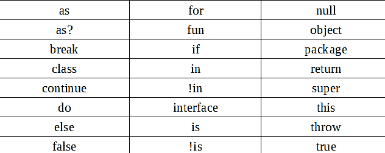

# 科特林中的关键词

> 原文：<https://dev.to/jay_tillu/keywords-in-kotlin-4116>

*   关键字是预定义的保留词，在语言中有特殊的含义。

*   通常，建议不要将其用作标识符。

*   但是在 kotlin 中，有一些关键字可以在某些情况下用作标识符。

*   kotlin 中基本上有四种类型的关键字:

*   硬关键字

*   软关键字

*   修饰符关键字

*   特殊标识符

## 硬关键字

* * *

*   kotlin 中有 24 个硬关键字，在任何情况下都不能用作标识符。

*   下面是硬关键字列表。

## 软关键字

* * *

*   科特林有 17 个软关键词。

*   这些标记在特定的上下文中充当关键字，但是您可以在另一个上下文中将它们用作标识符。

*   以下是软关键字列表。

## 修饰关键字

* * *

*   kotlin 中有 29 个修饰关键字。

*   这些标记在声明的修饰符列表中充当关键字，并且可以在另一个上下文中用作标识符。

*   下面是修饰关键字的列表。

## 特殊标识符

* * *

*   以下两个特殊标识符由编译器在特定上下文中定义，可以在另一个上下文中用作常规标识符。
*   下面是这两个标识符的列表。

拜托，伙计们，不要把它们用作标识符。就一个字，是我给你最好的建议。避免使用关键字作为标识符。

所以，伙计们，这就是关键词。如有任何疑问，请随时询问。

在那之前，继续编码，继续爱。

> 想和我联系吗？以下是链接。我很乐意成为你的朋友。😊
> [Twitter](https://twitter.com/jay_tillu)
> [脸书](https://www.facebook.com/jaytillu.1314/)
> [insta gram](https://www.instagram.com/jay.tillu/)
> [Medium](https://medium.com/jay-tillu)
> 或者直接发邮件给我[jayviveki13@gmail.com](mailto:jayviveki13@gmail.com)