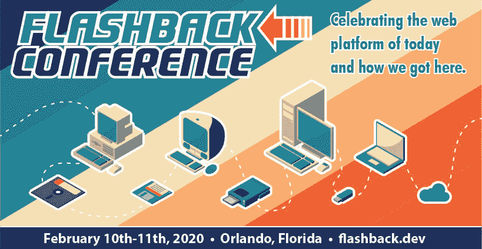

# 了解网络的历史对它的现在和未来至关重要

> 原文：<https://dev.to/remotesynth/knowing-the-web-s-history-is-critical-to-its-present-and-future-54fd>

我一直相信了解历史的重要性。大学的时候，我不是计算机专业的，是历史专业的。历史不仅仅是了解过去，它还解释了我们今天所处的位置，没有历史，我们就不知道我们将走向何方。想象一下，你突然醒来，之前的一切都不记得了。你被告知唯一安全的道路是继续前进，但是如果你不知道你去过哪里，那什么是前进呢？

在技术和开发方面，我们注重进步的理念。例如，今天的网络平台比几年前的网络平台要好，也比 20 年前的网络平台好得多。定义进步需要理解历史背景。

## 但是为什么历史对于前端开发很重要呢？

历史对于网络来说是非常重要的，因为网络是一个我们致力于完全向后兼容的平台。这种向后兼容性有时会超出平台本身，甚至扩展到开发人员用来构建平台的工具。让我们举一个相对近期的例子。

还记得《smooshgate》吗？这是一场争论，其起因是一个听起来有点荒谬的方法名称建议`Array.smoosh()`来展平一个数组。为什么这甚至是一个问题？嗯，因为很久以前有一个叫 MooTools 的工具非常流行，它使用 JavaScript 的原型继承来用`flatten()`方法扩展数组。因此，添加`Array.flatten()`会破坏任何仍在 MooTools 上运行的现有网站。杰·霍夫曼，网络时事通讯优秀的[历史的作者，对此有一个](https://thehistoryoftheweb.com/)[伟大的、深入的概述](https://css-tricks.com/yet-another-javascript-framework/)。

另一个例子围绕着 Flash 及其对开发的影响，不仅仅是 HTML5，还有它慢慢消亡后的许多工具和框架。正如我在[中谈到的 web 欠 Flash 什么](https://dev.to/remotesynth/what-the-web-owes-flash)一样，Web 平台花了一些时间来追赶 Flash 的能力。例如，现在可以通过 WebGL 和 [GLSL 着色器](https://developer.mozilla.org/en-US/docs/Games/Techniques/3D_on_the_web/GLSL_Shaders)等工具在网络上实现的 3D 可视化和游戏在 8 年前使用 Stage3D 在 Flash 中是可能的。Flash 中所做的事情极大地影响了 web 平台发展到今天的方式。

## 了解历史让你成为更好的开发者

了解历史可以加深你对网络平台的理解。从仅仅理解一个特性如何工作到它为什么会这样工作，这需要很长的路要走。回到我一开始的类比，它也把你导向了什么方向才是前进。理解我们是如何走到这一步的，为什么是理解我们如何进步的最佳指南。

* * *

web 历史的重要性是我创建[闪回会议](https://flashback.dev)的原因，该会议致力于涵盖 web 平台上的新功能、工具和框架，同时也了解它们背后的历史。

大会将于 2020 年 2 月 10-11 日在奥兰多(我的家乡)举行。我真的认为这将是一个令人惊讶和有趣的事件，我已经得到了一些了不起的发言者和赞助商排队，门票已经开始出售。我真的希望你能加入我们。

此外，如果你和我一样热爱这个话题，我强烈推荐杰伊·霍夫曼的[网络时事通讯史](https://thehistoryoftheweb.com/)(杰伊将在闪回会议上发言)。