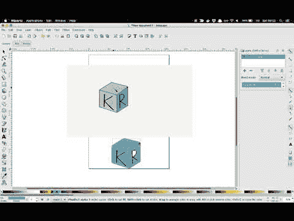
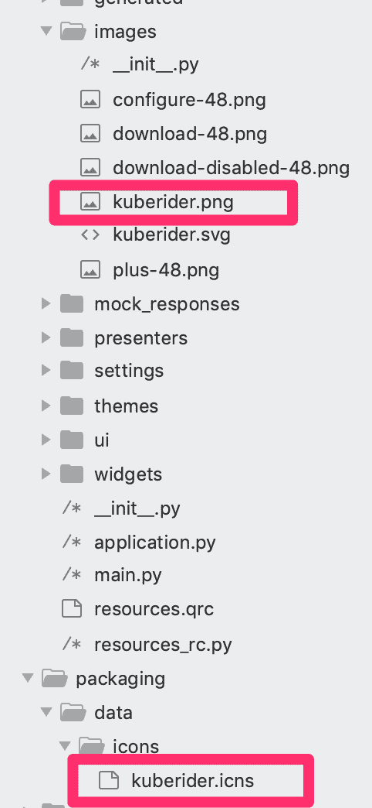
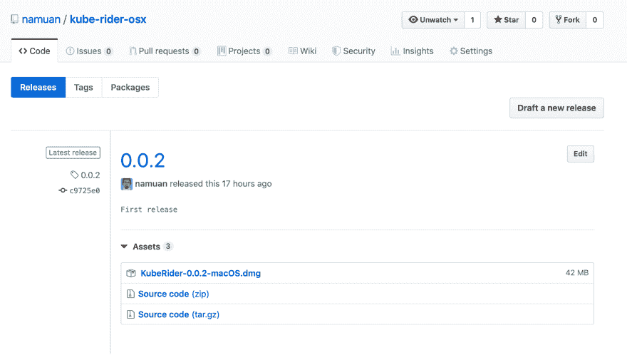

# KubeRider::捆绑 MacOS 版本

> 原文：<https://dev.to/namuan/kuberider-bundling-macos-release-23g4>

[](https://res.cloudinary.com/practicaldev/image/fetch/s--A2rKUqaa--/c_limit%2Cf_auto%2Cfl_progressive%2Cq_auto%2Cw_880/https://deskriders.dev/media/posts/4/kuberider_github_releases.png)

在这篇文章中，我将介绍构建一个 MacOS 发布包并从 TravisCI 发布到 Github 上所涉及的内容。

### 第一步:应用图标

尽管从在线服务中查找/生成徽标可能更快。我决定创建一个简单的标志，通过创建和矢量绘图转换它的过程。

以下是我在 iPad 上使用纸质应用的结果。

[](https://res.cloudinary.com/practicaldev/image/fetch/s--BhDmuLuB--/c_limit%2Cf_auto%2Cfl_progressive%2Cq_auto%2Cw_880/https://deskriders.dev/media/posts/4/kuberider_logo_image.png)

下一步是把它转换成矢量格式，一旦你安装了 Inkscape，这就很容易了。

[](https://www.youtube.com/watch?v=5zgugMUlz58)

现在 SVG 文件已经导出，我有一个助手脚本来使用 Inkscape 生成 iconset。

```
#!/usr/bin/env bash

inkscape="/Applications/Inkscape.app/Contents/Resources/bin/inkscape"
svg_file=$1
output_name=$2

set -e
test -d "$output_name.iconset" && rm -R "$output_name.iconset"
mkdir "$output_name.iconset"
$inkscape -z -e "$PWD/$output_name.iconset/icon_16x16.png" -w 16 -h 16 "$svg_file"
$inkscape -z -e "$PWD/$output_name.iconset/icon_16x16@2x.png" -w 32 -h 32 "$svg_file"
$inkscape -z -e "$PWD/$output_name.iconset/icon_32x32.png" -w 32 -h 32 "$svg_file"
$inkscape -z -e "$PWD/$output_name.iconset/icon_32x32@2x.png" -w 64 -h 64 "$svg_file"
$inkscape -z -e "$PWD/$output_name.iconset/icon_128x128.png" -w 128 -h 128 "$svg_file"
$inkscape -z -e "$PWD/$output_name.iconset/icon_128x128@2x.png" -w 256 -h 256 "$svg_file"
$inkscape -z -e "$PWD/$output_name.iconset/icon_256x256.png" -w 256 -h 256 "$svg_file"
$inkscape -z -e "$PWD/$output_name.iconset/icon_256x256@2x.png" -w 512 -h 512 "$svg_file"
$inkscape -z -e "$PWD/$output_name.iconset/icon_512x512.png" -w 512 -h 512 "$svg_file"
$inkscape -z -e "$PWD/$output_name.iconset/icon_512x512@2x.png" -w 1024 -h 1024 "$svg_file"
iconutil -c icns "$output_name.iconset"
rm -R "$output_name.iconset"
mv $output_name.icns packaging/data/icons/

$inkscape -z -e "$PWD/${output_namimg/${output_name}.png" -w 512 -h 512 "$svg_file" 
```

然后我们简单地运行上面的脚本，为它提供 svg 文件的路径

```
./mk-icns.sh `pwd`/kuberidimg/kuberider.svg kuberider 
```

这将生成一个图标集和一个将在软件包安装过程中使用的图像。

[](https://res.cloudinary.com/practicaldev/image/fetch/s--2nEksLO_--/c_limit%2Cf_auto%2Cfl_progressive%2Cq_auto%2Cw_880/https://deskriders.dev/media/posts/4/kr_iconset_image.png)

### 第二步:建立苹果磁盘镜像(dmg)文件

[setup.py](https://github.com/namuan/kube-rider/blob/master/setup.py) 使用 [py2app](https://py2app.readthedocs.io/en/latest/) 生成一个。MacOS 的 app 文件和[节点 AppDmg](https://github.com/LinusU/node-appdmg) 包产生 Dmg 文件。

### 第三步:从 TravisCI 发布到 Github

发布管道被分成两个不同的 Github repos，这样我就可以控制发布过程。 [kube-rider-osx](https://github.com/namuan/kube-rider-osx) repo 包含 [.travis.yml](https://github.com/namuan/kube-rider-osx/blob/master/.travis.yml) 文件，用于下载发布版本并准备工具链以生成和发布发布发布版本。

[](https://res.cloudinary.com/practicaldev/image/fetch/s--A2rKUqaa--/c_limit%2Cf_auto%2Cfl_progressive%2Cq_auto%2Cw_880/https://deskriders.dev/media/posts/4/kuberider_github_releases.png)

一旦成功构建，TravisCI 就会在 Github 上发布新版本

[](https://res.cloudinary.com/practicaldev/image/fetch/s--HQlBhKUx--/c_limit%2Cf_auto%2Cfl_progressive%2Cq_auto%2Cw_880/https://deskriders.dev/media/posts/4/travisci_release_publish.png)