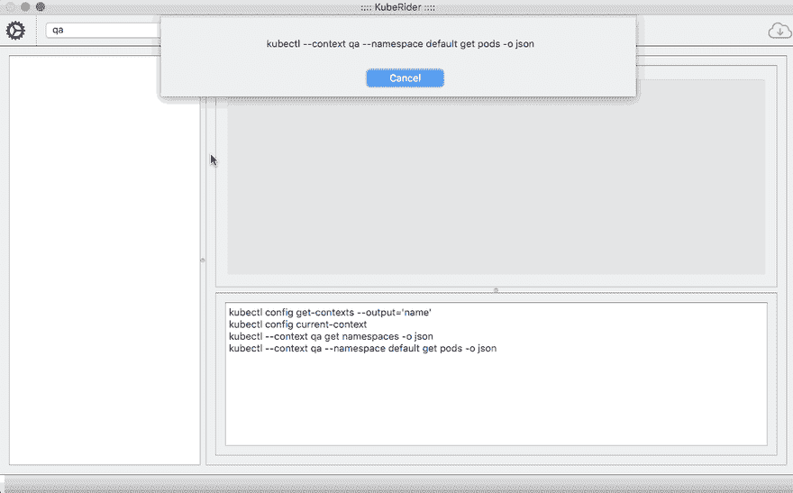

# KubeRider::在自定义 PyQt5 列表项中显示 pod 信息

> 原文：<https://dev.to/namuan/kuberider-display-pod-info-in-a-custom-pyqt5-list-item-3c0g>

[](https://res.cloudinary.com/practicaldev/image/fetch/s--aqy5GVRt--/c_limit%2Cf_auto%2Cfl_progressive%2Cq_auto%2Cw_880/https://deskriders.dev/media/posts/7/qdesigner_widget.png)

在本文中，我将介绍在 PyQt5 中构建自定义列表小部件并使用它来显示 Kubernetes pod 信息的过程。

用 PyQt5 创建定制列表项有两种不同的方法(AFAIK)。使用 [QListView](https://doc.qt.io/qt-5/qlistview.html) 和 [QListWidget](https://doc.qt.io/qt-5/qlistwidget.html) 。

QListWidget 易于使用，因为您可以使用 QDesigner 构建一个小部件并使用它。QListView 更加复杂，但是在处理大量项目时，它提供了更大的灵活性和更好的性能。

我决定暂时使用 QListWidget 来快速开发这个概念验证，但考虑到如果性能成为问题，我可能必须用 QListView 来切换它。

使用 QDesigner，这是一个简单的小部件，带有一些 QLabels，以简单的布局组织。

[](https://res.cloudinary.com/practicaldev/image/fetch/s--aqy5GVRt--/c_limit%2Cf_auto%2Cfl_progressive%2Cq_auto%2Cw_880/https://deskriders.dev/media/posts/7/qdesigner_widget.png)

QDesigner 生成一个. ui 文件，可以使用 [pyuic5](https://www.riverbankcomputing.com/static/Docs/PyQt5/designer.html) 将其转换成 python。我有一个[简单脚本](https://github.com/namuan/kube-rider/blob/master/pre-build.sh)，它处理所有的 [ui 文件](https://github.com/namuan/kube-rider/tree/master/resources/ui)，并在[目标文件夹](https://github.com/namuan/kube-rider/tree/master/kuberider/generated)中生成代码。

```
for i in `ls resources/ui/*.ui`; do FNAME=`basename $i ".ui"`; ./venv/bin/pyuic5 $i \> "kuberider/generated/$FNAME.py"; done 
```

现在小部件代码已经生成，下面的类继承了 QWidget 和生成的类来设置小部件 UI。

```
from PyQt5 import QtWidgets

from ..entities.model import KubePodItem
from ..generated.pod_item_widget import Ui_PodItemWidget

class PodItemWidget(QtWidgets.QWidget, Ui_PodItemWidget):
 pod_info: KubePodItem

 def __init__(self, pod_info: KubePodItem, parent=None):
   super(PodItemWidget, self).__init__(parent)
   self.setupUi(self)
   self.set_data(pod_info)

 def set_data(self, pod_info: KubePodItem):
   self.pod_info = pod_info
   self.lbl_pod_name.setText(pod_info.name)
   self.lbl_pod_count.setText(pod_info.count)
   self.lbl_pod_status.setText(pod_info.pod_status)

 def get_data(self):
   return self.pod_info 
```

除了在构造函数中设置 UI 的代码之外，它还包含两个助手方法，用于根据[kubepotitem](https://github.com/namuan/kube-rider/blob/3014fed32049462de275dcadfa44701b6ce0df01/kuberider/entities/model.py#L54)对象更新小部件中的数据。

现在剩下的唯一一件事就是连接事件，通知 pods 已经加载，这样我们就可以填充 list 小部件。参见[这篇文章](https://dev.to/namuan/kuberider-events-and-signals-with-pyqt5-3k8c)了解事件和信号在该应用中的使用。

```
 def on_pods_loaded(self, pods):
   logging.info(f"on_pods_loaded: Displaying {len(pods)}")
   self.view.clear()
   for pod in pods:
     pod_widget = PodItemWidget(pod, self.view)
     pod_widget_item = QtWidgets.QListWidgetItem(self.view)
     pod_widget_item.setSizeHint(pod_widget.sizeHint())

     self.view.addItem(pod_widget_item)
     self.view.setItemWidget(pod_widget_item, pod_widget) 
```

应该就是这样了。这是几个豆荚的样子。它显示容器名称、容器的当前状态和准备好的容器数量。

[](https://res.cloudinary.com/practicaldev/image/fetch/s--7nEiqarb--/c_limit%2Cf_auto%2Cfl_progressive%2Cq_66%2Cw_880/https://deskriders.dev/media/posts/7/kube_rider_pods.gif)