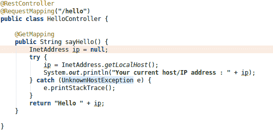
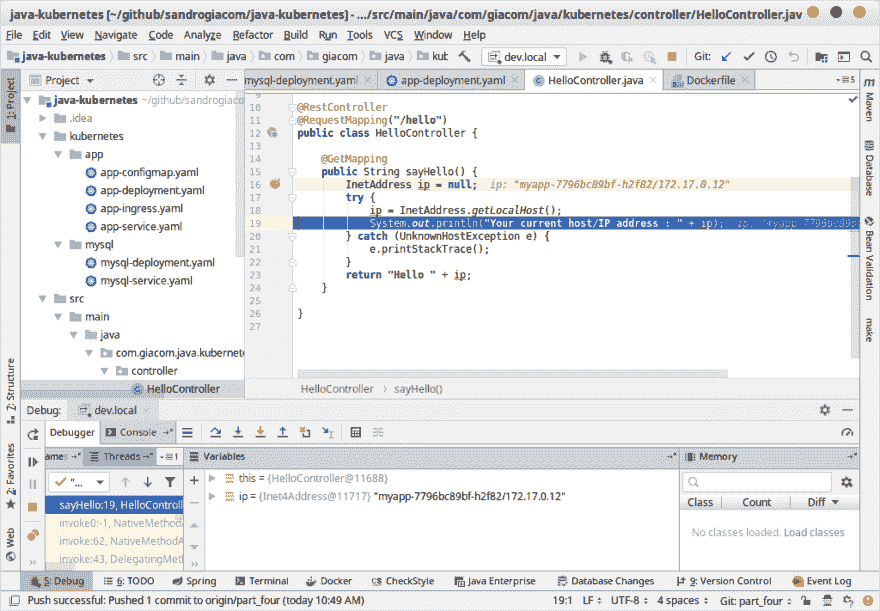

# 面向 Java 开发人员的 Kubernetes 调试应用程序

> 原文：<https://dev.to/sandrogiacom/kubernetes-for-java-developers-debug-application-4l1a>

## 调试应用程序

此时，我们在本地集群中部署了我们的应用程序。但是现在我们有一个问题。我如何调试我在 docker 中的应用程序，docker 在 kubernetes 中，kubernetes 在虚拟机中？

## 准备调试

在这种情况下，我们将使用远程 Java 调试器。

### 第一步:

准备您的 Dockerfile:

```
FROM openjdk:11.0.3-jdk-slim
RUN mkdir /usr/myapp
COPY target/java-kubernetes.jar /usr/myapp/app.jar
WORKDIR /usr/myapp
EXPOSE 8080
ENTRYPOINT [ "sh", "-c", "java $JAVA_OPTS -jar app.jar" ] 
```

这个入口点允许您通过$java_OPTS 环境变量将选项传递给 JAVA。

### 第二步:

更改`app-configmap.yaml`文件以填充`$JAVA_OPTS`。

```
JAVA_OPTS: "-agentlib:jdwp=transport=dt_socket,address=*:5005,server=y,suspend=n  -Xms256m  -Xmx512m  -XX:MaxMetaspaceSize=128m" 
```

### 第三步:

构建和部署应用:

```
mvn clean install
eval $(minikube -p dev.to docker-env) && docker build --force-rm -t java-k8s .
kubectl apply -f kubernetes/app/ 
```

### 第四步:

向本地主机公开调试端口:

获取豆荚:

```
kubectl get pods -n dev-to

NAME                     READY   STATUS    RESTARTS   AGE
myapp-7796bc89bf-h2f82   1/1     Running   0          3h3m 
```

暴露 pod 5005 端口:

```
kubectl port-forward -n dev-to myapp-7796bc89bf-h2f82 5005:5005
Forwarding from 127.0.0.1:5005 -> 5005
Forwarding from [::1]:5005 -> 5005 
```

**根据需要更改您的 pod 名称**。

在您的 IDE 上创建远程调试器:

在 IntelliJ 上，转到**运行/调试配置**。

*   像这样添加新的远程配置:

[](https://res.cloudinary.com/practicaldev/image/fetch/s--kBt8OZZ3--/c_limit%2Cf_auto%2Cfl_progressive%2Cq_auto%2Cw_880/https://thepracticaldev.s3.amazonaws.com/i/xnvm0go9ox6gdmu2n4fj.png)

之后，运行配置。您应该会看到下面的消息:

```
Connected to the target VM, address: 'localhost:5005', transport: 'socket' 
```

### 检查是否起作用:

现在，您可以在`HelloController`中设置一个断点。

[](https://res.cloudinary.com/practicaldev/image/fetch/s--HQnefsZi--/c_limit%2Cf_auto%2Cfl_progressive%2Cq_auto%2Cw_880/https://thepracticaldev.s3.amazonaws.com/i/mf5ws3rt0ivvcyr7pkqx.png)T3】

```
minikube -p dev.to service -n dev-to myapp --url
http://192.168.99.100:32301 
```

```
curl http://192.168.99.100:32301/hello 
```

[](https://res.cloudinary.com/practicaldev/image/fetch/s--CzXM2KJs--/c_limit%2Cf_auto%2Cfl_progressive%2Cq_auto%2Cw_880/https://thepracticaldev.s3.amazonaws.com/i/s1u88q02d9v176g64dg5.png)

## 结论

在这一部分中，我们学习了如何在本地 kubernetes 集群中调试应用程序。

在下一部分中，我们将看到一些好的实践，以及如何使用 Ingress 通过友好的 URL 访问应用程序。

回头见！

[](https://twitter.com/sandrogiacom)