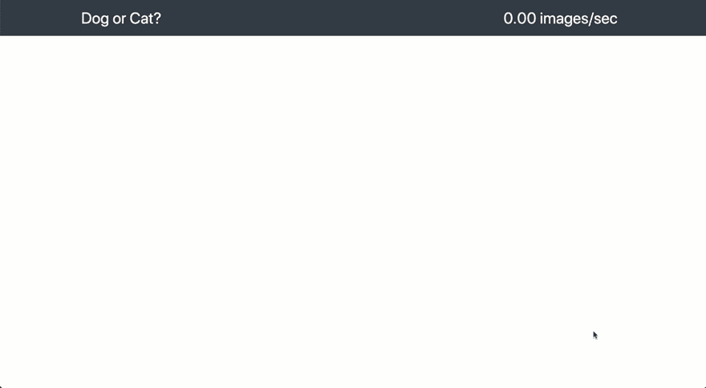
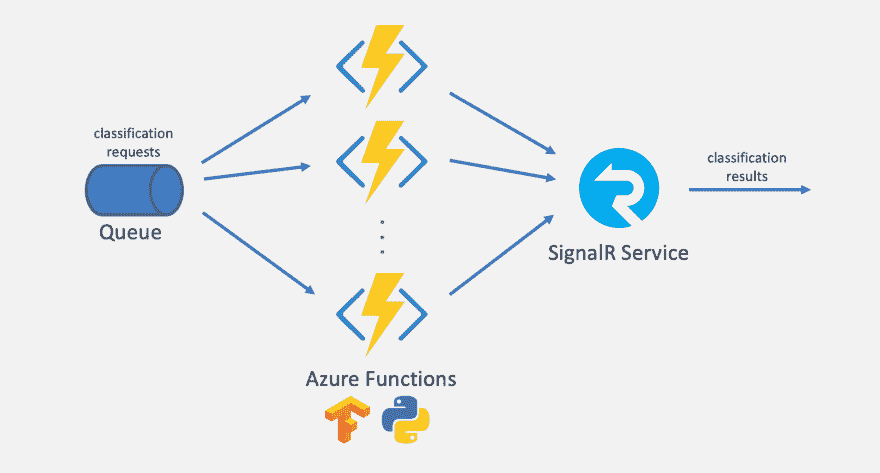
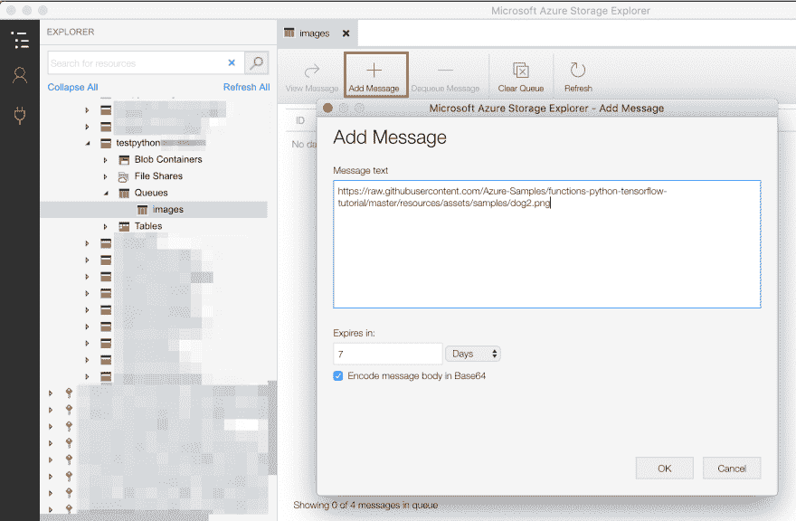
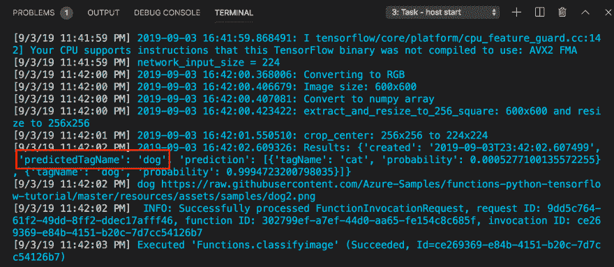

# 基于 Azure 函数的大规模无服务器机器学习推理

> 原文：<https://dev.to/azure/large-scale-serverless-machine-learning-inference-with-azure-functions-4mb7>

> 本文是 [#ServerlessSeptember](https://dev.to/azure/serverless-september-content-collection-2fhb) 的一部分。在这个无服务器的内容集合中，您可以找到其他有用的文章、详细的教程和视频。9 月份，每天都有来自社区成员和云倡导者的新文章发布，没错，每天都有。
> 
> 在[https://docs.microsoft.com/azure/azure-functions/](https://docs.microsoft.com/azure/azure-functions/?WT.mc_id=servsept_devto-blog-cxa)了解更多关于微软 Azure 如何实现你的无服务器功能。

Azure Functions 最近[宣布](https://azure.microsoft.com/blog/announcing-the-general-availability-of-python-support-in-azure-functions/?WT.mc_id=servsept_devto-blog-antchu)他们的 Python 语言支持的普遍可用性。我们可以利用 Python 3.6 和 Python 庞大的包生态系统，比如 TensorFlow，来构建无服务器的功能。今天，我们将看看如何使用 TensorFlow 和 Python Azure 函数来执行大规模的机器学习推理。

## 概述

一个常见的机器学习任务是图像的分类。图像分类是一项计算密集型任务，执行起来可能会很慢。如果我们需要对一系列图像进行分类，例如来自物联网摄像头的图像，我们将需要提供大量基础设施来获得足够的计算能力，以跟上生成图像的数量和速度。

因为像 Azure Functions 这样的无服务器平台会随着需求自动扩展，所以我们可以使用它们来执行机器学习推理，并确信它们可以跟上高容量的工作负载。

如果不进行扩展，这就是我们的应用程序目前运行的速度:

[](https://res.cloudinary.com/practicaldev/image/fetch/s--JIZxsA5J--/c_limit%2Cf_auto%2Cfl_progressive%2Cq_66%2Cw_880/https://thepracticaldev.s3.amazonaws.com/i/ri9cmt68ywkxt66qyv5h.gif)

这个应用程序非常简单。以下是关键部分:

*   [**Azure 存储队列**](https://docs.microsoft.com/azure/storage/queues/storage-queues-introduction?WT.mc_id=servsept_devto-blog-antchu) 是一个低成本但高度可扩展的消息队列。我们在队列中创建一条消息，包含我们要分类的每张图片的 URL。
*   [**Azure Functions**](https://docs.microsoft.com/azure/azure-functions/functions-overview?WT.mc_id=servsept_devto-blog-antchu) 是 Azure 的无服务器功能平台。对于队列中的每个图像 URL，Python 函数将运行 TensorFlow 模型并对图像进行分类。Azure Functions 能够横向扩展并并行处理这项工作。
*   [**Azure SignalR 服务**](https://docs.microsoft.com/azure/azure-signalr/?WT.mc_id=servsept_devto-blog-antchu) 是一个完全托管的实时消息服务，支持 WebSockets 之类的协议。使用 SignalR 服务将每个分类结果广播到在一个或多个浏览器中运行的状态页面。

[](https://res.cloudinary.com/practicaldev/image/fetch/s--mk5cuzcd--/c_limit%2Cf_auto%2Cfl_progressive%2Cq_auto%2Cw_880/https://thepracticaldev.s3.amazonaws.com/i/9fjprwmzjrm0w2hbhlmp.png)

## 打造 app

我们正在构建的应用程序将通过 TensorFlow 模型运行图像，以预测其中是否包含猫或狗。它由上面的 Azure 服务组成。我们将首先在本地构建和运行功能应用程序。

### 创建 Azure 服务

我们首先在 Azure 门户中提供以下 Azure 服务。

1.  使用以下参数创建 Azure 函数应用程序:
    *   Linux 消费计划
    *   计算机编程语言
    *   新的存储帐户(我们还将在该帐户中创建我们的队列)
2.  使用以下参数创建 Azure SignalR 服务帐户:
    *   与您的功能应用程序相同的区域
    *   自由层

### 创建功能 app

接下来，我们将使用 Azure Functions CLI 创建一个 Python 函数应用程序。完整的细节，看一下这个 [Python Azure Functions 机器学习教程](https://docs.microsoft.com/azure/azure-functions/functions-machine-learning-tensorflow?WT.mc_id=servsept_devto-blog-antchu)。

```
func init --worker-runtime python 
```

Enter fullscreen mode Exit fullscreen mode

接下来，我们将创建一个名为`classifyimage`的函数，只要队列中有消息就会触发该函数。

```
func new --template AzureQueueStorageTrigger --name classifyimage 
```

Enter fullscreen mode Exit fullscreen mode

在名为`classifyimage`的文件夹中创建一个函数。

要使用 Azure SignalR 服务通过其 Azure 函数绑定来广播图像，我们需要将扩展添加到我们的函数应用程序中。一种方法是运行这个命令。

```
func extensions install -p Microsoft.Azure.WebJobs.Extensions.SignalRService -v 1.0.0 
```

Enter fullscreen mode Exit fullscreen mode

我们稍后将编辑我们的函数。但是首先，我们需要导入一个 TensorFlow 模型，我们将使用它来对图像进行分类。

### 导入一个张量流模型

对于这个应用程序，我们导入了一个 TensorFlow 模型，我们已经使用 Azure 自定义视觉服务对该模型进行了训练，该服务将图像分类为“猫”或“狗”。关于如何训练和输出你自己的模型来识别你能想到的几乎任何东西的信息，请查看这些说明。

模型由`model.pb`和`labels.txt`组成。这里有一个模型已经被训练好了。我们可以将文件复制到包含`classifyimage`功能的文件夹中。

### 在功能中使用模型

我们将需要一些包，如 TensorFlow。将它们添加到`requirements.txt`并安装它们:

```
azure-functions
tensorflow
Pillow
requests 
```

Enter fullscreen mode Exit fullscreen mode

```
pip install --no-cache-dir -r requirements.txt 
```

Enter fullscreen mode Exit fullscreen mode

`classifyimage/function.json`描述函数的触发器、输入和输出。我们将把队列名称更新为`images`,并向函数添加一个 SignalR 服务输出绑定。

```
{  "scriptFile":  "__init__.py",  "bindings":  [  {  "name":  "msg",  "type":  "queueTrigger",  "direction":  "in",  "queueName":  "images",  "connection":  "AzureWebJobsStorage"  },  {  "type":  "signalR",  "direction":  "out",  "name":  "$return",  "hubName":  "imageclassification"  }  ]  } 
```

Enter fullscreen mode Exit fullscreen mode

然后，我们将更新函数体(`classifyimage/__init__.py`)，使用队列消息中的 URL 下载图像，运行 TensorFlow 模型，并返回结果。

```
import logging
import azure.functions as func
import json
from .predict import predict_image_from_url

def main(msg: func.QueueMessage) -> str:
    image_url = msg.get_body().decode('utf-8')
    results = predict_image_from_url(image_url)
    logging.info(f"{results['predictedTagName']}  {image_url}")
    return json.dumps({
        'target': 'newResult',
        'arguments': [{
            'predictedTagName': results['predictedTagName'],
            'url': image_url
        }]
    }) 
```

Enter fullscreen mode Exit fullscreen mode

大部分工作由`predict.py`中的助手函数完成，这些函数可以在找到[并复制到我们的函数应用中。该函数还返回通过 Azure SignalR 服务广播的消息。该消息由图像 URL 和预测(“猫”或“狗”)组成。](https://github.com/Azure-Samples/functions-python-tensorflow-tutorial/blob/master/resources/predict.py)

### 本地配置并运行 app

我们使用`local.settings.json`在本地配置一个 Azure Functions 应用。将连接字符串添加到我们的存储帐户和 SignalR 服务。

```
{  "IsEncrypted":  false,  "Values":  {  "FUNCTIONS_WORKER_RUNTIME":  "python",  "AzureWebJobsStorage":  "<STORAGE_CONNECTION_STRING>",  "AzureSignalRConnectionString":  "<SIGNALR_CONNECTION_STRING>"  }  } 
```

Enter fullscreen mode Exit fullscreen mode

现在我们运行功能 app。

```
func start 
```

Enter fullscreen mode Exit fullscreen mode

使用类似于 [Azure Storage Explorer](https://azure.microsoft.com/features/storage-explorer/?WT.mc_id=servsept_devto-blog-antchu) 的工具，我们在我们的存储帐户中创建一个名为`images`的队列，并添加一个包含图像 URL 的消息。我们应该看到我们的函数执行。

[](https://res.cloudinary.com/practicaldev/image/fetch/s--LVpwamzv--/c_limit%2Cf_auto%2Cfl_progressive%2Cq_auto%2Cw_880/https://thepracticaldev.s3.amazonaws.com/i/1tu04m6yvn5iukkr3w64.png)

[](https://res.cloudinary.com/practicaldev/image/fetch/s--m9XpxukN--/c_limit%2Cf_auto%2Cfl_progressive%2Cq_auto%2Cw_880/https://thepracticaldev.s3.amazonaws.com/i/ia3e8g2q6p3mef2q658s.png)

## 大规模部署和运行应用

既然应用程序在本地运行，是时候将它部署到云上了！

运行以下 Azure Functions 核心工具命令，将我们的应用程序部署到我们之前创建的 Azure Function 应用程序。我们正在使用远程构建，以便它带来在 Linux 上运行所需的适当的依赖关系。

```
func azure functionapp publish <FUNCTION_APP_NAME> -b remote 
```

Enter fullscreen mode Exit fullscreen mode

我们还需要在功能应用程序的配置设置中配置存储帐户和 SignalR 服务连接字符串。

要向队列中添加大量图像 URL，请运行类似于[这个](https://github.com/anthonychu/functions-python-queue-imageclassifier/blob/master/src/generateload/generate_load.py)的负载生成器脚本。

> 示例应用程序还包含一个[状态页面](https://github.com/anthonychu/functions-python-queue-imageclassifier/blob/master/src/functionapp/www/index.html)，它连接到 Azure SignalR 服务，接收分类结果，并实时显示它们。要将该页面部署到 Azure，请查看 [SignalR 服务无服务器开发人员指南](https://docs.microsoft.com/azure/azure-signalr/signalr-concept-serverless-development-config?WT.mc_id=servsept_devto-blog-antchu)上的详细信息。

当浏览器中的状态页面打开时，每次一个函数执行并分类一个图像时，它会将结果推送到状态页面。随着越来越多的消息被添加到队列中，Azure Functions 平台检测到队列长度正在增长，function app 会扩展到越来越多的实例。随着功能应用的扩展，每秒分类的图像数量将会增加。

[](https://res.cloudinary.com/practicaldev/image/fetch/s--8246oXkG--/c_limit%2Cf_auto%2Cfl_progressive%2Cq_66%2Cw_880/https://thepracticaldev.s3.amazonaws.com/i/vo9sa50y8itobx4in0ma.gif)

## 总结

在本文中，我们看到 Azure Functions 支持 Python 及其许多流行的包，包括 TensorFlow。它允许我们大规模地运行机器学习推理任务。要了解更多信息，请查看以下资源:

*   [样品的 GitHub repo】](https://github.com/anthonychu/functions-python-queue-imageclassifier)
*   [使用 TensorFlow 和 Azure 函数](https://docs.microsoft.com/azure/azure-functions/functions-machine-learning-tensorflow?WT.mc_id=servsept_devto-blog-antchu)
*   [Azure SignalR 服务无服务器开发者指南](https://docs.microsoft.com/azure/azure-signalr/signalr-concept-serverless-development-config?WT.mc_id=servsept_devto-blog-antchu)