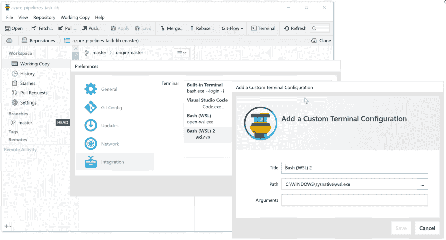
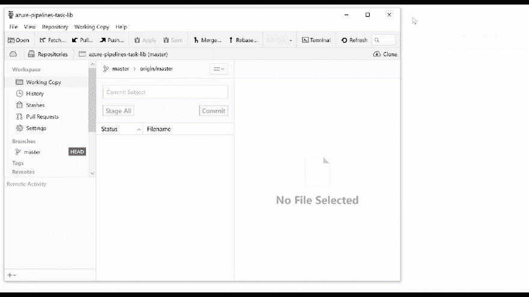

# 从塔上启动 WSL bash 提示符

> 原文：<https://dev.to/xpirit/launch-wsl-bash-prompt-from-tower-ok>

当您从 Tower 启动一个终端时，它会启动一个包含的 MingW bash shell。既然 Windows 10 附带了 Linux 的 Windows 子系统，那么使用 bash shell 就更好了。

[我第一次尝试推出 WSL 的尝试悲惨地失败了](https://superuser.com/questions/1380488/opening-a-wsl-shell-from-another-windows-application/1380499#1380499)。看起来 Windows 文件系统重定向导致看不到`wsl.exe`或`bash.exe`，因为 Tower 是一个 32 位程序。

经过多次尝试后，我发现可以使用`sysnative`文件系统重定向点来逃离 32 位世界:

标题:Bash (WSL)

路径:`C:\WINDOWS\sysnative\wsl.exe`

论据:

 

<figcaption>从塔上启动 Windows Linux 子系统</figcaption>

 

<figcaption>从塔上启动 Linux 的 Windows 子系统 bash 提示符</figcaption>