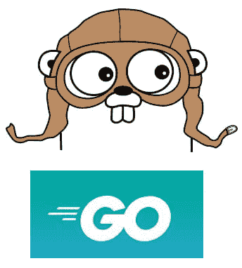

# 学习一门新的编程语言(以 Go 语言为例)

> 原文：<https://dev.to/emadashi/learning-a-new-programming-language-go-language-as-an-example-257e>

# 总结

这篇文章解释了我为什么以及如何学习 Go 语言。希望这能帮助你快速学习，或者启发你如何学习新的语言。

# 学习一门新语言的原因

有人想学习一门新语言的原因可能有很多，对我来说主要是:1)解决当前的业务问题 2)学习概念以适应当前的工具 3)寻找乐趣和激情。当然，你可以有多种原因促使你学习一门新的语言，或者仅仅是其中一个足够强的原因。

在我职业生涯的很长一段时间里，C#是我的主要编程语言，我也经常使用 JavaScript，但它一直处于次要地位，直到 TypeScript 出现，SPA 成为事实上的前端开发模型。所以 16 年来，对我来说已经是两种语言半了，从来没有觉得有必要再学一种语言(大学的 Java 不算)。

## 为什么不是 Haskell 或者 F#？

当函数式编程再次成为一件事的时候，我试图找到学习 F#(或者 Haskell)的正确理由，但是随着我们这个行业技术信息的爆炸，时间变得更加稀缺(我有三个 5 岁以下的孩子！)我真的需要一个更有力的理由来花时间学习一门新语言。不幸的是，即使有 [@DanielChambers](https://twitter.com/danielchambers) 不断努力将我转换为:P，我也没有跳上马车。

有趣的是，我不能付出努力的原因正是函数式编程本身引人注目的原因；这是范式的转变。范式的转变是如此之大，以至于我花了大部分时间去帮助的组织无法接受它；20 多年的 OOP 意味着在教育、解决方案和模式、框架和人员配备方面的大量投资，这使得接受这样的变化很难。

以我在这些组织的经验来看，可能会有函数式语言比面向对象的语言更好地解决问题的情况，但是考虑到这些组织的遗产，投资的回报会很少。当然，我并不是提倡组织不应该投资学习和采用新技术；那将是失败之路！但我只是描述了我工作过的大多数组织的情况。

这排除了我的业务需求原因，我只剩下“学习概念以适应当前工具”了，因为仅仅有热情是不够的:p。幸运的是，我周围都是对函数式编程充满热情的朋友，我设法从他们那里学到了足够多的关于函数式编程的好处以及如何将它带到我的 OOP 世界中。与这些朋友和同事如 Daniel Chambers、Thomas Koster 的交谈，以及参加专业人士如 Joe Bahari 的讲座，对我在 C#中采用函数概念帮助很大。

# 我在围棋中找到了原因

所以我一直学习两种半语言，直到去年我有机会参与一个项目，在这个项目中我们使用了 Kubernetes。一旦你踏入 Kubernetes 的世界，你会意识到 [Go](http://golang.org/) 是英雄语言；Kubernetes 是用 Go 编写的， [Helm](https://helm.sh/) 是用 Go 编写的，Helm 使用的模板是基于 Go 模板引擎的。虽然你可以不用学习围棋语言就能使用 Kubernetes，但是一旦你想更深入一点，你会觉得学习围棋是一个优势。

除此之外，随着云成为我的主要兴趣，我已经看到 Go 越来越多地被用作许多云原生项目、产品和服务的语言选择。

与此同时，我的许多同事和 Twitter 朋友已经将他们的博客从数据库驱动的引擎如 WordPress 移植到静态网站生成器如 Jekyll。我有两个网站可以从中受益，1)我的博客[emadashi.com](https://emadashi.com)2)和[dotnetarabi.com](https://dotnetarabi.com)播客，这是我在 ASP.NET 和 Rob Conery 的亚音速 ORM 上建立的。我的朋友[亚塞尔·梅赫拉班](http://yashints)一直取笑我，并施加他的同龄人压力，直到我投降，我终于开始研究将我的博客和播客转移到一个静态网站生成器。

我的选择是[雨果](https://gohugo.io)；对我来说，它似乎是最成熟的静态站点生成器，用户流失和学习曲线最少。你猜怎么着，雨果是用 go 写的！模板引擎是基于 Go 的。与 Kubernetes 一样，如果你想使用 Hugo，你不需要学习 Go，但这只是熟悉该语言的另一个令人信服的理由。

所以到现在为止，我感觉自己被正在用围棋解决的问题所包围，而且更明显的是，我未来有更大的可能性在围棋中工作，甚至是职业上。

这一切，再加上对 C#的熟悉导致的入门门槛低，都鼓励我去涉水。

# 我从哪里开始？

一个人可以通过很多方式开始学习一门语言，对我来说，我想快速学习这门语言，并且学得足够让我继续下去。因为这个原因，我没有拿起一本要花一段时间才能学会的书，即使一本书可能是最深刻的方式。

我没有拿起一本书，而是去了[https://golang.org](https://golang.org)查看网站提供的内容；大多数现代项目和语言都有文档，包括教程和入门指南。如果这些指南制作得很好，将会是一个很好的学习促进，而且幸运的是，Go 有很好的内容。

## 调教

我想做的第一件事是设置环境并运行最基本的例子(hello world of Go)，为此我遵循了[入门](https://golang.org/doc/install)指南。设置环境作为学习语言的基本步骤是非常重要的；它会让你理解这门语言的要求，并对这种体验对你来说有多友好建立一些期望，它打破了僵局。此外，它为即将到来的动手步骤铺平了道路；我将在本文后面解释这一步。

## 基础

现在我的环境已经设置好了，并且运行了我的 hello world 示例，我需要理解到底发生了什么:代码如何编译，如何运行，如何打包，如何托管；我需要基础概念来建立一个坚实的基础，作为我学习的基础。学习语法和各种 Go 功能会随之而来，这需要时间，但你不能推迟打基础。为此，我遵循了“[如何编写 Go 代码](https://golang.org/doc/code.html)”指南。这篇文章的标题可能听起来不太基础，但内容奠定了概念。

## 按需巡航

如果这不是你学习的第一门编程语言，那么你已经熟悉了结构流的概念:函数、循环、If 子句、...等等。这给了你一个很好的优势来快速浏览这些；这些不太可能与其他语言有太大的不同。快速浏览应该足以捕捉到任何突出的东西。

为此，我使用了[旅程](https://tour.golang.org/welcome/1)；这次旅行有两个好处:1)它有一个简单的可导航结构 2)它与一个在线游乐场相关联，在那里你可以现场实验并确认你的理解。这次旅行涵盖了广泛的话题，有些我会快速浏览，有些我会慢慢理解；例如，与 C#中的数组相比，切片可能有点令人困惑。

**注意**:每个人的经历都是不同的，所以列出我快速浏览过的主题和我花时间讨论过的主题是没有意义的，请用你自己的经历来判断。

至于高级的话题，在我对这门语言的基础有了更好的理解之前，我会稍微省略一些；在这个阶段用高级话题淹没自己可能会对你的学习产生反作用。

## 动手

在了解了如何编写 Go 代码的基础知识，并浏览了教程之后，是时候接触这门语言了；这是你真正理解和学习一门语言的唯一途径。

我需要一个问题来解决，这样我才能有一个驱动的目标。我选择的问题是从数据库(嘉宾和剧集)导入 DotNetArabi 的现有记录，为 Hugo 网站创建相应的 Markdown 文件，所以[这是我的第一个节目](https://github.com/eashi/dna-hugo-migration/)。

在这里，重要的是要明白，我还没有 100%掌握这些东西(现在也没有:P)，但这是我赖以掌握概念和获得经验的实践经验。如果你离开实践的一面太久，你会发现自己忘记了基础，或者你正在学习你很少使用的太高级的主题。迭代方法在这里非常好。

于是我逐渐构建了应用程序；每次我遇到困难的时候，我要么回头查阅旅程，要么在谷歌上搜索(比如连接到数据库)。在每一个被卡住和解决的情况下，我都会花一点时间来确保我理解了解决方案和它背后的技术。只要你停下来理解，复制和粘贴是绝对没问题的。

## 高级主题

好了，现在在这个阶段，我觉得我知道了基本知识，我可以轻松地编写一个没有大问题的程序。但是在这个阶段，用 Go 编写程序比用另一种语言编写程序几乎没有优势(如果有的话);我没有充分利用这门语言。正是这些高级特性，比如 [goroutines 和 channels](https://tour.golang.org/concurrency/1) ，让我们以最少的维护开销实现了并发性。

不要害怕高级的题目；因为它们可能很复杂而回避它这个高级话题将会危及我们从学习语言中获得的价值！

因此，对于这一点，我继续游览以上的高级主题。操场有巨大的价值，因为你需要改变周围的东西来证实你的理解。此外，旅游有一些演习，将戳你的想法，我强烈建议尝试这些！这不仅会推动您理解概念，还会扩展您可能需要这些高级功能的用例的视野。

如果你能回到你最喜欢的项目，并尝试实现这些先进的概念，这将是非常有趣和有价值的，这就是我所做的。我回到我的应用程序，利用 goroutines 将数据提取到 markdown 文件中。

## 单元测试

将单元测试留到最后并没有破坏它们的价值，而是我想首先关注语言本身；测试框架，把复杂性和学习曲线推得足够高。我从 JavaScript 刺痛到现在的经历:p。

## 最好的围棋

最后，Go 网站有一个栏目叫做“[有效 Go](https://golang.org/doc/effective_go.html) ”。这一节并不是真正的参考文档，但是它非常有价值，因此您可以按照语言的意图编写 Go 代码。它为以最佳形式编写语言提供了进一步的上下文和全面的风格。

我在这里也建议挑选题目，阅读整本书可能会适得其反。

# 关闭循环，完成画面

现在你可能认为你已经完成了，但这仅仅是开始；现在是时候通过修改这种语言的主要特征、哲学和最大优势来把事情联系在一起了。

如果我们特别看一下 Go，作为我们的例子，这可能是像 Go 一样简单的东西，其中没有类，没有继承，也没有泛型。或者像并发性和 Go 如何在异步代码执行中处理状态之类的东西。在这个阶段，检查视频是很有价值的，比如 Sameer Ajmani 的演讲和讨论“[为什么去](https://gist.github.com/ungerik/3731476)”的文献。

我还发现 golang.org 的常见问题解答是一些理由和解释的宝贵资源。你不应该把这当成一篇文章来读，挑选感兴趣的话题。

但这不是落后吗？我不应该一开始就了解这些东西吗？的确，你可以从一开始就学会这些，但你不会重视这些主张，直到你尝试并把你的手放在实践中，直到那时它将仅仅是空中的主张。所以即使你从这些开始，你也应该修改它们，并确保你打好循环。

# 结论

在我学习围棋的过程中，我做到了以下几点:

*   我有充分的理由
*   我建立了核心概念
*   我安装了工具并运行了“hello world”程序
*   我浏览了结构流程
*   我把手放在代码上，编写了第一个程序
*   阅读高级主题，并使用操场来确认我的理解
*   观看更多关于为何使用 Go 及其优势的视频

这里有一点很重要，那就是为组织选择一种语言不仅仅是学习它。如果你有能力影响一个决定，请注意这一点。

我希望这能帮助你，享受编码:)。