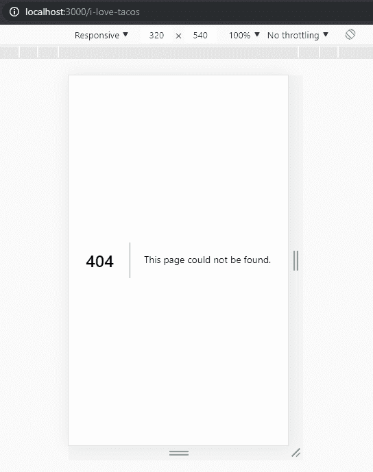
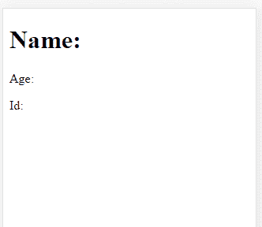
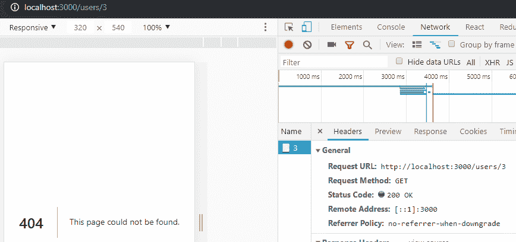
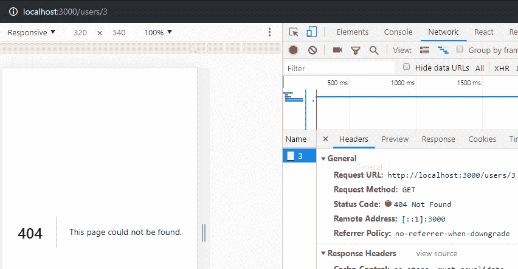

# 学习 NextJs -第 11 天

> 原文：<https://dev.to/eperedo/learning-nextjs-day-11-1j8g>

今天我想谈谈 NextJs 如何处理 Http 错误。不仅可以定制错误页面的设计，还可以定制发送给客户端的实际状态代码。

假设我们有一个简单的应用程序，有两个页面，一个显示用户列表，另一个显示每个用户的详细信息页面。这意味着我们的应用程序中有两个有效的网址。

```
/ # root url that show a list of users
/users/[id] # dynamic url that will show the detail of one user 
```

让我们快速看一下其中一个页面的代码:

```
// pages/index.js

import Link from "next/link";

const users = [
  {
    id: 1,
    name: "Eduardo",
    age: 20
  },
  {
    id: 2,
    name: "Cinthya",
    age: 30
  }
];

function Home() {
  return (
    <ul>
      {users.map(user => {
        return (
          <li key={user.id}>
            <Link href={`/users/${user.id}`}>
              <a>{user.name}</a>
            </Link>
          </li>
        );
      })}
    </ul>
  );
}

export default Home; 
```

这里没有什么奇怪的，只是迭代用户数组并在页面上显示它们。现在让我们创建详细信息页面，在这里我们可以显示每个用户的所有信息。

```
// pages/users/[id].js
const users = [
  {
    id: 1,
    name: "Eduardo",
    age: 20
  },
  {
    id: 2,
    name: "Cinthya",
    age: 30
  }
];

function Details({ user }) {
  return (
    <div>
      <h1>Name: {user.name}</h1>
      <p>Age: {user.age}</p>
      <p>Id: {user.id}</p>
    </div>
  );
}

function getInitialProps({ query, res }) {
  const { id } = query;
  const user = users.find(u => u.id == id);
  return {
    user: user || {}
  };
}

Details.getInitialProps = getInitialProps;

export default Details; 
```

我知道重复 users 数组并不理想，但是因为这篇文章的目标是 NextJs 错误页面，所以让我们假设这没问题。该页面从 url 获取用户的 id，然后搜索该用户是否存在于 **users** 数组中。然后返回结果，这样 NextJs 可以将该值作为道具传递给**细节**组件。

由于该应用程序只有两条路线，如果你在我们的浏览器中键入任何其他网址，NextJs 将显示默认的错误页面。让我们在浏览器中输入以下 URL

```
/i-love-tacos 
```

NextJs 将向您展示这个页面:

[](https://res.cloudinary.com/practicaldev/image/fetch/s--PrB4VjQp--/c_limit%2Cf_auto%2Cfl_progressive%2Cq_auto%2Cw_880/https://thepracticaldev.s3.amazonaws.com/i/ymzf013k9ejitxil465p.png)

如果您打开开发人员工具，可以看到响应的状态代码是 404 Not Found。

[](https://res.cloudinary.com/practicaldev/image/fetch/s--9iai1aJh--/c_limit%2Cf_auto%2Cfl_progressive%2Cq_auto%2Cw_880/https://thepracticaldev.s3.amazonaws.com/i/ozpn2v0x0ik0j0etvwwa.png)

但是如果你输入网址:
呢

```
/users/3 
```

这与动态页面相匹配:**页面/用户/[id]。js** ，但是在**用户**数组中没有 ID 等于 3 的用户，所以根据该页面的当前功能，它应该返回一个空对象作为该页面的道具。

[](https://res.cloudinary.com/practicaldev/image/fetch/s--1L8n_EcC--/c_limit%2Cf_auto%2Cfl_progressive%2Cq_auto%2Cw_880/https://thepracticaldev.s3.amazonaws.com/i/u28g9fnjvnm5amuazhnp.png)

不要显示一个信息不完整的奇怪页面，让我们改变一下，显示 NextJs 的默认 404 页面。

```
// pages/users/[id].js
function getInitialProps({ query }) {
  const { id } = query;
  const user = users.find(u => u.id == id);
  return {
    user: user || {},
    statusCode: user ? 200 : 404
  };
} 
```

首先，我们向结果对象添加一个新的 **statusCode** 变量，这个变量的值取决于用户是否在 **users** 数组中被找到。如果用户存在，statusCode 将为 200，否则为 404。

但是 NextJs 怎么知道我们想要显示默认的错误页面呢？这很简单，你需要返回默认的**错误**组件。

```
// pages/users/[id].js
import Error from "next/error";

function Details({ user, statusCode }) {
  if (statusCode === 404) {
    // This line will show the default Error Page
    return <Error statusCode={statusCode} />;
  }

  return (
    <div>
      <h1>Name: {user.name}</h1>
      <p>Age: {user.age}</p>
      <p>Id: {user.id}</p>
    </div>
  );
} 
```

很简单，对吧？现在，当请求一个不存在的用户时，您可以看到错误页面。如果你打开开发者工具
，你可以看到 200 状态码被返回。
但是你发的是错误页面！为什么状态码还是 200？

[](https://res.cloudinary.com/practicaldev/image/fetch/s--6snJvuew--/c_limit%2Cf_auto%2Cfl_progressive%2Cq_auto%2Cw_880/https://thepracticaldev.s3.amazonaws.com/i/td2jkqkkk4oihvpdrhec.png)

好吧，NextJs 给你的回应不是**错误**组件的责任。如果你想显示一个不同的状态代码，你需要**在你的响应中设置它**。就这么办吧。

```
// pages/users/[id].js
function getInitialProps({ query, res }) {
  const { id } = query;
  const user = users.find(u => u.id == id);
  // The find method return undefined if the condition
  // does not match
  if (!user) {
    // here you can assume user is undefined that means
    // it is an nonexistent user so change the status code
    // of the response.
    res.statusCode = 404;
  }
  return {
    user: user || {},
    statusCode: user ? 200 : 404;
  };
} 
```

如果您再次测试您的页面，您将会看到错误页面和正确的状态代码！

[](https://res.cloudinary.com/practicaldev/image/fetch/s--J40fY5dN--/c_limit%2Cf_auto%2Cfl_progressive%2Cq_auto%2Cw_880/https://thepracticaldev.s3.amazonaws.com/i/64cubkxc62lvt2ojkj9z.png)

### 自定义错误页面

如果您不喜欢默认的错误页面怎么办？你可以换掉它！为了做到这一点，首先你需要在你的 **pages** 文件夹中有一个名为 **_error.js** 的新文件。

```
// pages/_error.js

function CustomError({ statusCode }) {
  return (
    <figure>
      
      <figcaption>
        <h1>{statusCode}</h1>
      </figcaption>
    </figure>
  );
}

function getInitialProps({ res, err }) {
  let statusCode;
  // If the res variable is defined it means nextjs
  // is in server side
  if (res) {
    statusCode = res.statusCode;
  } else if (err) {
    // if there is any error in the app it should
    // return the status code from here
    statusCode = err.statusCode;
  } else {
    // Something really bad/weird happen and status code
    // cannot be determined.
    statusCode = null;
  }
  return { statusCode };
}

CustomError.getInitialProps = getInitialProps;

export default CustomError; 
```

现在，在详细信息页面中，您需要用新的组件替换错误组件:

```
// pages/users/[id].js
import Error from "./_error.js"; 
```

如果你再试一次，你会看到一只可爱的猫告诉你
得到了一个 404 错误页面。

[](https://res.cloudinary.com/practicaldev/image/fetch/s--pGPnnQ7P--/c_limit%2Cf_auto%2Cfl_progressive%2Cq_auto%2Cw_880/https://thepracticaldev.s3.amazonaws.com/i/jy9gthggjc1h4bcs787t.png)

这里玩完整代码:
[https://github . com/EPE redo/learning-nextjs/tree/nextjs-day-11-error](https://github.com/eperedo/learning-nextjs/tree/nextjs-day-11-error)

### 你学到的东西！

*   现在，您可以控制如何以及何时显示默认错误页面
*   您可以修改响应的状态代码，使其与当前显示的错误保持一致。
*   您可以自定义错误页面的外观