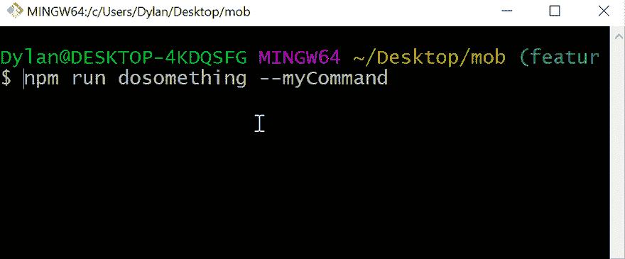
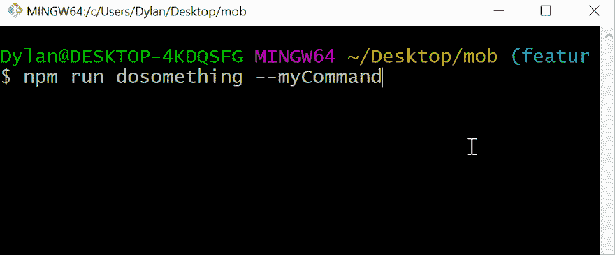
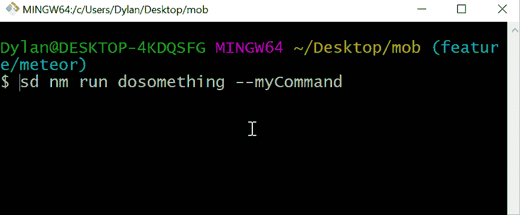
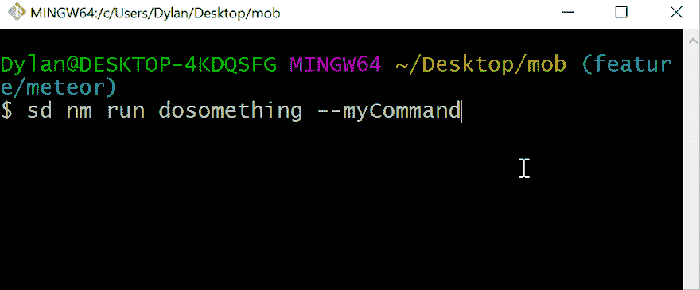
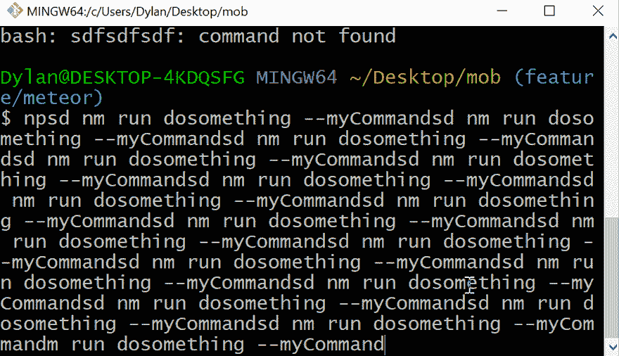
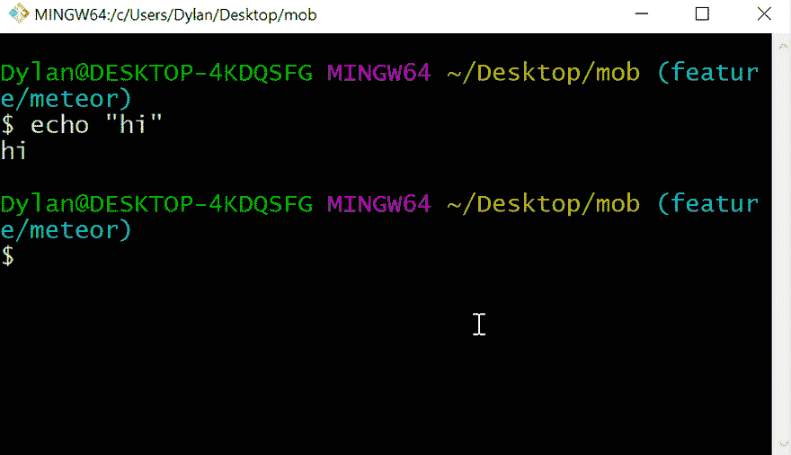

# 提升您的终端/命令行导航

> 原文：<https://dev.to/ganderzz/leveling-up-your-terminal-command-line-navigation-5e69>

使用终端的一个激励因素是生产率的提高...也就是说，一旦你能像 80 年代的金属吉他手一样扫键盘。获得一些基本的键盘快捷键/命令可以极大地提高终端的可用性。让我们来看看我最喜欢的几个。

*(在本文中，我将展示 Git Bash，但是这些命令在大多数终端中都有效)*

### 运动

**移动到终点，输入**
`ctrl + e`

**移动到输入**
`ctrl + a`的开头

**在每个‘字’之间移动**
`ctrl + [arrow left/right]`

### 删除

**向后删除一整‘字’**
`ctrl + w`

**删除一切**
`ctrl + u`

### 打开文件浏览器

在当前位置打开文件浏览器会非常有用。该命令因操作系统而异。

(在当前目录下打开文件资源管理器。更改“.”去任何地方！)

**Windows:**`explorer .`
**Unix/MAC OS:**`open .`

### 历史

**重新运行最后一个命令**
`!!`

**获取命令的全部历史**
`history`

**从历史中重新运行命令**
`![#number]`

### 结束

这些是我发现自己每天都要使用的快捷方式/命令，让终端成为一种乐趣。有我错过的你爱的人吗？请在评论中告诉我们！

*Josiah Weiss 在 Unsplash 上拍摄的照片*