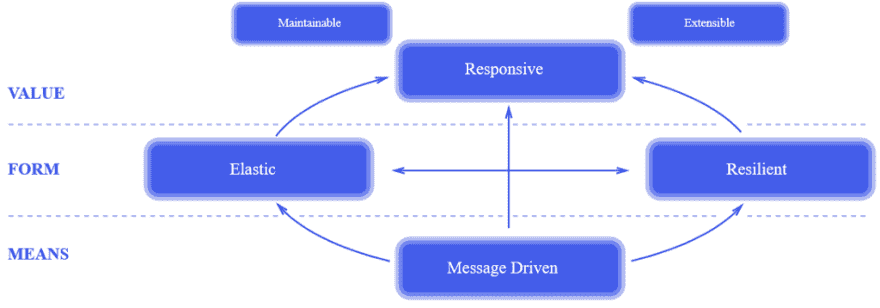
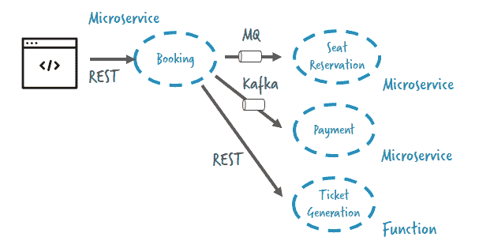
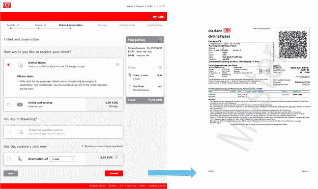
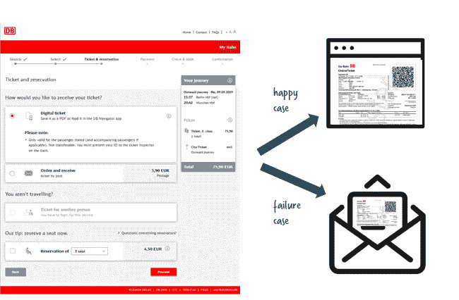

# 利用反应式架构的全部潜力，设计反应式业务流程

> 原文：<https://dev.to/berndruecker/leverage-the-full-potential-of-reactive-architectures-and-design-reactive-business-processes-499i>

#### 为什么您应该让您的企业重新思考业务流程，以改善客户体验

有很多关于反应式架构的讨论。以事件驱动架构、事件流、反应式编程等为例。我相信，随着我们构建更复杂的系统、连接更多分布式组件并将系统分割成更小的自治部分，这些架构将在未来占据主导地位。

不幸的是，我看到许多公司没有调整他们的业务流程来适应这个新世界。在这篇文章中，我想举一个例子并讨论其后果，希望能激励你倡导重新设计你的业务流程。因为很多注意力都集中在反应的技术方面，而没有过多考虑业务方面。正如 Thorsten Dirks(Telefonica 首席执行官)所说:

> 当你数字化一个低劣的过程时，你就有了一个低劣的数字过程

#### 无功是什么意思？

但首先我们必须澄清术语。我指的是在[反应宣言](https://www.reactivemanifesto.org/)中定义的反应:一个反应迅速、有弹性(容错)和有弹性(纵向扩展/横向扩展)的系统。这是通过像消息传递这样的异步通信实现的。如果你想深入了解关于反应这个术语的不同理解，Gernot Starke 很好地诠释了反应的不同含义[。](https://www.innoq.com/en/blog/reactivity-whats-in-a-name/)

#### 举个例子

假设你想订一张火车票。因为我住在德国，那很可能在德国铁路完成。声明:我没有在这里提到的特定公司的用例上工作过，但是在类似的客户上工作过。

为了便于讨论，让我们假设 Deutsche Bahn 运行以下组件来实现这一点:

到目前为止，这并不奇怪，多个组件需要交互才能订票。那又怎样？再来看用户体验。假设你订了一张票:

你选择一个火车连接，选择一个座位预订，选择车票类型和票价，最后提供你的个人信息和付款方式。

输入所有数据后，点击“继续”按钮。高兴的是，你看着一些动画 gif，期待着打印你的票，然后直接打开为 PDF 格式。

等等，你在等 PDF 出现吗？是的，你需要，同时你最好不要关闭你的浏览器。**业务流程不是反应式的**。**是完全同步的**。您将等待所有处理完成。该模型将行为可视化:

但是这有什么问题呢？

第一个问题是，**这个行为实际上很难实现**。预订服务需要按照定义的顺序访问其他一些服务，并一直等待结果。它必须处理一些远程通信，其中一些是异步的。而且，由于远程连接根据定义是[不可靠的](https://en.wikipedia.org/wiki/Fallacies_of_distributed_computing)，它必须解决许多不同的故障场景。这很棘手。幸运的是，我知道一些很棒的工作流引擎可以帮助你解决这些问题；)我的同事 Josh 刚刚写了一篇关于 REST 请求/响应中的[工作流的博客。](https://zeebe.io/blog/2019/08/zeebe-rest-affinity/)

第二个问题是**延迟蠕变**。为了完成预订，该服务必须调用其他服务。每个调用都有等待时间，这只会越积越多，尤其是当你必须按顺序做事情的时候。因此，最终的机票预订可能需要几秒钟的时间。由于延迟限制，甚至不可能外包某些服务(或将它们转移到云中)。因此**限制了可能性**。

第三个问题是这个设计**忽略了一些非常可能的故障场景**。服务确实会中断，网络也会出现故障，所以即使你非常努力，单个组件的可用性也不会超过某个百分比。现在停电的风险越来越大——让你的预订服务变得比你希望的更加不可靠。

每当某项服务不可用(或遇到问题)时，预订就无法完成并将失败，**让您作为客户独自面对错误消息，**因此解决故障的任务就交给了您。我在微服务集成的 [3 个陷阱](https://blog.bernd-ruecker.com/3-common-pitfalls-in-microservice-integration-and-how-to-avoid-them-3f27a442cd07)中写过为什么这会导致**糟糕的用户体验**。

但是在预订失败之前，预订服务实际上必须注意清理:取消可能已经预订的所有服务，取消你信用卡上的费用等等。我写过这个[传奇:如何在没有两阶段提交的情况下实现复杂的业务事务](https://blog.bernd-ruecker.com/saga-how-to-implement-complex-business-transactions-without-two-phase-commit-e00aa41a1b1b)。

#### 还有生意？

如果 PDF 生成不起作用，流程设计将中止预订，甚至可能取消信用卡收费。这意味着你将一些收入置于不必要的风险中。

更严重的是，由此产生的错误场景通常不被业务涉众所理解，这导致**开发人员围绕对失败的反应做出许多关键决策**。

当提出一种更被动、更异步的做事方式时，答案通常是:但是业务流程必须是这样的——用户需要立即获得 PDF 以便打印。

我告诉你:**用户的期望很久以前就改变了**。没错，有些人仍然想马上在浏览器中打印出 PDF 文件。但老实说，大多数人都希望在手机上或应用程序中实现电子机票。或者 PDF 可以稍后通过电子邮件发送。如果你使用打印机有问题的售票机，这甚至是一个选择！现代应用程序是被动和异步的，人们已经习惯了。他们甚至乐在其中！

是的，这将改变业务流程，是的，它将包括客户接触点，并影响客户体验。但是不要把这看作一个线索，这实际上是一个很好的机会！

我总是会问:“如果出现故障，你希望向你的客户显示一个同步的故障页面，还是稍后正确订票并通过电子邮件异步发送？”

#### 无功版本

这个业务流程的反应版本没有太大的不同，您不再需要同步等待 PDF:

看起来很小的变化却有很大的影响。

首先，你开始**讨论正确的问题**:“如果预订无法进行，但我们只是在客户离开预订流程后才发现这一点，该怎么办？”或者“如果我们无法生成票证，而客户没有重试，现在谁会重试呢？”“在停电的情况下，我们可以尝试多长时间来收回付款，是否有 B 计划来代替取消预订？”因此，企业确实需要考虑各种故障场景，并定义反应。

其次，你在实现的过程中获得了很多**自由度。您不再需要阻塞 REST 调用，使延迟变得无关紧要。我的意思是，如果你发了那封邮件，你会在意那是几秒钟后吗？你其实不知道。**

#### 为用户造福

您**降低了故障率**，因为设计允许解决故障的更多可能性(例如[状态重试](https://blog.bernd-ruecker.com/fail-fast-is-not-enough-84645d6864d3)或调用备份服务)。这也**提高了客户满意度**，因为我不再看到内部技术问题的错误页面，而是简单地提交我的机票请求，并可以确定我最终会收到它。

引用 Eliyahu Goldratt 的话:

> “你已经部署了*惊人的技术*、*但是*因为你没有改变你的工作方式，你实际上并没有减少限制”

或者用我的同事迈克·温特斯的话说:

> 看，你真正实现的是一种更有弹性(更有利可图和可持续)的用户体验。这不是为了时髦而时髦的架构，而是更好的产品。

#### 在 CamundaCon 了解更多信息

反应式架构将成为新常态。为了充分利用它们的响应性、弹性和伸缩性的潜力，你还必须设计反应性的业务流程。

我将在柏林即将举行的[CamundaCon](https://www.camundacon.com/agenda/session/94323)第二天的主题演讲中谈到这一点。希望 CU 在那里，然后讨论！

#### 和你的故事？

我目前正在寻找更多关于这个话题的故事。如果你有什么要分享的，不要犹豫，给我发电子邮件吧！

Bernd Ruecker 是 [Camunda](http://camunda.com/) 的联合创始人兼首席技术专家。他喜欢用第三人称谈论自己。他热衷于开发人员友好的工作流自动化技术。*跟着他上* [*推特*](http://twitter.com/berndruecker/) *。*一如既往，他喜欢得到你的反馈。下面评论或者[给他发邮件](http://bernd.ruecker@camunda.com)。

* * *