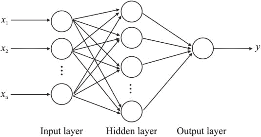
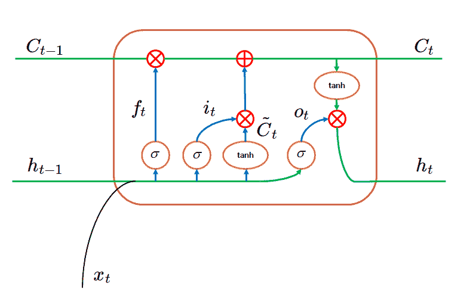

# LSTM:如何训练神经网络像洛夫克拉夫特一样写作

> 原文：<https://dev.to/strikingloo/lstm-how-to-train-neural-networks-to-write-like-lovecraft-2bbk>

近年来，LSTM 神经网络在文本和音乐生成以及时间序列预测方面有着广泛的应用。

今天，我将教你如何训练一个用于文本生成的 LSTM 神经网络，使它能够以 H. P. Lovecraft 的风格写作。

为了训练这个 LSTM，我们将使用 TensorFlow 的 Keras API for Python。

我从这本很棒的 [LSTM 神经网络教程](http://colah.github.io/posts/2015-08-Understanding-LSTMs/)中了解到这个主题。我的代码紧跟这个[文本生成教程](https://chunml.github.io/ChunML.github.io/project/Creating-Text-Generator-Using-Recurrent-Neural-Network/)。

我将像往常一样向您展示我的 Python 示例和结果，但是首先，让我们做一些解释。

## 什么是 LSTM 神经网络？

最普通的神经网络，称为多层感知器，只是完全连接的层的组合。

在这些模型中，输入是特征向量，每个后续层是一组“神经元”。

每个神经元对前一层的输出执行仿射(线性)变换，然后对该结果应用一些非线性函数。

一层神经元的输出，一个新的向量，被提供给下一层，等等。

<figure> 

<figcaption>[来源](https://www.researchgate.net/figure/A-hypothetical-example-of-Multilayer-Perceptron-Network_fig4_303875065)</figcaption>

</figure>

LSTM(长短期记忆)神经网络只是另一种类型的[人工神经网络](http://www.datastuff.tech/machine-learning/autoencoder-deep-learning-tensorflow-eager-api-keras/)，属于递归神经网络的范畴。

使 LSTM 神经网络不同于常规神经网络的是，它们在某些层中有 LSTM 细胞作为神经元。

很像[卷积层](https://dev.to/strikingloo/convolutional-neural-networks-an-introduction-tensorflow-eager-4f4m)帮助神经网络学习图像特征，LSTM 细胞帮助网络学习时态数据，这是其他机器学习模型传统上难以解决的问题。

LSTM 细胞是如何工作的？我现在将解释它，尽管我强烈建议你也给那些教程一个机会。

## LSTM 细胞是如何工作的？

LSTM 图层将包含许多 LSTM 像元。

我们的神经网络中的每个 LSTM 细胞将只查看其输入的单个列，并且还查看前一列的 LSTM 细胞的输出。

通常，我们将一个完整的矩阵作为 LSTM 神经网络的输入，其中每一列对应于下一列“之前”的内容。

这样，每个 LSTM 单元将有**两个不同的输入向量**:前一个 LSTM 单元的输出(这给了它一些关于前一个输入列的信息)和它自己的输入列。

### LSTM 细胞在行动:一个直观的例子。

例如，如果我们正在训练一个 LSTM 神经网络来预测股票交易值，我们可以向它输入一个向量，其中包含股票在过去三天的收盘价。

在这种情况下，第一个 LSTM 单元将使用第一天作为输入，并将一些提取的特征发送到下一个单元。

在为下一个单元生成新的输入之前，第二个单元将查看第二天的价格，以及前一个单元从昨天获得的任何信息。

对每个单元格执行此操作后，最后一个单元格实际上会有很多时态信息。它将从前一个单元接收从昨天收盘价和前两个单元(通过其他单元提取的信息)获得的信息。

您可以尝试不同的时间窗口，也可以改变查看每天数据的单位(神经元)数量，但这是总体思路。

### LSTM 细胞如何工作:数学。

每个细胞从前一个细胞中提取的信息背后的实际数学要复杂一些。

#### 忘门

“遗忘门”是一个 sigmoid 层，它调节前一个细胞的输出对这个细胞的影响程度。

它将前一个单元的“隐藏状态”(另一个输出向量)和前一层的实际输入作为输入。

因为它是一个 sigmoid，所以它将返回一个“概率”向量:介于 0 和 1 之间的值。

他们将**乘以前一个单元的输出**来调节他们拥有多大的影响力，从而创建这个单元的状态。

例如，在极端的情况下，sigmoid 可能返回一个零向量，整个状态将被乘以 0，从而被丢弃。

例如，如果该层在输入分布中看到非常大的变化，则可能发生这种情况。

#### 输入门

与遗忘门不同，输入门的输出被加到前一个单元的输出上(在它们乘以遗忘门的输出之后)。

输入门是两个不同层的输出的点积，尽管它们都采用与遗忘门相同的输入(前一个单元的隐藏状态和前一层的输出):

*   一个 **sigmoid 单元**，调节新信息会对这个细胞的输出产生多大的影响。
*   一个 **tanh 单元**，它实际上提取新的信息。注意 tanh 取-1 和 1 之间的值。

这两个单位的**乘积(也可以是 0，或者正好等于 tanh 输出，或者介于两者之间的任何值)被添加到该神经元的细胞状态中。**

#### LSTM 细胞的输出

单元格的状态是下一个 LSTM 单元格将接收的输入，以及该单元格的隐藏状态。

隐藏状态将是**应用于该神经元状态的另一个双曲正切单位**，乘以另一个 **sigmoid 单位**，该单位接受前一层和细胞的输出(就像遗忘门一样)。

这是每个 LSTM 细胞的可视化效果，借用我刚才链接的教程:

<figure> 

<figcaption>来源:[文字生成 LSTMs](https://chunml.github.io/ChunML.github.io/project/Creating-Text-Generator-Using-Recurrent-Neural-Network/)</figcaption>

</figure>

既然我们已经讨论了理论，让我们继续讨论一些实际应用吧！

像往常一样，所有的代码都可以在 GitHub 上找到，如果你想试试的话，或者你也可以跟着去看看要点。

## 用张量流 Keras 训练 LSTM 神经网络

在这个任务中，我使用了这个包含 60 个爱情故事的数据集。

由于他的大部分作品是在 20 年代创作的，他于 1937 年去世，所以现在大部分作品都在公共领域，所以不难得到。

我认为训练一个神经网络像他一样写作会是一个有趣的挑战。

这是因为，一方面，他有非常鲜明的风格(有丰富的紫色散文:使用怪异的词语和精心制作的语言)，但另一方面，他使用了非常复杂的词汇，一个网络可能很难理解它。

例如，这是数据集中第一个故事的随机句子:

> 到了晚上，外面黑暗的城市里微妙的骚动，老鼠在爬满虫子的隔墙里阴险的窜来窜去，还有百年老屋里隐藏的木头发出的吱嘎声，都足以给他一种刺耳的混乱感

如果我能让一个神经网络写出“pandemonium”，那我会印象深刻。

### 预处理我们的数据

为了训练 LSTM 神经网络生成文本，我们必须首先预处理我们的文本数据，以便它可以被网络使用。

在这种情况下，由于神经网络将向量作为输入，我们需要一种方法将文本转换为向量。

对于这些例子，我决定训练我的 LSTM 神经网络来预测字符串中接下来的 M 个字符，将前面的 N 个字符作为输入。

为了能够输入 N 个字符，我对它们中的每一个都进行了一次性编码，因此网络的输入是 CxN 个元素的矩阵，其中 C 是我的数据集中不同字符的总数。

首先，我们读取文本文件并连接它们的所有内容。

我们限制我们的字符是字母数字，加上一些标点符号。