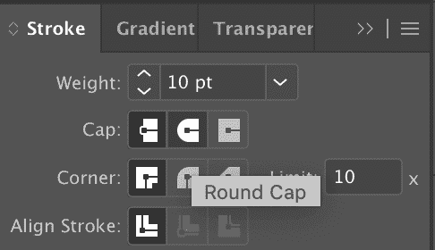
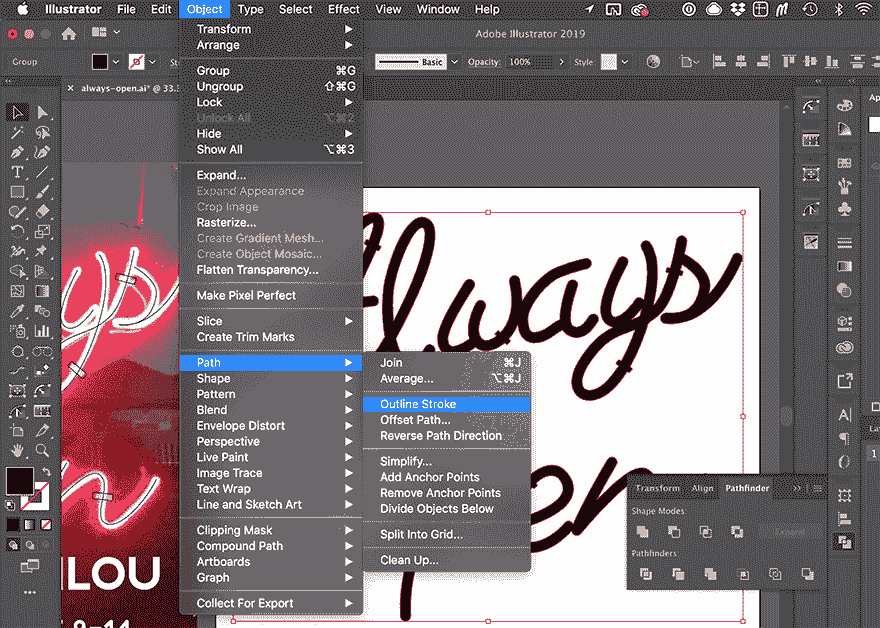
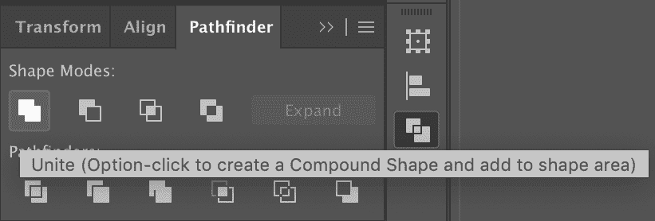
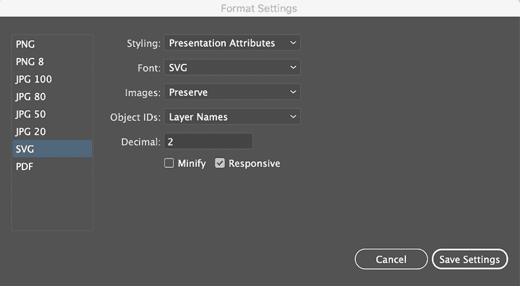
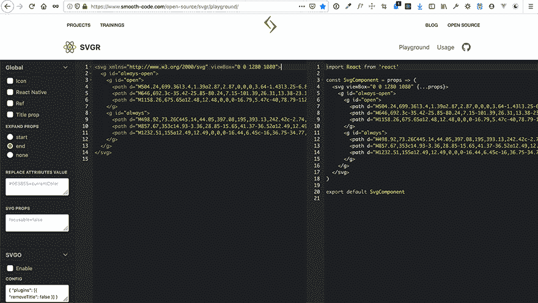
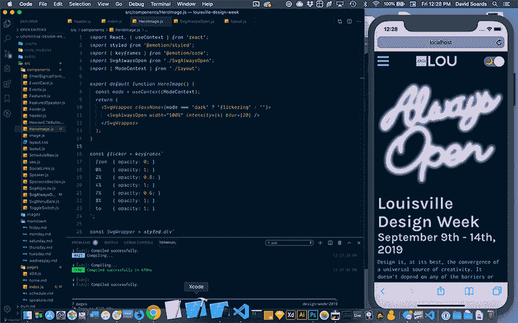

# 使用 Illustrator，React & Emotion 从头开始制作闪烁的霓虹灯 SVG 动画

> 原文：<https://dev.to/ninjasoards/make-a-flickering-neon-svg-animation-from-scratch-w-illustrator-react-emotion-39gm>

这是一个简短系列的第二部分，在这里我将详细介绍我在设计和开发一个网站来推广 AIGA 路易斯维尔的年度设计周时学到的东西。

[louisvilledesignweek.com](https://louisvilledesignweek2019.netlify.app/)

偷看我的[源代码](https://github.com/davidysoards/louisville-design-week)👀

[第 1 部分:夜间模式切换](https://dev.to/ninjasoards/make-a-custom-night-mode-toggle-w-react-css-variables-272o)

## 创建&导出 SVG

我在 **Adobe Illustrator** 中开始使用**钢笔工具**描绘我们在设计周的一张宣传图片，并为括号添加了一些圆角矩形。

[](https://res.cloudinary.com/practicaldev/image/fetch/s--EgirzRIg--/c_limit%2Cf_auto%2Cfl_progressive%2Cq_auto%2Cw_880/https://thepracticaldev.s3.amazonaws.com/i/gvbe37wlna43oy3009p1.png)

然后我调高笔画值，直到它与图像中的符号大致匹配，并将笔帽设置为**圆形笔帽**。

[](https://res.cloudinary.com/practicaldev/image/fetch/s--QJyxw6nN--/c_limit%2Cf_auto%2Cfl_progressive%2Cq_auto%2Cw_880/https://thepracticaldev.s3.amazonaws.com/i/1c8y2949r6tj32famdx7.png)

我用物体>路径>勾勒出笔画

[](https://res.cloudinary.com/practicaldev/image/fetch/s--fwV-FHDq--/c_limit%2Cf_auto%2Cfl_progressive%2Cq_auto%2Cw_880/https://thepracticaldev.s3.amazonaws.com/i/u4bq2xhscelmz82dbr7r.png)

然后我使用**探路者**中的**合并**形状模式将重叠的元素合并成一个形状。

[](https://res.cloudinary.com/practicaldev/image/fetch/s--HBdIIewP--/c_limit%2Cf_auto%2Cfl_progressive%2Cq_auto%2Cw_880/https://thepracticaldev.s3.amazonaws.com/i/jnd4sye33w4j2vwa7y3h.png)

我添加了黑色填充，**使用**呈现属性**设置将整个画板**导出为 SVG，确保选中**响应**(这给了你一个视图框，而不是固定的高度和宽度)。

[](https://res.cloudinary.com/practicaldev/image/fetch/s--aBz4xcWj--/c_limit%2Cf_auto%2Cfl_progressive%2Cq_auto%2Cw_880/https://thepracticaldev.s3.amazonaws.com/i/5uma637jab9vfs3d3q6k.png)

你如何用**层**和**组**组织你的 Illustrator 文件中的元素也将决定**你导出的代码看起来如何**。

我使用了一个名为“始终打开”的层和两个名为“始终”和“打开”的组。将它导出为一个**画板**而不仅仅是一组资源，会使您的**视框**具有您选择的精确高度和宽度，还会为您的图像提供一些填充。

[](https://res.cloudinary.com/practicaldev/image/fetch/s--8U8BNny6--/c_limit%2Cf_auto%2Cfl_progressive%2Cq_auto%2Cw_880/https://thepracticaldev.s3.amazonaws.com/i/gfrpa2oj66he2uwdgbng.png)

导出产生以下代码。(我已经从 SVG 路径中删除了实际数字，因为它使这篇文章注册为“28 分钟读取”，但是你可以在 github 上的[源代码](https://github.com/davidysoards/louisville-design-week/blob/master/src/components/SvgAlwaysOpen.js)中看到它们。)

```

  
    always-open
  
  <g id="always-open">
    <g id="open">
      <path d="######"/>
      <path d="######"/>
      <path d="######"/>
    </g>
    <g id="always">
      <path d="######"/>
      <path d="######"/>
      <path d="######"/>
    </g>
  </g>
 
```

Enter fullscreen mode Exit fullscreen mode

我过去总是运行我通过 SVGOMG 导出的任何 SVG，但是据比我聪明得多的人说，Illustrator 的导出已经变得如此之好，以至于这不再是真正必要的了。

> 萨拉苏伊丹@萨拉苏伊丹这个。这个 [@Illustrator](https://twitter.com/Illustrator) SVG 导出非常干净，我在处理从它导出的 SVG 时再也不用 SVGO 了。[twitter.com/DmitryBaranovs…](https://t.co/1uDRpMBxqh)2019 年 8 月 31 日下午 14:34Dmitry Baranovskiy@ DmitryBaranovsk@ pugson @ SaraSoueidan @ dirkschulze 不确定为什么需要 SVGO 与新的插画师导出。；)[](https://twitter.com/intent/tweet?in_reply_to=1167807788707450880)[](https://twitter.com/intent/retweet?tweet_id=1167807788707450880)[](https://twitter.com/intent/like?tweet_id=1167807788707450880)

当谈到 SVG(和 a11y)时，Sara *真的*知道她的东西。如果这是一个你有兴趣了解更多关于我*高度*推荐她的[写作](https://www.sarasoueidan.com/blog/)或演讲的主题。Dmitry 是设计新的 SVG 导出功能的向导之一！

为了将我的 SVG 转换成 React 组件，我使用了另一个名为 [SVGR Playground](https://www.smooth-code.com/open-source/svgr/playground/) 的在线工具。只需将您的 SVG 代码粘贴到工具的左侧，它就会为您创建一个函数组件。

[](https://res.cloudinary.com/practicaldev/image/fetch/s--yGg370Ue--/c_limit%2Cf_auto%2Cfl_progressive%2Cq_auto%2Cw_880/https://thepracticaldev.s3.amazonaws.com/i/pyzj31f6rexfwavyegpl.png)

新的 **SVG React 组件**看起来像这样:

```
import React from 'react'

const SvgAlwaysOpen = props => (
  
    <g id="always-open">
      <g id="open">
        <path d="######" />
        <path d="######" />
        <path d="######" />
      </g>
      <g id="always">
        <path d="######" />
        <path d="######" />
        <path d="######" />
      </g>
    </g>
  
)

export default SvgAlwaysOpen; 
```

Enter fullscreen mode Exit fullscreen mode

## 定制 SVG 组件

这个效果使用了两个 **SVG 滤镜**。一个是**亮模式**的**投影**，另一个是**暗模式**的**辉光**。过滤器需要在 **< defs >元素**内定义。

什么是 defs 元素？我会让莎拉·苏伊丹解释:

*<defs>元素用来定义你以后想要重用的元素。使用< defs >定义元素对于创建某种在整个文档中多次使用的“模板”非常有用。在< defs >元素中定义的元素不会呈现在画布上，除非您在文档中的某个地方“调用”它们。*

```
<defs>
  <filter id="glow" x="-50%" y="-50%" width="200%" height="200%">
    <feGaussianBlur
      result="blurred"
      in="SourceGraphic"
      stdDeviation={blur}
    />
  </filter>

  <filter id="shadow" x="0" y="0" width="200%" height="200%">
    <feOffset result="offOut" in="SourceAlpha" dx="20" dy="20" />
    <feColorMatrix
      result="matrixOut"
      in="offOut"
      type="matrix"
      values="1 0 0 0 0
              0 1 0 0 0
              0 0 1 0.05 0
              0 0 0 0.2 0"
    />
    <feGaussianBlur result="blurOut" in="matrixOut" stdDeviation="10" />
  </filter>
</defs> 
```

Enter fullscreen mode Exit fullscreen mode

为了多次重用路径，但根据需要给它们分配不同的滤镜、填充和过渡，我将它们放在 **< defs >元素**中，然后在 **< use >元素**中通过它们的 id 调用它们。填充被分配给 CSS 变量，单击标题中的切换开关，颜色会改变。**转场的长度**和**缓动**值由**样式属性**设置。变量和黑暗模式开关的设置在本系列第 1 部分的[中描述。](https://dev.to/ninjasoards/make-a-custom-night-mode-toggle-w-react-css-variables-272o) 

```
<use xlinkHref="#always-open" filter="url(#shadow)" />
<use
  xlinkHref="#always-open"
  fill="var(--color-neon-glow)"
  filter="url(#glow)"
  style={{
    transition: 'fill 0.5s ease-in',
  }}
/>
<use
  xlinkHref="#always-open"
  fill="var(--color-neon-fill)"
  style={{
    transition: 'fill 0.3s ease-in',
  }}
/> 
```

Enter fullscreen mode Exit fullscreen mode

为了控制发光效果，我使用了本·尼伯格的[代码笔](https://codepen.io/clickblipclick/pen/zdpMgY)中的一个函数。使用这个函数，我可以通过增加或减少发光效果的道具来传递一个强度值。

```
function addIntensity(num) {
  const arr = [];
  while (num) {
    arr.push(<feMergeNode in="blurred" key={num} />);
    num--;
  }
  return arr;
} 
```

Enter fullscreen mode Exit fullscreen mode

*<feMerge>SVG 元素允许同时应用滤镜效果，而不是顺序应用。* - [MDN](https://developer.mozilla.org/en-US/docs/Web/SVG/Element/feMerge)

**add intensity 函数**获取通过 props 传递的强度值，并在 **< feMerge >元素**中添加许多模糊滤镜。我选定了 4 的**强度，这意味着我在一个模糊滤镜上加上一个模糊滤镜，创建了一个极度模糊的**。**** 

```
 <feGaussianBlur
    result="blurred"
    in="SourceGraphic"
    stdDeviation={blur}
  />
+  <feMerge>{addIntensity(intensity)}</feMerge> 
```

Enter fullscreen mode Exit fullscreen mode

我还传入了一个**宽度**道具和一个**模糊**道具用于设置费高斯模糊效果的**标准偏差**。 **< feGaussianBlur >** 是一个原生的 SVG 过滤器原语。如果您有兴趣了解更多关于 SVG 过滤器的知识，请查看本系列的 [codrops](https://tympanus.net/codrops/2019/01/15/svg-filters-101/) 。

```
//SvgAlwaysOpen.js
const SvgAlwaysOpen = ({ width, intensity, blur }) => (
  
  {/* ... */}
) 
```

Enter fullscreen mode Exit fullscreen mode

```
// in Parent Component
 
```

Enter fullscreen mode Exit fullscreen mode

## 神树闪烁不定

闪烁动画是不透明度值上的简单 **CSS 关键帧**动画。同一组关键帧用于**闪烁 1** 和**闪烁 2** 。两者的区别在于它们的**持续时间**，而闪烁 2 在开始前被**延迟了 3s** 。两者都设置为**线性**(无缓和)和**无限**，这意味着动画将在**循环中连续播放**。我使用了来自 **@emotion/core** 的**关键帧**助手来设置 JS 文件中的 CSS 关键帧。

```
//SvgAlwaysOpen.js
import styled from '@emotion/styled';
import { keyframes } from '@emotion/core';

// ...

// right under the function component
const flicker = keyframes`
  from  { opacity: 0; }
  0%    { opacity: 1; }
  3%    { opacity: 0.4; }
  6%    { opacity: 1; }
  7%    { opacity: 0.4; }
  8%    { opacity: 1; }
  9%    { opacity: 0.4; }
  10%   { opacity: 1; }
  89%   { opacity: 1; }
  90%   { opacity: 0.4; }
  100%  { opacity: 0.4; }
  to    { opacity: 1; }
`;

const AlwaysOpen = styled.g`
  .flicker1 {
    animation: ${flicker} 5s linear infinite;
  }
  .flicker2 {
    animation: ${flicker} 6s linear 3s infinite;
  }
`; 
```

Enter fullscreen mode Exit fullscreen mode

样式通过 **@emotion/styled** 库应用于 SVG 组件，就像应用于任何其他 JSX HTML 元素一样。在这种情况下，id 为“always-open”的 **< g >** 标签已被重命名为 **< AlwaysOpen >** ，并且**类名**‘闪烁 1’和‘闪烁 2’将被**应用于 AlwaysOpen 组内的特定路径**。

```
- <g id="always-open"> + <AlwaysOpen id="always-open">
   <g id="open">
     <path d="######" />
     <path
+      className={mode === 'dark' ? 'flicker1' : ''}
       d="######"
     />
     <path d="######" />
   </g>
   <g id="always">
     <path
+      className={mode === 'dark' ? 'flicker2' : ''}
       d="######"
     />
     <path d="######" />
     <path d="######" />
   </g>
- </g> + </AlwaysOpen> 
```

Enter fullscreen mode Exit fullscreen mode

类名的**条件逻辑**阻止动画播放，除非模式设置为“黑暗”。 **currentMode** 变量位于 layout.js 中，它是 SvgAlwaysOpen 组件的**第 4 层**。

为了从 SVG 组件内部**访问当前模式变量**,我使用了 React 的**上下文** API。

```
// layout.js
import React, { useState, useEffect, createContext } from 'react';

// ...

export const ModeContext = createContext('light');

export default function Layout({ children }) {
  const [currentMode, setCurrentMode] = useState('light');

// ...

  return (
    <>
      <ModeContext.Provider value={currentMode}>
        <Header/>
        <main>{children}</main>
        <Footer />
      </ModeContext.Provider>
    </>
  );
} 
```

Enter fullscreen mode Exit fullscreen mode

```
// SvgAlwaysOpen.js
import React, { useContext } from 'react';
import { ModeContext } from './layout';

// ...

export default function SvgAlwaysOpen({ width, intensity, blur }) {
  const mode = useContext(ModeContext);

// ...

} 
```

Enter fullscreen mode Exit fullscreen mode

上下文是相当新的反应，在大多数情况下,**取代了 Redux** 的需要。你可以在 [React 文档](https://reactjs.org/docs/context.html)中了解更多信息

## WTF iOS？！

我必须处理的最后一个问题是 SVG **中应用的动画似乎不能在 iOS** 上工作。它们可以在所有现代桌面浏览器上运行，甚至可以在安卓手机上运行，但不能在 iPhones 上运行。

我在我的 Macbook 上使用了**模拟器**应用程序来为这个问题创建一个变通办法，而不必为了在我的手机上检查它而实际上重复部署到网络上。非常方便。

[](https://res.cloudinary.com/practicaldev/image/fetch/s--elE4Q5CG--/c_limit%2Cf_auto%2Cfl_progressive%2Cq_auto%2Cw_880/https://thepracticaldev.s3.amazonaws.com/i/rtpkujxn0hgaub2tix6o.png)

我想到的解决方案是创建一个**包装组件**并向其添加一个额外的动画。将动画直接添加到 index.js 中的包装器 div 也不起作用，因为在 Gatsby 页面模板中更新上下文变量存在一个未解决的问题。🤷🏻‍♂️

新的闪烁更加微妙，影响整个 SVG，而不仅仅是某些字母。我认为它既可以单独使用，也可以与其他两个动画结合使用。关键帧相似但略有不同，**持续时间为 10 秒**，初始**延迟为 5 秒**。

```
// HeroImage.js
import React, { useContext } from 'react';
import styled from '@emotion/styled';
import { keyframes } from '@emotion/core';
import SvgAlwaysOpen from './SvgAlwaysOpen';
import { ModeContext } from './layout';

export default function HeroImage() {
  const mode = useContext(ModeContext);
  return (
    
      
    
  );
}

const flicker = keyframes`
  from  { opacity: 0; }
  0%    { opacity: 1; }
  2%    { opacity: 0.8; }
  4%    { opacity: 1; }
  7%    { opacity: 0.6; }
  8%    { opacity: 1; }
  to    { opacity: 1; }
`;

const SvgWrapper = styled.div`
  max-width: 540px;
  width: 100%;
  margin: 20px auto;
  @media screen and (min-width: 1024px) {
    margin: 40px auto;
    flex-shrink: 0;
  }
  &.flickering {
    animation: ${flicker} 10s linear 5s infinite;
  }
`; 
```

Enter fullscreen mode Exit fullscreen mode

就是这样！如果有人知道为什么 iOS 中的动画不能像预期的那样工作，或者有更好的解决方案，请在评论中告诉我。

感谢阅读！

查看第 1 部分👇

[](/ninjasoards) [## 自定义夜间模式切换 w/React & CSS 变量

### 大卫·索兹 8 月 25 日 195 分钟阅读

#react #css #javascript #darkmode](/ninjasoards/make-a-custom-night-mode-toggle-w-react-css-variables-272o)