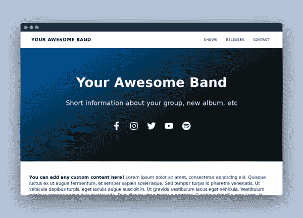
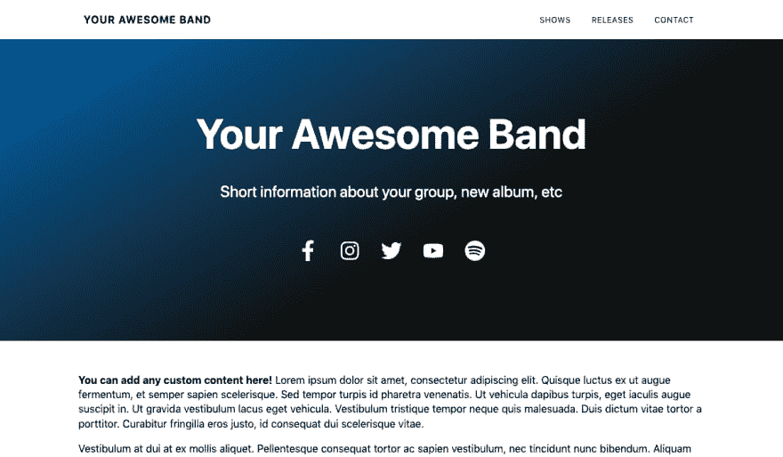
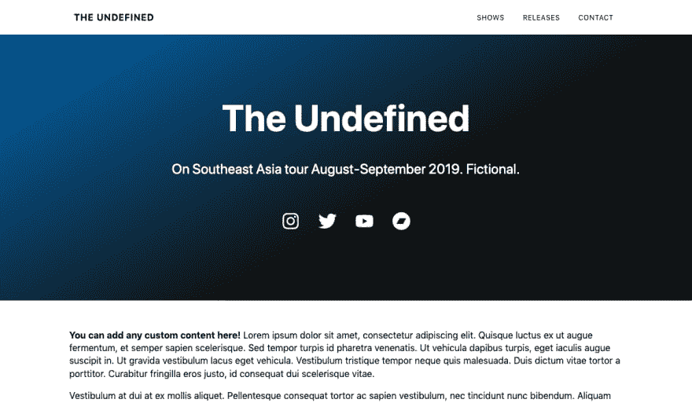
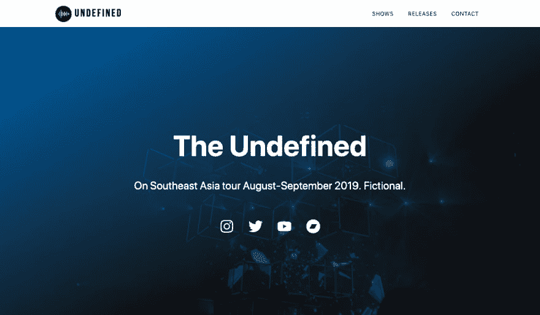
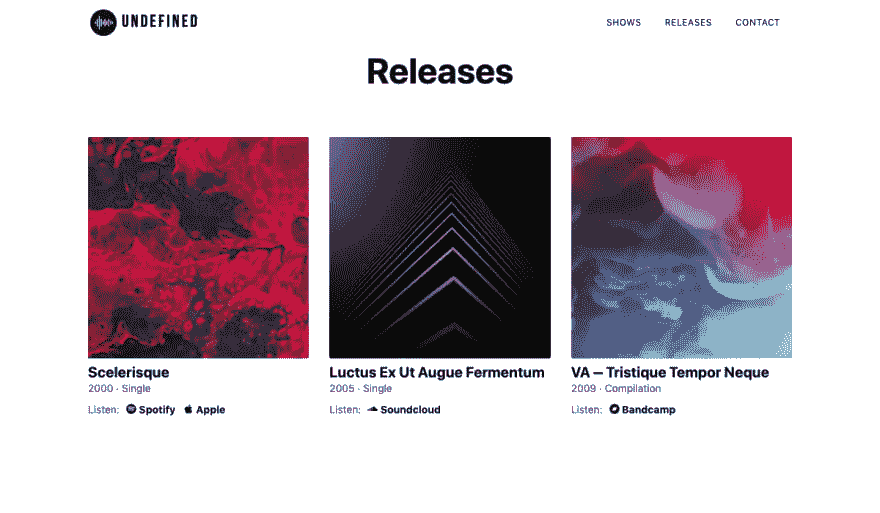
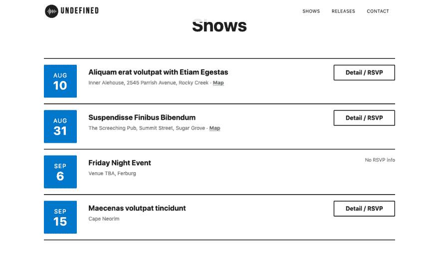
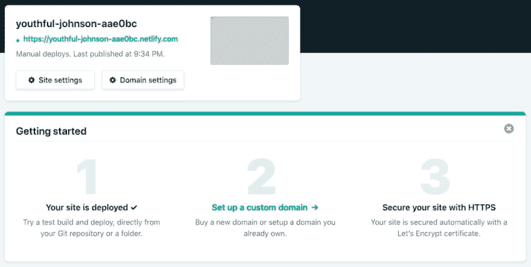

# 用盖茨比主题音乐家在 30 分钟内为你的乐队制作一个登陆页面🎸

> 原文：<https://dev.to/ekafyi/make-a-landing-page-for-your-band-in-30-minutes-with-gatsby-theme-musician-2227>

## 背景

今天，我发布了我的第一个盖茨比主题——也是我的第一个可公开安装的软件包！🎉

[](https://res.cloudinary.com/practicaldev/image/fetch/s--jSqX3UqT--/c_limit%2Cf_auto%2Cfl_progressive%2Cq_auto%2Cw_880/https://raw.githubusercontent.com/ekafyi/gatsby-theme-musician/master/screenshot_with_bg.png)

[音乐人主题](https://github.com/ekafyi/gatsby-theme-musician)旨在让想要创建自己的登陆页面(或完整网站)的音乐人——团体和独唱艺术家——更容易。

但为什么要做一个网站，当有这么多平台来迎合音乐人和他们的观众的时候？🤔以下是一些原因。

*   不要依赖不断变化的社交媒体平台来保存重要信息(简历、联系方式、从哪里/如何获得你的相册等)。
    *   服务来来去去。Myspace 被遗弃了(还带来了你的自定义布局*和* [和你的歌曲](https://www.rollingstone.com/music/music-news/myspace-lost-music-809455/)💀)，ReverbNation 被遗忘了；下一个是 Bandcamp 还是 Spotify？你的网站可能会比他们更长寿。
    *   你也可以用你的网站作为一个漏斗，引导你的观众到你选择的社交账户。
*   你拥有你的数据。有了这个主题，你可以像编辑和保存任何常规文本文件一样编辑和保存 4-5 个文本文件。
*   快速*且易于访问。可以在各种浏览器和设备上运行，有/没有 Javascript。

我发现盖茨比主题是创建这种性质的网页的一种有趣的媒介，因为它让我想起了过去十年来玩 Myspace band 页面布局:你可以只填写你的个人资料和图像(和 MP3，在 Myspace 的情况下)。你也可以随心所欲地装饰你的网页……这已经被证明是通向前端发展的一剂良药，以免你的音乐事业停滞不前😈🙃。

我构建这个主题时特别考虑了以下原则:

*   想接触多少代码就接触多少代码。您不需要编写 React 组件——如果您不想的话，除了在配置中添加一行主题名称之外，您不需要编写任何 Javascript。但是`src`文件夹会一直等着你，以防你改变主意。😬
*   由于 Gatsby 主题的可组合、模块化本质，高度可扩展和可定制。电子商务、博客、播客、图片库…从头开始构建一切可能会花费太多的时间和精力，但是主题(希望如此)可以让你更容易地拼凑出你需要的功能组合。

*) **告诫:**核心主题是在没有任何跟踪或第三方脚本的情况下构建的。但是嵌入外部媒体(例如来自 Youtube、Spotify、Soundcloud)对音乐人来说也很重要，所以我也让嵌入这种媒体变得容易，这可能会损害速度、性能和隐私。

长长的介绍结束了，让我们开始吧！我们将从头开始为一个名为**未定义的**的虚构乐队创建一个网站，使用带有*的音乐家主题，尽可能简单地修改*。

*   [现场直播](https://example-gatsby-theme-musician.netlify.com)
*   [源代码](https://github.com/ekafyi/gatsby-theme-musician/tree/master/examples/site-minimal)
*   [文档](https://github.com/ekafyi/gatsby-theme-musician/tree/master/docs)

**目录**

1.  创建新的盖茨比网站
2.  向网站添加主题
3.  起始位点
4.  配置基础数据
5.  添加内容-图像
6.  添加内容-发布和显示
7.  编辑登录页面
8.  部署到网络

* * *

## 1)创建新的盖茨比站点

如果您已经有了，请跳过这一步。另一方面，如果你以前从未用过 Gatsby，看看他们的[快速入门指南](~https://www.gatsbyjs.org/docs/quick-start/~)或[初学者友好教程](~https://www.gatsbyjs.org/tutorial/~)。

我们使用主题启动器来创建一个新的 Gatsby 站点，该站点预先配置了主题及其内容。

```
# create a new site at the directory "my-band-site"
gatsby new my-band-site https://github.com/ekafyi/starter-musician-theme

# go to the site directory
cd my-band-site

# start your site
gatsby develop 
```

如果使用这一步，可以跳过第 2 步和第 3 步。

注意:你可以使用任何其他的启动器——我最初在[示例站点](https://github.com/ekafyi/gatsby-theme-musician/tree/master/examples/site-minimal)中使用官方的“hello-world”启动器——只要确保你做了步骤 2 和 3。

## 2)给站点添加主题

根据您首选的软件包管理器，通过运行以下命令之一来安装主题。

```
npm install --save gatsby-theme-musician
# or
yarn add gatsby-theme-musician 
```

然后给`gatsby-config.js`加上主题名。

```
// gatsby-config.js
module.exports = {
  plugins: [
    {
      resolve: "gatsby-theme-musician",
    },
  ],
} 
```

## 3)开始站点

运行`gatsby develop`

主题将复制必要的数据，我们的网站将开始运行。但是当我们打开 [http://localhost:8000](http://localhost:8000) ，我们*无法*看到主题的登陆页面。相反，我们看到起始站点的普通索引页打印着*“Hello world”*。

这是意料之中的，因为 hello-world starter 站点确实包含一个索引页面。尽管如此，当使用主题，或者主题和初始站点的组合时，这是值得记住的。📝

在这种情况下，有两个选项可供选择:

*   移除 hello-world 启动器的`src/pages/index.js`、**或**
*   把`basePath` [主题选项](https://dev.to~#1-theme-options~)改成别的，比如`my-band`
    *   如果我们选择这个选项，“Hello world”主页将保持不变，主题的登录页面将创建在[http://localhost:8000/my-band](http://localhost:8000/my-band)

对于这篇文章，我们将做第一个选择。停止应用，删除`src/pages/index`，重启我们的应用。

现在我们可以看到我们的登录页面了！

[](https://res.cloudinary.com/practicaldev/image/fetch/s--RDQprtCq--/c_limit%2Cf_auto%2Cfl_progressive%2Cq_auto%2Cw_880/https://thepracticaldev.s3.amazonaws.com/i/sj3jpl6tvqb0ap1o4kwb.png)

除了`basePath`，我们也可以从[主题选项](https://dev.to~#1-theme-options~)中改变`contentPath`，但是我们在这里不打算这么做。

## 4)配置基础数据

要编辑艺术家数据，让我们打开`src/gatsby-theme-musician/config/artist.yml`。

对于所有特定于主题的配置，我们使用 YAML 数据格式，它被描述为[“一种人类友好的数据序列化标准”](https://yaml.org)。我之所以选择它，是因为它的语法简单，即使对于初学者或非开发人员来说也是用户友好的。你可以[在这里](~https://yaml.org/start.html~)了解更多关于 YAML 格式的信息。

在这篇文章中，让我们为一个名为**未定义的**的(虚构的)电子行为制作一个网站。

```
#artist.yml

artist:
  name: The Undefined
  tagline: On Southeast Asia tour August-September 2019\. Fictional.
  seo_title: "The  Undefined  |  Yogyakarta,  Indonesia  fictional  electronic  band"
  seo_description: "Fictional  electronic  group  from  Yogyakarta,  Indonesia"
  contact_twitter_username: "thisaccountdoesnotexist"
  # contact_phone: 
  # contact_email: 

social:
  - name: Instagram
    url: https://instagram.com/thisaccountdoesnotexist
  - name: Twitter
    url: https://twitter.com/thisaccountdoesnotexist
  - name: Youtube
    url: https://youtube.com/thisaccountdoesnotexist
  - name: Bandcamp
    url: https://thisaccountdoesnotexist.bandcamp.com

site_language: en 
```

除了`name`之外的所有字段都是可选的，用于各种元数据(native、OpenGraph、Twitter、结构化数据)，这些元数据有助于搜索引擎优化和社交共享。

物品的名字可以是任何东西(脸书、推特、Instagram 等)。你可以在这个文件中看到[支持的图标列表。如果您添加了列表中没有的内容，图标将默认为一个地球图标，它仍将显示在社交链接中。](https://github.com/ekafyi/gatsby-theme-musician/blob/master/theme/src/components/icon-by-name.js)

现在，我们的登录页面显示我们的数据。浏览器标签也显示了我们的搜索引擎优化友好的标题。

[](https://res.cloudinary.com/practicaldev/image/fetch/s--vU6auwgr--/c_limit%2Cf_auto%2Cfl_progressive%2Cq_auto%2Cw_880/https://thepracticaldev.s3.amazonaws.com/i/v48q19io4lcfjtiy0d1i.png)

我们不打算定制导航和文本标签，但是你可以阅读主题配置文件[和主题文档](https://github.com/ekafyi/gatsby-theme-musician/blob/master/docs/usage.md#theme-configuration)。

## 5)添加内容-图片

接下来，我们将图像添加到`content`文件夹中。

您可以添加以下 PNG 或 JPG 格式的图像(全部可选):

*   `artist-banner`
*   `artist-social`
*   `artist-logotype`

如果名为`artist-banner.png`或`artist-banner.jpg`的文件存在于内容文件夹中，主题将使用它作为顶部横幅的背景图像。同样的还有`artist-social.jpg|png`(用于社交分享缩略图)和`artist-logotype.jpg|png`(用于顶部标题菜单)。

你可以参考[主题文档](https://github.com/ekafyi/gatsby-theme-musician/blob/master/docs/usage.md#-images)中的图片尺寸和比例。

添加图像文件，重启应用程序——瞧，现在我们有图像了！

[](https://res.cloudinary.com/practicaldev/image/fetch/s--ClFlioCx--/c_limit%2Cf_auto%2Cfl_progressive%2Cq_auto%2Cw_880/https://thepracticaldev.s3.amazonaws.com/i/x484wnqgv9pc59geltyc.png)

## 6)添加内容-发布和显示

这个主题提供了两种特定于主题的内容类型:**发布**(又名音乐；Discography)和**显示**(又名巡演；事件)。

像主题配置一样，我们也使用 YAML 文件。这些文件分别是`releases.yml`和`shows.yml`，可以在您的内容文件夹中找到。

这些文件中的每个条目在主字段前都标有破折号(`-`)。例如,“Shows”部分的三个条目,基本上是这样的。

```
- name: Test Show 1
  date: 2019-08-10

- name: Test Show 2
  date: 2019-08-31

- name: Test Show 3
  date: 2019-09-01 
```

`shows`项包含以下字段:

*   `name`
*   `date`yyyy-mm-DD 格式
*   `location`
*   `info_url`
*   `map_url`

```
# shows.yml
# Data example (with randomly generated place)
- name: Aliquam erat volutpat with Etiam Egestas
  date: 2019-08-10
  location: Inner Alehouse, 2545 Parrish Avenue, Rocky Creek
  info_url: https://some-website.com
  map_url: https://maps.google.com 
```

`releases`项包含以下字段:

*   `title`
*   `date`yyyy-mm-DD 格式
*   `release_type`
*   `image`
*   `links` —每个链接项包含以下字段:
    *   例如，Spotify、Apple Music、Bandcamp、Beatport
    *   `url`

```
# artist.yml
# Data example (with rickrolling)
- title: "Scelerisque"
  date: 2000-01-01
  release_type: Single
  image: "./album-1.jpg"
  links:
    - name: Spotify
      url: https://open.spotify.com/track/4uLU6hMCjMI75M1A2tKUQC
    - name: Apple
      url: https://music.apple.com/au/music-video/never-gonna-give-you-up/277040657 
```

[](https://res.cloudinary.com/practicaldev/image/fetch/s--A9O5UktH--/c_limit%2Cf_auto%2Cfl_progressive%2Cq_auto%2Cw_880/https://thepracticaldev.s3.amazonaws.com/i/w68dlrrb1u5mg117ncy7.png)

[](https://res.cloudinary.com/practicaldev/image/fetch/s--zTKDUwWD--/c_limit%2Cf_auto%2Cfl_progressive%2Cq_auto%2Cw_880/https://thepracticaldev.s3.amazonaws.com/i/dfsb5snqi27s5tzljoni.png)

## 7)编辑登陆页面

我们准备部署之前的最后一部分是编辑登录页面本身。与前面的部分不同，现在我们正在处理一个 MDX 文件。MDX 是一种新的格式*“让你无缝地在你的降价文档中写 JSX”*([在他们的网站上了解更多](https://mdxjs.com/))。

因此，基本上，您可以在 MDX 中执行以下任何(和所有)操作:

*   书写常规文本
*   写下降价格式，例如`**bold text** and [hyperlink](https://dev.to)`
*   编写本地 HTML 元素——它是 JSX 的一部分，例如`<aside>`或`<a href="#some-link">links with <em>formatting</em></a>`
    *   在某些方面，确实不同于普通的 HTML，比如使用 object 作为内嵌的 CSS 样式，比如`<p style={{ color: 'hotpink' }}>hotpink text</p>`，使用`className`代替`class`属性。
*   导入并使用任何 React 组件——主题提供的组件，以及您自己编写和/或从外部包安装的任何组件

要编辑我们的登录页面，请打开您的`content`文件夹中的`artist-landing-page.mdx`。你可以像编辑一个普通的降价文本文件一样添加、删除、重新排序*任何东西*。

这个主题附带了几个组件，您可以立即使用，而不必导入它们。例如，`<Banner>`、`<Releases>`和`<Shows>`显示我们刚刚在上面添加的特定于主题的内容。

你可以用`<Youtube>`组件嵌入 **Youtube** 视频，此外，你还可以嵌入来自 **Spotify** 和 **Soundcloud** 的视频，只需将链接粘贴到一行即可。

```
<!-- Embed Youtube video -->
<Youtube url="https://www.youtube.com/watch?v=GBUCmMxmup0" />

<!-- Embed Spotify track -->
https://open.spotify.com/track/4uLU6hMCjMI75M1A2tKUQC 
```

我们不讨论其他部分，因为这篇文章是为了让*快速开始*这个主题。但是你可以在默认的[示例页面](https://gatsby-theme-musician.netlify.com/sample-page)和[文档中看到更多关于组件](https://github.com/ekafyi/gatsby-theme-musician/blob/master/docs/components.md)的内容。

## 8)部署到网络

最后一步是部署我们的新站点。

有许多部署方式，盖茨比有一份详尽的部署指南。在这篇文章中，我们使用 Netlify 的✨魔法✨拖放上传器来部署静态构建文件，因为这是最快的方法。(如果你想从你的 Github、Gitlab 或 Bitbucket repo 设置连续部署到 Netlify，[请遵循本指南](https://www.gatsbyjs.org/docs/deploying-to-netlify/)。)

建立你的网站。这将在您站点的根目录下创建一个`public`文件夹。

```
gatsby build 
```

接下来，创建一个[免费网络生活账户](https://app.netlify.com/signup?)(如果你还没有的话)并登录。向下滚动到显示*的框，“需要更新您的站点而不对存储库进行更改吗？将您的站点文件夹*拖放到这里。将您的`public`文件夹拖到那里。

Netlify 将在一个随机生成的地址部署您的站点，并带您到您的新站点仪表板。当您的站点成功部署后，*“最后发布”*日期/时间将反映最新版本，您可以立即访问您的站点。点击*【站点设置】*更改地址。

[](https://res.cloudinary.com/practicaldev/image/fetch/s--vQ54GDjG--/c_limit%2Cf_auto%2Cfl_progressive%2Cq_auto%2Cw_880/https://thepracticaldev.s3.amazonaws.com/i/h5rfddokikir42vfvred.jpg)

就这样，[我们的站点](https://example-gatsby-theme-musician.netlify.com/)上线了！

* * *

## 关闭

这个主题非常新，而且有很多问题——在我写这篇文章的时候，我还在发现和做各种各样的修改。然而，我对这个主题的可能性感到兴奋。将来，我可能会继续发布:

*   在 MDX 中编写内容—添加自定义页面，创建和使用组件
*   扩展和隐藏 UI/数据组件
*   使用主题 UI 的样式——扩展和隐藏设计标记(对于技术和非技术用户)
*   可访问性增强，例如，使用户能够添加替代文本到专辑插图

如果你使用它，请让我知道它如何进行。感谢您的阅读！